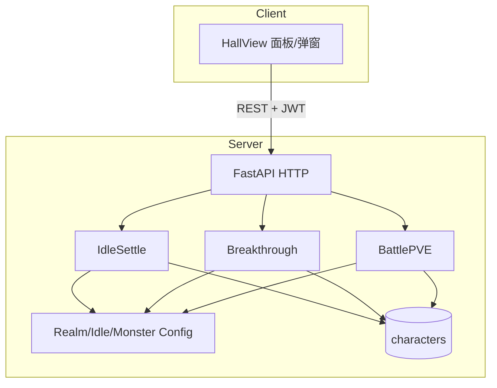

# M1 核心循环 MVP — 详细设计说明

> 依据：`开发计划.md` §3 · `project修仙.md`（GDD v4.0）§1 / §2 / §3.1 / §7 极简 / §9.1·§9.3 · `M0工程骨架设计.md`  
> 目标：跑通 **挂机 → 修为 → 突破 → 简单战 → 资源回流**（锻体～炼气教学段）  
> 范围外：见根目录 [`后续待完成.md`](./后续待完成.md)（开设计前必读）  
> 版本：v1.0 · 2026-08-03

---

## 1. 设计目标与思路

### 1.1 一句话目标

在 M0「可登录、可读面板」之上，落地服务端权威的最小养成闭环：修灵挂机涨修为、层进阶突破、打赢一场教学怪并拿回流奖励；陌生人按 README 能在本地复现。

### 1.2 设计原则

| 原则 | 落地方式 |
| --- | --- |
| **服务端权威** | 挂机切片、突破掷骰、战斗扣血只在服务端；前端只展示与发起 |
| **配置驱动** | 境界门槛、挂机速率、突破概率、怪属性进 YAML/JSON，禁止散落 if 链 |
| **复用 M0 字段** | 优先写 `cultivation_points` / `spirit_stones` / `idle_direction` / `status` / `last_settled_at` / 境界三字段；不改表大翻 |
| **预测展示 + 惰性权威入账** | **无**全服定时写库 / APScheduler。权威仍按 `last_settled_at` 切片入账；大厅体感靠客户端预测 + 按 `next_tick_at` 对齐 `/idle/sync`（详见 §4.0） |
| **大厅内闭环** | 不新增玩法路由；挂机/突破/战斗均在 `/hall` 面板与弹窗完成 |
| **数值占位** | 公式可调；本设计给出可跑通的默认占位值，正式案另开数值文档 |
| **延后必登记** | 凡故意不做的能力写入 `后续待完成.md`，标明目标里程碑 |

### 1.3 成功标准（验收）

1. 创角后可开始「修灵」挂机；时间前进后修为增加、灵石减少。  
2. 灵石耗尽进入停滞：修为不再涨，UI 有明确提示。  
3. 修为达标可发起突破；成功层数 +1；失败有修为回退反馈。  
4. 进阶流程中（本设计为同步请求内）禁止开战；挂机无有效产出。  
5. 可对教学怪开战；胜负与伤害由服务端计算；胜利获得修为与灵石。  
6. 炼气大圆满 → 筑基初期跨境骨架可走通（品阶固定凡品）。  
7. development 下 GM 可抬境界/修为，便于联调。  
8. README / CHANGELOG / `.env.example` 与本文同步；无密钥硬编码。

### 1.4 明确不做（摘要）

完整清单与钩子见 [`后续待完成.md`](./后续待完成.md)。M1 摘要：

- 7×7 棋盘、布阵、阵法、快照、真实战报落库  
- 炼体 / 制造业挂机实装、离线 12h 帽、修为手动分配  
- 突破品阶随机、雷劫、异步真读条  
- WebSocket、体质、化身、宗门、交易  

### 1.5 与 M0 的关系

| M0 已交付 | M1 动作 |
| --- | --- |
| 鉴权 / JWT / 创角 / `GET /characters/me` | 保留契约；`me` **先 settle 再返回** |
| `CharacterPublic` 字段 | 扩展只读衍生字段（进度、速率、停滞） |
| 大厅 `IdlePanelPlaceholder` | 替换为真挂机面板 |
| `/api/v1` | 新增 `/idle/*`、`/breakthrough/*`、`/battle/*`、`/gm/*` |

---

## 2. 技术框架设计

### 2.1 选型（继承 M0，写死）

| 层 | 技术 | M1 增量 |
| --- | --- | --- |
| 后端 | FastAPI + SQLAlchemy 2 async + Alembic | 领域服务：idle / breakthrough / battle / realm config |
| 配置 | pydantic-settings + `.env` | 挂机/突破相关 env 默认值；玩法数值以配置文件为主 |
| 配置文件 | YAML 或 JSON（二选一，推荐 YAML） | `backend/app/config_data/` |
| 前端 | Vue3 + Pinia + Router + Axios | 大厅组件替换；api/stores 按模块追加 |
| 定时任务 | **无** | 权威惰性入账；前端 tick 对齐拉取即可 |
| WebSocket | **无** | — |

### 2.2 系统上下文



### 2.3 后端目录增量（相对 M0）

```text
backend/app/
├── config_data/                 # 玩法配置（随仓库提交）
│   ├── realms.yaml
│   ├── idle.yaml
│   ├── breakthrough.yaml
│   └── pve_monsters.yaml
├── domain/                      # 无 IO 纯规则（后补 OOP）
│   ├── idle.py                  # SettleResult / IdleGainCalculator / OfflinePending
│   ├── combat.py                # CombatCalculator
│   └── breakthrough.py          # BreakthroughPreview
├── services/
│   ├── idle_service.py          # IdleService：切换方向、sync、settle
│   ├── breakthrough_service.py  # BreakthroughService
│   ├── battle_service.py        # BattleService
│   ├── play_gate.py             # PlayGate：跨玩法前置（角色 + pending）
│   ├── realm_config.py          # 加载与查询配置 → GameConfigBundle
│   └── gm_service.py            # GmService；仅 development
├── api/
│   ├── idle.py                  # Depends(get_idle_service)
│   ├── breakthrough.py
│   ├── battle.py
│   └── gm.py
├── schemas/
│   ├── idle.py
│   ├── breakthrough.py
│   └── battle.py
└── tests/
    ├── test_idle_settle.py
    ├── test_breakthrough.py
    └── test_battle_pve.py
```

> 角色 ORM **原则上不新增列**（M1 当时约定）。战力由境界配置推导；战报 M1 仅响应返回。若实现中发现必须持久化字段，须同步改本文与 Alembic，并评估是否应改记入 `后续待完成.md`。  
> **OOP（2026-08-04）**：服务均为 Application Service 类；路由 `Depends` 注入；模块级函数保留兼容包装。详见 README「后端架构」。

### 2.4 环境变量增量

| 变量 | 类型 | 默认 | 说明 |
| --- | --- | --- | --- |
| `IDLE_TICK_SECONDS` | int | `60` | 一片时长（秒）；可被 `idle.yaml` 覆盖，env 作兜底 |
| `IDLE_POLL_HINT_SECONDS` | int | `5` | 写入 OpenAPI/前端可读提示（可选） |
| `GM_ENABLED` | bool | 随 `APP_ENV==development` | 显式关闭 GM 时即使 development 也 404 |
| `BREAKTHROUGH_RNG_SEED` | int \| 空 | 空 | 仅测试注入；生产勿设 |

玩法速率、成功率、怪属性 **以配置文件 / 后台发布覆盖为准**；env 只放开关与兜底。正式改数走 ADM（主计划 §0.0）；DEV `/gm` 仅联调。

前端可选：

| 变量 | 默认 | 说明 |
| --- | --- | --- |
| `VITE_IDLE_POLL_MS` | `120000` | 权威对表**兜底**最大间隔（主路径按 `next_tick_at` 对齐） |
| `VITE_IDLE_PREDICT_MS` | `250` | 客户端片内进度条刷新间隔（仅本地 display） |

---

## 3. 领域模型与配置

### 3.1 角色字段复用（M0 §3.3）

| 字段 | M1 行为 |
| --- | --- |
| `major_realm` / `realm_stage` / `realm_stage_label` | 突破成功时改写；展示仍由服务端生成 `realm_display` |
| `cultivation_points` | 挂机增加；突破消耗/失败回退；战斗奖励 |
| `spirit_stones` | 挂机消耗；战斗奖励；突破消耗 |
| `idle_direction` | `none` / `spirit`；`body`/`crafting` 拒绝 |
| `status` | `normal` ↔ `breaking_through`（同步请求内短暂置位亦可，见 §5） |
| `last_settled_at` | 权威入账锚点（惰性 settle / 预测共用） |

`body_tempering_points` / `crafting_exp`：M1 **只读展示**，不增长。

### 3.2 境界配置 `realms.yaml`（结构）

```yaml
major_realms:
  body_tempering:
    name: 锻体
    stage_mode: layers   # 1-9 + perfection=10
    stages:
      - { stage: 1, label: layer_1, cultivation_required: 100, base_atk: 10, base_hp: 100 }
      - { stage: 2, label: layer_2, cultivation_required: 200, base_atk: 12, base_hp: 120 }
      # ... 占位填满 1-10；数值可日后改
  qi_refining:
    name: 炼气
    stage_mode: layers
    stages: [ ... ]
  foundation:
    name: 筑基
    stage_mode: phases   # early/middle/late/perfection
    stages:
      - { stage: 1, label: early, cultivation_required: 5000, base_atk: 40, base_hp: 400 }
```

**规则**

- 锻体/炼气：`realm_stage` 1～9，圆满 = 10，`label` = `layer_*` / `perfection`。  
- 筑基起：1～4 ↔ `early` / `middle` / `late` / `perfection`。  
- M1 教学主路径：锻体多层进阶 + 炼气若干层 + **一次**炼气圆满→筑基初期。  
- 未在配置中的大境界：突破拒绝并打日志。

### 3.3 挂机配置 `idle.yaml`

```yaml
tick_seconds: 60
directions:
  spirit:
    enabled: true
    cultivation_per_tick: 10    # 每 tick 修为
    spirit_stones_per_tick: 1   # 每 tick 灵石
  body:
    enabled: false
  crafting:
    enabled: false
```

默认占位保证：1000 灵石可挂机较长时间，便于本地演示；正式曲线后置。

### 3.4 突破配置 `breakthrough.yaml`

```yaml
layer_advance:
  success_rate: 0.85
  spirit_stone_cost: 50
  # 成功：扣除 cultivation_required（当前档门槛）
  # 失败：refund_ratio 表示「保留」比例，回退 = 当前修为 * (1 - refund_ratio) 再不低于 0
  fail_cultivation_keep_ratio: 0.7
  fail_still_charge_stones: true
major_advance:  # 跨境（如炼气圆满 → 筑基初期）
  success_rate: 0.7
  spirit_stone_cost: 200
  fail_cultivation_keep_ratio: 0.5
  fail_still_charge_stones: true
  fixed_grade: mortal          # 凡品；随机品阶 → 后续待完成 / M2
```

### 3.5 怪物配置 `pve_monsters.yaml`

```yaml
monsters:
  tutorial_slime:
    name: 教学妖兽·浊气蛙
    atk: 8
    hp: 80
    max_rounds: 20
    rewards_on_win:
      cultivation_points: 30
      spirit_stones: 20
    rewards_on_lose:
      cultivation_points: 0
      spirit_stones: 0
```

### 3.6 战力推导

```text
player_atk = realms[major].stages[current].base_atk
player_hp  = realms[major].stages[current].base_hp
```

不落库。体质/功法修正 → 后续里程碑。

---

## 4. 修炼结算模型（核心 · 现行）

> **命名**：早期文档所称「惰性结算」仅指服务端 `settle_idle` 写库方式。  
> **现行完整模型** = **服务端惰性权威入账** + **客户端预测展示** + **tick 对齐同步**。  
> 三者缺一不可；禁止再写成「固定每 N 秒轮询 sync」或「全服定时扫表」。

### 4.0 三层分工（写死）

```text
┌─────────────────────────────────────────────────────────────┐
│ ① 客户端预测展示（不写库）                                   │
│    idlePredict：整片公式对齐 settle_idle；片内条仅动画         │
│    刷新间隔 VITE_IDLE_PREDICT_MS（默认 250ms）               │
├─────────────────────────────────────────────────────────────┤
│ ② tick 对齐同步（HTTP 入账）                                 │
│    按 next_tick_at（或 last_settled_at+tick）到点才            │
│    POST /idle/sync；VITE_IDLE_POLL_MS（默认 120s）仅兜底对表 │
│    可见页 + 修灵中才调度；停滞/未修炼不拉；0～2s jitter        │
├─────────────────────────────────────────────────────────────┤
│ ③ 服务端 settle_idle（唯一权威）                             │
│    无 APScheduler；在 me/direction/sync/突破/战斗/GM 入口触发 │
│    无完整 tick 时 sync 不改 updated_at（减空转写库）           │
│    响应带 next_tick_at 供前端排程                             │
└─────────────────────────────────────────────────────────────┘
```

| 层 | 改库？ | 职责 |
| --- | --- | --- |
| 预测 | 否 | CharacterPanel / IdlePanel 体感增长；突破预览 **只跟权威** `character` |
| sync 对齐 | 是（满 tick 时） | 把预测窗口收敛到权威；有 `settled_ticks` 可写 GameLog |
| settle_idle | 是 | 唯一增减修为/灵石/锚点的算法 |

**明确不做（本模型边界）**

- 全服定时器批量结算  
- 修炼区手动「同步」按钮（已移除）  
- 固定 5s 打满 `/idle/sync`（已废弃）  
- WebSocket / SSE 真推送（→ `后续待完成.md` M1-D33 / M6）

### 4.1 调用时机（服务端）

下列入口 **必须先** `settle_idle(character, now_utc)`：

- `GET /characters/me`
- `POST /idle/direction`、`POST /idle/sync`
- `POST /breakthrough/attempt`
- `POST /battle/pve`
- GM 改角色前（避免 GM 与挂机竞态脏数据）

### 4.2 伪代码（`settle_idle`）

```text
function settle_idle(ch, now):
  if ch.last_settled_at > now:
    ch.last_settled_at = now   # 时钟回拨保护
    return SettleResult(stalled=false, ticks=0)

  tick = config.tick_seconds
  elapsed = now - ch.last_settled_at
  max_ticks = floor(elapsed / tick)
  if max_ticks <= 0:
    return SettleResult(stalled=is_currently_stalled(ch), ticks=0)

  # 非修灵或非 normal：不产不耗，但仍推进锚点，避免「补算」
  if ch.status != "normal" or ch.idle_direction != "spirit":
    ch.last_settled_at += max_ticks * tick
    return SettleResult(stalled=false, ticks=0, advanced_only=true)

  rate_c = config.spirit.cultivation_per_tick
  rate_s = config.spirit.spirit_stones_per_tick
  if rate_s <= 0:
    raise ConfigError

  affordable = floor(ch.spirit_stones / rate_s)
  used = min(max_ticks, affordable)
  stalled = affordable < max_ticks

  ch.cultivation_points += used * rate_c
  ch.spirit_stones -= used * rate_s
  ch.last_settled_at += used * tick
  # 若因灵石不足提前停：把锚点推到「停住」的时刻，
  # 余下 max_ticks-used 对应的时间不再空转吞掉——
  # 约定：不足一片不结算；停滞期间 last_settled_at 停在最后一次成功 tick 末，
  # 再次 settle 时若仍无石则 used=0 且 stalled=true（锚点不推进，见下）

  if stalled and used == 0:
    # 已停滞：不推进 last_settled_at，避免时钟空转后「突然有石又补算超长」
    pass
  elif stalled and used > 0:
    # 部分 tick 后耗尽：锚点已是用尽时刻；剩余墙钟时间在有石前不累积
    pass

  return SettleResult(stalled=stalled or (ch.spirit_stones < rate_s and ch.idle_direction=="spirit"), ticks=used)
```

**停滞约定（写死）**

1. `idle_direction` 仍可为 `spirit`（表示意图），`is_stalled=true` 由结算/响应给出。  
2. 灵石为 0 或不足以支付 1 tick 时：`used=0`，**不推进** `last_settled_at`。  
3. 玩家获得灵石（战斗/GM）后，下一轮 settle 从原锚点继续，只结算「现在买得起」的 tick，且 `used ≤ floor(elapsed/tick)`，防止一次补发无穷。

### 4.3 切换方向

1. `settle_idle`  
2. 若目标 `body`/`crafting` → 错误码 `40020`  
3. 若目标 `spirit` 且灵石 < 1 tick 费用 → 允许切换但立即 `is_stalled=true`（或 `40021` 拒绝开工——**推荐允许切换并停滞**，便于 UI 提示「去打架赚灵石」）  
4. 写入 `idle_direction`；`none` 表示停止挂机  

### 4.4 进阶中

`status == breaking_through` 时 settle **只推进时间锚点、零产出零消耗**（若采用同步突破且状态在同一请求内恢复，实际几乎观察不到；仍实现该分支以保持状态机完整）。

### 4.5 客户端预测与 tick 对齐（前端契约）

落地：`frontend/src/utils/idlePredict.ts` + `stores/character.ts`（`startIdleRealtime`）。

| 项 | 约定 |
| --- | --- |
| 整片预测 | 与 §4.2 同公式：`used = min(floor(elapsed/tick), floor(stones/rate_s))`；只改 **display**，不改 Pinia 权威 `character` |
| 片内进度 | `elapsed % tick → tick_progress_ratio`；**不**提前加总修为；满片闪示体感 |
| 排程 | `resolveNextDueMs(character, next_tick_at)`；到点 `syncNow`；失败约 5s+jitter 重试 |
| 兜底 | `VITE_IDLE_POLL_MS` 最大对表间隔，防定时器漂移 |
| 可见性 | `visibilityState=hidden` 清 sync 定时器；回到前台若已到期立即 sync |
| 停表 | 离开大厅、`logout`、未修灵、停滞；sync 单飞防叠 |

API 响应须带 `next_tick_at`（未修灵/停滞为 `null`）。`POST /idle/sync`：若 `ticks==0` 且非 `advanced_only`，**不**更新 `updated_at`。

---

## 5. 突破状态机与流程

### 5.1 状态（M1）

| status | 含义 | M1 |
| --- | --- | --- |
| `normal` | 可挂机、可开战、可突破 | 主状态 |
| `breaking_through` | 进阶中 | 同步请求内置位；禁开战 |
| 其它 | 渡劫/引渡等 | 不可进入；见后续待完成 |

```text
normal --attempt--> (内部 breaking_through) --结果--> normal
```

### 5.2 同步突破（推荐实现）

一次 `POST /breakthrough/attempt` 内：

1. `settle_idle`  
2. 校验 `status==normal`  
3. 读取当前档 `cultivation_required`；若 `cultivation_points < required` → `40023`  
4. 校验灵石 ≥ cost → 否则 `40021`  
5. 置 `status=breaking_through`（便于中间异常时落库可观测；成功路径末尾清回）  
6. 判定层进阶 vs 跨境（当前是否圆满且存在下一 major）  
7. 掷骰 `success_rate`  
8. **成功**：扣灵石；扣修为 `required`（或扣至配置策略）；写入下一 `realm_*`；跨境时 `breakthrough_grade=mortal` 仅日志/响应，**不强制新列**（需要展示时响应临时字段即可）  
9. **失败**：按 keep_ratio 保留修为；按配置扣灵石；境界不变  
10. `status=normal`；`last_settled_at=now`（避免读条窗口补算）  
11. 返回结果 + 最新 `CharacterPublic`

前端可对响应做 0.8～1.5s 假读条动画；**真异步读条**见 [`异步真读条突破设计.md`](./异步真读条突破设计.md)（**M5-D05 / M1-D20**，设计中）。

### 5.3 层进阶 vs 跨境

| 条件 | 类型 | 成功效果 |
| --- | --- | --- |
| 非圆满 | 层/期进阶 | `realm_stage += 1`，更新 label |
| 圆满且存在下一 major | 跨境 | `major_realm=下一境`，stage=起点（锻体/炼气→1 层；筑基→early） |
| 圆满且无下一境配置 | 拒绝 | `40026` 已达 M1 开放上限 |

M1 开放上限建议：最高演示到 **筑基初期**；再往上 GM 可测，玩家突破返回明确文案。

---

## 6. 极简战斗（数值对撞）

### 6.1 流程

1. `settle_idle`；`status` 必须 `normal`，否则 `40022`  
2. 加载 `monster_id`（默认 `tutorial_slime`）  
3. `p_hp, p_atk` ← 境界配置；`m_hp, m_atk` ← 怪表  
4. `rounds = []`；先手：**玩家先手**（写死，降低随机噪音）  
5. 每回合：攻击方造成 `atk` 点伤害（无暴击）；追加一行战报；死亡则结束  
6. 超过 `max_rounds`：判 **怪物胜**（写死）  
7. 按胜负发奖，写回角色  
8. 返回 `{ result, rounds, rewards, character }`

### 6.2 战报行结构

```json
{
  "round": 1,
  "actor": "player",
  "action": "attack",
  "damage": 10,
  "attacker_hp_after": 100,
  "defender_hp_after": 70,
  "text": "你对浊气蛙造成 10 点伤害"
}
```

### 6.3 不做

棋盘、多单位、技能、种子复现外挂检测强化——见后续待完成 / M3。

---

## 7. API 总体约定

继承 M0：统一 `{ code, message, data }`；时间 ISO8601 UTC；整数资源；Bearer 鉴权。

### 7.1 错误码增量

| code | 含义 |
| --- | --- |
| `40020` | 挂机方向未开放（炼体/制造业） |
| `40021` | 灵石不足（突破/其它强制扣费场景） |
| `40022` | 角色状态互斥（进阶中开战等） |
| `40023` | 修为不足，无法突破 |
| `40024` | 已在突破中（若并发） |
| `40025` | 怪物不存在或未开放 |
| `40026` | 已达当前版本境界开放上限 |
| `40310` | GM 接口在非开发环境不可用 |

M0 码表继续有效。

### 7.2 `CharacterPublic` 扩展（向后兼容）

在 M0 字段上 **追加**（老前端忽略不影响）：

| 字段 | 类型 | 说明 |
| --- | --- | --- |
| `cultivation_to_next` | int \| null | 当前档突破门槛；满境上限为 null |
| `cultivation_progress_ratio` | float | `min(1, points/required)`，无门槛则 0 |
| `is_stalled` | bool | 修灵但买不起下一 tick |
| `idle_cultivation_per_tick` | int | 当前方向每 tick 修为；未挂机为 0 |
| `idle_stones_per_tick` | int | 每 tick 灵石消耗 |
| `idle_tick_seconds` | int | 片长 |
| `base_atk` | int | 推导 |
| `base_hp` | int | 推导 |

`GET /characters/me`：**先 settle，再序列化**。

---

## 8. 接口详细设计

### 8.1 `POST /idle/direction`

**鉴权**：Bearer  

**Body**

| 字段 | 类型 | 必填 | 说明 |
| --- | --- | --- | --- |
| `direction` | string | 是 | `none` \| `spirit` \| `body` \| `crafting` |

**行为**：settle → 校验 → 更新方向 → 返回角色 + settle 摘要  

**响应 `data`**

```json
{
  "character": { "...CharacterPublic" },
  "settled_ticks": 3,
  "gained_cultivation": 30,
  "spent_spirit_stones": 3,
  "next_tick_at": "2026-08-03T12:01:00Z"
}
```

**错误**：`40020`、`40005`、`40100`、`40022`（若未来禁止进阶中切换）

### 8.2 `POST /idle/sync`

**鉴权**：Bearer  

**Body**：空对象或不需要  

**行为**：

1. 执行 `settle_idle` 并返回最新角色 + 结算摘要 + `next_tick_at`。  
2. **大厅主路径**：前端按 `next_tick_at` **到点**调用（非固定短轮询）。  
3. 无完整 tick 且非 `advanced_only` 时：**不**改 `updated_at`，减轻空转写库。  

**响应 `data`**：同 8.1（`next_tick_at` 在未修灵/停滞时为 `null`）  

### 8.3 `GET /breakthrough/preview`（推荐实现）

**鉴权**：Bearer  

**行为**：settle 后只读预览  

**响应 `data`**

| 字段 | 说明 |
| --- | --- |
| `can_attempt` | bool |
| `reason` | 不可时的原因文案 |
| `required_cultivation` | int |
| `current_cultivation` | int |
| `spirit_stone_cost` | int |
| `success_rate` | float |
| `advance_type` | `layer` \| `major` \| null |
| `next_realm_display` | 成功后展示名 |

### 8.4 `POST /breakthrough/attempt`

**鉴权**：Bearer  

**Body**：`{}` 或可选 `{ "confirm": true }`  

**响应 `data`**

```json
{
  "success": true,
  "advance_type": "layer",
  "message": "突破成功，抵达锻体二层",
  "cultivation_delta": -100,
  "spirit_stones_delta": -50,
  "character": { }
}
```

失败时 `success=false`，`message` 说明回退；HTTP 仍 200 + `code=0`（业务结果在 data）。校验失败用非 0 业务码。

### 8.5 `POST /battle/pve`

**鉴权**：Bearer  

**Body**

| 字段 | 类型 | 默认 |
| --- | --- | --- |
| `monster_id` | string | `tutorial_slime` |

**响应 `data`**

```json
{
  "result": "win",
  "monster_id": "tutorial_slime",
  "monster_name": "教学妖兽·浊气蛙",
  "rounds": [ ],
  "rewards": { "cultivation_points": 30, "spirit_stones": 20 },
  "character": { }
}
```

`result`：`win` \| `lose`  

### 8.6 `POST /gm/character/set`（development）

**鉴权**：Bearer + `APP_ENV=development` 且 `GM_ENABLED`  

**Body**（字段皆可选，至少一项）

| 字段 | 说明 |
| --- | --- |
| `major_realm` | |
| `realm_stage` | |
| `cultivation_points` | |
| `spirit_stones` | |
| `idle_direction` | |
| `status` | 仅允许 normal（防把玩坏状态机） |

**错误**：`40310`  

生产环境路由可不注册或恒 403。

---

## 9. 后端模块设计思路

### 9.1 分层

```text
api（Depends 注入）
  → services Application Service
       IdleService / BreakthroughService / BattleService / GmService
       PlayGate（require_character + resolve_pending_before_play）
  → domain（SettleResult / CombatCalculator 等纯规则）
  → models
         ↘ realm_config（只读 GameConfigBundle 缓存）
```

- 所有改角色资源的路径共享 `IdleService.settle`（兼容名 `settle_idle`）。  
- 突破/战斗等经 `PlayGate` 统一清 pending，再 settle。  
- 战斗与突破 **禁止** 在 api 层算数值。  
- 配置加载失败：进程启动失败或首请求失败并 ERROR 日志（推荐启动时校验）。  
- 配置仍 YAML 底表；DB 覆盖延后见 **M2-D01**。

### 9.2 并发与幂等

- 个人游戏：同一用户串行即可；DB 行更新用会话提交。  
- 突破/战斗：短请求；可选对 `character.id` 做 `SELECT ... FOR UPDATE`（SQLite 下退化为事务串行）。  
- 前端按钮防抖；服务端不强制 idempotency-key（列入后续待完成若出现双花）。

### 9.3 日志

| 事件 | 级别 |
| --- | --- |
| settle 摘要（ticks、收支） | DEBUG |
| 切换挂机方向 | INFO |
| 突破成功/失败 | INFO |
| 战斗结束 + seed/结果 | INFO |
| GM 操作 | WARNING |
| 配置缺失 | ERROR |

禁止记录 Token、密码。

### 9.4 测试最低集

| 用例 | 期望 |
| --- | --- |
| 时间前进 N tick + 修灵 + 有石 | 修为/灵石按公式变化，`last_settled_at` 前进 |
| 灵石不足 | `is_stalled`，修为不再涨，锚点不飞 |
| 切换 body | `40020` |
| 修为达标突破成功（seed） | 层 +1 |
| 突破失败（seed） | 修为回退，层不变 |
| 进阶中开战 | `40022`（若状态可见）或同步设计下开战前已回 normal |
| PVE 胜利 | 奖励入账；战报非空 |
| 非 dev 调 GM | `40310` |

单测用冻结时间（`freezegun` 或注入 `now`）。

---

## 10. 交叉开发排期（建议）

约 **1.5～2.5 周**，严格竖切：

| 阶段 | 后端 | 前端 | 验收 |
| --- | --- | --- | --- |
| B | realms 配置 + CharacterPublic 扩展 + GM | 进度条、境界展示刷新 | GM 抬层后 UI 一致 |
| C | settle + direction + sync + `next_tick_at` | IdlePanel、预测展示、tick 对齐、停滞提示 | 挂机体感涨修为；权威到点入账 |
| D | breakthrough preview/attempt | 突破按钮 + 假读条弹窗 | 成功/失败反馈 |
| E | battle pve | 开战 + 战报列表 | 胜负与奖励正确 |
| 收尾 | 单测、README、CHANGELOG | 文案、日志窗事件 | **M1 总验收清单** |

---

## 11. M1 总验收清单

- [x] 配置文件可改速率/门槛且无需改代码逻辑  
- [x] `GET /characters/me` 触发 settle，字段含进度与 `is_stalled`  
- [x] 修灵挂机：有石涨修为；无石停滞提示  
- [x] 修炼实时模型：客户端预测 + tick 对齐 `/idle/sync` + `next_tick_at`；无固定 5s 轮询；片内进度条仅展示  
- [x] `body`/`crafting` 返回 `40020`  
- [x] 突破成功层 +1；失败修为回退可见  
- [x] 炼气圆满→筑基初期可走通（品阶固定凡品）（配置与跨境逻辑已实现；联调可用 GM 抬境）  
- [x] PVE 教学怪可反复打；胜利修为/灵石增加  
- [x] 战斗与突破数值仅服务端计算  
- [x] GM 仅 development  
- [x] 日志无密钥；README 能复现闭环  
- [x] `后续待完成.md` 已登记本阶段所有延后项  
- [x] CHANGELOG 记录 M1 设计/实现节点  

---

## 12. 文档与产出物清单

1. 本文 `M1核心循环设计.md`  
2. `M1前端目录与路由设计.md`  
3. 根目录 `后续待完成.md`（跨里程碑活文档）  
4. 实现期：`backend/app/config_data/*`、新 api/services、大厅组件替换  
5. 更新 `README.md`、`CHANGELOG.md`、`.env.example`  

---

## 13. 风险与对策

| 风险 | 对策 |
| --- | --- |
| 惰性入账时钟回拨 / 超长离线一次领爆 | M1 无离线帽但有「有石才结算」；M2 加 12h 帽（已登记后续） |
| 预测与权威短暂偏差 | 到点 sync 校正；突破/战斗只读权威 `character` |
| 同步突破无「读条互斥」体感 | 前端假读条 + 按钮锁；状态字段仍写入 |
| 数值过强/过弱 | 只改 YAML；验收用默认表 |
| 过早做棋盘 | 禁止；战报列表即可 |
| SQLite 并发 | 单人开发可接受；事务包裹 settle+业务 |

---

## 14. 修订记录

| 日期 | 说明 |
| --- | --- |
| 2026-08-03 | 初稿：B/C/D/E 全量设计；惰性结算；大厅闭环；延后项指向 `后续待完成.md` |
| 2026-08-03 | 实现落地：§11 验收清单打勾；代码见 `config_data` + idle/breakthrough/battle/gm |
| 2026-08-03 | 修炼实时：预测展示 + tick 对齐 `/idle/sync` + `next_tick_at`；WS 真推送 → M1-D33 |
| 2026-08-04 | 体感实时：IdlePanel「本回合」片内进度条 + CharacterPanel 总修为条；`VITE_IDLE_PREDICT_MS` 默认 250；权威仍惰性结算（不引入全服定时写库） |
| 2026-08-04 | **M1 收口**：跨境单测（炼气圆满→筑基初期 + 筑基上限 40026）；测试引擎 dispose；文档进度改为已验收；下一里程碑 M2 |
| 2026-08-04 | **结算模型正名**：§4 改为「预测展示 + 惰性权威入账 + tick 对齐」三层写死；废弃「固定短轮询」表述；与代码 `startIdleRealtime` / `idlePredict` 对齐 |
| 2026-08-04 | **后端 OOP 抽象同步**：§2.3 / §9.1 改为 Application Service + `domain/` + `PlayGate`；路由 `Depends` 注入；配置热更见 M2-D01 |
| 2026-08-10 | **中文信条指针**：玩家可见方向/战报等须中文（开发计划 **§0.0.2 / §0.6.1**）；异步真读条见 [`异步真读条突破设计.md`](./异步真读条突破设计.md)（**v1.2 默认关读条·同步出结果**） |

---

*玩法冲突以 `project修仙.md` 为准；里程碑以 `开发计划.md` 为准；延后项以 `后续待完成.md` 为准；M0 表结构与鉴权以 `M0工程骨架设计.md` 为准；M1 接口与结算以本文为准。*
