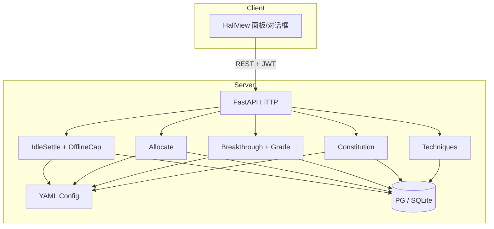

# M2 成长深度 — 详细设计说明（骨架）

> 依据：`开发计划.md` §4 · `project修仙.md`（GDD v4.0）§3.2 / §4 / §9 · `M0工程骨架设计.md` · `M1核心循环设计.md`  
> 目标：在 M1 闭环之上落地 **挂机三向 + 离线 12h 帽 + 资源手动分配 + 体质骨架 + 跨境品阶**  
> 范围外：见根目录 [`后续待完成.md`](./后续待完成.md)（开实现前必读；尤其勿提前做棋盘 / 雷劫 / WS）  
> 版本：v1.0 · 2026-08-04  
> 对应延后项消化目标：`M1-D01`～`M1-D05`、`M1-D32`

---

## 1. 设计目标与思路

### 1.1 一句话目标

把「过夜挂机有收益上限、三向养成可分配、体质可镶嵌、跨境有永久品阶」做成可本地复现的成长深度层；陌生人按 README 能从 M1 大厅无缝升到 M2 玩法，而不推翻 M0/M1 鉴权与 **「预测展示 + 惰性权威入账 + tick 对齐」** 结算骨架。

### 1.2 设计原则

| 原则 | 落地方式 |
| --- | --- |
| **继承 M1 权威壳** | 结算 / 突破掷骰 / 战斗仍只在服务端；前端只展示、发起、弹窗 |
| **配置驱动** | 三向速率、离线帽、功法表、品阶权重、体质样本进 YAML；禁止散落 if 链 |
| **继承 M1 结算模型 + 离线帽** | 无 APScheduler / 无固定短轮询；在线仍预测 + `next_tick_at` 对齐 sync；长缺口走 pending/claim；settle 时 `effective_elapsed = min(elapsed, offline_cap)` |
| **池与投入分离** | 挂机只涨资源池；境界进度 / 功法等级靠玩家手动分配（系统不代选） |
| **大厅为主、对话框为辅** | **不新增玩法路由**（与 M1 一致）；离线领取 / 分配 / 体质用面板与对话框 |
| **表可增量迁** | 品阶、功法、体质、离线 pending 允许 Alembic 加表/加列；不推翻 `users`/`characters` 主关系 |
| **延后必登记** | 雷劫、真读条、棋盘、化身、配方实装等继续写入 `后续待完成.md` |

### 1.3 成功标准（验收）

1. 可切换 `spirit` / `body` / `crafting`（三选一互斥）；分别涨修为池 / 炼体度 / 制造业经验。  
2. 离线超过免费帽后不再增加收益；会员档位字段预留（18h/24h），默认走 12h。  
3. 上线（或进大厅）可预览离线明细并一键领取；领取后池资源入账、锚点推进。  
4. 玩家可将三池资源手动分配到「当前境界进度」或「功法等级」（最少 2～3 本功法可升）。  
5. 突破读 **已投入的境界进度**（不再直接把整池修为当门槛）。  
6. 体质：初始 1 主格 + 2 副格；可镶嵌 / 卸下；格满拒绝；升品/融合接口可调（结果可占位）。  
7. 仅 **跨境成功** 结算品阶（劣质～天道）并持久化；层内进阶不出品阶；面板可见当前品阶与历史。  
8. 神通槽位数按品阶解锁占位（槽可空，无神通内容）。  
9. 突破品阶权重可读体质基础属性（系数占位，有/无体质可测差异）。  
10. README / CHANGELOG / `.env.example` 同步；无密钥硬编码。

### 1.4 明确不做（摘要）

完整清单见 [`后续待完成.md`](./后续待完成.md)。M2 摘要：

- 7×7 棋盘、布阵、阵法、快照、战报落库（→ M3）  
- 雷劫 / 渡劫 / 待引渡 / 轮回实装（→ M5）  
- 异步真读条突破（→ M2 末可选体验或 M5；默认仍同步 + 假读条）  
- 化身、制造业配方成品、灵宠（→ M4）  
- WebSocket / SSE 真推送（→ M6）  
- 天气 / 六时对挂机修正（→ M5）  
- 付费会员开通流程（仅预留 cap 档位字段与配置）

### 1.5 与 M0 / M1 的关系

| 已交付 | M2 动作 |
| --- | --- |
| JWT / 创角 / `CharacterPublic` | 保留；扩展池/进度/品阶/离线摘要字段 |
| 惰性 `settle_idle`（权威层） | **扩展**：三向产出 + 离线帽 + pending 领取；在线短缺口仍走 M1 §4 三层模型 |
| `/idle/*` `/breakthrough/*` `/battle/*` `/gm/*` | 保留；扩展 direction；新增 allocate / offline / constitution / techniques |
| 大厅四面板 | Idle 三向开放；新增分配面板、体质面板、离线对话框、品阶展示 |
| `body`/`crafting` → `40020` | 改为配置 `enabled: true` 后可切换 |

---

## 2. 技术框架设计

### 2.1 选型（继承 M0/M1）

| 层 | 技术 | M2 增量 |
| --- | --- | --- |
| 后端 | FastAPI + SQLAlchemy 2 async + Alembic | allocate / offline / constitution / technique / grade |
| 配置 | YAML + pydantic-settings | `techniques.yaml` / `offline.yaml` / `constitution.yaml` / `grades.yaml`；扩展 `idle.yaml` |
| 前端 | Vue3 + Pinia + Router + Axios | 大厅面板/对话框增量；**路由表不新增玩法 path** |
| 定时任务 | **无** | 离线靠 pending/claim；在线靠预测 + tick 对齐 sync |
| WebSocket | **无** | — |

### 2.2 系统上下文



### 2.3 后端目录增量（相对 M1）

```text
backend/app/
├── config_data/
│   ├── idle.yaml                 # 三向 enabled + 按境界消耗曲线钩子
│   ├── offline.yaml              # 免费帽 / 会员档位预留
│   ├── techniques.yaml           # 最少 2～3 本功法
│   ├── constitution.yaml         # 体质/词条样本（非全附录）
│   ├── grades.yaml               # 品阶权重、神通槽位数、属性修正占位
│   └── breakthrough.yaml         # 去掉 fixed_grade；改为读 grades
├── domain/                       # 无 IO 纯规则（OOP）
│   ├── idle.py                   # SettleResult / OfflinePending / IdleGainCalculator
│   ├── combat.py                 # CombatCalculator（品阶×功法×体质）
│   └── breakthrough.py           # BreakthroughPreview
├── db/
│   ├── bootstrap.py              # 启动补列 / schema_migrations（自 main 迁出）
│   └── models/
│       ├── character.py          # 加列：realm_progress、品阶、会员帽、pending 等
│       ├── technique.py
│       ├── constitution.py
│       └── breakthrough_grade.py
├── services/
│   ├── idle_service.py           # IdleService：三向 + 离线帽 + preview/claim
│   ├── play_gate.py              # PlayGate：跨玩法前置
│   ├── allocate_service.py       # AllocateService
│   ├── technique_service.py      # TechniqueService
│   ├── constitution_service.py   # ConstitutionService
│   ├── breakthrough_service.py   # BreakthroughService：跨境品阶
│   ├── grade_service.py          # GradeService：掷骰与槽位
│   ├── character_service.py      # CharacterService：战力权威 enrich
│   └── realm_config.py           # YAML → GameConfigBundle
├── core/
│   ├── time_utils.py
│   └── deps.py                   # get_*_service 工厂
├── api/                          # 均 Depends 注入对应 Service
│   ├── idle.py
│   ├── allocate.py
│   ├── techniques.py
│   └── constitution.py
├── schemas/
│   ├── allocate.py
│   ├── offline.py
│   ├── techniques.py
│   ├── constitution.py
│   └── grades.py
└── tests/
    ├── test_idle_three_way.py
    ├── test_offline_cap.py
    ├── test_allocate.py
    ├── test_constitution.py
    └── test_breakthrough_grade.py
```

> **OOP（2026-08-04）**：玩法域均为 Application Service 类；无 DB 规则下沉 `domain/`；HTTP 契约不变。  
> **配置（2026-08-07）**：**M2-D01 已消化** — YAML 底表 ∪ 后台发布覆盖 → `GameConfigBundle`；功法/体质/品阶/idle 等表均须可被 ADM 对应域管理（主计划 §0.0）。DEV `/gm` 不是运营入口。

### 2.4 环境变量增量

| 变量 | 类型 | 默认 | 说明 |
| --- | --- | --- | --- |
| `OFFLINE_CAP_HOURS_FREE` | float | `12` | 免费离线有效小时；可被 `offline.yaml` 覆盖 |
| `OFFLINE_CAP_HOURS_MEMBER_TIER1` | float | `18` | 会员档预留（无开通流程时不启用） |
| `OFFLINE_CAP_HOURS_MEMBER_TIER2` | float | `24` | 会员档预留 |
| `OFFLINE_PREVIEW_THRESHOLD_SECONDS` | int | `300` | 离线缺口 ≥ 此值则进入「待领取」语义（可配） |
| `ALLOCATE_MIN_UNIT` | int | `1` | 单次分配最小整数单位 |
| `CONSTITUTION_UNEQUIP_COOLDOWN_SECONDS` | int | `0` | M2 默认 0；卸下冷却占位 |
| `GRADE_RNG_SEED` | int \| 空 | 空 | 仅测试注入 |

前端可选：

| 变量 | 默认 | 说明 |
| --- | --- | --- |
| `VITE_OFFLINE_AUTO_OPEN` | `true` | 进大厅若有 pending 自动打开领取对话框 |

---

## 3. 领域模型与配置

### 3.1 资源池 vs 境界进度（相对 M1 的关键语义变更）

| 字段 | M1 语义 | M2 语义 |
| --- | --- | --- |
| `cultivation_points` | 挂机涨、突破直接读门槛 | **修为池**（未分配） |
| `body_tempering_points` | 只读 0 | **炼体度池** |
| `crafting_exp` | 只读 0 | **制造业经验池** |
| `realm_progress`（新列） | — | **已投入当前档的境界进度**；突破门槛读此字段 |
| `idle_direction` | `none`/`spirit`；body/crafting 拒 | 三向均可（配置开启） |

**迁移策略（Alembic）**

1. 新增 `realm_progress BIGINT NOT NULL DEFAULT 0`。  
2. 数据迁移：`realm_progress = cultivation_points`，然后 `cultivation_points = 0`（把 M1 已堆修为视为「已投入境界」，避免老号突然无法突破）。  
3. 文档与 GM 同步支持读写新字段。

> 若更希望「旧修为留在池里强制玩家点一次分配」，可改为不迁移数值并在首次进大厅弹引导；**默认采用策略 2**，降低回归成本。

### 3.2 角色表增量列

| 字段 | 类型 | 默认 | 说明 |
| --- | --- | --- | --- |
| `realm_progress` | BIGINT | 0 | 当前档已投入修为进度 |
| `breakthrough_grade` | VARCHAR(32) | `none` | 最近一次跨境品阶；无跨境过为 `none` |
| `divine_ability_slots` | INT | 0 | 由品阶推导后缓存，便于面板 |
| `membership_tier` | VARCHAR(32) | `free` | `free` / `tier1` / `tier2`（开通流程后置） |
| `pending_offline_json` | TEXT/JSON | null | 待领取离线明细；无则 null |
| `offline_capped_at` | TIMESTAMPTZ | null | 最近一次因帽截断的时刻（审计/展示） |

`breakthrough_grade` 持久化对应消化 **M1-D32**。

### 3.3 挂机配置 `idle.yaml`（M2）

```yaml
tick_seconds: 60
# 灵石消耗可按 major_realm 覆盖；缺省用方向内默认
spirit_stone_cost_by_realm:
  body_tempering: 1
  qi_refining: 2
  foundation: 3
directions:
  spirit:
    enabled: true
    cultivation_per_tick: 10
    # spirit_stones_per_tick 可省略，回落到 cost_by_realm
  body:
    enabled: true
    body_tempering_per_tick: 8
  crafting:
    enabled: true
    crafting_exp_per_tick: 8
```

**规则**

- 同一时刻仅一个 `idle_direction`。  
- 切换：先 settle（含离线 pending 规则，见 §4）再改方向。  
- 停滞：当前方向 1 tick 灵石不够 → `is_stalled=true`，锚点不空转（继承 M1）。  
- `status != normal`：只推进/冻结规则与 M1 一致（零产出）。

### 3.4 离线配置 `offline.yaml`

```yaml
free_cap_hours: 12
membership_caps:
  free: 12
  tier1: 18
  tier2: 24
preview_threshold_seconds: 300
# 领取后是否把「帽外墙钟」直接丢弃（推进锚点到 now）
discard_over_cap_wall_time: true
```

### 3.5 功法配置 `techniques.yaml`（最小集）

```yaml
techniques:
  basic_qi_art:
    name: 基础吐纳诀
    track: spirit          # 消耗 cultivation_points 池
    max_level: 10
    cost_per_level: [20, 40, 80, 120, 200, 300, 450, 600, 800, 1000]
    effects_placeholder:
      atk_bonus_per_level: 1
  iron_body_art:
    name: 铁皮锻体功
    track: body
    max_level: 10
    cost_per_level: [20, 40, 80, 120, 200, 300, 450, 600, 800, 1000]
    effects_placeholder:
      hp_bonus_per_level: 5
  beginner_alchemy:
    name: 入门丹道残篇
    track: crafting
    max_level: 5
    cost_per_level: [30, 60, 100, 160, 250]
    effects_placeholder:
      crafting_speed_bonus_per_level: 0.02
```

角色功法进度表 `character_techniques`：`(character_id, technique_id, level)` UNIQUE。

### 3.6 品阶配置 `grades.yaml`

```yaml
grades:  # 低 → 高
  - id: inferior
    name: 劣质
    weight: 5
    atk_mul: 0.95
    hp_mul: 0.95
    divine_slots: 0
  - id: mortal
    name: 凡品
    weight: 40
    atk_mul: 1.0
    hp_mul: 1.0
    divine_slots: 0
  - id: good
    name: 良品
    weight: 25
    atk_mul: 1.03
    hp_mul: 1.03
    divine_slots: 1
  - id: superior
    name: 上品
    weight: 15
    atk_mul: 1.06
    hp_mul: 1.06
    divine_slots: 1
  - id: peerless
    name: 极品
    weight: 10
    atk_mul: 1.1
    hp_mul: 1.1
    divine_slots: 2
  - id: immortal
    name: 仙品
    weight: 4
    atk_mul: 1.15
    hp_mul: 1.15
    divine_slots: 2
  - id: heavenly
    name: 天道
    weight: 1
    atk_mul: 1.2
    hp_mul: 1.2
    divine_slots: 3

# 体质对权重的占位修正（有镶嵌主词条时）
constitution_weight_bonus:
  per_main_affix: 2        # 加到「良品及以上」权重池的占位
  per_base_attr_point: 0.01
```

层内进阶：**不掷品阶**。跨境成功：**必掷一次**并写历史。

### 3.7 体质配置与表（骨架）

**配置样本**（非附录全表）：

```yaml
slot_defaults:
  main: 1
  sub: 2
items:
  sample_body_root:
    name: 凡体·根基
    quality: mortal          # 品质 → 只影响基础属性
    base_attrs: { vitality: 5, defense: 3 }
  sample_main_affix_iron:
    name: 主词条·铜皮
    kind: main
    grade: good
    effects: { hp_bonus: 20 }
  sample_sub_affix_swift:
    name: 副词条·轻身
    kind: sub
    grade: mortal
    effects: { atk_bonus: 2 }
```

**表**

| 表 | 用途 |
| --- | --- |
| `character_constitution_slots` | 角色主/副格数量与已镶嵌 `item_instance_id` |
| `character_constitution_items` | 背包实例：`def_id`、品质/品级、是否已镶嵌 |
| （可选）`constitution_ops_log` | 升品/融合审计 |

创角发放：1 个凡体样本 + 1 主词条样本 + 2 副词条样本（便于联调镶嵌）。

### 3.8 战力推导（M2）

```text
base_atk/hp ← realms.yaml 当前档
× breakthrough_grade 的 atk_mul/hp_mul
+ 功法 effects_placeholder
+ 已镶嵌体质 base_attrs / 词条 effects
```

仍可不落「最终战力列」；响应里计算。需要缓存时仅缓存 `divine_ability_slots`。

---

## 4. 结算模型扩展：在线三层 + 离线领取

> **在线路径**完整继承 [`M1核心循环设计.md`](./M1核心循环设计.md) §4.0：  
> **客户端预测展示** + **tick 对齐 `/idle/sync`** + **服务端 `settle_idle` 权威入账**。  
> 本节只扩展「长离线缺口」的 pending/claim 与三向产出；**禁止**把在线改回固定短轮询。

### 4.0 与 M1 在线模型的关系

| 场景 | 行为 |
| --- | --- |
| 大厅修炼中、短缺口 | 与 M1 相同：`startIdleRealtime` 预测 + 到点 sync；`settle_idle` 三向版入账 |
| 有 `offline_pending` | **冻结**预测入账与 tick sync；UI 引导领取 |
| claim 成功后 | 恢复 M1 在线三层模型 |
| 突破 / 战斗 / 分配 | 只读权威；入口先处理 pending（见 §4.2）再 settle |

### 4.1 两种缺口

| 场景 | 判定 | 行为 |
| --- | --- | --- |
| **在线短缺口** | `elapsed < preview_threshold` 且无 pending | 与 M1 相同：请求内 `settle_idle` 权威入账；大厅仍靠预测 + tick 对齐体感 |
| **离线长缺口** | `elapsed ≥ preview_threshold` 或已有 pending | **不直接入池**；写入 `pending_offline_json`；推进逻辑见下 |

### 4.2 离线 pending 计算伪代码

```text
function prepare_offline_or_settle(ch, now):
  if ch.pending_offline_json:
    return  # 已有待领取，禁止用同一段时间再累计

  tick = config.tick_seconds
  elapsed = now - ch.last_settled_at
  if elapsed < preview_threshold:
    return settle_idle_online(ch, now)   # M1 三向版

  cap = hours_to_seconds(membership_caps[ch.membership_tier])
  effective = min(elapsed, cap)
  max_ticks = floor(effective / tick)

  # 按方向与灵石算 used / stalled / gains（同 M1，扩展 body/crafting）
  pending = {
    "from": ch.last_settled_at,
    "to_effective": ch.last_settled_at + used * tick,
    "cap_hours": cap/3600,
    "capped": elapsed > cap,
    "wall_elapsed_seconds": elapsed,
    "settled_ticks": used,
    "direction": ch.idle_direction,
    "gained_cultivation": ...,
    "gained_body": ...,
    "gained_crafting": ...,
    "spent_spirit_stones": ...,
    "is_stalled": ...
  }
  ch.pending_offline_json = pending
  # 锚点：先不改 last_settled_at 到 now；claim 时再提交
  # 若 discard_over_cap_wall_time：claim 后 last_settled_at = now
  # 否则 claim 后 last_settled_at = to_effective（帽外时间仍可在下次继续——不推荐）
  return pending
```

**写死约定**

1. 有 pending 时：`GET /characters/me`、`/idle/sync` 返回 `offline_pending`；**在线 tick 不再累加**，直到 claim 或 discard。  
2. `POST /idle/offline/claim`：把 pending 入池、扣灵石、清 pending、按配置推进 `last_settled_at`。  
3. `POST /idle/direction` 在有 pending 时：先要求 claim，或自动 claim 再切换——**推荐拒绝并返回 `40030`，前端引导先领取**。  
4. 突破 / 战斗 / 分配：有 pending 时 **先自动 claim**（或拒绝 `40030`）——**推荐自动 claim 并在响应带 `auto_claimed_offline`**，减少卡死。

### 4.3 三向 settle（在线）

在 M1 `spirit` 分支上并列：

| direction | 每 tick 增加 | 消耗灵石 |
| --- | --- | --- |
| `spirit` | `cultivation_points`（**按大境界基础表** × 内外部加成） | 按境界表 |
| `body` | `body_tempering_points`（同上） | 按境界表 |
| `crafting` | `crafting_exp`（同上） | 按境界表 |
| `none` | 0 | 0（只推进锚点） |

速率公式与 `idle_env` 拆解见 [`挂机速率与加成设计.md`](./挂机速率与加成设计.md)；`idle.yaml` 的 `gain_per_tick_by_realm` 为权威基础表。

---

## 5. 资源分配

### 5.1 分配目标

| `target_type` | `target_id` | 消耗池 | 效果 |
| --- | --- | --- | --- |
| `realm` | 忽略或 `current` | `cultivation_points` | `realm_progress += amount` |
| `technique` | 功法 id | 按功法 `track` 对应池 | 按 `cost_per_level` 扣费升级；`amount` 表示「投入点数」，服务端换算可升几级 |

### 5.2 规则

- 系统 **不** 自动把池转入境界。  
- `amount` 必须为正整数且 ≤ 池余额。  
- 功法满级 → `40033`。  
- 炼体度 **不可** 投入境界进度（仅功法 track=body）；制造业经验同理。  
- 分配前：settle / 处理 pending（见 §4.2）。

### 5.3 突破门槛（M2）

```text
can_breakthrough = realm_progress >= cultivation_required
成功时：realm_progress -= required（或清零策略与配置一致；推荐扣 required）
```

失败回退：对 `realm_progress` 按 M1 的 keep_ratio 逻辑（不再误伤未分配池）。

成功判定：修为区间骰（[`骰子系统设计.md`](./骰子系统设计.md)）；`breakthrough.yaml` 的 `success_rate` 映射区间阈值。

---

## 6. 突破品阶与体质权重

### 6.1 时机

| 进阶类型 | 品阶 |
| --- | --- |
| 层 / 期内 | 不结算 |
| 跨境成功 | 按 `grades.yaml` 权重掷骰；写 `breakthrough_grade` + 历史行；刷新 `divine_ability_slots` |
| 跨境失败 | 不改品阶 |

### 6.2 权重修正（占位）

```text
weights = base_weights from grades.yaml
if has_equipped_main_affix:
  增加 good+ 档的 weight（constitution_weight_bonus）
再按 vitality 等基础属性做微小加成
normalize → 掷骰
```

天气/材料/付费道具 → 仍登记后续，M2 不做。

### 6.3 神通槽

- 仅占位：`divine_ability_slots` 数字 + 前端空槽 UI。  
- 无神通配置表实装；不可装配。

### 6.4 历史表 `breakthrough_grade_history`

| 字段 | 说明 |
| --- | --- |
| `character_id` | |
| `from_realm_display` / `to_realm_display` | |
| `grade` | 枚举 id |
| `created_at` | |

---

## 7. API 总体约定

继承 M0/M1：`{ code, message, data }`；ISO8601 UTC；整数资源；Bearer。

### 7.1 错误码增量

| code | 含义 |
| --- | --- |
| `40020` | 挂机方向未开放（配置 enabled=false 时仍用） |
| `40030` | 存在未领取离线收益，需先 claim（若采拒绝策略的接口） |
| `40031` | 无待领取离线收益 |
| `40032` | 分配资源不足或 amount 非法 |
| `40033` | 功法不存在 / 满级 / track 不匹配 |
| `40034` | 体质格满 / 主副格类型不匹配 / 同名冲突 |
| `40035` | 体质物品不存在或不在背包 |
| `40036` | 升品/融合材料不足或规则不满足 |
| `40037` | 卸下冷却中 |

M0/M1 码表继续有效。

### 7.2 `CharacterPublic` 再扩展

| 字段 | 类型 | 说明 |
| --- | --- | --- |
| `realm_progress` | int | 已投入境界进度 |
| `cultivation_to_next` | int \| null | 门槛（对照 realm_progress） |
| `cultivation_progress_ratio` | float | `realm_progress / required` |
| `breakthrough_grade` | string | `none` 或品阶 id |
| `breakthrough_grade_name` | string | 中文 |
| `divine_ability_slots` | int | |
| `membership_tier` | string | |
| `offline_cap_hours` | float | 当前生效帽 |
| `offline_pending` | object \| null | 与 preview 同结构 |
| `technique_summary` | array | `{id,name,level,max_level}` 可选摘要 |
| `constitution_summary` | object | 已镶嵌简述 |

池字段语义见 §3.1；`idle_*_per_tick` 随三向变化。

---

## 8. 接口详细设计

### 8.1 扩展 `POST /idle/direction`

Body：`direction` ∈ `none|spirit|body|crafting`  
行为：处理 pending 策略（§4.2）→ settle → 校验 enabled → 更新方向。

### 8.2 `GET /idle/offline/preview`

**鉴权**：Bearer  

若无 pending 且缺口不足阈值：返回 `has_pending=false`。  
若应生成 pending：幂等生成并返回明细（不入池）。

**响应 `data` 示例**

```json
{
  "has_pending": true,
  "pending": {
    "settled_ticks": 120,
    "cap_hours": 12,
    "capped": true,
    "wall_elapsed_seconds": 90000,
    "direction": "spirit",
    "gained_cultivation": 1200,
    "gained_body": 0,
    "gained_crafting": 0,
    "spent_spirit_stones": 120,
    "is_stalled": false
  },
  "character": { }
}
```

### 8.3 `POST /idle/offline/claim`

**鉴权**：Bearer  

**行为**：校验 pending → 入池/扣石 → 清 pending → 推进锚点 → 返回 character + applied 明细。  

**错误**：`40031` 无 pending。

### 8.4 `POST /allocate`

**鉴权**：Bearer  

**Body**

| 字段 | 类型 | 说明 |
| --- | --- | --- |
| `target_type` | string | `realm` \| `technique` |
| `target_id` | string \| null | 功法 id；realm 可空 |
| `amount` | int | 投入的池点数 |

**响应 `data`**

```json
{
  "allocated": 40,
  "levels_gained": 1,
  "message": "铁皮锻体功升至 2 级",
  "character": { }
}
```

### 8.5 `GET /techniques/me`

返回角色已解锁功法等级列表（创角默认解锁配置中全部最小集）。

### 8.6 体质

| 方法 | 路径 | 说明 |
| --- | --- | --- |
| GET | `/constitution/me` | 背包 + 格子 + 已镶嵌 |
| POST | `/constitution/equip` | `{ "item_id": int, "slot_type": "main"|"sub", "slot_index": int }` |
| POST | `/constitution/unequip` | `{ "slot_type", "slot_index" }` |
| POST | `/constitution/upgrade` | 升品骨架 `{ "item_id" }`；材料校验可先用占位消耗灵石 |
| POST | `/constitution/fuse` | 融合骨架 `{ "item_ids": [..] }`；结果占位随机 |

### 8.7 突破扩展

- `GET /breakthrough/preview`：门槛改为 `realm_progress`；跨境时额外返回 `grade_preview`（权重说明，不预掷结果）。  
- `POST /breakthrough/attempt`：跨境成功写入品阶与历史；响应含 `grade` / `grade_name` / `divine_ability_slots`。  
- `GET /breakthrough/grades/history`：最近 N 条品阶历史。

### 8.8 GM 扩展（development）

`POST /gm/character/set` 增可选字段：`realm_progress`、`body_tempering_points`、`crafting_exp`、`breakthrough_grade`、`membership_tier`、`clear_offline_pending`。

---

## 9. 后端模块设计思路

### 9.1 分层

```text
api（Depends 注入）
  → Application Service
       IdleService / AllocateService / ConstitutionService /
       TechniqueService / GradeService / BreakthroughService /
       CharacterService / PlayGate
  → domain（纯规则 / 值对象）
  → models
         ↘ realm_config → GameConfigBundle（YAML 底表）
```

- 一切改资源路径共享「`PlayGate` pending 处理 + `IdleService.settle`」。  
- 品阶掷骰只在 `GradeService`；突破服务只调用。  
- 体质效果聚合给战斗/突破只读：`GradeService.aggregate_constitution_bonuses`（或等价包装）。  
- 战力权威入口：`CharacterService.build_combat_stats` / `enrich_public`（`domain.CombatCalculator`）。  
- 配置热更/DB 覆盖：**现在不做**，见 `后续待完成.md` **M2-D01**。

### 9.2 并发

- 同 M1：单角色事务；关键写路径可 `SELECT … FOR UPDATE`。  
- claim / allocate / attempt 按钮前端防抖；幂等键仍见后续 `M1-D30`。

### 9.3 日志

| 事件 | 级别 |
| --- | --- |
| 三向切换 | INFO |
| 离线 pending 生成 / claim | INFO |
| 分配 | INFO |
| 品阶结果 | INFO |
| 体质镶嵌/卸下/升品/融合 | INFO |
| GM | WARNING |

### 9.4 测试最低集

| 用例 | 期望 |
| --- | --- |
| body/crafting 挂机 N tick | 对应池增加，修为池不增 |
| 离线 20h + free | 最多按 12h tick 入 pending；claim 后池正确 |
| 有 pending 再 sync | 不双算 |
| 分配 realm | 池减、realm_progress 增 |
| 分配功法 | 等级 +1，费用按表 |
| 层进阶 | 品阶字段不变 |
| 跨境成功（seed） | 品阶写入 + 历史 + 槽位 |
| 格满镶嵌 | `40034` |
| 有主词条 vs 无 | 品阶分布可测差异（多次 seed 或权重断言） |

---

## 10. 交叉开发排期（建议）

约 **2～3 周**，按开发计划板块竖切：

| 阶段 | 后端 | 前端 | 验收 |
| --- | --- | --- | --- |
| F1 | 三向 settle + idle.yaml | IdlePanel 三按钮 | 炼体/制造业池可见涨 |
| F2–F3 | allocate + techniques | AllocatePanel | 分配后进度/等级变 |
| F4–F5 | offline cap + preview/claim | OfflineClaimDialog | mock 时间测帽 |
| F6 | 境界耗石曲线 | 速率展示随境界 | 高境耗更快 |
| G | constitution CRUD + 样本 | ConstitutionPanel | 镶嵌/卸下 |
| H | grades + history + slots | 品阶展示 / 空神通槽 | 跨境出品阶 |
| 收尾 | 单测、README、CHANGELOG | 文案 / GameLog | **M2 总验收** |

---

## 11. M2 总验收清单

- [ ] 三向互斥挂机；池字段分别增长  
- [ ] 免费 12h 离线帽正确；会员档位可配置但默认 free  
- [ ] 离线预览 + 一键领取；无双算  
- [ ] 手动分配到境界进度与功法；系统不代选  
- [ ] 突破读 `realm_progress`；失败回退不误伤未分配池  
- [ ] 体质镶嵌/卸下/格满拒绝；升品融合接口可调用  
- [ ] 跨境出品阶并持久化；层内不出；历史可查  
- [ ] 神通槽位数随品阶变化（可空）  
- [ ] 体质影响品阶权重可测  
- [ ] 挂机耗石随境界配置变化  
- [ ] 无新玩法路由；文档与 `.env.example` 同步  
- [ ] `后续待完成.md` 中 M1-D01～D05、M1-D32 标为已消化（实现完成后）  

---

## 12. 文档与产出物清单

1. 本文 `M2成长深度设计.md`  
2. `M2前端目录与路由设计.md`  
3. 更新 `后续待完成.md`（设计阶段→设计中；实现后→已消化）  
4. 实现期：迁移脚本、新 YAML、新 api/services、大厅组件  
5. 更新 `README.md`、`CHANGELOG.md`、`.env.example`  

---

## 13. 风险与对策

| 风险 | 对策 |
| --- | --- |
| pending 与在线 settle 双算 | 有 pending 则冻结在线累计；单测覆盖 |
| M1 老号修为语义变化 | Alembic 把旧修为迁入 `realm_progress` |
| 大厅面板过多 | 分配/体质用折叠面板；离线用对话框；仍不新开路由 |
| 品阶权重难调 | 只改 `grades.yaml`；seed 单测 |
| 过早做配方/化身 | 禁止；制造业只涨经验池 + 入门功法 |
| 过早 WS | 禁止；继续 **预测 + tick 对齐 sync**（M1 §4.0） |

---

## 14. 修订记录

| 日期 | 说明 |
| --- | --- |
| 2026-08-04 | 初稿：三向/离线帽与领取/分配/体质骨架/跨境品阶；大厅无新路由；消化目标对齐 M1-D01～D05、D32 |
| 2026-08-04 | §4 正名：在线继承 M1「预测 + 惰性权威入账 + tick 对齐」；离线 pending 为扩展，非退回短轮询 |
| 2026-08-04 | **后端 OOP 抽象同步**：§2.3 / §9.1 改为 Application Service + `domain/` + `PlayGate` + `deps.get_*_service`；M2-D01 配置源延后 |
| 2026-08-10 | **中文/索引指针**：离线方向展示中文（§0.0.2）；工坊/背包复合索引见开发计划 §0.6.1 |

---

*玩法冲突以 `project修仙.md` 为准；里程碑以 `开发计划.md` 为准；延后项以 `后续待完成.md` 为准；M0 鉴权与表根基以 `M0工程骨架设计.md` 为准；M1 结算与突破骨架以 `M1核心循环设计.md` 为准；M2 接口与成长语义以本文为准。*
