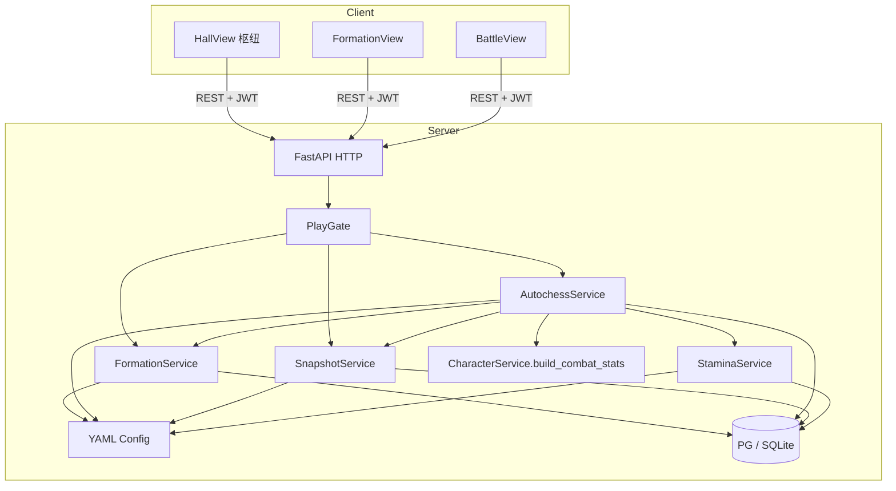
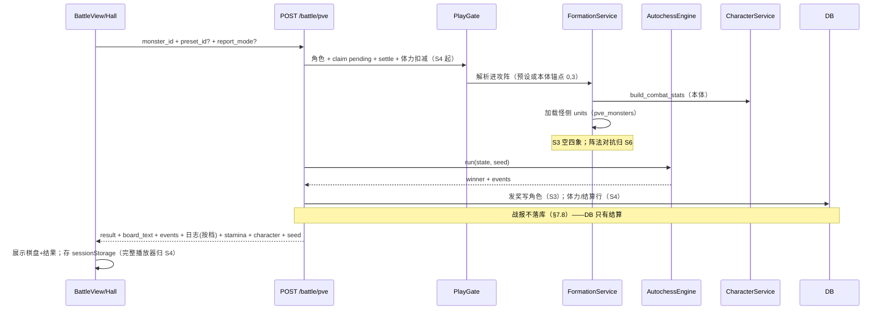

# M3 战斗成型 — 详细设计说明（现行已落地）

> 依据：`开发计划.md` §5 · `project修仙.md`（GDD v4.0）§7 / §8 · M0～M2 设计  
> **状态**：S1～S6 竖切 **已落地**（2026-08-05）；本文只描述**现行实现范围**  
> **延后项**：一律见 [`后续待完成.md`](./后续待完成.md) **§1.5（M3-D01～D10）**——开新功能前必读，勿在本文展开未做细则  
> 版本：v1.5 · 2026-08-05  
> 已消化延后项：`M1-D10`～`M1-D13`、`M1-D31`  
> **战斗模式真理（已落地）**：§3 棋盘 · §5 阵法四象与地形探路（最小 LOS）· §7.0～7.3 / 7.6～7.8 普攻演算与战报 · 默认 AI 见 [`M3自动移动攻击算法设计.md`](./M3自动移动攻击算法设计.md)

---

## 1. 设计目标与思路

### 1.1 一句话目标

把「DND+自走棋：战前在 7×7 布子与选阵 → 服务端可复现演算（含四象对抗）→ 战报回放 → 防守快照可被他人攻打」做成可本地复现的战斗成型层；陌生人按 README 能从 M2 大厅进入布阵页打通空盘 PVE，并在 S6 后更新快照供第二账号攻打，而不推翻 M0～M2 鉴权、养成与 **「预测展示 + 惰性权威入账 + tick 对齐」** 挂机骨架。

### 1.2 设计原则

| 原则 | 落地方式 |
| --- | --- |
| **服务端权威** | 占位校验、出手、伤害、胜负、奖励、快照序列化只在服务端；前端只编辑阵与播放战报 |
| **配置驱动** | 棋盘常量、上阵上限、怪阵、阵法、快照冷却/定点钟点进 YAML；禁止散落 if 链 |
| **战报 schema 独立** | M3 战报 **不兼容** M1 `rounds[]` 叙事行；新 `events[]` + `schema_version`（消化 **M1-D13**）；**零保留**——响应即战报，不落库（§7.8） |
| **棋子模型独立** | 棋子/坐标/阵容与 M1「单本体数值对撞」分离；M1 `POST /battle/pve` **演进为棋盘路径**（见 §1.5） |
| **大厅变枢纽** | 首次新增玩法路由 `/formation`、`/battle`（消化 **M1-D31**）；`/hall` 保留养成与入口跳转 |
| **快照不含瞬时挂机** | 序列化战力/棋子/布阵/阵法/哈希；不含 `pending` / 片内预测进度 |
| **继承 OOP 分层** | 新 `FormationService` / `AutochessService` / `SnapshotService` / `StaminaService`；无 IO 规则进 `domain/` |
| **六步竖切、战斗流程单列** | 实现按 **§11** 六步；**整条开战→演算→结算链路**单独作为 **§12** 重点板块开发与验收 |
| **延后必登记** | 化身/灵宠/傀儡成品、天气锁定、陨落、道主实时、APScheduler 强依赖等写入 `后续待完成.md` |

### 1.3 成功标准（验收）

1. 共用 7×7；左下 `(0,0)`；x 轴己方/中立/敌对三区；默认仅能部署在 `(0,2)–(1,4)`（最多 6）；非法占位拒绝。（阵法改部署区 → **M3-D08**）  
2. 可保存 ≥3 套预设（进攻 / 防守 / 临时）；进攻开战不自动覆盖防守预设。  
3. 出战前可选阵法样本；四象对抗结算 + 效果乘区 + 障/渊揭晓已落地；禁制子类/环境天气载荷加深 → **M3-D07**（设计见 [`四象禁制与环境天气载荷设计.md`](./四象禁制与环境天气载荷设计.md)）。  
4. 回合循环纯服务端可复现（同 seed 同结果）；含出手顺序、普攻占位、死亡、回合上限评分。  
5. 前端布阵编辑器可用；战报播放器可逐步/跳过；数据源=开战响应，浏览器 `sessionStorage` 会话自存（**零保留**，无服务端历史）。  
6. 上阵数量随境界配置（默认上限 6）；本体唯一；`tribulation` 等状态 **预留禁本体**（M5 前可仅配置钩子）。  
7. 手动更新防守快照：1h 冷却；渡劫状态禁止（状态未实装时钩子返回明确码）。  
8. 每日定点刷新：按配置钟点 **惰性补刷**（请求路径检测，见 §6.3；**不强制**引入 APScheduler）。  
9. 第二账号可攻打第一账号防守快照；奖励占位；不改对方实时养成。  
10. 本会话可回看最近 N 场战报（前端会话列表）；登出/关页销毁；**无**服务端历史查询（守方过程见 **M3-D04**）。  
11. README / CHANGELOG / `.env.example` 同步；无密钥硬编码。  
12. **六步均有竖切验收**（§11）；**S3 战斗全流程**单独打勾（§12.7），不得用「能弹几行日志」代替。

### 1.4 明确不做 / 延后（指针）

完整清单与验收钩子见 [`后续待完成.md`](./后续待完成.md)。与本里程碑相关的待做 ID：

| ID | 摘要 |
| --- | --- |
| M3-D01 | 快照每日定点真 APScheduler（现行=惰性补刷） |
| M3-D02 | 完整任意角 LOS / 飞跃寻路（现行=轴对齐+对角最小 LOS） |
| M3-D03 | 功法主动/被动 + 道具/陷阱（现行=普攻主技能） |
| M3-D04 | PVP 守方战报过程可见（可选） |
| M3-D05 | 体力恢复道具 / 制作扣体力 |
| M3-D06 | 嘲讽光环强制目标（**Phase A 已消化** → [`嘲讽光环设计.md`](./嘲讽光环设计.md)；**Phase B = M3-D06b → M3-D03**） |
| M3-D07 | 四象内容加深（`seal` 禁制子类、环境/天气载荷）→ **已消化** [`四象禁制与环境天气载荷设计.md`](./四象禁制与环境天气载荷设计.md) |
| M3-D08 | 阵法改部署格 / force_shift（**Phase A 已落地** → [`阵法部署与自研设计.md`](./阵法部署与自研设计.md)） |
| M3-D09 | `report_mode` 请求参数对齐（可选；现行=响应全量+前端切档） |
| M3-D10 | 引擎算法打磨（Tier A/C、基准、修正栈） |
| M4+ | 化身/灵宠/真傀儡 · M5 六时天气锁定/雷劫陨落 · M6 道主 WS · M2-D01 配置热更 · M1-D30 幂等键 |

微操战斗：**永不做**。

### 1.5 与 M0 / M1 / M2 的关系

| 已交付 | M3 动作 |
| --- | --- |
| JWT / 创角 / `CharacterPublic` | 保留；可追加 `defense_snapshot_summary` 只读摘要 |
| 挂机三层模型 / 离线 pending | **不动**；开战入口仍经 `PlayGate`（先 claim pending） |
| `CharacterService.build_combat_stats` | 继续作本体属性权威源；棋子面板复用 |
| M1 `POST /battle/pve` | **升级**：可选 `preset_id` / `formation_id`；响应改 M3 战报；无布阵 → 本体默认锚点 `(0,3)` |
| 大厅四面板 + 分配/体质 | 保留；`BattlePanel` 缩为入口（跳转 `/battle`）或保留一键教学战 |
| 无玩法路由 | **打破**：新增 `/formation`、`/battle`（见前端设计） |

```text
M1 PVE：1 本体 atk/hp 对撞 → rounds[] 仅响应
M3 PVE：体力扣减 → 布阵棋子 → AutochessEngine → 响应即战报（棋盘字符画+日志，浏览器会话自存）
        服务器只落结算（体力/奖励/胜负），不保留任何战斗日志
```

### 1.6 六大关键设计决策（实现拆分锚点）

> 下列决策锁定后 **不得在实现中偷偷改语义**；变更须改本文并记修订记录。  
> **实现顺序 = §11 六步**，与下表一一对应。

| # | 决策 | 一句话 | 落入实现步 |
| --- | --- | --- | --- |
| D1 | **坐标与分区锁定** | 7×7；锚点左下 `(0,0)`；**x**：己方 `0–2` / 中立 `3` / 敌对 `4–6`；默认落子 `(0,2)–(1,4)`（最多 6 子） | **S1** |
| D2 | **战报独立·零保留** | 新 `events[]` + 双档渲染（simple/detailed）；**响应即战报，服务器不落库**，浏览器会话自存；不兼容 M1 `rounds[]` | **S4**（S3 先响应内带回完整 events） |
| D3 | **路由拆分** | 新增 `/formation`、`/battle`；`/hall` 变枢纽；养成不拆路由 | **S2** |
| D4 | **快照定点惰性** | 手动 1h 冷却 + 请求路径惰性补刷；不引入 APScheduler | **S6** |
| D5 | **棋子种类** | 本体必做且唯一；化身/灵宠/傀儡/道具为合法 kind（M3 可样本或拒未开放） | **S5** |
| D6 | **PVE 演进** | `/battle/pve` 走棋盘引擎；无预设 → 本体落默认区锚点格 | **S3（重点板块）** |
| D7 | **阵法四象** | 默认盘无地形/环境/天气/效果；阵法可改四象；对抗用 DND 骰点比较（§5） | **S6**（S3 仅空盘） |
| D8 | **战斗演算** | 先攻=速度×骰；同点双方交错；每回合 2 AP；正交移动；切比雪夫远程；伤害/命中（§7.0～7.3）；功法/道具 → **M3-D03** | **S3**（已落地） |
| D9 | **探路 AI** | 障/深渊未知乐观规划；揭晓后重算换目标（算法专文）；嘲讽 → **M3-D06** | **S6**（已落地，无嘲讽） |
| D10 | **体力门禁** | 战斗消耗体力；按时间惰性恢复；开战 P0 扣减，不足 `40049`；恢复道具/制作消耗 → **M3-D05** | **S4**（已落地） |


★ = 独立重点板块，细则见 **§12**。

---

## 2. 技术框架设计

### 2.1 选型（继承 M0～M2）

| 层 | 技术 | M3 增量 |
| --- | --- | --- |
| 后端 | FastAPI + SQLAlchemy 2 async + Alembic/bootstrap | formation / autochess / snapshot / battle_report |
| 配置 | YAML + pydantic-settings | `board.yaml` / `formations.yaml` / `snapshots.yaml`；扩展 `pve_monsters.yaml` |
| 前端 | Vue3 + Pinia + Router + Axios | **新增路由** + 布阵编辑器 + 战报播放器 |
| 定时任务 | **无强制 APScheduler** | 快照每日定点用 **惰性补刷**；可选后续登记真定时器 |
| WebSocket | **无** | — |

### 2.2 系统上下文



### 2.3 后端目录增量（相对 M2）

```text
backend/app/
├── config_data/
│   ├── board.yaml                 # 棋盘尺寸、3×3 区、上阵上限、回合上限、默认 AI
│   ├── formations.yaml            # 阵法样本（属性/扩展格/移位）
│   ├── snapshots.yaml             # 手动冷却、每日定点钟点、版本
│   ├── stamina.yaml               # 体力：上限、恢复速率、战斗/制作消耗、道具恢复（§12.9）
│   ├── pve_monsters.yaml          # 扩展：怪侧棋子与默认布阵
│   └── （复用 realms / grades / techniques / constitution）
├── domain/
│   ├── board.py                   # Coord / DeployZone / PlacementRules
│   ├── board_tables.py            # 导入期静态表：邻接/切比雪夫球/曼哈顿/射线（零依赖）
│   ├── terrain.py                 # 位掩码地形 + 全源距离表（版本号懒重建）
│   ├── combat_ai.py               # 默认 AI 决策：选目标 / 首步 / Scratch
│   ├── autochess.py               # UnitState / BattleEvent / simulate_battle（纯函数）
│   ├── battle_text.py             # 渲染器：开局棋盘字符画 + 事件→DND 式日志（算法文档 §11）
│   ├── stamina.py                 # 体力惰性恢复纯计算（同挂机 lazy 模式，§12.9）
│   ├── formation_rules.py         # 阵法修正 / 移位纯函数
│   ├── snapshot_hash.py           # 快照规范化 + 版本哈希
│   └── combat.py                  # 仍负责本体 atk/hp 聚合（M2）
├── db/models/
│   ├── formation_preset.py        # 角色布阵预设
│   └── defense_snapshot.py        # 当前防守快照（每角色一行或历史最新）
│   #（v1.4.4 移除 battle_report.py —— 战报零保留，见 §7.8）
├── services/
│   ├── formation_service.py       # FormationService：预设 CRUD、占位校验
│   ├── autochess_service.py       # AutochessService：PVE / PVP 开战编排（含渲染进响应）
│   ├── snapshot_service.py        # SnapshotService：手动更新 + 惰性定点
│   ├── stamina_service.py         # StaminaService：惰性恢复读数 + 开战扣减（§12.9）
│   └── battle_service.py          # 保留薄包装：转发到 AutochessService（兼容旧路径）
├── api/
│   ├── formation.py
│   ├── snapshot.py
│   ├── battle.py                  # 扩展 pve / 新增 pvp / reports
│   └── …
├── schemas/
│   ├── formation.py
│   ├── snapshot.py
│   ├── autochess.py               # 战报事件、开战请求/响应
│   └── battle.py                  # 兼容重导出或弃用旧字段
└── tests/
    ├── test_board_placement.py
    ├── test_autochess_engine.py
    ├── test_battle_text_render.py    # 棋盘字符画 golden file + 日志渲染 + 零保留断言
    ├── test_stamina.py               # 惰性恢复 / 扣减 / 40049 / 日上限
    ├── test_formation_shift.py
    └── test_snapshot_cooldown.py
```

> **OOP**：与 M2 一致；路由 `Depends(get_*_service)`；配置 YAML ∪ Overlay（**M2-D01 已落地**）；怪物/阵法可由 ADM `monsters`/`formations` 域发布。  
> **演算层纯度（写死）**：`board_tables.py` / `terrain.py` / `combat_ai.py` / `autochess.py` **不得 import** FastAPI / SQLAlchemy / pydantic；`simulate_battle(setup, seed)` 为纯 CPU 函数，入参与返回值均为可序列化原始数据。战斗内动态属性（修正栈 + 脏标记 + 触发索引）、并发部署与万人容量估算见 [`M3自动移动攻击算法设计.md`](./M3自动移动攻击算法设计.md) §12～§14。

### 2.4 环境变量增量

| 变量 | 类型 | 默认 | 说明 |
| --- | --- | --- | --- |
| `STAMINA_ENABLED` | bool | `true` | 体力门禁开关（S3 联调期可关；数值在 `stamina.yaml`） |
| `BATTLE_MAX_ROUNDS` | int | `30` | 可被 `board.yaml` 覆盖 |
| `SNAPSHOT_MANUAL_COOLDOWN_SECONDS` | int | `3600` | 手动更新冷却；可被 yaml 覆盖 |
| `SNAPSHOT_LAZY_DAILY_ENABLED` | bool | `true` | 请求路径惰性执行每日定点刷新 |
| `AUTOCHESS_RNG_SEED` | int \| 空 | 空 | 仅测试注入；写入战报便于复现 |
| `PVE_REQUIRE_PRESET` | bool | `false` | `true` 时开战必须带预设；默认允许本体锚点 `(0,3)` 临时阵 |

前端可选：

| 变量 | 默认 | 说明 |
| --- | --- | --- |
| `VITE_BATTLE_PLAYBACK_MS` | `400` | 战报逐步播放默认间隔 |
| `VITE_FORMATION_GRID_SIZE` | `48` | 布阵格像素（纯 UI） |

---

## 3. 战斗模式与棋盘（DND + 自走棋）

### 3.0 模式总述

M3 战斗是 **DND 规则感 + 自走棋战前决策** 的融合，不是纯数值对撞，也不是微操 RTS：

| 侧面 | 玩家做什么 | 服务端做什么 |
| --- | --- | --- |
| **自走棋** | 战前在 7×7 上布置棋子、选择阵法/预设 | 开战后备自动演算出手、移动意图、胜负 |
| **DND** | 阵法带来的地形/环境/天气/效果，以及对抗时的掷骰比较 | 权威掷骰（seed 可复现）、LOS/阻挡、覆盖结算 |

**核心体验一句话**：把子摆对、把阵选对，然后看服务端按规则「掷骰 + 自动打完」。

棋子编成（设计态全种类）：

| kind | 含义 | M3 实现 |
| --- | --- | --- |
| `main` | 本体 | **必做**，唯一，必上阵 |
| `avatar` | 化身 | 枚举合法；内容/凝练 → M4；未开放 `40043` |
| `pet` | 灵宠 | 同上 → M4 |
| `puppet` | 傀儡 | M3 可发「试炼木傀」样本测多子 |
| `prop` | 其它可上场道具 | 枚举预留；具体道具表后置 |

> 玩家心智上「都能上场」；版本闸门只挡未实装内容，不挡数据模型。

### 3.1 坐标系（锚定左下角）

| 项 | 约定 |
| --- | --- |
| 尺寸 | `BOARD_SIZE = 7`；坐标 `(x, y)`，均 ∈ `[0, 6]` |
| 锚点 | **棋盘最左下角为 `(0,0)`** |
| 轴向 | **x 向右增大**；**y 向上增大**（UI 绘制时注意：屏幕 y 常需翻转） |
| JSON | `{ "x": int, "y": int }`（**废除**旧草案 `r/c` 上下半场语义） |
| 共用盘 | 攻守双方棋子在同一 7×7 上 |

### 3.2 三区划分（沿 x 轴）

以 **进攻方视角**（side=`attacker`）为准：

| 区域 | x 取值 | 说明 |
| --- | --- | --- |
| **己方半区** | `0, 1, 2` | 仅本方可在此区部署（中立/敌对默认不可落子） |
| **中立区** | `3` | 默认不可部署；开战中可进入（规则后置）；环境平局时随机二选一 |
| **敌对半区** | `4, 5, 6` | 对方部署区 |

防守方在共享盘上的「己方半区」为 **x 镜像**：`x' = 6 - x`（y 不变）。即防守方落子落在 `x ∈ {4,5,6}`。

```text
y\x  0    1    2    3    4    5    6
 6   ·    ·    ·    ·    ·    ·    ·
 5   ·    ·    ·    ·    ·    ·    ·
 4  [A]  [A]   ·    ·    ·   [D]  [D]     ← 默认落子带 y=2..4
 3  [A]  [A]   ·   [N]   ·   [D]  [D]
 2  [A]  [A]   ·    ·    ·   [D]  [D]
 1   ·    ·    ·    ·    ·    ·    ·
 0   ·    ·    ·    ·    ·    ·    ·
     └─己方 0–2─┘ 中立3 └─敌对 4–6─┘
     ▲(0,0) 左下锚点
```

`[A]` = 进攻方默认可部署格；`[D]` = 防守方默认可部署格（镜像）；`[N]` = 中立列示意。

### 3.3 默认落子区与上阵上限

**无阵法**时：

| 项 | 约定 |
| --- | --- |
| 进攻方默认区 | 以 `(0,0)` 为锚点，矩形 **`(0,2) – (1,4)`** → `x ∈ {0,1}` ∧ `y ∈ {2,3,4}`（共 **6** 格） |
| 防守方默认区 | 镜像：`x ∈ {5,6}` ∧ `y ∈ {2,3,4}` |
| 默认最大上阵 | **6**（与默认区格数一致；含本体） |
| 默认战场四象 | **无地形、无环境、无天气、无效果**（干净盘） |

阵法可：扩展可部署格、改四象（§5）；**不可**把阵法地形刷到对方半区（地形仅己方半区）。

境界可再收紧上限（教学期可 `< 6`），配置键 `max_units_by_major_realm`；**不得超过**当前合法部署格数。

### 3.4 占位规则

1. 同一格最多 1 棋子。  
2. 未开阵法扩展时，只能落在本方默认 6 格内。  
3. 不可部署到中立列 `x=3`（除非阵法/效果显式解锁——M3 默认关闭）。  
4. **本体**必须上阵且唯一；缺失 → `40042`。  
5. 上阵数 ≤ `min(配置上限, 当前合法格数)`。  
6. 非法占位 / 超员 / 重叠 → `40041`。  
7. 障碍格、沟壑格 **不可停留**（§5.2）；部署阶段也不可把子放在已布置的地形禁停格上。

### 3.5 配置 `board.yaml`（示意）

```yaml
size: 7
# 进攻方视角
zones:
  own_x: [0, 1, 2]
  neutral_x: [3]
  enemy_x: [4, 5, 6]
default_deploy:          # 进攻方；防守方由引擎镜像
  x_min: 0
  x_max: 1
  y_min: 2
  y_max: 4
default_max_units: 6
default_anchor_unit: { x: 0, y: 3 }   # 无预设时本体落点
max_rounds: 30
timeout_winner: defender
# 对抗掷骰（环境/天气/效果）
dnd:
  dice: d20                 # 可配置
  # score = formation_level * counter_mul * mastery_mul * dice_roll
default_ai:
  target_priority: [nearest_attackable]
  land_move_points: 2
  fly_move_points: 4
hit_rates:
  ranged_physical: 0.75
  ranged_magic: 0.85
  melee_physical: 0.90
  melee_magic: 0.95
max_units_by_major_realm:
  body_tempering: 3         # 教学可小于 6；正式默认可调到 6
  qi_refining: 4
  foundation: 6
unit_kinds:
  main: { unique: true, required: true }
  puppet: { unique: false, m3_sample: true }
  pet: { unique: false, unlock_milestone: M4 }
  avatar: { unique: false, unlock_milestone: M4 }
  prop: { unique: false, unlock_milestone: later }
```

### 3.6 PVE 怪侧落点

- 配置可显式给怪 `(x,y)`（应在敌对半区 `x∈{4,5,6}`）。  
- 旧单体怪无坐标时：落到防守默认区锚点镜像，即 **`(6,3)`**。

---

## 4. 布阵预设

### 4.1 表 `formation_presets`

| 列 | 类型 | 说明 |
| --- | --- | --- |
| `id` | PK | |
| `character_id` | FK | |
| `slot` | INT | `0..N-1`，N≥3 |
| `name` | VARCHAR | 玩家可改；默认「进攻/防守/临时」 |
| `role` | VARCHAR | `attack` / `defense` / `temp` |
| `formation_id` | VARCHAR | 阵法配置键；可空=`none` |
| `units_json` | JSON | `[{unit_uid, unit_kind, x, y, ref_id?}]` |
| `updated_at` | TIMESTAMPTZ | |

唯一：`(character_id, slot)`。创角种子：三槽本体均在默认锚点 `(0,3)`（防守预设存盘时按防守视角坐标或统一进攻视角+role 标记——**实现写死一种**；推荐 **一律存进攻视角坐标**，防守开战再镜像）。

### 4.2 规则

- 保存预设：校验占位 → 写库；**不**自动更新防守快照。  
- 开战：可指定 `preset_id` 或内联 `units`；临时阵不写预设。  
- 防守快照更新：读 **role=defense** 预设（若无则 slot=1）+ 实时属性 + 阵法 id。

---

## 5. 阵法与战场四象（地形 / 环境 / 天气 / 效果）

> 对应决策 **D7**；实现主落在 **S6**。  
> **S3 战斗全流程**只打 **空盘**（四象全无），但引擎须预留 `BattlefieldModifiers` 钩子，避免 S6 推翻 S3。

### 5.1 默认态 vs 阵法改写

| 层 | 无阵法（默认） | 有阵法 |
| --- | --- | --- |
| 地形 | 全格普通；无阻挡 | 可在 **己方半区** 固定/指定格写入地形 |
| 环境 | 无 | 可声明环境 id；可能覆盖全场（见对抗） |
| 天气 | 无 | 同环境对抗规则 |
| 效果 | 无 | 同环境对抗规则（含属性修正、强制等） |

阵法仍可附带：扩展部署格、`force_shift` 等（次要）；**四象是主规则**。

### 5.2 地形（仅己方半区）

阵法地形 **只出现在施法方己方半区**（进攻方 `x∈{0,1,2}`；防守方 `x∈{4,5,6}`）。可「按阵法固定表」或「指定某格」。

#### 5.2.1 障碍 `obstacle`

| 子类 | 规则 |
| --- | --- |
| 可破坏 `destructible` | **命中一次攻击即破坏**（格变普通）；攻击前对手 **不可见** 该子类 |
| 不可破坏 `indestructible` | 不可打碎；攻击前同样 **不可见**；首次攻击后揭晓 |

共性（未破坏时）：

- **不可停留、不可穿越**（移动路径被挡）。  
- **遮挡攻击**：未破坏障碍挡住则打不到后方目标（现行=轴对齐+对角最小 LOS；完整 LOS → **M3-D02**）。  
- **信息**：进攻方（及默认 AI）在 **对该障碍发动过至少一次攻击之前**，不知道可破或不可破；规划默认按「可破、耗 1 次攻击行动可清除」乐观估计（见 [`M3自动移动攻击算法设计.md`](./M3自动移动攻击算法设计.md)）。

#### 5.2.2 深渊 / 沟壑 `ravine`（深渊）

| 子类 | 规则 |
| --- | --- |
| 可飞行通过 `flyable` | 具备飞行标签的单位可按规则穿越 |
| 不可飞行通过 `no_fly` | 任何单位尝试进入均失败 |

共性：

- **深渊上空不可停留**；移动行动不得结束在深渊格。  
- **踏入约束**：移动至深渊格时，该次移动行动的 **剩余移动力必须 > 1**（踏入后仍须能再走至少 1 步离开）。  
- **揭晓**：须 **移动到其上方（尝试进入）一次** 后才知道可飞/禁飞；之前 AI 路径 **默认按可飞** 估价。  
- **禁飞结果**：弹回 **上一个格子**；战报 `abyss_bounce`；Belief 记 `no_fly`。  
- **远程攻击**可穿越深渊攻击对面（深渊不挡远程）。  
- 近战默认不可隔深渊打（须邻接或飞跃落地后再打）。

#### 5.2.3 禁制 `seal`

禁制格/带使特定攻击 **无法穿越**：

- 禁远程物理  
- 禁远程法术  
- 禁特定攻击标签（配置 id 列表）

近战默认不受「远程禁制」影响（除非配置写明）。

> **内容加深（已落地）**：子类样本、按 `attack_kind`（攻击类别）过滤 LOS、战报中文 → **M3-D07**，细则见 [`四象禁制与环境天气载荷设计.md`](./四象禁制与环境天气载荷设计.md)。

### 5.3 环境 / 天气 / 效果 —— 对抗结算（DND 融合）

三者 **生效判定算法相同**，仅 payload 不同（环境 id / 天气 id / 效果 id 列表）。

设双方阵法在该层各提出一个候选（无则该侧不参战）：

```text
score = formation_level
      * counter_coefficient      # 克制系数（表驱动，无克制=1）
      * formation_mastery_mul    # 人物阵法造诣系数（M3 可恒 1.0 占位）
      * dnd_dice_roll            # 默认 d20，写入战报
```

| 情形 | 结果 |
| --- | --- |
| 仅一方有该层阵法贡献 | **整张地图** 采用该方的环境/天气/效果 |
| 双方都有，且比分不等 | **分高者覆盖全场** |
| 双方都有，且比分相同 | **各自半区**用己方；**中立区 `x=3`** 在本场开战时 **二选一随机**（用 battle seed） |
| 仅一方声明 `force_apply=true` | **强制全场**采用该方（无视比分） |
| 双方都 `force_apply` | 该层结算为 **无**（互抵） |

> 「特殊效果强制生效」挂在阵法该层的 `force_apply` 标志上；环境/天气/效果三层 **各自独立** 比一次骰。

战报须记录：每层的双方 score、骰点、最终 `resolved_*`、中立区随机结果。

### 5.4 配置 `formations.yaml`（示意）

```yaml
formations:
  none:
    name: 无阵
    level: 0
    terrain: []
    environment: null
    weather: null
    effect: null

  stone_wall_left:
    name: 左拒马阵
    level: 1
    unlocked_by_default: true
    # 地形只写在己方半区局部坐标或绝对坐标（实现选一种；推荐相对己方）
    terrain:
      - { x: 2, y: 3, type: obstacle, subtype: destructible }  # 命中 1 次即破；subtype 对敌方开战前不可见
    environment: null
    weather: null
    effect:
      id: guarded
      force_apply: false
      atk_mul: 0.98
      hp_mul: 1.05

  mist_domain:
    name: 迷雾境
    level: 2
    environment:
      id: mist
      force_apply: false
      counter_group: fog
    weather: null
    effect: null

  storm_force:
    name: 强制雷暴（示意）
    level: 1
    weather:
      id: thunderstorm
      force_apply: true
```

克制表另文件或同文件：

```yaml
environment_counters:
  # A 克 B → A 的 counter_mul 对 B
  mist: { fire_field: 1.5 }
weather_counters: {}
effect_counters: {}
```

> 制造业阵法等级 / 造诣 → M4 挂钩；M3 用配置 `level` + 造诣占位 1.0。

### 5.5 开战套用顺序（完整态）

1. 加载双方单位与坐标（校验占位）。  
2. 布置双方 **地形**（各写己方半区）。  
3. **分层对抗**：效果 → 环境 → 天气（或配置顺序；须稳定写死），生成全场/分区 resolved 状态。  
4. 套用 resolved 效果中的面板乘区等。  
5. （可选）`force_shifts`：源空 → `shift_noop`；目标占用 → 取消。  
6. 进入回合循环（攻击须查询地形 LOS / 禁制 / 沟壑规则）。  

**S3 切片**：跳过 2～5 的实质逻辑，等价 `none` 阵 + 空四象。

---

## 6. 快照系统

### 6.1 快照内容（序列化）

```json
{
  "schema_version": 1,
  "character_id": 1,
  "dao_name": "…",
  "realm": { "major": "…", "stage": 1, "label": "…" },
  "breakthrough_grade": "mortal",
  "formation_id": "basic_guardian",
  "units": [
    {
      "unit_uid": "main",
      "unit_kind": "main",
      "x": 0,
      "y": 3,
      "atk": 12,
      "hp": 100,
      "name": "本体"
    }
  ],
  "combat_stats_note": "frozen at snapshot time",
  "content_hash": "sha256:…",
  "created_at": "…"
}
```

**不含**：`cultivation_points` 池瞬时、`offline_pending`、背包消耗品。

### 6.2 表 `defense_snapshots`

| 列 | 说明 |
| --- | --- |
| `character_id` | PK/UK：每角色当前有效防守快照一行 |
| `payload_json` | 上文结构 |
| `content_hash` | 冗余列便于列表比对 |
| `updated_at` | |
| `last_manual_update_at` | 手动冷却锚点 |
| `last_auto_slot` | 最近一次惰性定点槽位标记（防同日重复） |

### 6.3 更新机制

| 类型 | 规则 |
| --- | --- |
| **手动** | `POST /snapshot/defense/update`；冷却 `3600s`；`status` 为渡劫等禁止态 → `40046`；成功用当前防守预设 + 实时属性重算 |
| **每日定点** | `snapshots.yaml` 配 UTC 钟点列表（默认 3 个：`02:00/10:00/18:00`）；在任意需读快照或进大厅摘要的路径上 **惰性**：若「上次 auto 槽」落后于应达钟点，则静默刷新（渡劫中跳过） |
| **创角/首次** | 自动生成默认快照（本体在 `(0,3)`，防守侧镜像存储或开战镜像——与预设约定一致） |

> **不做** M3 引入全服 APScheduler；若多进程部署需要强定时，另开延后项。

### 6.4 PVP

- `POST /battle/pvp/attack`：`target_character_id`（或道号查找）；加载目标快照；进攻方用实时阵容（或指定进攻预设）。  
- 胜负奖励：荣誉字段可先写日志 + 少量灵石/修为池占位（`snapshots.yaml` / `pve` 旁配置）。  
- **禁止**修改防守方角色养成行。  
- 不可攻打自己 → `40047`。  
- 目标无快照 → `40048`（理论上创角必有）。

---

## 7. 战斗演算规则（行动 / 移动 / 攻击）

> **现行范围（已落地）**：§7.0～§7.3 + §7.6～§7.8（主技能=常规攻击；战报零保留；体力见 §12.9）。  
> **延后**：功法主动/被动与道具/陷阱 → [`后续待完成.md`](./后续待完成.md) **M3-D03**（细则在登记册笔记，本文不再展开）。

### 7.0 距离约定（写死）

| 用途 | 度量 | 说明 |
| --- | --- | --- |
| **移动** | 曼哈顿 / 正交步 | 只能上下左右，**禁止斜走**；一步消耗 1 移动力（默认） |
| **近战攻击邻接** | 正交四向 | 仅上下左右相邻格可近战 |
| **远程攻击距离** | **切比雪夫** `max(\|dx\|,\|dy\|)` | 斜向可打；例：`(0,0)` 射程 5 可打到 `(5,0)` 与 `(5,5)` |

### 7.1 行动顺序（先攻）

每个大回合开始（或整场只掷一次——**实现写死「每个大回合重掷」**，便于动态速度 buff）：

```text
initiative = unit.speed * cultivation_dice_roll   # 区间 [dice_lo, dice_hi]，见 骰子系统设计.md
```

1. 按 `initiative` **从高到低**行动。  
2. **点数不同**：高者先动。  
3. **点数相同（平票桶）**：
   - 桶内仍用 seed 做稳定随机打乱候选；  
   - 但须遵守 **双方交错**：同一平票桶内，**一方单位行动完毕后，若另一方仍有未行动的同点单位，则下一动必须来自另一方**；  
   - **禁止**出现「同速度点数下，一方连续行动、另一方一直等」；  
   - 若某一方在该桶内已无剩余单位，则另一方连续清空剩余。  
4. 平票桶清空后，进入下一更低 initiative 档。

```text
# 伪代码：resolve_tie_bucket(units_same_score, rng)
last_side = None
while units_same_score:
  candidates = [u for u in units_same_score if last_side is None or u.side != last_side]
  if not candidates:
    candidates = list(units_same_score)   # 一方已空，允许同侧清完
  pick = rng.choice(candidates)
  yield pick
  units_same_score.remove(pick)
  last_side = pick.side
```

### 7.2 移动与行动机会（AP）

| 项 | 默认 |
| --- | --- |
| 每先攻行动回合行动机会 | **`AP_MAX = 2`** |
| 陆地移动力 | **2** 格 / **一次移动行动**（正交） |
| 飞行移动力 | **4** 格 / **一次移动行动** |
| 修改来源 | 符箓、阵法、地形、功法、装备等 |
| 斜向 | **禁止** |
| AP 消耗 | **一次移动行动 = 1 AP**；**一次攻击行动**（普攻/主技能/主动技能，含打障碍）**= 1 AP** |

同一回合内可组合：移+攻、移+移、攻+攻等；剩 AP 可弃用。

**默认 AI**（已落地：探路、换目标；嘲讽 → **M3-D06**）：

> 专文 [`M3自动移动攻击算法设计.md`](./M3自动移动攻击算法设计.md)  
> 摘要：信念地图上选 `approach_ap` 最小敌人；未知障乐观可破、未知深渊乐观可飞；揭晓不可破/禁飞 → 立即重规划。  
> 实现：位棋盘 + 静态表 + `terrain_version` 懒建距离表。

### 7.3 攻击

#### 7.3.1 攻击范围

| 类型 | 可攻击方向 | 距离度量 |
| --- | --- | --- |
| **近战** | 仅上、下、左、右 | 邻接（距离 1 的正交格）；更远近战武器若配置 `melee_reach` 仍只许正交，不用斜角 |
| **远程** | 八向（含斜角） | 切比雪夫 ≤ `attack_range` |

地形遮挡 / 禁制 / 沟壑对「打不打得到」的修正见 §5.2（S3 空盘可忽略）。

#### 7.3.2 伤害

设攻击威力 `P`、防御 `D`、攻方克制 `C_atk`、守方克制 `C_def`、伤害骰 `Dice`（修为区间骰，单位 `dice_lo`～`dice_hi`；因子默认 `Dice/mid(lo,hi)`，见 [`骰子系统设计.md`](./骰子系统设计.md)）：

| 目标状态 | 公式 |
| --- | --- |
| **无护盾** | `damage = P * C_atk * Dice - D * C_def`（结果下限配置，默认 `max(0, ·)`） |
| **有护盾** | `damage = P * C_atk * Dice`（**不减防御**；伤害先打护盾，溢出是否扣血 — 默认 **溢出扣血**，写进配置） |

克制系数来自五行/道/阵法等表；无克制 = `1.0`。战报记录 `P,D,C_atk,C_def,Dice,raw,final`。

#### 7.3.3 命中

**默认命中率**（基础）：

| 攻击类别 | 默认命中率 |
| --- | --- |
| 远程物理 | **75%** |
| 远程法术 | **85%** |
| 近战物理 | **90%** |
| 近战法术 | **95%** |

**是否命中**（百分数语义，实现用 `[0,1]` 浮点等价）：

```text
hit_chance = clamp01( base_hit_rate + extra_hit_rate - dodge_rate )
# 文案「默认命中率 + 额外命中率 - 闪避几率」；额外命中率已是比例加值
roll = rng.random()  # 或 d100
hit = roll < hit_chance
```

**必中 / 必闪优先级**：

| 规则 | 说明 |
| --- | --- |
| 必中 | 无视闪避（仍受「无法选为目标」等硬限制） |
| 必闪 | 本次攻击必然未命中 |
| **优先级** | **必闪 > 必中**：同时存在时按必闪处理 |

### 7.4 功法技能（延后）

> **未落地。** 分类 / 降级 / 主动判定 / 被动触发等实现真理与验收钩子见 [`后续待完成.md`](./后续待完成.md) **M3-D03**。  
> 现行：主技能 ≡ 常规攻击（§7.3）。

### 7.5 道具（延后）

> **未落地。** 被动道具 / 陷阱布阵 / 消耗品库存见 **M3-D03**；体力恢复道具见 **M3-D05**。

### 7.6 引擎主循环（完整态伪代码）

```text
function run_battle(state, seed):
  rng = SeededRNG(seed)
  events = []
  apply_battlefield_modifiers(state, events)   # §5 四象（已落地）
  # apply_opening_buffs → M3-D03

  for round in 1..max_rounds:
    if one_side_wiped: break
    order = build_initiative_order(state, rng)  # §7.1
    for unit in order:
      if unit.dead: continue
      ai_act_turn(unit, state, rng, events)     # AP=2；见算法专文（嘲讽 M3-D06）
      # try_passive_and_items → M3-D03

  return BattleResult(decide_winner(state), events, seed)
```

### 7.7 战报事件（`schema_version: 1`）

与 M1 `rounds[]` **不兼容**。除 `battle_start` / `attack` / `death` / `battle_end` 外，完整态应能表达：

| type（增补） | 用途 |
| --- | --- |
| `initiative` | 单位 speed、骰点、initiative、本回合序 |
| `move` | path、AP |
| `ai_retarget` | 换目标原因（不可破障/禁飞/嘲讽/更便宜） |
| `terrain_reveal` / `abyss_bounce` / `obstacle_break` | 探路揭晓 |
| `hit_check` | base/extra/dodge、必中/必闪、结果 |
| `damage` | 公式中间量、护盾变化 |
| `skill_cast` / `skill_fail` | 主动/被动/主技能 |
| `item_trigger` | 道具 |
| `blocked` | 地形/禁制导致无法攻击 |

完整字段清单（含骰点与全部计算中间量）以算法文档 **§11.4 事件全集** 为准；S3 可先合并为较少事件类型，但 **seed 复现** 必须保留。

**双档战斗日志（v1.4.3）**：

| 档位 | 内容 |
| --- | --- |
| `simple` | 开局棋盘字符画 + 结果摘要（胜负/回合数/存活与剩余 HP/击杀） |
| `detailed` | 开局棋盘字符画 + 逐回合 **DND 式文本日志**（移动 / 掷骰点数与计算后数值 / 攻击 / 技能释放与触发 / 道具 / 深渊通过与弹回 / 攻击障碍与击破/无法破坏 等全量渲染） |

- 两档 **开战前都渲染开局棋盘**：7×7 字符画，棋子名写在格内，地形写「障/渊/封」（**不泄露** 可破/禁飞等未知属性），天气/环境/效果以文字行说明（样例见算法文档 §11.5～§11.6）。  
- `report_mode` 为开战请求参数，默认 `simple`；**引擎无条件全量记事件**，档位只是渲染层差异。

### 7.8 战报持久化：**取消**（v1.4.4 定稿，覆盖 v1.4.3）

**产品决策（写死）**：服务器 **不保留任何战斗日志**——战报（棋盘字符画 + 摘要/详细日志）只存在于开战响应中，由 **浏览器自行保存**（Pinia + `sessionStorage`），退出登录或关闭浏览器即销毁。

| 项 | 口径 |
| --- | --- |
| `battle_reports` 表 | **移除出 M3 范围**（v1.4.3 的 summary+setup+seed 方案一并废止） |
| 服务器持久化 | 仅 **结算**：体力扣减、奖励入账、胜负/荣誉计数、快照结果——全是小事务行更新 |
| 运行日志（logging） | 可记 `seed` + setup 摘要供排障（滚动删除），与玩家战报无关 |
| 历史战报页 | 无；只能回看 **本会话** 内的场次（浏览器侧列表） |
| PVP 防守方 | 看不到被打过程，只看到结果通知；未来若要补 → **M3-D04**（给守方投递 `setup+seed`，确定性重演再渲染，仍不落日志） |

> 引擎确定性（seed 复现）**仍然必须**：单测断言、开发环境排障重演、M3-D04 预留，均依赖它。容量算术见算法文档 §14.0（日志写入 0 字节/s）。

### 7.9 与 M1 路径兼容

| 调用 | 行为 |
| --- | --- |
| `POST /battle/pve` 无 preset | 本体 `(0,3)`；怪 `(6,3)`；走新引擎 |
| 带 `preset_id` | 校验后开战 |
| 响应 | `{ result, seed, board_text, summary, events, rewards, stamina, character }`（§9.3）；`events` 替代 `rounds`，无 `report_id` |

---

## 8. API 总体约定

继承 M0～M2：`{ code, message, data }`；ISO8601 UTC；整数资源；Bearer；开战经 `PlayGate`。

### 8.1 错误码增量

| code | 含义 |
| --- | --- |
| `40040` | 布阵预设不存在或非本人 |
| `40041` | 非法占位 / 重叠 / 超员 |
| `40042` | 缺少本体或本体不唯一 |
| `40043` | 棋子类型未开放（pet/avatar 等） |
| `40044` | 阵法不存在或未解锁 |
| `40045` | 快照手动更新冷却中 |
| `40046` | 当前状态禁止更新快照 / 禁止开战（渡劫等） |
| `40047` | 不可攻打自己 |
| `40048` | 目标无有效防守快照 |
| `40049` | 战报不存在或无权查看 |
| `40025` | 怪物不存在（沿用 M1） |
| `40022` | 角色状态互斥（沿用） |

### 8.2 `CharacterPublic` 可选扩展

| 字段 | 说明 |
| --- | --- |
| `defense_snapshot_updated_at` | ISO 或 null |
| `snapshot_manual_cooldown_remaining` | 秒；0 表示可更新 |
| `max_battle_units` | 当前境界上阵上限 |

---

## 9. 接口详细设计

### 9.1 布阵

| 方法 | 路径 | 说明 |
| --- | --- | --- |
| GET | `/formation/presets` | 列出 ≥3 套预设 + 已解锁阵法列表 |
| PUT | `/formation/presets/{slot}` | 保存：`name`/`role`/`formation_id`/`units` |
| GET | `/formation/board-meta` | 返回 zone、extra 高亮计算用元数据（只读配置） |
| POST | `/formation/validate` | 干跑校验占位（可选，编辑器省往返） |

**PUT Body 示意**

```json
{
  "name": "防守·护体",
  "role": "defense",
  "formation_id": "basic_guardian",
  "units": [
    { "unit_uid": "main", "unit_kind": "main", "x": 0, "y": 3 }
  ]
}
```

> 防守预设坐标按 **防守方视角**（上方 3×3）存储；进攻预设按进攻方视角。引擎加载 PVP 时防守侧直接用快照坐标。

### 9.2 快照

| 方法 | 路径 | 说明 |
| --- | --- | --- |
| GET | `/snapshot/defense/me` | 我的当前快照摘要（可不含全量 units 大字段时给 summary） |
| POST | `/snapshot/defense/update` | 手动更新；返回新快照 + 冷却 |
| GET | `/snapshot/defense/{character_id}` | 攻打前预览对方快照（公开战斗用字段） |

### 9.3 战斗

| 方法 | 路径 | 说明 |
| --- | --- | --- |
| POST | `/battle/pve` | `{ monster_id, preset_id?, formation_id?, units?, report_mode? }`；体力不足 → `40049` |
| POST | `/battle/pvp/attack` | `{ target_character_id, preset_id?, report_mode?, … }`；体力不足 → `40049` |
| GET | `/battle/pve/monsters` | 可挑战怪列表（含推荐布阵提示、体力消耗） |
| GET | `/battle/stamina` | 当前体力（惰性恢复后读数）+ 上限 + 恢复速率（或并入 `CharacterPublic`） |

> **无 `GET /battle/reports*` 端点**（v1.4.4）：战报零保留（§7.8）。开战响应即完整战报：
>
> ```json
> {
>   "result": "win", "seed": 123, "schema_version": 1,
>   "board_text": "（开局棋盘字符画，两档都有）",
>   "summary": { "rounds": 7, "survivors": ["main"], "kills": ["wolf"] },
>   "log_lines": ["…detailed 档才有：逐回合 DND 式日志…"],
>   "events": ["…结构化事件（前端播放器用）…"],
>   "rewards": {}, "stamina": { "left": 84, "cap": 120 }, "character": {}
> }
> ```

### 9.4 GM（development）

`POST /gm/character/set` 增可选：`reset_snapshot_cooldown`、`force_refresh_snapshot`、发放 `test_puppet`。

---

## 10. 后端模块设计思路

### 10.1 分层

```text
api（Depends）
  → FormationService / AutochessService / SnapshotService / StaminaService
       ↳ PlayGate → Idle settle / pending → 体力校验扣减（§12.9）
       ↳ CharacterService.build_combat_stats
  → domain/board + domain/autochess + domain/battle_text + domain/stamina
    + domain/formation_rules + domain/snapshot_hash
  → models + realm_config（GameConfigBundle 扩展 board/formations/snapshots）
```

### 10.2 并发

- 单角色事务；开战与更新快照 `SELECT … FOR UPDATE`。  
- PVP 只读对方快照行，不锁对方养成（避免排行榜式锁等待）。  
- 前端按钮防抖；幂等键仍见 **M1-D30**。

### 10.3 日志

| 事件 | 级别 |
| --- | --- |
| 保存预设 / 校验失败 | INFO / WARNING |
| 开战 seed / setup 摘要 / 结果（运行日志滚动删除，非玩家战报） | INFO |
| 体力扣减 / 体力不足拒绝 `40049` | INFO |
| 手动/惰性更新快照 | INFO |
| 冷却拒绝 / 状态禁止 | INFO |

### 10.4 测试最低集

| 用例 | 期望 |
| --- | --- |
| 放到 3×3 外 | `40041` |
| 无本体 | `40042` |
| 同 seed 两场 | events 序列一致 |
| 移位源空 | `shift_noop`，不停战 |
| 手动更新两次间隔 <1h | 第二次 `40045` |
| PVP 胜 | 攻方奖励；守方养成字段不变 |
| 战报零保留 | 开战后 DB 无任何日志/事件行；响应含 `board_text` +（detailed 时）`log_lines` |
| 体力不足开战 | `40049`；引擎未被调用 |
| 旧式无 preset PVE | 仍可胜并正确结算（体力/奖励） |

---

## 11. 六步竖切实现计划（强制）

> **纪律**：严格按 S1→S6 顺序交付；每步结束必须前后端可联调、可打勾验收，再开下一步。  
> **禁止**：在 S3 未验收前做阵法高亮美化、快照冷却 UI、PVP、战报历史页。  
> 与开发计划板块对照：S1～S3≈I；S4≈I4+D13；S5≈I5；S6≈J+K。  
> 前端落点对照：[`M3前端目录与路由设计.md`](./M3前端目录与路由设计.md) §9。

### 11.0 总览

| 步 | 名称 | 锚定决策 | 主交付 | 依赖 |
| --- | --- | --- | --- | --- |
| **S1** | 棋盘与占位 | D1 坐标锁定 | `board.yaml` + `domain/board` + 占位校验 | — |
| **S2** | 路由与布阵壳 | D3 路由拆分 | `/formation` `/battle` + 预设 CRUD + 大厅枢纽 | S1 |
| **S3** | **战斗全流程★** | D6 PVE 演进 | 引擎 + 开战编排 + 奖励；端到端可打 | S1、S2（可最小 UI） |
| **S4** | 战报回放与体力 | D2 零保留 + D10 体力 | 播放器（会话内数据）+ `sessionStorage` + 体力门禁 | S3 |
| **S5** | 棋子编成与上限 | D5 棋子范围 | 本体唯一 / 试炼傀儡 / `max_units` / 预设完善 | S3 |
| **S6** | 阵法 + 快照 + PVP | D4 快照惰性 | 阵法修正/移位；手动+惰性快照；攻打他人 | S4、S5 |

★ **S3 为独立重点板块**，细则与专用验收见 **§12**（勿与本节其它步合并冲刺）。

```text
建议耗时（弹性）：S1 2～3 日 · S2 2～3 日 · S3 4～6 日（重点） · S4 2～3 日 · S5 2 日 · S6 4～5 日 · 收尾 1～2 日
```

### 11.1 S1 · 棋盘与占位（D1）

| 端 | 任务 | 验收 |
| --- | --- | --- |
| 后端 | `board.yaml`：`(x,y)`、三区、默认 `(0,2)–(1,4)`、上限 6 | 单测：区外 / 中立落子 / 重叠 → `40041` |
| 后端 | `GET /formation/board-meta` | 返回 zones、default_deploy、镜像规则说明 |
| 前端 | （可延至 S2）按 meta 画 7×7，高亮默认 6 格 | 左下为 (0,0) |

**本步不做**：开战、四象、阵法实质。

### 11.2 S2 · 路由与布阵壳（D3）

| 端 | 任务 | 验收 |
| --- | --- | --- |
| 前端 | 路由 `/formation`、`/battle`；守卫与 `safeRedirect` | 与大厅鉴权一致 |
| 前端 | `FormationView` 点击落子（默认 6 格）；`HallBattleGate` | 非法格提示 |
| 后端 | `formation_presets`；≥3 槽；坐标用 `x,y` | 进攻保存不改防守槽 |
| 双端 | 保存后刷新再读一致 | 联调通过 |

**本步不做**：真引擎；阵法四象 UI。

### 11.3 S3 · 战斗全流程★（D6 + D8）— 见 §12

空盘 PVE + **§7.1～§7.3**（先攻交错、正交移动、命中/伤害、主技能普攻）。  
主动/被动功法与道具完整链 → **M3-D03**（或本步收尾加餐）。  
回放器与体力门禁归 S4（S3 响应已含 `board_text` + `events`，体力可暂关 `STAMINA_ENABLED=false`）。

### 11.4 S4 · 战报回放（会话内）与体力系统（D2 + D10）

| 端 | 任务 | 验收 |
| --- | --- | --- |
| 后端 | 双档渲染进响应（`report_mode`：棋盘字符画 + summary / detailed 日志）；**不建 `battle_reports` 表** | 开战后 DB 无日志行；同 seed 重演日志一致 |
| 后端 | 体力系统（§12.9）：`stamina.yaml` + 角色 `stamina`/`stamina_updated_at` + 惰性恢复 + P0 扣减 | 不足 `40049`；恢复曲线单测 |
| 前端 | `BattleReportPlayer` 逐步/跳过（数据源=开战响应）；本会话战报列表存 Pinia + `sessionStorage` | 关标签页/登出后战报消失（预期行为）；跳过到 `battle_end` |
| 前端 | 体力条显示（大厅 + `/battle`）；不足时禁用开战按钮并提示恢复时间 | 与 `GET /battle/stamina` 一致 |
| 双端 | schema_version=1；无 M1 `rounds` 依赖 | 旧前端字段标废弃 |

### 11.5 S5 · 棋子编成与上限（D5）

| 端 | 任务 | 验收 |
| --- | --- | --- |
| 后端 | `unit_kinds`；无本体/`main` 重复 → `40042`；pet/avatar → `40043` | 单测覆盖 |
| 后端 | `max_units_by_major_realm`；超员 `40041` | 锻体默认 1 |
| 可选 | GM/创角发「试炼木傀」便于多子 | 可上阵 1 傀儡（境界允许时） |
| 前端 | `UnitBench`；超员/未开放灰置 | 文案对齐错误码 |

### 11.6 S6 · 阵法四象 + 快照 + PVP（D4 + D7 + J/K）

| 端 | 任务 | 验收 |
| --- | --- | --- |
| 后端 | 地形三种 + 环境/天气/效果对抗（§5.3） | 单测：单方覆盖、平局分区、双强制互抵、force 单方 |
| 后端 | 障碍挡攻击 / 沟壑远程可穿 / 禁制（最小 LOS） | 战报有 blocked 事件 |
| 前端 | 阵法选择；己方半区地形预览高亮 | 与 meta 一致 |
| 后端 | 快照手动+惰性；PVP | 第二账号可攻打 |
| 收尾 | README / CHANGELOG；延后项消化 | **M3 总验收** |

### 11.7 与旧「I/J/K」步骤映射

| 开发计划 | 落入六步 |
| --- | --- |
| I1 棋盘模型 | S1 |
| I3 布阵编辑器/预设 | S2（壳）+ S5（编成完善） |
| I2 回合循环 | **S3 / §12** |
| I4 战报播放器 | S4 |
| I5 上阵数量/本体 | S5 |
| J 阵法 | S6 |
| K 快照/PVP | S6 |
| PVE 路径演进 | **S3 / §12** |

---

## 12. 战斗全流程（重点开发板块）

> **定位**：M3 的核心可玩闭环，对应关键决策 **D6** 与实现步 **S3**。  
> **独立原因**：引擎 + 开战编排 + 奖励回流 + 前端开战/最小回放，体量与风险高于布阵壳或快照；必须单独排期、单独验收，避免「棋盘画了但打不起来」或「快照做了但引擎不可复现」。  
> **入口文档**：后端以本节为准；前端开战落点见 `M3前端目录与路由设计.md`（`BattleView` / 大厅一键教学战）。

### 12.1 板块目标（一句话）

玩家（或大厅一键）发起 PVE → 服务端经 PlayGate（含体力扣减）组好双方棋盘态 → `AutochessEngine` 纯函数演算 → 写入奖励与角色 → 响应返回开局棋盘 + 可复现 `events[]` + 按档日志（**响应即战报，服务器不留档**）；回放器（S4）只消费浏览器会话内的数据。

### 12.2 端到端时序（权威路径）



### 12.3 流水线阶段拆解

| 阶段 | 职责 | 成功标准 | S3 必做 |
| --- | --- | --- | --- |
| **P0 门禁** | `PlayGate`：有角色、pending 已处理、`status` 允许开战、**体力足够并扣减（§12.9）** | `40022` / `40030` / **`40049`** 路径明确 | ✅（体力可 `STAMINA_ENABLED=false` 暂关） |
| **P1 组进攻方** | 有 `preset_id` → 读预设；否则本体放到默认锚点 `(0,3)` | 无本体 → `40042` | ✅ |
| **P2 组防守方** | 读怪阵；兼容旧单怪落到 `(6,3)` | 未知怪 → `40025` | ✅ |
| **P3 面板冻结** | 本体 atk/hp ← `build_combat_stats`；怪用配置 | 与大厅面板一致可测 | ✅ |
| **P4 四象/阵法钩子** | S3：**空盘**（无地形/环境/天气/效果）；接口位预留 | 不读阵法四象实质 | 钩子壳即可 |
| **P5 引擎演算** | 出手序、普攻、死亡、回合上限、timeout 胜负 | **同 seed 同 events** | ✅ **核心** |
| **P6 结算发奖** | 胜：修为/灵石入账；败：安慰奖可 0 | 角色字段变化正确 | ✅ |
| **P7 响应契约** | `{ result, seed, board_text, summary, log_lines?, events, rewards, stamina, character }`；`schema_version:1` | 无 `rounds` 依赖；**响应即战报** | ✅（S3 可先 `simple` 档） |
| **P8 渲染双档** | `battle_text`：棋盘字符画（两档）+ detailed 逐回合日志 | 同 seed 重演逐字节一致；**不落库** | 棋盘+摘要必做；detailed 归 **S4** |
| **P9 播放器** | 逐步/跳过 UI；数据源 = 开战响应（会话内） | 关会话即销毁（预期） | 最小文本可；完整归 **S4** |

### 12.4 引擎规则与 §7 的切片关系（S3）

**完整真理见 §7。** S3 冻结并必须实现的子集：

1. 共享 7×7；单位不重叠；空四象。  
2. **先攻**：`initiative = speed * dice`；同点 **双方交错**（§7.1）。  
3. **移动 / AP**：每回合 2 AP；移/攻各 1 AP；陆地 2 / 飞行 4 格/次移动行动；仅正交；AI 见 [`M3自动移动攻击算法设计.md`](./M3自动移动攻击算法设计.md)（空盘子集）。  
4. **攻击**：近战正交；远程切比雪夫；命中表 §7.3.3；伤害无护盾公式 §7.3.2（有护盾可后做）。  
5. **主技能** = 常规攻击；沉默/缴械降级可后做。  
6. 一方全灭或 `max_rounds` → `timeout_winner: defender`。  
7. 全程 `seed` 可复现。  

**S3 明确可不做（→ M3-D03 或 S3 收尾加餐）**：主动/被动功法完整链、装备道具触发、陷阱布阵与跨场库存。

### 12.5 「无预设」兼容（D6）

```text
if request.preset_id is None and request.units is None:
    attack_units = [MainUnit(x=0, y=3, stats=build_combat_stats(ch))]
```

### 12.6 本板块明确边界

| 做 | 不做（推后） |
| --- | --- |
| PVE 空盘 + §7.1～7.3 主路径 | PVP 快照（S6） |
| 先攻交错 / 正交移动 / 命中与伤害骰 | 阵法四象实质（S6） |
| 响应内 `board_text` + `events[]` | detailed 全量日志渲染 + 会话回放器（S4） |
| 主技能普攻 | 主动被动功法+道具完整（**M3-D03**） |
| `/battle` 最小开战 | 精美回放动画 |
| （体力可暂关） | 体力门禁与体力条（S4，§12.9） |

### 12.7 S3 / 本板块验收清单（单独打勾）

- [x] `POST /battle/pve` 无预设：本体 `(0,3)` vs 教学怪，胜负与养成变化正确  
- [x] 先攻：速度×骰写入战报；同点不会同侧连续（双方皆有人时）  
- [x] 移动仅正交；默认向最近可攻击目标靠近  
- [x] 近战仅四向；远程切比雪夫射程（单测 `(0,0)` 射程 5 含 `(5,5)`）  
- [x] 命中率按四类默认表；伤害无盾公式含骰与克制  
- [x] 同 `seed` 两次 `events` 一致  
- [x] `PlayGate` / `40022` 行为正确  
- [x] 前端可开战见胜负奖励  
- [x] 空四象；运行日志含 seed/result  
- [x] 响应含 `board_text` 开局棋盘字符画；开战后 DB 无任何战斗日志行  

**S3 出口**：陌生人能打完一场带「先攻+移动+命中伤害」的棋盘 PVE。未完成禁开 S6。（✅ 2026-08-05 验收：`tests/test_autochess_engine.py` + `tests/test_formation_snapshot_battle.py` + `scripts/smoke_m3.py`）

### 12.8 与 §7 的关系

- §7 = 战斗内循环 **完整设计真理**（含功法/道具）。  
- §12 = **S3 交付切片**与验收。  
- 冲突时：已实现的 S3 子集以 §12.4 为准；扩展必须向 §7 对齐。

### 12.9 体力系统（战斗准入，v1.4.4 · D10）

> 战斗（后续含制作）消耗体力；体力 **只按时间恢复**（+ 恢复道具），因此 **每人每天的可战场次有硬上限**——这既是数值节流，也是服务端的权威限流器（容量意义见算法文档 §14.0）。

**机制（与挂机同款惰性模式，不引入定时器）**：

| 项 | 约定 |
| --- | --- |
| 存储 | 角色行加两列：`stamina`（上次结算值）、`stamina_updated_at` |
| 读数 | 任何读取时惰性结算：`stamina = min(cap, stored + elapsed_seconds × regen_rate)`，回写可懒 |
| 扣减 | 开战 P0：在单角色事务（`FOR UPDATE`）内先惰性结算再扣 `battle_cost`；不足 → **`40049`**，**不进引擎** |
| 恢复道具 | **延后 M3-D05**（`stamina.yaml` 已预留 `item_overflow`）；现行仅时间恢复 |
| 制作消耗 | 制作系统（M4+）复用同一 `StaminaService.spend(kind='craft')` 接口，本期只留接口位 |
| 日上限 | 不单独记「每日额度」——`cap + 24h × regen_rate + 道具` 天然构成日上限，无需跨日重置逻辑 |
| GM | `POST /gm/character/set` 增 `set_stamina` |

**配置 `stamina.yaml`（示意）**：

```yaml
cap: 120                 # 体力上限（可随境界扩展：cap_by_major_realm 后置）
regen_per_minute: 0.5    # 每分钟恢复；≈ 每 2 min 1 点，一天 720 点
costs:
  battle_pve: 5
  battle_pvp: 8
  craft: 10              # M4+ 制作接口位
item_overflow: false     # 道具恢复是否允许超上限
```

**错误码**：`40049` 体力不足（响应带 `stamina.left` / `next_point_in_seconds` 供前端倒计时）。

**S 步落点**：S3 可 `STAMINA_ENABLED=false` 放行；**S4 必须开启并验收**（§11.4）。

---

## 13. M3 总验收清单

> ✅ **2026-08-05 全部验收通过**：后端 91 测试 + `scripts/smoke_m3.py` HTTP 冒烟（注册→布阵→快照→PVE→PVP）全绿；前端 `vue-tsc -b && vite build` 通过。

- [x] **六步 S1～S6 均已验收**（§11）  
- [x] **§12.7 战斗全流程清单全部打勾**  
- [x] 7×7 + x 轴三区 + 默认落子 `(0,2)–(1,4)`（最多 6）；非法占位拒绝；服务端可复现  
- [x] ≥3 套预设；进攻/防守/临时可区分；开战可选阵法  
- [x] **§7 战斗演算**：先攻交错、正交移动、近战/远程距离、命中与伤害公式可测  
- [x] 阵法四象：地形（障碍/沟壑/禁制）+ 环境/天气/效果 DND 对抗（§5）  
- [x] **战报零保留**：双档日志 + 开局棋盘只在响应中；浏览器会话保存、登出/关闭销毁；DB 无日志行（§7.8）  
- [x] **体力门禁**：惰性恢复、开战扣减、不足 `40049`、前端体力条与倒计时（§12.9）  
- [x] 上阵上限随境界（≤6 默认区）；本体唯一；禁态钩子预留  
- [x] 手动快照 1h 冷却；定点惰性补刷；渡劫禁更新钩子  
- [x] PVP 攻打快照有占位奖励；不改对方养成  
- [x] 路由：`/formation`、`/battle`；大厅为入口枢纽；鉴权守卫与 M0 一致  
- [x] 文档与 `.env.example` 同步；`后续待完成` 中 D10～D13、D31 标已消化（实现后）  

---

## 14. 文档与产出物清单

1. 本文 `M3战斗成型设计.md`（含 §11 六步 + §12 战斗全流程重点板块）  
2. `M3前端目录与路由设计.md`  
3. **`M3自动移动攻击算法设计.md`**（默认 AI：AP、探路、换目标、嘲讽）  
4. 更新 `后续待完成.md`（设计阶段→设计中；实现后→已消化）  
5. 实现期：按 S1→S6 竖切提交；YAML、模型、services、api、FormationView、BattleView、播放器  
6. 更新 `README.md`、`CHANGELOG.md`、`.env.example`  

---

## 15. 风险与对策

| 风险 | 对策 |
| --- | --- |
| 功能过多一次做不完 | **强制六步竖切**；S3 单独验收 |
| 战报/快照提前耦合引擎 | S3 只响应内 events；落库与 PVP 分步 |
| 强行兼容 M1 rounds schema | **禁止**；新 events + schema_version |
| 布阵页复杂度拖垮进度 | S2 先点击落子；不做拖拽美化 |
| 每日定点引入调度器 | 惰性补刷；见 **M3-D01** |
| 过早做化身/宠 | S5 枚举拒绝；只发测试傀儡可选 |
| 大厅与战斗双入口状态不同步 | 开战返回 `character`；回厅 `fetchMe` |
| detailed 响应体大 | 默认 `simple` 档；detailed 是玩家显式选择；不落库无存储风险 |
| 玩家误以为战报会保留 | UI 明示「战报仅本次登录有效」；`sessionStorage` 仅作会话内缓存 |
| 体力数值失衡（太松=白设，太紧=劝退） | 全部数值在 `stamina.yaml` 可调；GM `set_stamina` 便于测试 |
| S3 与 S6 并行导致不可复现 | 引擎规则 §12.4 冻结后再加四象；LOS 算法配置化 |
| 四象对抗公式难调 | 只改 YAML 克制表与 dice；战报必须打出双方 score |

---

## 16. 修订记录

| 日期 | 说明 |
| --- | --- |
| 2026-08-04 | 初稿：7×7 坐标锁定、预设/阵法/快照惰性定点、战报落库、PVE 演进、玩法路由；对齐 I/J/K 与 M1-D10～D13、D31 |
| 2026-08-04 | **v1.1**：§1.6 六大关键决策；§11 六步竖切（S1～S6）；**§12 战斗全流程独立重点板块**（时序/P0～P9/专用验收）；原排期 I/J/K 映射保留 |
| 2026-08-05 | **v1.2**：战斗模式定为 **DND+自走棋**；§3 重写为左下锚点 `(x,y)`、x 轴三区、默认落子 `(0,2)–(1,4)`/最多 6 子、空四象默认盘；§5 阵法四象；新增决策 D7；废止旧「上下半场 3×3 / r,c」草案 |
| 2026-08-05 | **v1.3**：§7 重写为战斗演算真理（先攻=速度×骰且同点双方交错；正交移动；切比雪夫远程；伤害/命中；功法主/主主动/被动；道具与陷阱库存）；新增决策 **D8**；S3 子集与 **M3-D03** 边界写清 |
| 2026-08-05 | **v1.4**：障碍/深渊 **探路揭晓**（可破一次即破；踏深渊剩余移动力>1；禁飞弹回）；每回合 **2 AP**；默认 AI 指向 [`M3自动移动攻击算法设计.md`](./M3自动移动攻击算法设计.md)；决策 **D9** |
| 2026-08-05 | **v1.4.1**：对齐算法文档 **v2.0**（规则不变）——§2.3 目录增 `board_tables.py` / `terrain.py` / `combat_ai.py`；写死演算层零框架依赖 + `simulate_battle(setup, seed)` 纯函数口径；§7.2 补位棋盘/静态表/零搜索实现约定 |
| 2026-08-05 | **v1.4.2**：对齐算法文档 **v2.1**——战斗内动态属性采用「开战快照 L0 + 修正栈 L1 + 脏标记缓存 L2 + 触发索引」机制；万人在线容量估算结论（演算 CPU 非瓶颈）收录于算法文档 §12～§14 |
| 2026-08-05 | **v1.4.3**：对齐算法文档 **v2.2**——§7.7 增双档战斗日志（`simple`/`detailed`，开战前均渲染开局棋盘字符画，地形不泄露未知属性）与 `report_mode` 请求参数；§7.8 落库改为 `summary + setup + seed`（详细日志重演再生，`payload_json` 降为可空缓存）；频率口径 10～30 s/场 |
| 2026-08-05 | **v1.4.4**：**战报零保留 + 体力系统（D10）**——§7.8 战报持久化取消（响应即战报，浏览器 `sessionStorage` 自存，登出/关闭销毁；`battle_reports` 表与 `GET /battle/reports*` 端点移除，守方过程可见性登记 **M3-D04**）；新增 §12.9 体力系统（惰性恢复 + P0 扣减 + `40049` + `stamina.yaml`，恢复道具依赖 **M3-D05**）；S4 重定义为「战报回放（会话内）+ 体力」；§2.2/§2.3/§9.3/§10/§13/§15 同步 |
| 2026-08-05 | **实现收口**：S1～S6 全部落地；§12.7 与 §13 验收清单全部打勾（后端 91 测试 + HTTP 冒烟全绿，前端构建通过）；延后深化项维持 **M3-D01～D05** |
| 2026-08-05 | **v1.5 文档收口**：§1.3 对齐零保留；§1.4 改为延后指针表；§7.4/7.5 细则迁入 `后续待完成` **M3-D03**；补登记 **M3-D06～D10**；本文只保留现行已落地内容 |
| 2026-08-10 | **§0.0.2 战报出口**：`render_summary.kills` 用单位中文名；未知枚举回落「未知(id)」；与 M3-D07 enrichment / `display_labels` 对齐 |

---

*玩法冲突以 `project修仙.md` 为准；里程碑以 `开发计划.md` 为准；**延后项以 `后续待完成.md` 为准（本文不展开未做细则）**；M3 现行以本文为准；AI 见算法专文。*
