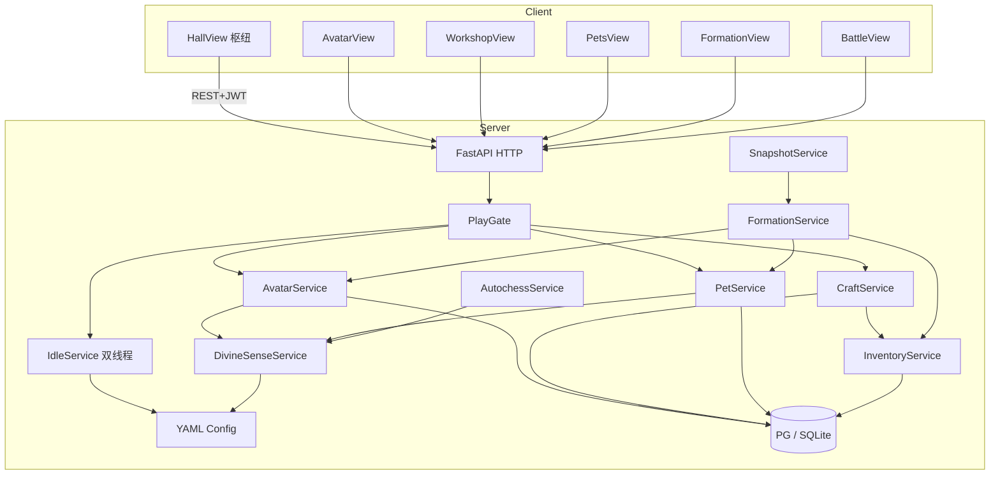
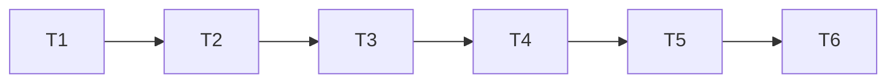

# M4 双线程成长 — 详细设计说明（骨架）

> 依据：`开发计划.md` §6 · `project修仙.md`（GDD）§9.2 / §10 / §11 / §12 · M0～M3 设计  
> 目标：金丹后 **化身双挂机** + **制造业配方工坊** + **灵宠雏形**；神识约束生效；产出能进布阵/快照  
> 范围外：见根目录 [`后续待完成.md`](./后续待完成.md)（开实现前必读；尤其勿提前做六时/雷劫/宗门/WS）  
> **灵宠完整细则**：[`灵宠系统设计.md`](./灵宠系统设计.md)（N4 收窄出口仍见本文 §7.4）  
> 版本：v1.0 · 2026-08-05（§7.4 于 2026-08-07 收窄修订）  
> 对应开发计划板块：**L（化身）· M（制造业）· N（灵宠）**  
> 前端落点：[`M4前端目录与路由设计.md`](./M4前端目录与路由设计.md)

---

## 1. 设计目标与思路

### 1.1 一句话目标

在 M3「可布阵、可开战、可快照 PVP」之上，落地 **第二条成长线程**：金丹凝练化身并行挂机、配方工坊产出丹/傀/阵法等级、灵宠可持有上阵；用 **神识池** 约束化身+灵宠强度；陌生人按 README 能从 M3 大厅进入化身/工坊/灵兽园，把成品编进 `/formation` 并更新防守快照，而不推翻 M0～M3 鉴权、惰性挂机与棋盘引擎。

### 1.2 设计原则

| 原则 | 落地方式 |
| --- | --- |
| **服务端权威** | 凝练、双线程 settle、传修为、配方队列、神识衰减、上阵合法性只在服务端；前端只展示与发起 |
| **配置驱动** | 凝练门槛、神识阈值、配方、灵宠样本、阵法等级挂钩进 YAML；禁止散落 if 链 |
| **继承挂机三层模型** | 无 APScheduler；本体+化身均惰性 settle；在线预测扩展「双线程摘要」；离线帽仍按角色共享 12h（两线程合计有效时长，见 §4.4） |
| **共享灵石、分离成长池** | 灵石一池共耗；修为可互传；炼体度/制造业经验 **不可** 互传（GDD §10.4） |
| **玩法路由再拆** | 新增 `/avatar` `/workshop` `/pets`（体量超大厅折叠区）；`/hall` 仍为养成+入口枢纽；`/formation` `/battle` 保留 |
| **棋子 kind 解禁** | M3 已枚举 `avatar`/`pet`/`puppet`；M4 真开放（样本傀儡保留）；校验走同一 `FormationService` |
| **神识表驱动可测** | `overload_bands` + `backlash_table`（**M4-D03 已落地**）；`DIVINE_SENSE_STRICT` 仅 DEV 门控 |
| **延后必登记** | ~~多化身~~（**已取消**→[`化身系统设计.md`](./化身系统设计.md)）；化身独立跨境、道值炼丹、M3 引擎打磨等写入 `后续待完成.md` |

### 1.3 成功标准（验收）

1. 非金丹不可凝练（明确业务码）；金丹可凝练 **1** 个化身：初始属性 = 本体战斗属性 ×50%（材料修正占位），修为池对齐凝练时刻。  
2. 化身有独立 `idle_direction`；与本体并行耗灵石；互不抢本体三选一。  
3. `POST` 修为互传成功；传炼体度/制造业经验 → 拒绝。  
4. 神识容量可配置；上阵化身+灵宠超载时战力衰减可测，严重超载写惩罚日志（反噬占位）。  
5. 五类配方各 ≥1：炼丹 / 炼器 / 制符 / 阵法 / 傀儡；手动启动 → 队列挂机 → 完成入背包；失败率占位。  
6. 本体 `idle_direction=crafting` 时工坊效率高于「非制造业方向」；化身可并行一条工坊队列。  
7. 傀儡成品可上阵；阵法钻研等级挂钩 `formations.yaml` 解锁/强度（§7.6 占位）。  
8. 灵兽园可持有/勾选上阵；灵宠不可替代本体；GM/测试可发放样本宠；培养升级占位进战报面板。  
9. 防守快照序列化含化身/灵宠/真傀儡编成；更新快照后第二账号可攻打含双线程棋子的阵容。  
10. 渡劫状态钩子：禁化身上阵（M5 前状态未实装时，配置/GM 可模拟）。  
11. README / CHANGELOG / `.env.example` 同步；无密钥硬编码。  
12. **竖切步均有验收**（§11）；不得用「能开空页」代替双挂机与工坊闭环。

### 1.4 明确不做 / 延后（指针）

完整清单与验收钩子见 [`后续待完成.md`](./后续待完成.md)。与本里程碑相关：

| ID / 主题 | 摘要 |
| --- | --- |
| **M4-D01** | ~~多化身数量随境界增加~~ | **取消** → [`化身系统设计.md`](./化身系统设计.md) |
| **M4-D02** | 化身独立跨大境界突破权 |
| **M4-D03** | 神识完整公式与精细反噬表 | **已消化**（2026-08-07） |
| **M4-D04** | 灵宠完整捕获/孵化/进化生态 |
| **M4-D05** | 道值运用于炼丹炼器（真仙后，→ M6） |
| **M4-D06** | 化身独立宗门任务（→ M7） |
| M3-D02～D10 等 | M3 末打磨；**不阻塞** M4 主路径；可并行但勿塞进 M4 出口 |
| M5+ | 六时/天气锁定开工、雷劫真态、轮回 |
| M6+ | 大道/道池、WS、道主 |
| M2-D01 | ~~配置热更运营化~~ **已消化**（2026-08-07；与 ADM 同批） |

微操战斗：**永不做**。

### 1.5 与 M0～M3 的关系

| 已交付 | M4 动作 |
| --- | --- |
| JWT / 创角 / `CharacterPublic` | 保留；追加化身摘要、神识、工坊队列、背包摘要、灵宠摘要 |
| 挂机三层模型 / 离线 pending | **扩展**：settle 同时处理本体+化身两线程；离线帽按角色共享 |
| `PlayGate`（先 claim pending） | 保留；凝练/开工/传修为/开战入口均经 Gate |
| `build_combat_stats` | 本体权威源；化身/宠/傀儡各有 `build_*_combat_stats` |
| 布阵 `unit_kind` | `avatar`/`pet`/`puppet` 自 `40043` 解禁为可校验通过（有持有物时） |
| `/formation` `/battle` | 保留；Bench 接入真棋子源 |
| 大厅养成四面板 | 保留；新增双线程/工坊/灵宠入口卡片 |

```text
M2：单线程三向挂机 → 池资源
M3：棋盘编成（本体+试炼傀儡）→ 开战
M4：本体∥化身双挂机 + 工坊队列 + 灵宠
    → 成品/棋子进布阵 → 快照含双线程编成
```

### 1.6 关键设计决策（实现拆分锚点）

> 锁定后 **不得在实现中偷偷改语义**；变更须改本文并记修订记录。  
> **实现顺序 = §11 竖切**，与下表对应。

| # | 决策 | 一句话 | 落入 |
| --- | --- | --- | --- |
| D1 | **单化身（永久）** | 每角色最多 **1** 化身；功能随境界解锁见 [`化身系统设计.md`](./化身系统设计.md)；**禁止**多化身 | **T1** |
| D2 | **双挂机线程** | 本体三选一不变；化身独立 `avatar_idle_direction`；共享灵石池 | **T2** |
| D3 | **修为可传、两池不可传** | 仅 `cultivation_points` 互传；body/crafting → `40052` | **T3** |
| D4 | **神识共用池** | 上阵化身+灵宠占神识；超载衰减+反噬日志占位 | **T3 / T6** |
| D5 | **玩法路由三拆** | `/avatar` `/workshop` `/pets`；大厅只做入口 | **T4** |
| D6 | **工坊≠挂机方向** | 配方队列独立；`crafting` 方向只提供效率乘区；开工可扣体力（接 M3-D05 钩子） | **T5** |
| D7 | **最小背包** | 成品入 `inventory` 表；非完整经济；交易 → M7 | **T5** |
| D8 | **产出进战斗** | 真傀儡可上阵；阵法等级解锁/加强样本阵法；宠/化身进预设与快照 | **T5 / T6** |
| D9 | **渡劫禁化身上阵** | `status=tribulation`（或钩子）时拒绝 `unit_kind=avatar` | **T6** |
| D10 | **离线帽共享** | 角色级 12h 帽覆盖两线程合计有效挂机时长，避免双倍刷帽 | **T2** |


---

## 2. 技术框架设计

### 2.1 选型（继承 M0～M3）

| 层 | 技术 | M4 增量 |
| --- | --- | --- |
| 后端 | FastAPI + SQLAlchemy 2 async + Alembic/bootstrap | avatar / craft / pet / inventory / divine_sense |
| 配置 | YAML + pydantic-settings | `avatar.yaml` / `craft_recipes.yaml` / `pets.yaml` / `divine_sense.yaml`；扩展 `idle.yaml` / `formations.yaml` / `board.yaml` / `stamina.yaml` |
| 前端 | Vue3 + Pinia + Router + Axios | **新增三路由** + 化身/工坊/灵兽园页 |
| 定时任务 | **无** | 工坊完成靠惰性 settle（同挂机） |
| WebSocket | **无** | — |

### 2.2 系统上下文



### 2.3 后端目录增量（相对 M3）

```text
backend/app/
├── config_data/
│   ├── avatar.yaml              # 解锁境界、初始比例、材料修正占位、化身方向
│   ├── divine_sense.yaml        # 容量曲线、舒适阈值、衰减/反噬占位
│   ├── craft_recipes.yaml       # 五类各≥1 配方；耗时、材料、失败率、效率乘区
│   ├── pets.yaml                # 样本宠、持有上限、升级占位
│   ├── inventory.yaml           # 堆叠规则、品类枚举（最小）
│   ├── idle.yaml                # 扩展：avatar 线程速率/耗石；offline 帽说明
│   ├── formations.yaml          # 扩展：required_array_level / 等级效果
│   ├── board.yaml               # unit_kinds.avatar/pet/puppet unlock_milestone: M4
│   ├── stamina.yaml             # 启用 costs.craft（接 M3-D05）
│   └── （复用 realms / grades / techniques / constitution / …）
├── domain/
│   ├── avatar_rules.py          # 凝练校验、初始属性、互传合法性
│   ├── divine_sense.py          # 占用/衰减/反噬纯函数
│   ├── craft_rules.py           # 队列进度、效率、失败掷骰
│   ├── pet_rules.py             # 持有/上阵/升级占位
│   ├── inventory_rules.py       # 入包/扣减
│   └── （复用 board / autochess / stamina / combat / …）
├── db/models/
│   ├── avatar.py                # 化身一行（1:1 character）
│   ├── craft_job.py             # 进行中/可领取工坊任务
│   ├── inventory_item.py        # 背包行
│   ├── pet.py                   # 持有灵宠
│   └── character.py             # 加列：divine_sense、array_craft_level 等
├── services/
│   ├── avatar_service.py
│   ├── craft_service.py
│   ├── pet_service.py
│   ├── inventory_service.py
│   ├── divine_sense_service.py  # 或并入 domain + 薄包装
│   ├── idle_service.py          # 扩展双线程 settle
│   ├── formation_service.py     # 解禁 kind；校验持有物
│   ├── snapshot_service.py      # 序列化含 avatar/pet/puppet ref
│   └── autochess_service.py     # 开战前套神识衰减
├── api/
│   ├── avatar.py
│   ├── craft.py
│   ├── pets.py
│   ├── inventory.py
│   └── （扩展 idle / formation / gm / character）
├── schemas/
│   ├── avatar.py
│   ├── craft.py
│   ├── pets.py
│   └── inventory.py
└── tests/
    ├── test_avatar.py
    ├── test_dual_idle.py
    ├── test_craft.py
    ├── test_pets_sense.py
    └── test_formation_m4_units.py
```

### 2.4 环境变量增量

| 变量 | 默认 | 说明 |
| --- | --- | --- |
| `AVATAR_ENABLED` | `true` | 总开关（联调可关） |
| `CRAFT_ENABLED` | `true` | 工坊总开关 |
| `PETS_ENABLED` | `true` | 灵宠总开关 |
| `DIVINE_SENSE_STRICT` | `true` | `false` 时超载只打日志不衰减（DEV） |
| `M4_GM_GRANT_MATERIALS` | — | 随 `GM_ENABLED`；发放材料/测试宠 |

前端：

| 变量 | 默认 | 说明 |
| --- | --- | --- |
| `VITE_AVATAR_POLL_MS` | `0` | 化身页额外 sync；`0`=复用大厅 tick |
| `VITE_CRAFT_TICK_MS` | `1000` | 工坊进度条本地预测刷新 |

---

## 3. 化身系统（板块 L）

### 3.1 解锁与凝练

| 规则 | 说明 |
| --- | --- |
| 门槛 | `major_realm >= jindan`（配置 `avatar.yaml.unlock_major_realm`） |
| 数量 | **1（永久）**；深化见 [`化身系统设计.md`](./化身系统设计.md) |
| 消耗 | 灵石 + 材料占位（可 GM 跳过材料） |
| 初始属性 | `combat_stats_avatar = floor(main_stats * 0.5 * material_mod)` |
| 初始修为 | `avatar.cultivation_points = character.cultivation_points`（凝练时刻快照） |
| 境界展示 | 化身展示「凝练时本体境界标签」只读；**跨境突破权在本体**（M4-D02） |

非法：未达境界 → `40050`；已有化身 → `40051`。

### 3.2 化身状态机（最小）

| status | 含义 |
| --- | --- |
| `none` | 未凝练（无行或 flag） |
| `idle` | 可挂机/可上阵 |
| `crafting` | 工坊队列进行中（可与 idle_direction 并存，见 §5） |
| `disabled` | 渡劫等禁止上阵（挂机仍可） |

### 3.3 表 `avatars`（示意）

| 列 | 类型 | 说明 |
| --- | --- | --- |
| `id` | PK | |
| `character_id` | FK unique | 1:1 |
| `name` | str | 默认同道号+「化身」 |
| `status` | str | 上表 |
| `idle_direction` | str | `none`/`spirit`/`body`/`crafting` |
| `cultivation_points` | int | 化身修为池 |
| `body_tempering_points` | int | 化身炼体池（不可传） |
| `crafting_exp` | int | 化身制造业池（不可传） |
| `base_stats_json` | JSON | 凝练快照属性 |
| `last_settled_at` | datetime | 化身线程锚点 |
| `created_at` | datetime | |

> 化身 **不** 另开 `spirit_stones`；扣石只改 `characters.spirit_stones`。

### 3.4 配置 `avatar.yaml`（示意）

```yaml
unlock_major_realm: jindan
max_avatars: 1   # 永久单化身；后台校验必须为 1（化身系统设计 v1.0）
initial_stat_ratio: 0.5
material_mod_placeholder: 1.0
condense_spirit_stone_cost: 1000
idle:
  spirit:
    cultivation_per_tick: 6   # 可低于本体曲线
  body:
    enabled: true
    body_tempering_per_tick: 5
  crafting:
    crafting_exp_per_tick: 6
spirit_stone_cost_per_tick_ratio: 0.8  # 相对本体同境耗石比例占位
transfer:
  allow: [cultivation_points]
  deny: [body_tempering_points, crafting_exp]
```

---

## 4. 双线程挂机（L2 + D2/D10）

### 4.1 线程模型

| 线程 | 方向槽 | 产出 | 耗石 |
| --- | --- | --- | --- |
| 本体 | `characters.idle_direction` 三选一 | 三池入本体 | 按本体境界曲线 |
| 化身 | `avatars.idle_direction` | 三池入化身 | 共享灵石，按配置比例 |

- 两线程 **互不抢** 对方方向槽。  
- 任一线程灵石不足 → 该线程停滞；另一线程若仍有石可继续（扣石顺序：先结算两线程需求，不足时按配置优先级，默认 **本体优先**）。

### 4.2 Settle 扩展（伪代码）

```text
function settle_dual(ch, now):
  # 1) 离线帽：角色级 effective 窗口（D10）
  prepare_offline_or_settle(ch, now)  # 复用 M2；pending 可带 avatar 明细

  # 2) 本体线程
  settle_thread(ch, now, thread="main")

  # 3) 化身线程（若存在）
  if avatar:
    settle_thread(avatar, now, thread="avatar", stone_payer=ch)

  # 4) 工坊队列惰性完成（§5）
  craft_service.settle_jobs(ch, now)
```

在线预测：大厅/化身页展示 `main_preview` + `avatar_preview`；`next_tick_at` 取两线程较早者（或分列返回）。

### 4.3 修为互传（L3）

`POST /avatar/transfer`

| 字段 | 说明 |
| --- | --- |
| `direction` | `main_to_avatar` \| `avatar_to_main` |
| `resource` | 仅允许 `cultivation_points` |
| `amount` | >0；不得超过来源池 |

拒绝 `body_tempering_points` / `crafting_exp` → `40052`。  
传修为前 `settle_dual`。

### 4.4 离线帽（D10）

| 规则 | 说明 |
| --- | --- |
| 帽 | 仍角色级免费 12h（会员档预留） |
| 含义 | `effective_elapsed` 一次算清，两线程在该窗口内各自产；**不是** 各 12h |
| pending 明细 | 分列 `main_gains` / `avatar_gains` / `craft_completed[]` |

---

## 5. 制造业工坊（板块 M）

### 5.1 操作流（GDD §12.1）

```text
选配方 → 校验材料/灵石/体力 → 扣费开工
  → craft_jobs 行 status=running
  → 时间前进（惰性 settle）→ completed
  → 玩家领取 → 成品入背包 / 阵法等级+ / 失败日志
```

### 5.2 与挂机方向关系（D6）

| 条件 | 效率 |
| --- | --- |
| 本体 `idle_direction=crafting` 且队列属本体 | `efficiency *= main_crafting_bonus`（如 1.25） |
| 化身队列 | 可用化身 `crafting` 方向加成；无方向则基础速 |
| 其它方向 | 基础速（仍可开工，只是慢） |

> 工坊队列 **不占用** 三选一槽；「制造业挂机」继续涨 `crafting_exp` 池供分配熟练。

### 5.3 配方表（各 ≥1）

| branch | 示例 recipe_id | 产出 |
| --- | --- | --- |
| `alchemy` | `pill_stamina_minor` | 体力丹（接 M3-D05）或修为丹占位 |
| `smithing` | `ore_plate_t1` | 材料/装备占位 |
| `talisman` | `talisman_atk_t1` | 战斗符占位（技能链深挖 → M3-D03） |
| `array` | `array_drill_1` | `array_craft_level += 1` |
| `puppet` | `puppet_wood_v1` | 背包傀儡 → 可上阵 |

失败率：`fail_chance` 占位；失败耗材料不给成品（或给残次，配置）。

### 5.4 表 `craft_jobs`

| 列 | 说明 |
| --- | --- |
| `id` | PK |
| `character_id` | FK |
| `actor` | `main` \| `avatar` |
| `recipe_id` | |
| `started_at` / `finish_at` | 权威完成时刻（可按效率重算） |
| `status` | `running` \| `ready` \| `claimed` \| `failed` |
| `result_json` | 领取时写入 |

并发：M4 默认 **本体 1 队列 + 化身 1 队列**；超额 → `40053`。

### 5.5 体力（接 M3-D05）

开工调用 `StaminaService.spend(kind="craft", amount=cfg)`；不足 → `40049` 同战斗。  
恢复道具可在炼丹产出后接入，不阻塞「能炼丹」出口。

### 5.6 阵法等级挂钩（M4 步骤）

`characters.array_craft_level`（int，默认 0）。  
`formations.yaml` 增：

```yaml
formations:
  - id: mist_trap_v1
    required_array_level: 1
    effects: { ... }
```

未达等级：布阵可选列表灰置；保存/开战 → `40054`。

---

## 6. 神识（L4 + N1 + D4 · **M4-D03 已落地**）

### 6.1 容量与占用

| 项 | 约定 |
| --- | --- |
| 容量 | `base + realm_bonus`（`divine_sense.yaml`） |
| 占用 | 上阵 `avatar × cost_avatar`；宠默认 `cost_pet`，可被物种 `divine_sense_cost` 覆盖 |
| 舒适阈值 | `soft_cap = capacity × soft_ratio`；`load ≤ soft_cap` → 战斗乘区 **1.0** |
| 超载 | 阶梯表 `overload_bands`（按 `load/capacity`）；返回 `zone` / `overload_mult` |
| 严重超载 | `load > hard_cap` → 反噬表 `backlash_table`（`when: over_hard`）；写标志 + 化身挂机 × `idle_mult` |

`DIVINE_SENSE_STRICT=false` 时开战**只打日志不衰减**（DEV）；快照更新仍套公式。

### 6.2 生效时机

- **开战前**（PVE/PVP）：对进攻方实时编成套衰减；防守快照在 **更新快照时** 固化当时衰减后的面板（或存 raw+load，开战再算——M4 默认 **更新时固化**，简单可测）。  
- **挂机**：仅严重超载影响化身线程速率。

### 6.3 配置示意（M4-D03）

```yaml
base_capacity: 10
per_realm_bonus:
  jindan: 5
  yuanying: 8
costs:
  avatar: 5
  pet: 3
soft_ratio: 1.0
hard_ratio: 1.5
overload_bands:
  - { max_load_ratio: 1.0, combat_stat_mult: 1.0, zone: comfort }
  - { max_load_ratio: 1.25, combat_stat_mult: 0.85, zone: overload }
  - { max_load_ratio: 1.5, combat_stat_mult: 0.7, zone: overload }
  - { max_load_ratio: null, combat_stat_mult: 0.5, zone: critical }
backlash_table:
  - { id: over_hard, when: over_hard, idle_mult: 0.5, set_flag: true }
```

---

## 7. 灵宠雏形（板块 N）

### 7.1 持有与上阵

| 规则 | M4 |
| --- | --- |
| 持有上限 | 配置（如 5）；超额拒绝 |
| 上阵 | 占棋子位；受 `max_units` 与神识双重约束 |
| 本体 | **不可** 用宠替换 `main`；无 `main` → 仍 `40042` |
| 渡劫 | 宠可上阵（GDD 倾向）；化身不可 |

### 7.2 表 `pets`

| 列 | 说明 |
| --- | --- |
| `id` | PK / `pet_uid` |
| `character_id` | FK |
| `species_id` | YAML（物种定义，见 §7.4） |
| `level` | 培养占位 |
| `nickname` | 可选 |
| `is_deploy_preferred` | 布阵 Bench 默认勾选 |

> 后续可增 `rarity_roll` / `star` 等个体字段；**本规划阶段不强制迁库**，实现 N4 时再定。

### 7.3 获取雏形（N3 · 已落地）

| 途径 | M4 雏形 |
| --- | --- |
| GM 发放 | `POST /gm` 发 `test_pet_fox` |
| 测试捕获 | `POST /pets/capture_test`（固定表；**非**完整野外） |
| 正式途径 | → §7.5 / N4～N5 与 M5/M7/M9 分期 |

升级：`POST /pets/{id}/upgrade` 耗材料占位；战力 = `base * (1+0.05*(level-1))`。

### 7.4 物种与种族（正式规划 · N4 · 已收窄）

> **完整玩法真理**（品阶/词条/技能/捕获骰/1v1/灵兽宗）：[`灵宠系统设计.md`](./灵宠系统设计.md)。  
> 对齐 GDD §11；配置真相源仍为 `pets.yaml`（现行仅 `test_pet_fox` 样本）。  
> **不重开** M4 T1～T6 出口；本小节只定义 **N4 收窄出口**（骨架 + 字段预留）。

#### 7.4.1 种族（race）枚举

| race_id | 名称 | 定位倾向（占位） |
| --- | --- | --- |
| `beast` | 灵兽 | 近战 / 坦 |
| `avian` | 灵禽 | 敏捷 / 远程 |
| `insect` | 灵虫 | 控制 / 毒 |
| `spirit` | 精怪 | 辅助 / 光环 |

可扩表；业务只认配置枚举，禁止散落 if 链。N4 起每族带 `racial_talent_id` **占位**（天赋结算 → PET-D03）。

#### 7.4.2 物种（species）YAML 字段

| 字段 | 说明 |
| --- | --- |
| `species_id` / `name` | 主键与展示名（已有） |
| `base_atk` / `base_hp` / `base_speed` | 战斗面板底值（已有；对应品阶 1 底） |
| `upgrade_cost` | 升级材料占位（已有） |
| `race` | 所属种族（§7.4.1） |
| `rarity` | 物种稀有度 `common` \| `rare` \| `epic` \| `legendary`（≠ 个体品阶） |
| `roles` | 定位列表：`dps` / `tank` / `control` / `support` |
| `acquire_tags` | 允许产出该物种的途径 ID 白名单（§7.5） |
| `skill_pool_id` | 占位；真技能 → PET-D02 |
| `evolve_to` | 可选；进化目标 `species_id`（深挖） |
| `divine_sense_cost` | 可选；覆盖默认宠神识占用 |
| `growth` | 占位；品阶不改成长曲线（见灵宠系统设计） |

另：`grades` 表（品阶 → 词条槽 / 基础乘区 / 灵兽宗可改类型槽数）在 N4 写入 YAML **占位**，个体列 `grade` 预留。

#### 7.4.3 N4 验收（收窄 · **已落地** 2026-08-07）

- ✅ YAML ≥ **2** 种族、≥ **3** 物种；含 `grades` 占位表；种族/物种/技能 id **只认配置**；  
- ✅ API / 灵兽园列表与详情展示 **种族、稀有度、个体品阶**；  
- ✅ `GET /pets/catalog` = **物种注册表投影** + seen/caught；**仅加 YAML 物种 → 图鉴同步**（不改代码）；  
- ✅ `capture_test` 从物种表抽取 + **随机品阶占位**；  
- ✅ DB 预留 `grade`；  
- ✅ **预留** `/pets/sect/affix/type-reroll/*`（未开放不改库）；  
- Bench / 战报仍按个体面板。  

词条/技能/对战/野外 **可 N4 后并行**（见 `灵宠系统设计.md` §13），不冻结至 M7/M9。

### 7.5 正式获取途径（规划矩阵）

对齐 GDD §11.4 与 [`灵宠系统设计.md`](./灵宠系统设计.md) §9。每条途径：**状态 / 目标阶段 / 与物种关系**。

| 途径 ID | 说明 | 目标阶段 | 备注 |
| --- | --- | --- | --- |
| `gm_grant` | GM / DEV 发放 | **已有（M4）** | 联调保留 |
| `capture_test` | 测试捕获 | **已有（N4）**；走物种表+品阶占位 | **不得**冒充 `wild_capture` |
| `egg_hatch` | 灵兽蛋孵化 | **N5**（物种表之后） | 蛋可来自工坊配方或掉落占位 |
| `wild_capture` | 野外捕获（遭遇+骰） | **M4-D04c**（可占位区；M9 接真图） | 时辰×天气×`region_id`；诱灵草/灵兽袋 |
| `sect_exchange` | 宗门兑换 | **M7** 入口 | 贡献货币；改词条类型见 PET-D06（`/pets/sect/*` 已预留） |
| `activity_grant` | 活动发放 | **M10 / 运营** | 系统邮件挂点 |
| `reincarnation_carry` | 轮回传承概率带出 | **M5** | 轮回保留表加宠栏位占位 |

**原则（写死）**

1. 物种 `acquire_tags` 白名单约束「该宠能从哪条途径出」。  
2. **物种稀有度**影响获取权重与养成成本；**个体品阶**影响基础属性与词条槽（数值占位；正式曲线 → M13 / 数值专题）。  
3. 进化改定位 / 升星 / 生活修炼加成宠 → 仍属内容深挖，不进 N4/N5 出口。

#### 7.5.1 竖切映射

| 步 | 内容 | 决策落点 |
| --- | --- | --- |
| **N4** | 种族 + 多物种 + 品阶字段/图鉴骨架；测试捕获走物种表 | §7.4；灵宠系统设计 §13 |
| **N5** | 蛋物品 + 孵化会话 → 入灵兽园 | `egg_hatch` |
| PET-D01～D05 | 词条/技能/被动/喂养/1v1 | 灵宠系统设计 |
| PET-D06 | 灵兽宗改词条类型 | **M7** |
| M5-R | 轮回带出钩子 | `reincarnation_carry` |
| M7-V | 宗门商店兑宠 | `sect_exchange` |
| M9-AC | 野外捕获全因子 | `wild_capture` / M4-D04c |

延后登记见 [`后续待完成.md`](./后续待完成.md) **M4-D04a / D04b / D04c** 与 **PET-D01～D06**。

---

## 8. 与布阵 / 快照 / 战斗集成（L6 / M4 / N）

### 8.1 `unit_kind` 解禁

| kind | 条件 |
| --- | --- |
| `avatar` | 已凝练且非渡劫禁上阵；`ref_id=avatar.id` |
| `pet` | 持有对应 `pet.id` |
| `puppet` | 背包有 `item_uid` 且 `item_type=puppet`；试炼傀儡逻辑保留 |

### 8.2 快照序列化增量

```json
{
  "units": [
    {"unit_uid": "main", "unit_kind": "main", "x": 0, "y": 3},
    {"unit_uid": "avatar-1", "unit_kind": "avatar", "ref_id": 1, "x": 1, "y": 2,
     "stats": {"atk": 12, "hp": 80, "speed": 10}},
    {"unit_uid": "pet-3", "unit_kind": "pet", "ref_id": 3, "x": 0, "y": 2,
     "stats": {"atk": 8, "hp": 40, "speed": 12}},
    {"unit_uid": "puppet-9", "unit_kind": "puppet", "ref_id": 9, "x": 1, "y": 4,
     "stats": {"atk": 6, "hp": 50, "speed": 5}}
  ],
  "divine_sense_load": 8,
  "array_craft_level": 1
}
```

不含：工坊进度、挂机 pending、背包非上阵消耗品无限库存。

### 8.3 UnitBench 数据源

前端 Bench 拉：`GET /formation/bench`（新）返回可上阵列表（本体/化身/宠/傀儡库存）。

---

## 9. API 总体约定

### 9.1 错误码增量

| code | 含义 |
| --- | --- |
| `40050` | 未达凝练境界 |
| `40051` | 已有化身 / 未凝练却操作化身 |
| `40052` | 非法资源转移（炼体/制造业） |
| `40053` | 工坊队列已满 |
| `40054` | 阵法等级不足 |
| `40055` | 材料不足 |
| `40056` | 神识规则拒绝（可选；或仅衰减不拒） |
| `40057` | 灵宠持有/上阵非法 |
| `40043` | 仅对仍未开放的 kind（若关开关） |

### 9.2 `CharacterPublic` 扩展（示意）

| 字段 | 说明 |
| --- | --- |
| `has_avatar` | bool |
| `avatar_summary` | `{ status, idle_direction, cultivation_points, … }` \| null |
| `divine_sense` | `{ capacity, load, soft_cap, backlash }` |
| `array_craft_level` | int |
| `craft_jobs_summary` | 进行中条数 / 可领条数 |
| `inventory_count` | 背包占用 |
| `pets_count` | 持有数 |
| `dual_idle_preview` | 可选：两线程速率摘要 |

### 9.3 接口清单（详细字段实现时再钉死）

#### 化身

| 方法 | 路径 | 说明 |
| --- | --- | --- |
| GET | `/avatar/me` | 化身面板；无则 `data=null` |
| POST | `/avatar/condense` | 凝练 |
| POST | `/avatar/idle` | 设化身方向 |
| POST | `/avatar/transfer` | 修为互传 |
| GET | `/avatar/sense` | 神识读数（可并入 me） |

#### 工坊 / 背包

| 方法 | 路径 | 说明 |
| --- | --- | --- |
| GET | `/craft/recipes` | 配方列表（含锁定原因） |
| GET | `/craft/jobs` | 我的队列 |
| POST | `/craft/start` | `{ recipe_id, actor }` |
| POST | `/craft/claim` | `{ job_id }` |
| GET | `/inventory` | 背包 |
| POST | `/inventory/use` | 可选：用体力丹等 |

#### 灵宠

| 方法 | 路径 | 说明 |
| --- | --- | --- |
| GET | `/pets` | 列表 |
| POST | `/pets/capture_test` | 测试捕获 |
| POST | `/pets/{id}/upgrade` | 升级占位 |
| PATCH | `/pets/{id}` | 昵称/偏好上阵 |

#### 布阵扩展

| 方法 | 路径 | 说明 |
| --- | --- | --- |
| GET | `/formation/bench` | 可上阵棋子源 |

#### 挂机扩展

| 方法 | 路径 | 说明 |
| --- | --- | --- |
| GET | `/idle/sync` | 响应带 `avatar` 线程字段 |
| GET | `/idle/offline/preview` | pending 分列主/化身/工坊 |

#### GM

发放材料、一键金丹、凝练跳过、发测试宠、设神识、清工坊队列。

---

## 10. 后端模块设计思路

### 10.1 分层

```text
api → AvatarService / CraftService / PetService / InventoryService
    → IdleService.settle_dual / DivineSense（纯函数）
    → FormationService / SnapshotService / AutochessService（消费棋子与衰减）
    → domain/*_rules + YAML bundle
```

### 10.2 并发

- 同一角色写路径串行化（沿用 M2/M3：先锁角色行或乐观版本）。  
- 工坊 claim 幂等：重复 claim → 明确码或空操作。

### 10.3 日志

- 凝练、互传、开工、领取、超载反噬、快照含化身 均 `INFO`。  
- 禁止 `print`。

### 10.4 测试最低集

| 用例 | 期望 |
| --- | --- |
| 炼气凝练 | `40050` |
| 金丹凝练两次 | 第二次 `40051` |
| 双线程同时挂机 | 两池涨、石按两线程扣 |
| 传 crafting_exp | `40052` |
| 配方完成入包 | 背包 +1 |
| 本体 crafting 更快 | 完成时刻早于对照组 |
| 真傀儡上阵 | 保存预设成功；开战 kind=puppet |
| 宠+化身超载 | 面板 atk 下降可断言 |
| 快照含 avatar | 第二账号 PVP 战报出现化身单位 |
| 渡劫钩子 | 保存含 avatar → 拒绝 |

---

## 11. 竖切实现计划（强制）

> 对齐开发计划 L/M/N；**禁止**先铺三页空壳却无双挂机权威。

### 11.0 总览

| 步 | 内容 | 决策 | 出口 |
| --- | --- | --- | --- |
| **T1** | 化身表 + 凝练 API + GM 金丹 | D1 | 非金丹拒；可凝练 1 个 |
| **T2** | 双线程 settle + sync/offline 分列 | D2 D10 | 双挂机耗石可测 |
| **T3** | 互传 + 神识纯函数 + 读数 API | D3 D4 | 非法转移拒；超载可测 |
| **T4** | 路由 `/avatar` + 化身页联调 | D5 | 凝练/挂机/传修为 UI |
| **T5** | 配方/队列/背包/傀儡/阵法等级 | D6 D7 D8 | 能炼丹；傀儡可上阵 |
| **T6** | 灵宠 + Bench + 快照 + 渡劫钩子 | D8 D9 | 出口标准全打勾 |



### 11.1 与开发计划映射

| 计划步骤 | 竖切 |
| --- | --- |
| L1 | T1 |
| L2 | T2 |
| L3–L4 | T3 |
| L5 | T4 |
| L6 | T6 |
| M1–M4 | T5（M4 傀儡/阵法在 T5 末） |
| N1–N3 | T6 |

### 11.2 建议冒烟脚本

`scripts/smoke_m4.py`：注册 → GM 金丹 → 凝练 → 双挂机加速 → 传修为 → 炼丹领取 → 发宠 → 布阵含化身/宠/傀 → 更新快照 → PVE。

---

## 12. M4 总验收清单

- [x] 金丹凝练化身；非金丹拒绝  
- [x] 本体∥化身双挂机；灵石共享；方向互不抢  
- [x] 修为互传成功；炼体/制造业拒绝  
- [x] 神识超载衰减/反噬日志可见  
- [x] 五类配方各能跑通至少 1 个；成品入包  
- [x] 化身可并行工坊；本体制造业方向更快  
- [x] 真傀儡上阵；阵法等级锁样本阵法  
- [x] 灵兽园持有/上阵；不可替本体  
- [x] 快照含化身/宠/傀；可被攻打  
- [x] 渡劫钩子禁化身上阵  
- [x] `/avatar` `/workshop` `/pets` 可从大厅进入  
- [x] 文档与 `.env.example` 同步  

**出口标准（计划原文）**：金丹后双挂机；能炼丹/上傀儡；神识约束生效。  
**实现收口（2026-08-05）**：后端 102 passed；前端 `vue-tsc` + `vite build` 通过。

---

## 13. 文档与产出物清单

| 产出 | 说明 |
| --- | --- |
| 本文 | M4 后端/领域骨架 |
| `M4前端目录与路由设计.md` | 三路由与组件落点 |
| `后续待完成.md` | M4-D01～D06 等延后项 |
| README / CHANGELOG | 索引与变更 |
| 实现后 | YAML、迁移、smoke_m4、测试 |

---

## 14. 风险与对策

| 风险 | 对策 |
| --- | --- |
| 双线程 settle 与离线 pending 复杂度爆 | T2 单测先行；pending schema 显式分列；先做在线再离线 |
| 工坊与 `crafting` 方向概念混淆 | UI/文案区分「经验挂机」vs「配方队列」；文档 D6 写死 |
| 过早做完整背包经济 | 最小 inventory；交易/拍卖拒绝进入 M4 |
| 神识公式争论拖期 | **已消化**：阶梯表 + 反噬表（M4-D03） |
| 布阵 Bench 数据源散落 | 统一 `/formation/bench` |
| 把 M3-D0x 打磨塞进 M4 出口 | 出口只认 §12；打磨另排 |

---

## 15. 修订记录

| 日期 | 说明 |
| --- | --- |
| 2026-08-05 | 初稿 v1.0：对齐开发计划 L/M/N；竖切 T1～T6；三路由；延后 M4-D01～D06 |
| 2026-08-05 | **实现收口**：T1～T6 落地；§12 验收清单打勾；后端 102 测试 + smoke_m4；前端三路由 |
| 2026-08-05 | **物种与获取途径正式规划**：新增 §7.4 种族/物种、§7.5 途径矩阵与 N4/N5；不重开 T1～T6 出口 |
| 2026-08-07 | **N4 收窄 + 灵宠愿景外置**：指针 [`灵宠系统设计.md`](./灵宠系统设计.md)；§7.4.3 验收改为骨架+`grade` 预留；词条/技能/野外/灵兽宗不进 N4 |
| 2026-08-07 | **§7.4.3 对齐 v1.2**：热插拔 catalog 同步；灵兽宗 API 桩；PET 并行不绑 M7/M9 |
| 2026-08-07 | **N4 实现收口**：§7.4.3 验收勾选；`capture_test` 行改为已走物种表 |
| 2026-08-07 | **M4-D03**：§6 改为阶梯 `overload_bands` + `backlash_table`；去占位表述 |
| 2026-08-07 | **取消多化身**：D1/M4-D01 指向 [`化身系统设计.md`](./化身系统设计.md)；功能随境界解锁 |
| 2026-08-10 | **探索中文 + 孵化索引**：野外探索 API/UI 下发区域·时辰·天气·物种中文名；`pet_hatch_jobs` 复合索引见 §0.6.1 |

---

*玩法真理以 `project修仙.md` 为准；灵宠细则以 `灵宠系统设计.md` 为准；排期以 `开发计划.md` §6 为准；前端以 `M4前端目录与路由设计.md` 为准；延后以 `后续待完成.md` 为准。*
