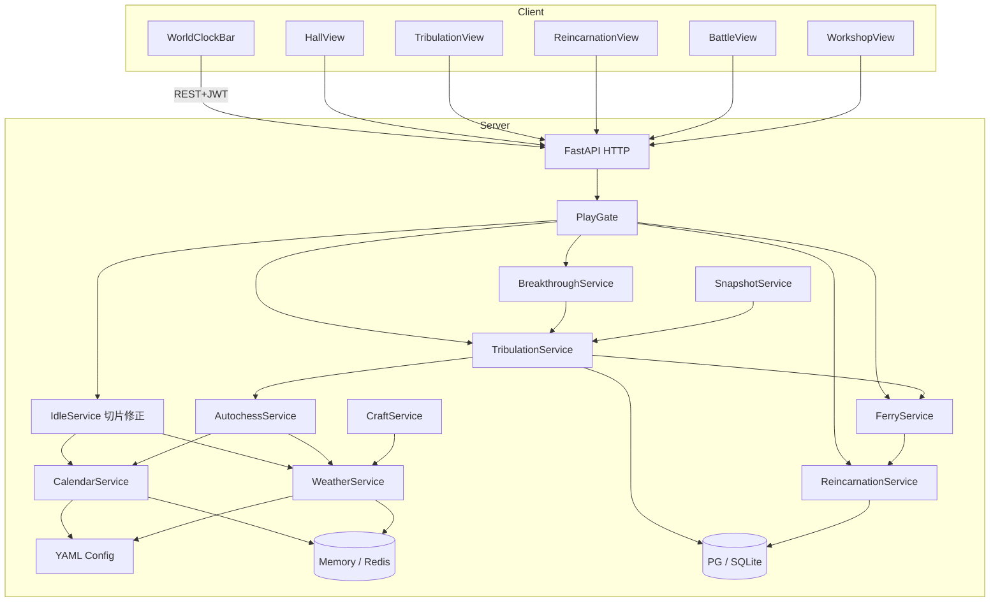

# M5 环境与轮回外环 — 详细设计说明（骨架）

> 依据：`开发计划.md` §7 · `project修仙.md`（GDD v4.0）§3.3 / §5 / §7.7–§7.8 / §17 / §18 · M0～M4 设计  
> 目标：**六时历法** + **区域天气** 影响结算；**雷劫/渡劫** 真态；走完一次 **待引渡 → 轮回新生**（含剧情「已历可跳」flag）  
> 范围外：见根目录 [`后续待完成.md`](./后续待完成.md)（开实现前必读；尤其勿提前做道主/完整引渡社交/地图野外捕获/真 WS 基建）  
> 版本：v1.5 · 2026-08-10（雷劫仅跨境；骰子对齐；**轮回强化收口**；**切段 settle 算力 + §0.0.2 中文出口**）  
> 对应开发计划板块：**O（历法六时）· P（天气）· Q（雷劫）· R（轮回与引渡骨架）**  
> 前端落点：[`M5前端目录与路由设计.md`](./M5前端目录与路由设计.md)  
> **检定骰权威**：[`骰子系统设计.md`](./骰子系统设计.md)（突破区间骰；遮天/护主/品阶权重走统一 RNG 门面）  
> 消化延后项指针：`M1-D20`（可选并入）、`M1-D21`（本里程碑主消化）

---

## 1. 设计目标与思路

### 1.1 一句话目标

在 M4「双线程成长 + 布阵快照」之上，落地 **服务端权威环境时钟**（六时循环 + 天气池），让挂机/突破/工坊/开战/渡劫读同一套修正；打通 **元婴→化神起的渡劫状态机** 与 **战败/陨落 → 待引渡 → 自选/强制轮回** 外环；陌生人按 README 能择时行动、打一场渡劫、走完一次轮回新生，而不推翻 M0～M4 鉴权、惰性挂机与棋盘引擎。

### 1.2 设计原则

| 原则 | 落地方式 |
| --- | --- |
| **服务端权威** | 当前时辰/天气、锁定快照、渡劫波次、陨落判定、轮回结算只在服务端；前端只展示与发起 |
| **配置驱动** | 六时表、天气池、修正系数、雷劫门槛、轮回保留表进 YAML；禁止散落 if 链 |
| **检定骰统一** | 突破成功判定走修为区间骰；遮天/护主/品阶权重等概率或权重抽走 `dice_rules` 门面；**禁止**业务内裸 `random()<rate` / `randint(1,20)`（见 [`骰子系统设计.md`](./骰子系统设计.md)） |
| **时钟可复现** | 权威推进公式基于 `server_epoch` + 现实时间；单测可注入「假时钟」；多进程优先 Redis，个人版可内存 |
| **切片结算带环境** | **目标**：挂机/离线 settle 按时辰切换点切段乘系数（与 GDD §9 离线对齐）。**现状（2026-08-10）**：**M5-D11 已消化**——`group_ticks_by_env` + 段摘要带 `shichen_label`/`weather_label`；resolver 用时辰公式+天气一次冻结+槽位 memo，避免每 tick 打快照 |
| **开战/渡劫/开工锁定** | 进入战斗、渡劫会话、工坊开工瞬间锁定 `(shichen, weather)`，过程中环境滚动不影响已锁实例 |
| **状态机写死互斥** | `normal` / `breaking_through` / `tribulation` / `awaiting_ferry` / `reincarnating`；与现有 `STATUS_NAMES` 对齐 |
| **剧情只留 flag** | 轮回后写 `story_flags.experienced_nodes`；**不写**章回正文（→ M10） |
| **引渡最小闭环** | M5 做自救道具/GM 救援 + 倒计时强制轮回；道友/宗门真引渡 → M7 |
| **延后必登记** | 完整修正矩阵、异步真读条（若本阶段不做）、WS 广播、完整带宠数值等写入 `后续待完成.md` |

### 1.3 成功标准（验收）

1. 权威时钟：每现实 **1 分钟**推进一时；六时循环（清晨→正午→晌午→傍晚→半夜→深夜）；`GET /world/calendar` 与服务器一致。  
2. 挂机/突破/出没（PVE 怪池权重占位）读时辰表；settle **带环境乘区**可测（跨时辰切段明细 **M5-D11 已消化**）。  
3. 区域天气池滚动；开战 / 渡劫 / 工坊开工锁定天气；战中不切换。  
4. 前端顶栏当前时辰 + 下一时倒计时；天气图标与对当前行为提示文案。  
5. 雷暴等对渡劫难度占位修正（配置可改）。  
6. 元婴→化神起：**仅跨大境界**进渡劫；同境内小境界（层/期）进阶**无**雷劫；锻体～元婴（含跨入元婴）**无**雷劫。  
7. 雷劫具备 **威力品阶四档** × **次数四档**；由跨境突破品阶映射；可测。  
8. 渡劫前准备格可放入护劫道具并按序消耗；减劫分 **改威力 / 改承伤** 两轴。  
9. 渡劫互斥：禁战斗、禁改本体挂机方向、禁手动更新快照、禁化身上阵（兑现 M4 钩子）。  
10. 结算用渡劫前天气；开渡后区域变为劫云；在既有劫云内开渡 → 基础值翻倍。  
11. 法宝耐久归零永久毁；一击破坏率可测；灵宝护主规则可测。  
12. 渡劫失败可见惩罚；极端失败 → `awaiting_ferry`。  
13. 待引渡：倒计时；自救 / 等救（占位）/ 入轮回三条路径可测；超时强制轮回。  
14. 轮回保留表落地：体质词条保留、境界重置锻体一层、贡献归零占位、灵宠栏位 `reincarnation_carry` 钩子；轮回点/成长属性/传承栏上限占位；结算日志完整。  
15. 轮回后防守快照作废；`story_experienced` flag 可写可读；**无**剧情正文。  
16. README / CHANGELOG / `.env.example` 同步；无密钥硬编码。  
17. **竖切步均有验收**（§11）；不得用「顶栏能显示字」代替环境修正与轮回闭环。

### 1.4 明确不做 / 延后（指针）

完整清单与验收钩子见 [`后续待完成.md`](./后续待完成.md)。与本里程碑相关：

| ID / 主题 | 摘要 |
| --- | --- |
| **M5-D01** | 六时×功法标签 / 天气×全系统完整系数矩阵（→ M13 数值案） |
| **M5-D02** | 多区域天气图与地图区域绑定（→ M9；M5 仅 `default` 区） |
| **M5-D03** | 道友/宗门真引渡（→ M7-W4）；M5 仅自救+GM+超时 |
| **M5-D04** | 六时切换 WS 广播（开发计划 O4；→ 可与 M6-T 一并） |
| **M5-D05** | 异步真读条突破跨请求（`M1-D20`）→ **已消化** 见 [`异步真读条突破设计.md`](./异步真读条突破设计.md) v1.1；Flag 可回退同步 attempt |
| **M5-D06** | 轮回带宠完整概率与数值（依赖 N4；M5 只留配置可关钩子） |
| **M5-D07** | 化身独立跨境/化身渡劫（`M4-D02`；本阶段渡劫仅本体） |
| **M5-D08** | 劫云半径真实覆盖邻区并对其他玩家/NPC 施加效果（→ M9 地图后） |
| **M5-D09** | 气运 / 魔性完整养成与来源（M5 仅角色占位字段 + 渡劫读取） |
| **M5-D10** | 遮天道具失败「极高负作用」完整表与表现（M5 占位惩罚即可） |
| M4-D04a/b | N4/N5 可与 M5 **并行**，不阻塞本出口 |
| M3-D01～D10 | 引擎打磨；不阻塞 M5 |
| M6+ | 大道/道池、WS 基建、道主 |
| M2-D01 | ~~配置热更运营化~~ **已消化**（2026-08-07；calendar/weather 可由 ADM 域发布） |

微操战斗：**永不做**。剧情章回正文：**永不进本里程碑**。

### 1.5 与 M0～M4 的关系

| 已交付 | M5 动作 |
| --- | --- |
| JWT / 创角 / `CharacterPublic` | 保留；追加 `status` 真流转、环境摘要、轮回点/待引渡摘要、story flags |
| 挂机三层模型 / 双线程 settle | **扩展**：settle 按时辰切段乘修正；渡劫中禁改本体方向 |
| `PlayGate` | 保留；渡劫/轮回入口经 Gate；`awaiting_ferry` 拦截开战/挂机改向 |
| 突破 `attempt` | **扩展**：达雷劫门槛则转入渡劫会话，而非直接层+1 |
| 棋盘开战 | 开战写入 `locked_shichen` / `locked_weather`；套用伤害/修为占位乘区 |
| 阵法四象 `weather` 层 | 与 **世界天气** 区分：阵法层仍为布阵四象；世界天气是全局/区域环境（§3.4） |
| 快照 | 渡劫/待引渡/轮回中禁止更新；轮回后作废 |
| 化身/工坊/灵宠 | 渡劫禁化身上阵；开工锁天气；轮回解散化身占位；宠 `reincarnation_carry` 钩子 |
| 状态名预留 | 兑现 `tribulation` / `awaiting_ferry` / `reincarnating` |

```text
M3：开战 → 棋盘演算 → 胜负
M4：双线程 + 产出进编成
M5：环境修正切片
    → 渡劫准备格 → 雷劫双维（品阶×次数）批次结算
    → 劫云覆盖（锁前天气算数）→ 陨落/轮回
```

> **v1.1（2026-08-06）**：§6 渡劫玩法大幅加厚——雷劫威力四档、次数四档、准备格、减劫双轴、法宝耐久/一击破、灵宝护主、劫云半径；决策增补 **D13～D16**。

### 1.6 关键设计决策（实现拆分锚点）

> 锁定后 **不得在实现中偷偷改语义**；变更须改本文并记修订记录。  
> **实现顺序 = §11 竖切**，与下表对应。

| # | 决策 | 一句话 | 落入 |
| --- | --- | --- | --- |
| D1 | **六时权威公式** | `slot = floor((now - epoch) / 60s) % 6`；名称表 YAML；可注入时钟 | **E1** |
| D2 | **单区天气池** | M5 仅 `region_id=default`；权重滚动；切换间隔配置 | **E2** |
| D3 | **三锁点** | 开战 / 渡劫开场 / 工坊 `start` 锁定环境；挂机 settle **不锁**（按时辰切段） | **E2 / E3** |
| D4 | **修正有上下限** | 时辰×天气叠加后 clamp；系数占位即可验收 | **E3** |
| D5 | **雷劫门槛** | 首次：元婴大圆满 → 化神初期；此后每次**跨大境界**渡劫；**小境界（层/期）不渡劫**；开启前无 | **E4** |
| D6 | **雷劫双维 + 准备格** | 威力品阶 × 次数档由突破品阶映射；渡劫前布阵式准备格；逐雷批次结算（非微操） | **E4** |
| D7 | **战败≠陨落** | PVE/渡劫失败先判战败；陨落另掷/规则进 `awaiting_ferry` | **E5** |
| D8 | **引渡最小集** | 自救消耗 + GM 救援 + 超时强制；道友/宗门 → M5-D03 | **E5** |
| D9 | **轮回重置境界** | 锻体一层；体质保留；快照作废；化身解散；贡献归零占位 | **E5** |
| D10 | **路由两拆** | `/tribulation` `/reincarnation`；顶栏环境组件非独立 path | **E6** |
| D11 | **剧情只 flag** | `experienced_story_nodes: string[]`；无播放器 | **E5 / E6** |
| D12 | **可选 WS** | O4 广播 **不进出口**；默认 HTTP 轮询/顶栏随 sync | **延后 M5-D04** |
| D13 | **结算锁天气、表现变劫云** | 成功率/基础伤害用**渡劫前**世界天气；开渡后天气切 `tribulation_cloud`，半径随威力档 | **E4** |
| D14 | **减劫双轴** | 轴 A 改威力（阵法/气运/魔性/遮天）；轴 B 改承伤（功法/护劫道具/法宝） | **E4** |
| D15 | **法宝耐久与一击破** | 耐久归零永久毁；任意法宝另有无视耐久/威力的基础一击破坏率 | **E4** |
| D16 | **灵宝护主** | 准备格耗尽且将死时概率触发：毁一灵宝、回 20% HP、威力档降一阶（怜悯档则基础伤害×1%） | **E4** |


---

## 2. 技术框架设计

### 2.1 选型（继承 M0～M4）

| 层 | 技术 | M5 增量 |
| --- | --- | --- |
| 后端 | FastAPI + SQLAlchemy 2 async + Alembic/bootstrap | calendar / weather / tribulation / ferry / reincarnation |
| 配置 | YAML + pydantic-settings | `calendar.yaml` / `weather.yaml` / `tribulation.yaml` / `reincarnation.yaml`；扩展 `idle` / `breakthrough` / `craft` / `pve` |
| 时钟存储 | **内存默认**；`REDIS_URL` 非空则写 Redis 键 | 多 worker 时必须 Redis（见环境变量） |
| 前端 | Vue3 + Pinia + Router + Axios | **新增两路由** + 全局环境顶栏 |
| 定时任务 | **无**全服扫表；时钟用公式推算；天气惰性滚动 | 与挂机一致 |
| WebSocket | **无（出口）** | O4 → M5-D04 / M6 |

### 2.2 系统上下文



### 2.3 后端目录增量（相对 M4）

```text
backend/app/
├── config_data/
│   ├── calendar.yaml            # 六时枚举、每时秒数、时辰修正表（占位）
│   ├── weather.yaml             # 天气枚举、区域池、滚动间隔、修正与渡劫压力
│   ├── tribulation.yaml         # 开启门槛、波次/检定、互斥、失败/陨落概率占位
│   ├── reincarnation.yaml       # 保留表、轮回点公式占位、引渡倒计时、自救费用、带宠钩子
│   ├── idle.yaml                # 扩展：shichen/weather 乘区键
│   ├── craft_recipes.yaml       # 扩展：天气分支效率键（炼丹/炼器等）
│   └── （复用 realms / grades / board / formations / avatar / pets / …）
├── domain/
│   ├── calendar_rules.py        # slot 计算、名称、下一时 ETA
│   ├── weather_rules.py         # 池滚动、加权抽、锁定结构
│   ├── env_modifiers.py         # 叠加 + clamp 纯函数
│   ├── tribulation_rules.py     # 品阶映射、双维、批次伤害、护主、遮天
│   ├── tribulation_prep.py      # 准备格校验与消耗序
│   ├── artifact_tribulation.py  # 耐久/一击破纯函数
│   ├── ferry_rules.py           # 倒计时、自救合法性
│   ├── reincarnation_rules.py   # 保留表应用、重置、flag
│   └── （复用 idle / autochess / avatar_rules / …）
├── db/models/
│   ├── tribulation_session.py   # 进行中渡劫会话（含准备格 JSON）
│   ├── world_cloud_overlay.py    # 可选：劫云覆盖标记
│   ├── ferry_state.py           # 待引渡行（或并入 character JSON）
│   ├── reincarnation_log.py     # 轮回结算流水
│   └── character.py             # 加列：reincarnation_points、growth_attrs_json、
│                                # story_flags_json、ferry_deadline_at、
│                                # fate_luck、demonic_nature 等
├── services/
│   ├── calendar_service.py
│   ├── weather_service.py
│   ├── tribulation_service.py
│   ├── ferry_service.py
│   ├── reincarnation_service.py
│   ├── idle_service.py          # 扩展切片修正
│   ├── breakthrough_service.py  # 分流进渡劫
│   ├── craft_service.py         # 开工锁天气
│   ├── autochess_service.py     # 开战锁环境 + 乘区
│   └── snapshot_service.py      # 状态禁更（已有钩子兑现）
├── api/
│   ├── world.py                 # calendar / weather 读模型
│   ├── tribulation.py
│   ├── ferry.py                 # 或并入 reincarnation
│   ├── reincarnation.py
│   └── （扩展 breakthrough / battle / craft / gm / character）
├── schemas/
│   ├── world.py
│   ├── tribulation.py
│   ├── ferry.py
│   └── reincarnation.py
└── tests/
    ├── test_calendar.py
    ├── test_weather_lock.py
    ├── test_env_modifiers_idle.py
    ├── test_tribulation.py
    ├── test_ferry_reincarnation.py
    └── test_story_flags.py
```

### 2.4 环境变量增量

| 变量 | 默认 | 说明 |
| --- | --- | --- |
| `CALENDAR_ENABLED` | `true` | 六时总开关；`false` 时固定「正午」占位便于回归 |
| `WEATHER_ENABLED` | `true` | 天气总开关；`false` 时固定「晴」 |
| `TRIBULATION_ENABLED` | `true` | 雷劫总开关；`false` 时高境界仍走无劫突破（仅 DEV 联调） |
| `CALENDAR_EPOCH_UTC` | 配置或固定 epoch | 与 YAML 一致；改 epoch 会平移全日相位 |
| `CALENDAR_SLOT_SECONDS` | `60` | 每时现实秒数；测时可改 `5` 加速 |
| `WORLD_STATE_BACKEND` | `memory` | `memory` \| `redis`；多 worker 用 `redis` |
| `FERRY_COUNTDOWN_SECONDS` | YAML 优先 | 待引渡倒计时覆盖 |
| `REINCARNATION_PET_CARRY` | `false` | 轮回带宠钩子总闸（依赖物种表时再开） |
| `M5_GM_FORCE_SHICHEN` | — | 随 `GM_ENABLED`；强制当前时辰 |
| `M5_GM_FORCE_WEATHER` | — | 强制天气 |
| `M5_GM_START_TRIBULATION` | — | 强制进入渡劫会话 |
| `M5_GM_SET_AWAITING_FERRY` | — | 直接置待引渡 |

前端：

| 变量 | 默认 | 说明 |
| --- | --- | --- |
| `VITE_WORLD_POLL_MS` | `5000` | 顶栏环境轮询；`0`=仅随角色 sync |
| `VITE_FERRY_TICK_MS` | `1000` | 待引渡倒计时本地刷新 |

---

## 3. 历法六时（板块 O）

### 3.1 一日六时

| 顺序 `slot` | `shichen_id` | 展示名 |
| --- | --- | --- |
| 0 | `dawn` | 清晨 |
| 1 | `noon` | 正午 |
| 2 | `afternoon` | 晌午 |
| 3 | `dusk` | 傍晚 |
| 4 | `night` | 半夜 |
| 5 | `late_night` | 深夜 |

完整游戏日 = `6 * CALENDAR_SLOT_SECONDS`（默认 6 现实分钟）。

### 3.2 权威推进（D1）

```text
function current_shichen(now, epoch, slot_seconds=60):
  elapsed = floor((now - epoch).total_seconds())
  slot = floor(elapsed / slot_seconds) % 6
  next_at = epoch + (floor(elapsed / slot_seconds) + 1) * slot_seconds
  return { shichen_id, slot, next_at, server_now: now }
```

- **无** APScheduler 推进；读时计算即可。  
- Redis 可选缓存「展示用」键，但真相仍是公式（避免时钟漂移双源）。  
- 单测：注入 `now` / 改 `slot_seconds`。

### 3.3 配置 `calendar.yaml`（示意）

```yaml
slot_seconds: 60
epoch_utc: "2026-01-01T00:00:00Z"
shichen_order: [dawn, noon, afternoon, dusk, night, late_night]
labels:
  dawn: 清晨
  noon: 正午
  afternoon: 晌午
  dusk: 傍晚
  night: 半夜
  late_night: 深夜
modifiers:
  idle_cultivation:
    dawn: 1.05
    noon: 1.0
    afternoon: 1.0
    dusk: 0.98
    night: 1.08
    late_night: 1.1
  breakthrough_success:
    dawn: 1.0
    noon: 1.02
    # …
clamp:
  min: 0.5
  max: 1.5
```

完整功法标签矩阵 → **M5-D01**。

### 3.4 与阵法「天气层」的边界

| 概念 | 含义 | M5 |
| --- | --- | --- |
| **世界时辰 / 世界天气** | 历法与区域天气池 | 本文 §3～§4 |
| **阵法四象.weather** | 布阵带来的战场天气对抗层（M3） | **不变**；开战可同时存在「锁定世界天气」与「阵法 weather 层」 |

命名：API 用 `world_weather` / `shichen`；阵法层继续 `formation.weather`。

---

## 4. 天气（板块 P）

### 4.1 类型

| `weather_id` | 展示 |
| --- | --- |
| `clear` | 晴 |
| `overcast` | 阴 |
| `rain` | 雨 |
| `hurricane` | 飓风 |
| `storm` | 暴雨 |
| `thunderstorm` | 雷暴 |
| `tribulation_cloud` | 劫云（**仅渡劫表现天气**；不进日常滚动池） |

> 日常池不含劫云；劫云由渡劫 `begin` 写入区域 overlay，结束后清除。

### 4.2 区域池滚动（D2）

M5：**仅** `region_id = default`（角色无地图位置时一律读默认区）。

| 规则 | 说明 |
| --- | --- |
| 滚动 | 惰性：请求时若 `now >= weather_next_roll_at` 则加权抽下一种并写状态 |
| 独立于六时 | 天气相位不强制对齐时辰切换 |
| 持久 | Redis 或 DB `world_weather_state` 单行；memory 模式进程内 dict |

### 4.3 锁定（D3）

| 事件 | 锁定内容 | 解锁 |
| --- | --- | --- |
| `POST /battle/pve` / PVP | `locked_shichen` + `locked_world_weather` 写入 setup | 战斗结束 |
| 渡劫会话创建 | 同上写入 `tribulation_sessions` | 会话结束 |
| `POST /craft/start` | 写入 `craft_jobs.env_lock_json` | 任务结束/领取 |

挂机 settle：**不锁**；在时间窗内按时辰边界切段（每段用该段时辰修正；天气用段内权威天气，跨滚动则切段）。

### 4.4 配置 `weather.yaml`（示意）

```yaml
regions:
  default:
    pool:
      clear: 30
      overcast: 20
      rain: 15
      hurricane: 10
      storm: 15
      thunderstorm: 10
    roll_interval_seconds: 180
modifiers:
  idle_cultivation:
    clear: 1.05
    thunderstorm: 0.95
  craft:
    alchemy:
      rain: 1.1
      thunderstorm: 0.85
    smithing:
      clear: 1.05
    # talisman / puppet / array …
  tribulation_pressure:
    clear: 0.9
    thunderstorm: 1.25
  breakthrough_success:
    clear: 1.05
    hurricane: 0.9
clamp:
  min: 0.5
  max: 1.5
```

---

## 5. 环境修正接入（O2 / P 联动）

### 5.1 叠加规则（D4）

```text
raw = base * shichen_mult * weather_mult
final = clamp(raw, clamp.min, clamp.max)
```

纯函数：`domain/env_modifiers.py`。

### 5.2 接入点

| 系统 | 乘区键 | 说明 |
| --- | --- | --- |
| 挂机修为/炼体/制造业池 | `idle_*` | 双线程均乘；切片打标 |
| 突破成功率 | `breakthrough_success`（环境乘区）+ **修为区间骰** | 无劫突破：先环境修正意图，权威成败由 `purpose=breakthrough` 区间骰 + `success_rate→阈值` 判定（[`骰子系统设计.md`](./骰子系统设计.md)）；渡劫外层进阶同理 |
| 工坊效率 | `craft.<branch>` | 开工时用锁定天气；进行中不再改 |
| 渡劫压力 / 雷劫 env | `tribulation_pressure` + §6 锁前天气乘区 | 抬高名义伤害；与劫云表现分离 |
| 遮天 / 护主 | 非区间骰 | `DiceService.chance` / `dice_rules.chance` 伯努利门面 |
| 预估/正式突破品阶 | 权重抽 | `DiceService.weighted_pick` / `dice_rules.weighted_pick`（非修为上下限骰） |
| PVE 出没权重 | `spawn_bias` 占位 | 改怪池权重，非完整生态 |
| 战斗先攻/伤害 | 单位 `dice_lo`/`dice_hi` | 开战组装修为区间；战报写出目（M3 引擎；与 M5 锁环境并存） |

### 5.3 离线 pending

pending 明细增加可选字段：

```json
{
  "segments": [
    {"shichen": "night", "weather": "rain", "seconds": 120, "cultivation": 10}
  ]
}
```

前端离线弹窗可折叠展示「环境切片」；无则只显示合计（兼容旧客户端）。

---

## 6. 雷劫 / 渡劫（板块 Q · 消化 M1-D21 核心）

> **玩法定位**：独立于日常 PVE 的「批次自动结算」流程——**无微操**；玩家决策集中在 **渡劫前准备**（择时、选阵、排准备格、是否用遮天）。  
> **v1.1** 起雷劫具备 **威力品阶** 与 **次数档** 两维；与 M2 跨境突破品阶（劣质～天道）表驱动映射。

### 6.1 开启规则（D5）

| 规则 | 说明 |
| --- | --- |
| 首次雷劫 | 元婴大圆满 → 化神初期（**跨境**） |
| 此后 | 每一次 **跨大境界** 进渡劫（如化神圆满→下一境） |
| 小境界 | 同大境内层/期进阶（初→中→后→圆满等）**不渡劫**，走 `BreakthroughService.attempt` 直接升档 |
| 开启前 | 锻体～元婴（含跨入元婴）走原突破，无渡劫 |

配置：`tribulation.yaml.require_from` = `{ major: yuanying, stage: peak }`；`always_after_first: true` 仅作用于后续**跨境**（`advance_type=major`），不作用于 `layer`。

> **v1.2（2026-08-06）**：相对 v1.1，取消「首劫后每一次层/期也渡劫」；与产品确认对齐——小境界无雷劫。

### 6.2 状态与互斥

进入渡劫准备或开渡后：`character.status = tribulation`（准备阶段即可置位，防并发开战）。

| 禁止 | 错误码 |
| --- | --- |
| PVE/PVP 开战 | `40060` |
| 改本体挂机方向 | `40061` |
| 手动更新快照 | `40046`（已有语义，文案对齐渡劫） |
| 化身上阵 / Bench 启用 avatar | `40062`（或沿用布阵拒绝码） |
| 常规突破 attempt 重入 | `40063` |
| 准备格未确认就开渡 | `40070` |
| 准备格非法道具/超额 | `40071` |
| 遮天检定进行中重复提交 | `40072` |

**允许**：化身挂机线程继续（与 M4 文案一致）；查看面板；顶栏环境；编辑准备格（开渡前）。

### 6.3 雷劫双维：威力品阶 × 次数档（D6）

#### 6.3.1 威力品阶（基础伤害档）

| `power_tier` | 展示名 | 基础伤害权重（占位） | 默认劫云半径 |
| --- | --- | --- | --- |
| `mercy` | 天道怜悯 | `1.0` | `0`（仅本地图） |
| `normal` | 普通 | `1.8` | `1` |
| `jealousy` | 天妒 | `3.0` | `2` |
| `apocalypse` | 灭世 | `5.0` | `3` |

> 半径 `4`：留给「万劫 + 灭世」叠加或特殊事件（配置 `cloud_radius_bonus_on_myriad: +1`，clamp 到 4）。

#### 6.3.2 次数档（雷击总数）

| `count_tier` | 展示名 | `strike_count` |
| --- | --- | --- |
| `nine` | 九劫难天雷 | `9` |
| `hundred` | 百劫天雷 | `100` |
| `thousand` | 千劫天雷 | `1000` |
| `myriad` | 万劫天雷 | `10000` |

**UX 铁律**：禁止玩家点一万次。服务端按 `strikes_per_batch`（如 10/50/100，随档配置）**批次自动结算**；前端播进度条 + 摘要日志（可跳过到结束）。

#### 6.3.3 与突破品阶的映射（跨境）

跨境进阶在 **进入准备阶段时** 先做一次 **「预估品阶」掷骰**（算法同 M2 `grades.yaml` 权重，含体质/材料/天气修正占位；**RNG 走修为骰子系统 `weighted_pick` 门面**），得到 `projected_breakthrough_grade`（`inferior`～`heavenly`）。  
该预估：

1. **映射**出本次雷劫的 `power_tier` / `count_tier`（下表）；  
2. **缓存**进会话；渡劫 **成功** 后正式写入角色的跨境品阶（可用同一结果，或允许渡劫表现微调权重后再掷——M5 默认 **沿用预估**，简单可测；微调 → 配置开关）。

| 预估突破品阶 `grade.id` | 默认 `power_tier` | 默认 `count_tier` |
| --- | --- | --- |
| `inferior` / `mortal` | `mercy` | `nine` |
| `good` / `superior` | `normal` | `hundred` |
| `peerless` / `immortal` | `jealousy` | `thousand` |
| `heavenly` | `apocalypse` | `myriad` |

层/期内进阶（无跨境品阶）：**正常路径不进渡劫**；`layer_mapping` 仅保留给 GM 强制开渡等旁路。

### 6.4 初始威力与外部环境修正

```text
base_damage = power_tier.base_weight * realm_scale(target)

# 仅用「渡劫前锁定」的世界天气 / 时辰 / 地图修正（D13）
env_mult = clamp(
  weather_mult(locked_weather) * shichen_mult(locked_shichen) * map_mult(region),
  clamp.min, clamp.max
)

# 若开渡时所在区域已有他人/残留劫云覆盖 → ×2（D13）
if region_under_existing_cloud:
  env_mult *= 2.0

# 轴 A：改威力（见 §6.6）——可降档或乘区
power_after_axis_a = apply_axis_a(base_damage, env_mult, session)

# 单雷名义伤害（再经轴 B 承伤）
strike_nominal = power_after_axis_a / strike_count   # 或按波次曲线分配，配置
```

| 外部因素 | 作用 | M5 |
| --- | --- | --- |
| 渡劫前天气 | 进 `env_mult`；雷暴抬高、晴天缓和等 | 必做占位表 |
| 渡劫地图 / 区域 | `map_mult`；圣地缓和、禁地抬高等 | 仅 `default` + YAML 钩子；真多图 → M5-D02/D08 |
| 气运 | 轴 A：气运高降低威力乘区 | 角色字段占位 `fate_luck`（M5-D09） |
| 既有劫云 | 基础值（`env_mult` 段）×2 | 必做 |

### 6.5 渡劫前准备（准备格）

```text
突破达标且需雷劫
  → 创建 session：status=preparing
  → 掷 projected_grade → 映射 power/count
  → 锁定 locked_shichen / locked_weather（渡劫前世界天气）
  → 检测是否已在劫云内（in_cloud_double）
  → 玩家布置准备格、可选遮天、确认阵法
  → POST /tribulation/commit-prep → status=committed
  → POST /tribulation/begin
       · 世界天气切换为 tribulation_cloud（半径见威力档）
       · 结算仍用 locked_* ，不改用劫云天气算伤害
  → 批次 resolve strikes…
  → 成功 / 失败 / 陨落
```

#### 6.5.1 准备格规则

| 规则 | 说明 |
| --- | --- |
| 格子数 | 配置 `prep_slots`（如 6～8）；随境界可扩表 |
| 放入内容 | 护劫丹药、护劫法宝、普通法宝、遮天道具（限 0～1）、阵盘引用等 |
| 顺序 | **从左到右 / 玩家排列序** = 雷击中的消耗序 |
| 开渡后 | 不可改格；按序在受击时自动触发（服务端） |
| 耗尽 | 格内道具用尽后，仅靠本体属性/功法被动承伤 |

阵法：准备阶段选定 `formation_id`（可复用 M3 样本或专用护劫阵）；计入轴 A。

### 6.6 减劫双轴（D14）

| 轴 | 目标 | 来源 | 效果形态 |
| --- | --- | --- | --- |
| **A · 影响威力** | 降低（或升高）雷劫名义伤害 / 品阶 | 阵法、气运、魔性、遮天道具 | 乘区 或 **直接降 `power_tier` 一档** |
| **B · 影响承伤** | 降低角色实际扣血 | 功法（渡劫抗性标签）、护劫丹药/法宝、普通法宝（效率差） | 减伤%、护盾、消一层雷 |

#### 6.6.1 轴 A 细则

| 来源 | 规则（占位） |
| --- | --- |
| 阵法 | `formation.tribulation_power_mult`（如 0.85） |
| 气运 `fate_luck` | 高 → 乘区 ↓；低 → 乘区 ↑；曲线 YAML |
| 魔性 `demonic_nature` | **高则增加威力**（乘区 ↑）；与气运可并存 |
| **遮天道具** | 检定成功：`power_tier` **降一档**（灭世→天妒→普通→怜悯；已在怜悯则再乘 `0.5` 占位）；失败：极高负作用（当场抬一档威力 / 重伤 / 强制 `in_cloud_double` 等，细表 → M5-D10）。**实现**：`success_chance` 经修为骰子系统 **概率门面**（非区间骰），见 [`骰子系统设计.md`](./骰子系统设计.md) |

遮天：**欺骗天道**，改的是 **品阶档本身**，不是普通乘区；与乘区结算顺序：先遮天降档 → 再取该档 `base_weight` → 再乘其余轴 A 乘区。

#### 6.6.2 轴 B 细则

| 来源 | 规则（占位） |
| --- | --- |
| 功法 | 装备中带 `tribulation_resist` 标签的减伤% |
| 护劫丹药 | 准备格消耗：一次性大幅减伤或免伤 1 击 |
| 护劫法宝 | 高减伤；扣耐久 |
| 普通法宝 | **可**放入准备格，但 `mitigation_mult` 很差（如仅 0.2×护劫法宝）；同样扣耐久 |

每雷结算：

```text
raw = strike_nominal
mitigated = apply_axis_b(raw, next_prep_item_or_passives)
hp -= mitigated
then resolve_artifact_durability_and_shatter(...)
```

### 6.7 法宝耐久与一击破坏（D15）

| 规则 | 说明 |
| --- | --- |
| 耐久 | 护劫/普通法宝均有 `durability`；每次参与抵雷扣 `cost_per_strike` |
| 耐久归零 | **永久破坏**，不可修复、不可逆；移出背包/装备 |
| **一击破坏率** | 任意法宝面对雷劫另有 `base_shatter_chance`（配置，如 1%～5%） |
| 一击破特性 | **无视**当前耐久与当前雷劫威力；掷中则该法宝直接毁 |

护主候选池、准备格内法宝均适用一击破检定（顺序：先一击破 → 未破再扣耐久）。

### 6.8 灵宝护主（D16）

触发条件（须全部满足）：

1. 准备格内可用道具 **已耗尽**（或本击后耗尽且仍将死）；  
2. 本次扣血将使 `hp <= 0`；  
3. 角色身上（非仅准备格）仍有至少 1 件可毁「灵宝/法宝」；  
4. 本会话尚未成功触发过护主（默认每场最多 1 次）；  
5. 通过 `guardian_proc_chance` 检定（配置；实现走骰子系统 `chance` 门面）。

触发效果：

1. **随机**破坏一件身上灵宝（写流水）；  
2. 抵消本次致命伤害；  
3. 恢复 **最大生命 20%**；  
4. **威力品阶降一档**：`apocalypse→jealousy→normal→mercy`；若已是 `mercy`，则后续雷击 `strike_nominal *= 0.01`（基础值降低 99%）。

### 6.9 劫云天气（D13）

| 项 | 规则 |
| --- | --- |
| 锁定数 | `locked_weather` / `locked_shichen` = **开准备时**世界值；成功率、`env_mult`、轴结算 **只读锁定值** |
| 表现天气 | `begin` 后区域天气强制为 `tribulation_cloud`（劫云）；顶栏对劫源玩家显示「劫云（结算仍按开渡前·晴/雷暴…）」 |
| 半径 | 见 §6.3.1；M5 无真地图时：在 `default` 区写 `cloud_overlays[]`（中心角色、半径、过期时间）；半径>0 仅作 **标记与翻倍判定钩子**，不对真实邻区广播 → **M5-D08** |
| 对他人影响 | 设计意图：劫云内其他玩家/NPC 挂机/突破/移动受干扰（表驱动）；M5 可只打日志 + 同区 `in_cloud` 标记 |
| 在劫云内开渡 | `in_cloud_double = true` → §6.4 基础值×2 |
| 消散 | 渡劫结束（成/败/陨落）后按配置延迟清除；或立即清除 |

### 6.10 批次结算流程（权威）

```text
function resolve_batch(session, batch_size):
  for i in 1..batch_size while strikes_left > 0 and hp > 0:
    # 1) 取下一准备格效果（若有）
    # 2) 算 mitigated 伤害
    # 3) 法宝一击破 / 扣耐久
    # 4) 扣 HP；若将死 → 尝试灵宝护主
    # 5) strikes_done += 1
  append events[] 摘要（可压缩千/万劫日志）
  if hp <= 0 and not guardian_saved: → fail / fall
  if strikes_left == 0 and hp > 0: → win → 进阶 + 写入品阶
```

前端：`POST /tribulation/resolve-batch`（或服务端一键 `auto-resolve` 到结束）；允许「跳过动画」一次拉完全部事件。

**永不做**：雷击过程中的移动/放技能微操。

### 6.11 表 `tribulation_sessions`（示意）

| 列 | 说明 |
| --- | --- |
| `id` | PK |
| `character_id` | FK |
| `target_major` / `target_stage` | 目标境界 |
| `is_cross_major` | 是否跨境 |
| `projected_grade` | 预估突破品阶 id（层进阶可 null） |
| `power_tier` / `count_tier` | 当前生效档（可被遮天/护主修改） |
| `strike_total` / `strike_done` | 次数进度 |
| `locked_shichen` / `locked_weather` | **结算用**环境锁 |
| `in_cloud_double` | 开渡时是否已在劫云内 |
| `cloud_radius` | 本场释放半径 |
| `prep_slots_json` | 准备格顺序与道具引用 |
| `formation_id` | 护劫阵 |
| `axis_a_snapshot` / `axis_b_snapshot` | 开渡时固化的乘区摘要 |
| `hp_current` / `hp_max` | 渡劫专用生命（可与战斗面板同源快照） |
| `guardian_used` | 是否已护主 |
| `seed` | 可复现 |
| `phase` | `preparing` \| `committed` \| `running` \| `won` \| `failed` \| `fallen` |
| `result_json` | 结束时写入 |
| `created_at` / `updated_at` | |

### 6.12 配置 `tribulation.yaml`（示意）

```yaml
require_from: { major: yuanying, stage: peak }
always_after_first: true

power_tiers:
  mercy: { label: 天道怜悯, base_weight: 1.0, cloud_radius: 0 }
  normal: { label: 普通, base_weight: 1.8, cloud_radius: 1 }
  jealousy: { label: 天妒, base_weight: 3.0, cloud_radius: 2 }
  apocalypse: { label: 灭世, base_weight: 5.0, cloud_radius: 3 }

count_tiers:
  nine: { label: 九劫难天雷, strikes: 9, strikes_per_batch: 3 }
  hundred: { label: 百劫天雷, strikes: 100, strikes_per_batch: 20 }
  thousand: { label: 千劫天雷, strikes: 1000, strikes_per_batch: 100 }
  myriad: { label: 万劫天雷, strikes: 10000, strikes_per_batch: 500 }

grade_to_tribulation:
  inferior: { power: mercy, count: nine }
  mortal: { power: mercy, count: nine }
  good: { power: normal, count: hundred }
  superior: { power: normal, count: hundred }
  peerless: { power: jealousy, count: thousand }
  immortal: { power: jealousy, count: thousand }
  heavenly: { power: apocalypse, count: myriad }

prep_slots_default: 6
guardian_proc_chance: 0.35
guardian_hp_restore_ratio: 0.20
mercy_after_guardian_damage_mult: 0.01
in_existing_cloud_damage_mult: 2.0
cloud_radius_bonus_on_myriad: 1
artifact_base_shatter_chance: 0.03

# 气运/魔性占位曲线
fate_luck_power_mult: { low: 1.15, mid: 1.0, high: 0.85 }
demonic_nature_power_mult: { low: 1.0, mid: 1.1, high: 1.35 }
```

### 6.13 与突破品阶的闭环

| 时机 | 行为 |
| --- | --- |
| 准备创建 | 掷 `projected_grade` → 映射雷劫双维 |
| 渡劫成功 | 跨境：将 `projected_grade`（或微调后结果）写入角色品阶历史；层进阶：只升层 |
| 渡劫失败 | 不升境、不写新品阶；惩罚占位 |
| 陨落 | 进待引渡；本次品阶作废 |

渡劫表现影响品阶权重的深度公式 → M13；M5 用开关 `reroll_grade_on_win: false` 默认关闭。

---

## 7. 待引渡与轮回（板块 R）

### 7.1 战败 vs 陨落（D7）

| 结果 | 状态 |
| --- | --- |
| 战败（未陨落） | 保持 `normal`；失败结算 |
| 陨落 | `awaiting_ferry`；写 `ferry_deadline_at` |
| 渡劫极端失败 | 同上 |

PVE 陨落概率：`tribulation.yaml` / `combat_fall.yaml` 占位；GM 可强制陨落。

### 7.2 待引渡三条路径（D8）

| 路径 | M5 行为 |
| --- | --- |
| **自救** | 耗灵石/道具占位 → 复活 `normal` + 短惩罚 flag |
| **等救** | UI 展示倒计时；**真道友/宗门引渡 API 仅占位 501/40064「未开放」** → M5-D03 |
| **自选轮回** | 确认后按强制表结算（GDD：本批按强制） |
| **超时强制** | 惰性：任意请求经 `PlayGate` / 专用 tick 检测逾期 → 强制轮回 |

### 7.3 轮回结算（D9）

| 类别 | M5 落地（强化后） |
| --- | --- |
| 体质与已镶嵌词条 | **实例全保留**；装配槽 = `slots.constitution`（初始+次数免费+商店购，总上限）；超额卸下 |
| 境界与修为池 | **重置**锻体一层；三池清零 |
| 化身 | **解散** |
| 功法 | `traits` 含 `reincarnatable` **保留等级**；其余删后按目录重发 level=0 |
| 宗门/盟贡献 | 字段归零占位 |
| 灵石 | 按 `clear_spirit_stones_ratio` |
| 普通储物袋 | **清空**（`bags.normal.clear_on_reincarnate`） |
| 轮回袋 | **保留**；容量 = base + slots_per_count×次数，超限丢弃最旧 |
| 轮回点 | `base_per_peak_major[peak] × path_multipliers[path]`（主动 > 强制） |
| 永久加成 | 写入 `character_reincarnation_bonuses`（初始/小破/大破/突破率）；本世 `lifetime_applied_growth` 清零 |
| 灵根 / 传承 | 清空待新生；灵根可选数 = `slots.spirit_root` 公式 |
| 防守快照 | **作废** |
| 阵法预设 | **重置**默认三槽（`carry.formation=reset`；不保留前世 units/formation_id） |
| 剧情 | `experienced_nodes` 可保留 |
| 灵宠 | `reincarnation_carry` 钩子（默认关） |

结算后 **`status=reincarnating`**：须 `complete-newborn` 回 `normal`。商店：`fixed_items` + 随机池（`shop/refresh` 耗轮回点或仙缘）。

战力：`stage_base × (1 + initial_attr_bonus + lifetime_applied_growth)`；突破成功率 `clamp(base + break_rate_bonus)`。

### 7.4 表与字段

**`characters` 增量**

| 列 | 说明 |
| --- | --- |
| `reincarnation_points` | int |
| `peak_major_realm` | 历史最高大境界（发点/商品条件） |
| `growth_attrs_json` | 剧情/兼容占位（真数值见加成表） |
| `story_flags_json` | `{ "experienced_nodes": [] }` |
| `ferry_deadline_at` | 待引渡截止 |
| `reincarnation_count` | 周目计数 |
| `legacy_items_json` | 传承栏 |
| `spirit_root_tags_json` | 本世灵根 |
| `fate_luck` | 仙缘（可刷新随机商店） |

**`character_reincarnation_bonuses`（一对一）**：`initial_attr_bonus` / `minor_growth_bonus` / `major_growth_bonus` / `break_rate_bonus` / `lifetime_applied_growth` / 槽位购买数 / 随机货架 JSON。

**`inventory_items.bag_kind`**：`normal` | `reincarnation`。

**`reincarnation_logs`**：每次结算一行（路径、保留快照、点数、时间）。

### 7.5 配置 `reincarnation.yaml`（示意）

```yaml
ferry_countdown_seconds: 3600
self_rescue:
  spirit_stone_cost: 500
  cooldown_seconds: 300
carry:
  constitution: keep
  realm_reset: { major: body_tempering, stage: 1 }
  contribution_zero: true
  avatar: dissolve
  pet_carry:
    enabled: false   # REINCARNATION_PET_CARRY
    max_count: 1
    chance: 0.1
points:
  per_peak_major:
    jindan: 10
    yuanying: 20
    huashen: 40
growth_attr_gain_placeholder: 1
altar:
  spirit_stone_cost: 1000
  require_status: normal
  min_major_realm: huashen   # 化神期起可主动入轮回
story:
  reset_mainline_progress: true
  keep_experienced_nodes: true
```

### 7.6 剧情钩子（D11）

| API/字段 | 说明 |
| --- | --- |
| `story_flags.experienced_nodes` | string 节点 ID 列表 |
| `POST /gm` 标记已历 | 联调 |
| **无** | 播放器、对白、立绘（→ M10） |

轮回后客户端可读 flag；M10 再解释 `skip_if_experienced`。

---

## 8. 与开战 / 工坊 / 快照集成

| 模块 | M5 行为 |
| --- | --- |
| Autochess | setup 含环境锁；奖励修为乘环境；战报 summary 打一行环境 |
| Craft | start 写锁；效率用锁时天气；UI 提示「开工天气：雷暴（炼丹↓）」 |
| Snapshot | `tribulation` / `awaiting_ferry` / `reincarnating` 禁止手动更新 |
| Formation Bench | 渡劫灰置化身 |
| Idle | 待引渡/轮回中：停滞；渡劫中本体方向不可改 |

---

## 9. API 总体约定

### 9.1 错误码增量

| code | 含义 |
| --- | --- |
| `40060` | 渡劫/待引渡等状态禁止开战 |
| `40061` | 渡劫中禁止改本体挂机方向 |
| `40062` | 渡劫中禁止化身上阵 |
| `40063` | 已在渡劫 / 非法突破重入 |
| `40064` | 引渡方式未开放（道友/宗门） |
| `40065` | 待引渡已超时正在结算轮回 |
| `40066` | 自救条件不满足（石/道具/冷却） |
| `40067` | 非待引渡不可操作引渡/自选轮回 |
| `40068` | 主动轮回条件不满足（含未达化神期、灵石不足、状态不符） |
| `40069` | 环境/时钟后端不可用（Redis 必选却未配） |
| `40070` | 渡劫准备未确认不可开渡 |
| `40071` | 准备格非法/超额/道具不可用于渡劫 |
| `40072` | 遮天检定重复提交 |
| `40073` | 渡劫会话阶段不允许该操作 |

沿用：`40046` 快照状态禁止。

### 9.2 `CharacterPublic` 扩展（示意）

| 字段 | 说明 |
| --- | --- |
| `status` | 含真 `tribulation` / `awaiting_ferry` / `reincarnating` |
| `world_env` | 可选嵌入：`{ shichen, weather, next_shichen_at }` |
| `ferry` | `{ deadline_at, can_self_rescue }` \| null |
| `reincarnation_points` | int |
| `reincarnation_count` | int |
| `growth_attrs` | object |
| `story_flags` | `{ experienced_nodes: string[] }` |
| `tribulation` | 进行中会话摘要 \| null |

### 9.3 接口清单

#### 世界环境

| 方法 | 路径 | 说明 |
| --- | --- | --- |
| GET | `/world/calendar` | 当前时辰、下一时 ETA、全日相位 |
| GET | `/world/weather` | `region_id=default` 当前天气、下次滚动 ETA |
| GET | `/world/env` | 聚合 calendar+weather+对「当前角色行为」提示键 |

#### 渡劫

| 方法 | 路径 | 说明 |
| --- | --- | --- |
| GET | `/tribulation/me` | 当前会话（含双维、准备格、进度、锁天气/劫云） |
| POST | `/tribulation/start-prep` | 突破分流后创建 preparing 会话并返回预估品阶映射 |
| PUT | `/tribulation/prep` | 保存准备格顺序与阵法/遮天选择 |
| POST | `/tribulation/commit-prep` | 锁定准备 → committed |
| POST | `/tribulation/veil-check` | 可选：单独掷遮天（也可并入 begin） |
| POST | `/tribulation/begin` | 开渡：切劫云、固化轴摘要、phase=running |
| POST | `/tribulation/resolve-batch` | 结算下一批雷击；返回 events 摘要 |
| POST | `/tribulation/auto-resolve` | 一键结算至结束（跳过动画） |
| POST | `/tribulation/abandon` | 可选：放弃→失败惩罚 |

突破：`POST /breakthrough/attempt` 在需雷劫时返回 `needs_tribulation: true` + 引导 `start-prep`。

#### 引渡 / 轮回

| 方法 | 路径 | 说明 |
| --- | --- | --- |
| GET | `/ferry/me` | 待引渡状态与倒计时 |
| POST | `/ferry/self-rescue` | 自救 |
| POST | `/ferry/enter-reincarnation` | 自选轮回 |
| POST | `/reincarnation/preview` | 预览保留清单（祭坛/待引渡共用） |
| POST | `/reincarnation/altar` | 主动轮回（安全确认） |
| GET | `/reincarnation/logs` | 最近 N 次流水（可选） |

#### GM

强制时辰/天气、开渡劫、置待引渡、立即超时轮回、标记 story 节点、开关带宠。

---

## 10. 后端模块设计思路

### 10.1 分层

```text
api → CalendarService / WeatherService
    → TribulationService / FerryService / ReincarnationService
    → IdleService（切段） / BreakthroughService（分流）
    → AutochessService / CraftService / SnapshotService（消费锁与互斥）
    → domain/*_rules + YAML bundle
```

### 10.2 并发

- 同一角色写路径串行（沿用）。  
- 天气滚动用 compare-and-set（Redis）或 DB 版本号，避免双滚。  
- 轮回结算事务：删快照、解散化身、重置境界、写 log **同事务**。

### 10.3 日志

- 时辰切换（debug/采样）、天气滚动、渡劫波次、陨落、自救、轮回结算均 `INFO`。  
- 禁止 `print`。

### 10.4 测试最低集

| 用例 | 期望 |
| --- | --- |
| 注入 now 跨 60s | shichen 切换 |
| 开战锁天气后强制滚动 | 战报仍为锁值 |
| 夜时时辰修为 > 对照 | 切片乘区可断言 |
| 金丹突破 | 无渡劫 |
| GM 元婴圆满跨境 | 进 preparing；映射双维 |
| 天道预估品阶 | power=apocalypse, count=myriad |
| 准备格超额 | `40071` |
| 未 commit 开渡 | `40070` |
| 锁天气为晴后强制滚雷暴 | 伤害仍按晴计算；表现已是劫云 |
| 既有劫云内开渡 | `in_cloud_double` 伤害×2 |
| 遮天成功 | power_tier 降一档 |
| 法宝一击破 | 耐久仍满也被毁 |
| 护主 | 回 20% HP；档位下降或怜悯×1% |
| 渡劫中开战 | `40060` |
| 渡劫中改挂机 | `40061` |
| 极端失败 | `awaiting_ferry` |
| 自救成功 | `normal` |
| 超时 | 强制轮回；境界锻体一层；体质仍在 |
| 轮回后快照 | 不可被攻或空 |
| story flag | 保留 experienced_nodes |

---

## 11. 竖切实现计划（强制）

> 对齐开发计划 O/P/Q/R；**禁止**先做顶栏装饰却无权威时钟与轮回事务。

### 11.0 总览

| 步 | 内容 | 决策 | 出口 |
| --- | --- | --- | --- |
| **E1** | 六时公式 + `/world/calendar` + 假时钟测试 | D1 | 时辰循环可测 |
| **E2** | 天气池 + `/world/weather` + 三锁点写入 | D2 D3 | 战中天气不切换 |
| **E3** | `env_modifiers` 接入 idle/突破/工坊 | D4 | 择时收益差异可测 |
| **E4** | 渡劫准备格 + 双维映射 + 批次结算 + 劫云锁前天气 + 互斥 | D5 D6 D13～D16 | 可走完一场含准备的渡劫 |
| **E5** | 陨落/待引渡/自救/轮回保留表/快照作废/flag | D7 D8 D9 D11 | 走完一次新生 |
| **E6** | `/tribulation` `/reincarnation` + 顶栏 + 大厅门闸 | D10 | 出口标准全打勾 |


### 11.1 与开发计划映射

| 计划步骤 | 竖切 |
| --- | --- |
| O1 | E1 |
| O2 | E3 |
| O3 | E6（顶栏） |
| O4 | **不做出口**（M5-D04） |
| P1 | E2 |
| P2 | E6 |
| P3 | E4（压力）+ E3 |
| Q1–Q3 | E4 |
| Q4 | E5 |
| R1–R5 | E5 |
| R6 | E5 钩子（默认关） |

### 11.2 建议冒烟脚本

`scripts/smoke_m5.py`：注册 → GM 抬境至元婴圆满 → 发起跨境进渡劫 → 打通/失败分支 → 强制陨落 → 自救一次 → 再陨落 → 自选轮回 → 断言锻体一层 + 体质仍在 + 快照无效 → 顶栏 calendar/weather 200。

---

## 12. M5 总验收清单

- [x] 六时每现实 1 分钟推进；与 `/world/calendar` 一致  
- [x] 天气池滚动；开战/渡劫/开工锁定  
- [x] 挂机/突破/工坊修正可测；系数可配置  
- [x] 顶栏时辰 + 倒计时 + 天气提示  
- [x] 雷劫双维：威力四档 × 次数四档；品阶映射可测  
- [x] 渡劫准备格按序消耗；轴 A/轴 B 生效  
- [x] 锁前天气算伤害；开渡后劫云；云内开渡×2  
- [x] 法宝耐久毁 / 一击破 / 灵宝护主可测  
- [x] 元婴→化神起：**仅跨境**渡劫；小境界无；开启前无  
- [x] 渡劫互斥完整（战/挂机改向/快照/化身上阵）  
- [x] 失败惩罚可见；极端失败进待引渡  
- [x] 自救 / 自选轮回 / 超时强制 可测  
- [x] 轮回保留表 + 轮回点/成长占位 + 快照作废 + story flag  
- [x] 带宠钩子可关；流水可查  
- [x] `/tribulation` `/reincarnation` 可从大厅进入  
- [x] 文档与 `.env.example` 同步  
- [x] **收口后强化**：永久加成表 / 路径倍率 / 轮回袋 / 新生商店+刷新 / 粘性 `reincarnating` / 阵法 reset·prune / 筑基前挂机灵石 0  

**出口标准（计划原文）**：六时天气影响结算；有雷劫；能走完一次轮回新生。 — **已达成（2026-08-06）**；强化收口核对 **2026-08-07**（弱项 M5-D11/D12 不阻塞）。

---

## 13. 文档与产出物清单

| 产出 | 说明 |
| --- | --- |
| 本文 | M5 后端/领域骨架 |
| `M5前端目录与路由设计.md` | 双路由与顶栏落点 |
| `后续待完成.md` | M5-D01～D12；**M1-D21 已消化** |
| README / CHANGELOG | 索引与变更 |
| 实现后 | YAML、迁移、smoke_m5、测试 |

---

## 14. 风险与对策

| 风险 | 对策 |
| --- | --- |
| 离线长窗切段爆炸 | 合并同 (shichen,weather) 段；上限段数；超出则粗粒度平均 |
| 渡劫做成第二套战斗系统 | 复用检定或现有引擎子集；禁止新微操；概率/区间骰一律 [`骰子系统设计.md`](./骰子系统设计.md) |
| 突破仍用裸 random | 已改为区间骰 + 阈值；环境 `breakthrough_success` 乘区与骰判定分工写清，勿混用 |
| 过早做道友引渡 | API 明确 `40064`；UI 灰置「宗门/道友引渡（M7）」 |
| 环境与阵法天气概念混淆 | API 前缀 `world_`；文档 §3.4 |
| 多 worker 时钟不一致 | `WORLD_STATE_BACKEND=redis`；单进程 memory 默认 |
| 把 N4/完整带宠塞进出口 | 钩子默认关；N4 并行不挡 E6 |
| M1-D20 异步读条拖垮 | 默认不进出口；竖切设计见 [`异步真读条突破设计.md`](./异步真读条突破设计.md)（M5-D05） |

---

## 15. 修订记录

| 日期 | 说明 |
| --- | --- |
| 2026-08-06 | 初稿 v1.0：对齐开发计划 O/P/Q/R；竖切 E1～E6；决策 D1～D12；延后 M5-D01～D07 |
| 2026-08-06 | **v1.1 渡劫加厚**：§6 重写——威力四档/次数四档、品阶映射、准备格、减劫双轴、法宝耐久与一击破、灵宝护主、劫云半径与锁前天气；决策 D13～D16；延后增 M5-D08～D10；API/验收同步 |
| 2026-08-06 | **实现收口**：E1～E6 前后端落地；§12 验收打勾；冒烟 `smoke_m5.py` |
| 2026-08-06 | **v1.2 雷劫范围收窄**：仅跨大境界渡劫；同境内小境界（层/期）进阶不渡劫；`needs_tribulation_for_advance` / GDD §3.3 / 开发计划 Q1 同步 |
| 2026-08-06 | **v1.3 修为骰子对齐**：突破区间骰；遮天/护主/品阶权重走统一 RNG 门面；指针 [`骰子系统设计.md`](./骰子系统设计.md)；§5.2 / §6.6 / 风险表同步 |
| 2026-08-07 | **v1.4 强化收口核对**：§7.3 永久加成表/轮回袋/路径倍率/阵法 reset 已落地；开发计划 v1.7；弱项登记 **M5-D11**（切段 settle）· **M5-D12**（突破 dice UI）；D01～D10 仍延后 |
| 2026-08-10 | **v1.5 横切打磨**：M5-D11/D12/D05 已消化；切段 env 缓存（§性能）；渡劫/探索/挂机段 **§0.0.2** 中文 label；复合索引见开发计划 §0.6.1 |
| 2026-08-10 | **主动入轮回门槛**：祭坛 `min_major_realm=huashen`；化神以下禁主动；待引渡自选/强制不受限 |

---

*玩法真理以 `project修仙.md` 为准；排期以 `开发计划.md` §7 为准；前端以 `M5前端目录与路由设计.md` 为准；延后以 `后续待完成.md` 为准。*
