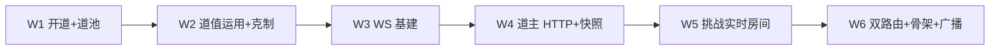
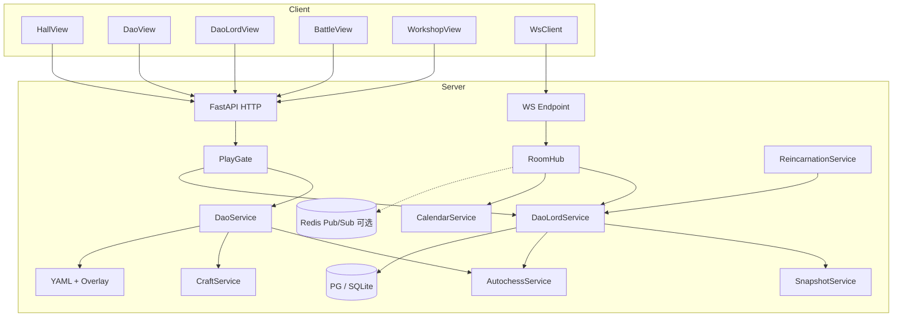
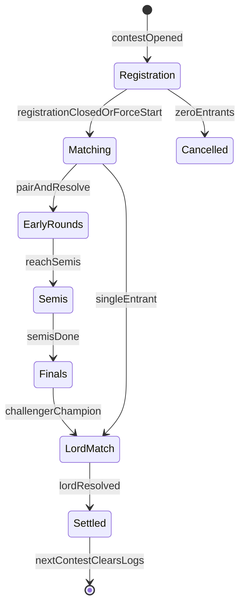
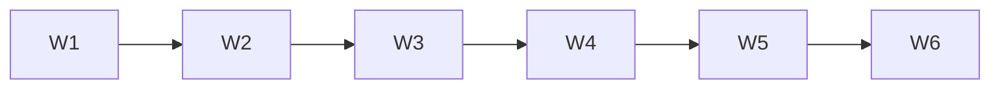

# M6 大道、道主与 WebSocket 强交互 — 详细设计说明（骨架）

> 依据：`开发计划.md` §8 · `project修仙.md`（GDD v4.x）§6 / §8 / §14.4 · M0～M5 设计  
> 目标：**真仙开道与道池**；**道值/道经验/运用**接入战斗与工坊；落地 **WebSocket 鉴权/房间/协议**；道主 **空位自动就任** + **有主后更替**（M6 已落地简化单挑；**道主之争赛会**定案见 §5 / **M6-D06**）；秘境/世界 Boss **仅骨架**  
> 范围外：见根目录 [`后续待完成.md`](./后续待完成.md)（开实现前必读；尤其勿提前做多频道聊天/传承红包/宗门战成型/完整 37 道数值）  
> 版本：v1.1 · 2026-08-10  
> 对应开发计划板块：**S（大道与道池）· T（WebSocket 基建）· U（道主挑战）**  
> 前端落点：[`M6前端目录与路由设计.md`](./M6前端目录与路由设计.md)  
> **检定骰权威**：[`骰子系统设计.md`](./骰子系统设计.md)（开道抽选/克制外的概率一律走统一 RNG 门面；禁止业务裸 `random()`）  
> 消化延后项指针：`M4-D05`（道值炼丹炼器）、`M5-D04`（六时天气 WS 广播）、`M1-D33`（修炼结算推送，本里程碑可选竖切，不进出口）

---

## 1. 设计目标与思路

### 1.1 一句话目标

在 M5「环境时钟 + 渡劫/轮回外环」之上，落地 **真仙本命道与跨轮回道池**，让战斗/工坊能 **耗道值运用道**；建立可复用的 **WS 强交互通道**；道主 **空位自动就任**；有主后以 **道主之争赛会**（报名→同道淘汰→决战道主；半决/决赛可直播）为目标形态（实现挂 **M6-D06**）。M6 W1～W6 已用「单挑 + 快照」打通更替闭环，**不因赛会定案回退出口**。为秘境/世界 Boss 留 **定时房间骨架**。

### 1.2 设计原则

| 原则 | 落地方式 |
| --- | --- |
| **服务端权威** | 开道抽选、道池写入、道值扣减、道主更替、房间状态机只在服务端；前端只展示与发起 |
| **配置驱动** | 道目录、权重、克制、挑战时段、达标门槛进 YAML；须可后台域管理（§0.0）；禁止散落 if 链 |
| **样本先于满表** | M6 落 **少量道样本**（建议 8～12，含 ≥1 组上位克制）；完整 37 道 → M13 / 专项 |
| **弱交互为主、强交互可选** | 开道/道池/运用走 HTTP；道主挑战/秘境/Boss 才强制在场 WS；不参加不挡挂机主线 |
| **赛会 + 双模应战** | 有主更替走赛会；挑战者比赛须在线；**道主在线→双方实时，离线→防守快照**；长期离线 **不收回**道主位 |
| **WS 可复用** | T 板块协议与房间抽象须可被 M7 聊天/传承、M5-D04 环境广播、M11 成型战场复用 |
| **轮回契约** | 道池跨轮回保留；本命道周目锁定；入轮回 **立即卸下道主**（兑现 GDD §6.16） |
| **中文信条** | 玩家可见道名/战报/房间文案一律中文（§0.0.2）；代码键英文 |
| **延后必登记** | 满表 37 道、聊天室、传承、Boss 成型等写入 `后续待完成.md` |

### 1.3 成功标准（验收）

1. 真仙初期起可开道：加权池 → 抽 3 → 三选一；抽出的 3 道全部入道池；本周目本命道锁定。  
2. 再轮回达真仙：已收藏道不进本次随机池；可选道池旧道；新抽 3 仍入库。  
3. 道值 / 道经验 / 道等级可测；战斗与工坊（炼丹/炼器至少一分支）可耗道值运用并涨经验（消化 **M4-D05**）。  
4. 上位克制读表；战报有中文克制标记（样本即可）。  
5. WS：JWT 鉴权、心跳、房间加入/离开、断线重连策略；小房间压测稳定。  
6. 消息协议 `type` / `payload` / `seq` 文档化；前端封装与 Pinia 同步；掉线提示。  
7. 空位达标自动就任道主；离线不收回；有主更替（W1～W6：**单挑快照闭环**；赛会 → **M6-D06**）。  
8. （W1～W6）能用 WS 打一场更替；非开放不可进。（赛会验收见 M6-D06 / §5.9）  
9. 轮回卸下道主；特权字段（天道技能/秘境开关）占位清空。  
10. 秘境/世界 Boss **房间骨架**（定时开、须在场）；不参加不挡主线。  
11. （加分非出口）六时/天气切换可经同一 WS 通道广播（消化 **M5-D04**）；掉线降级 HTTP 轮询。  
12. README / CHANGELOG / `.env.example` 同步；无密钥硬编码；ADM 域 `dao`（及挑战时段）可登记发布。  
13. **竖切步均有验收**（§11）；不得用「能连上 WS 心跳」代替开道事务与道主更替。

### 1.4 明确不做 / 延后（指针）

完整清单与验收钩子见 [`后续待完成.md`](./后续待完成.md)。与本里程碑相关：

| ID / 主题 | 摘要 |
| --- | --- |
| **M6-D01** | 完整 37 道名录 + 满克制矩阵 + 功法→权重全表（→ M13 / 附录 B 填坑） |
| **M6-D02** | 道池终局次数 N 与「可自选任意收藏道」交互定案（GDD §6.2.3；本阶段可配置开关默认关） |
| **M6-D03** | 道等级/道经验跨轮回保留比例完整案（本阶段：**道池收藏保留**；本周目道等级 **重置为 1** 或配置占位） |
| **M6-D04** | 天道技能完整效果表与道主秘境玩法成型（→ M11；本阶段特权布尔占位） |
| **M6-D05** | 世界 Boss / 秘境 **成型**数值与多波次（→ M11；U5 仅房间骨架） |
| **M6-D06** | **道主之争赛会**（报名/淘汰/道主决战双模/半决决赛直播）；W1～W6 仅单挑快照闭环 |
| **M6-D07** | 修炼结算 WS/SSE 真推送完整（**M1-D33**；本阶段可选订阅，**不进出口**） |
| **CHAT-*** / **HERITAGE-*** | 多频道聊天 + 传承红包（→ **M7**；勿在 M6 提前做重） |
| **ATTR-D01** | 统一战斗属性 schema（可并行文档；**不阻塞** M6） |
| M5-D01/D02/D03/D08 | 系数满表 / 多区天气 / 真引渡 / 劫云邻区 → 原目标阶段不变 |
| M3-D* 打磨 | 不阻塞 M6 |

微操战斗：**永不做**。聊天正文作为主玩法：**不进本里程碑**。

### 1.5 与 M0～M5 的关系

| 已交付 | M6 动作 |
| --- | --- |
| JWT / 创角 / `CharacterPublic` | 保留；追加本命道摘要、道池计数、道值、道主身份 |
| 挂机三层 + 环境切片 | 保留；道值 **不**占三选一槽；可选 idle 推送订阅不改权威 settle |
| `PlayGate` | 扩展：渡劫/待引渡/轮回中禁开道与道主挑战；挑战房间互斥 |
| 棋盘开战 / 快照 | 道主应战读防守快照；开战可带「运用道」开关；克制进战报 |
| 工坊 | 开工可选耗道值（M4-D05）；出特殊词条占位 + 涨道经验 |
| 轮回保留表 | **扩展**：道池保留；本命道清空待重开；卸道主 |
| 世界顶栏 HTTP 轮询 | 可并存；M5-D04 用 WS 推环境，失败降级轮询 |
| 状态机 | 不新增大状态枚举；道主为 **身份字段**；挑战用会话/房间态 |

```text
M5：环境 → 渡劫 → 轮回
M6：真仙开道 → 道池累积 → 耗道值运用
    → WS 房间
    → 空位自动就任 / 有主后更替（赛会定案 §5；实现 M6-D06）
    → Boss/秘境房间骨架
```

### 1.6 关键设计决策（实现拆分锚点）

> 锁定后 **不得在实现中偷偷改语义**；变更须改本文并记修订记录。  
> **实现顺序 = §11 竖切**，与下表对应。

| # | 决策 | 一句话 | 落入 |
| --- | --- | --- | --- |
| D1 | **样本道目录** | YAML 先落 8～12 道；含 id/中文名/大类/稀有度/上位关系；ADM 域 `dao` | **W1** |
| D2 | **开道一次/周目** | 真仙起首次（或周目内未锁定时）可开；选定后本周目不可改 | **W1** |
| D3 | **抽 3 入池** | 加权生成候选 → 抽 3 → 玩家三选一；**3 个全写入道池** | **W1** |
| D4 | **再开排除已藏** | 已在道池的道不进本次随机池；可选道池旧道作本命 | **W1** |
| D5 | **道资源独立** | 道值/道经验/道等级不占挂机三选一；运用发生在战斗与制造业操作 | **W2** |
| D6 | **运用占位效果** | M6 战斗：伤害/减伤占位乘区 + 战报标记；工坊：失败率/出词条占位 | **W2** |
| D7 | **克制读表** | 上位克制基础道；样本矩阵；战报中文「克制」行 | **W2** |
| D8 | **WS 协议统一** | `{type, payload, seq, ts}`；鉴权 query/首帧带 JWT；心跳独立 type | **W3** |
| D9 | **房间模型** | `room_id` + 成员 + 权限；挑战/Boss/环境广播复用同一 Hub | **W3** |
| D10 | **道主空位自动+有主更替** | 空位：首个本命达标自动就任（无手动夺位）；有主后仅赛会/挑战更替 | **W4** / **M6-D06** |
| D11 | **道主应战双模** | W1～W6：挑战者实时 × 道主快照；赛会定案：道主**在线双方实时**、**离线打快照** | **W4/W5** / **M6-D06 P3** |
| D12 | **离线不空悬** | 系统不因离线收回道主；打赢快照（或实时战）即换人 | **W4** |
| D13 | **轮回卸主** | 入轮回事务内清空道主身份与特权占位 | **W4** |
| D14 | **路由两拆** | `/dao` `/dao-lord`；WS 非独立 path | **W6** |
| D15 | **Boss 仅骨架** | 定时开房、在场名单、占位结算；无完整波次数值 | **W6** |
| D16 | **环境广播可选** | 同 WS `world.env` 推送；出口不依赖；失败降级轮询（M5-D04） | **W3 / W6** |
| D17 | **赛会报名与日程** | 每日可配报名窗 + 开打时刻；ADM/GM **立刻开赛**；报名截止后开打 | **M6-D06 P1** |
| D18 | **同道淘汰匹配** | 同本命道随机配对；奇数轮空晋级；对手不在线→离线负；0 人取消 / 1 人直战道主 | **M6-D06 P2** |
| D19 | **半决/决赛直播** | 仅半决赛、决赛（含挑战道主）可直播；权威先算再播；直播不可跳过；单直播槽 | **M6-D06 P4** |
| D20 | **赛会日志 TTL** | 直播/战报回溯保留至 **下一场道主之争开始** 后清除 | **M6-D06 P4** |



---

## 2. 技术框架设计

### 2.1 选型（继承 M0～M5）

| 层 | 技术 | M6 增量 |
| --- | --- | --- |
| 后端 | FastAPI + SQLAlchemy 2 async + Alembic/bootstrap | dao / dao_lord / ws hub |
| 配置 | YAML + OverlayStore（M2-D01） | `dao.yaml` / `dao_restraint.yaml` / `dao_lord.yaml` / `world_events.yaml`（骨架） |
| WS | FastAPI `WebSocket` + 进程内 Hub；多 worker 时 **Redis Pub/Sub**（可选） | 个人版默认同进程 |
| 前端 | Vue3 + Pinia + Router + Axios | **新增两路由** + `ws/` 客户端 |
| 定时 | 挑战/Boss **开窗用配置表 + 读时判断**；无全服扫玩家表 | 与挂机惰性一致 |
| 战斗 | 复用 Autochess 引擎 | 道主战：攻方实时编成 vs 守方快照 |

### 2.2 系统上下文



### 2.3 后端目录增量（相对 M5）

```text
backend/app/
├── config_data/
│   ├── dao.yaml                 # 道目录样本、稀有度、开道权重键、道值曲线占位
│   ├── dao_restraint.yaml       # 上位克制样本矩阵
│   ├── dao_lord.yaml            # 达标门槛、赛会 contest 日程、冷却、特权占位
│   ├── world_events.yaml        # 秘境/Boss 开窗骨架
│   ├── craft_recipes.yaml       # 扩展：可选 dao_usage 消耗与词条
│   └── （复用 board / formations / realms / …）
├── domain/
│   ├── dao_rules.py             # 加权池、抽3、入池、锁定校验
│   ├── dao_usage.py             # 扣道值、涨经验、升级
│   ├── dao_restraint.py         # 克制查询纯函数
│   ├── dao_lord_rules.py        # 首位/冷却/时段/更替合法性
│   └── ws_protocol.py           # type 枚举、信封校验
├── db/models/
│   ├── character_dao.py         # 本命道、道值、道等级、周目开道状态
│   ├── dao_pool_entry.py        # 道池收藏（character_id, dao_id, acquired_at）
│   ├── dao_lordship.py          # 每道现任道主、快照引用、就任时间
│   ├── dao_challenge_session.py # 挑战会话
│   └── character.py             # 可选嵌入摘要列或 JSON
├── services/
│   ├── dao_service.py
│   ├── dao_lord_service.py
│   ├── ws_hub_service.py        # 连接、心跳、房间、广播
│   ├── world_event_service.py   # Boss/秘境骨架
│   ├── craft_service.py         # 扩展道值运用
│   ├── autochess_service.py     # 运用道开关 + 克制标记
│   └── reincarnation_service.py # 卸道主 + 清本命保留道池
├── api/
│   ├── dao.py
│   ├── dao_lord.py
│   ├── world_events.py          # 骨架只读/报名
│   ├── ws.py                    # WebSocket 路由
│   └── （扩展 craft / battle / gm / character）
├── schemas/
│   ├── dao.py
│   ├── dao_lord.py
│   ├── ws_messages.py
│   └── world_events.py
└── tests/
    ├── test_dao_open.py
    ├── test_dao_pool_reincarnation.py
    ├── test_dao_usage_craft_battle.py
    ├── test_dao_restraint.py
    ├── test_ws_auth_heartbeat.py
    ├── test_dao_lord_claim_challenge.py
    └── test_world_event_skeleton.py
```

### 2.4 环境变量增量

| 变量 | 默认 | 说明 |
| --- | --- | --- |
| `DAO_SYSTEM_ENABLED` | `true` | 大道总开关；`false` 时开道 API 返回功能关闭 |
| `DAO_LORD_ENABLED` | `true` | 道主挑战总开关 |
| `WS_ENABLED` | `true` | WebSocket 总开关；`false` 时强交互入口提示关闭 |
| `WS_HEARTBEAT_SECONDS` | `25` | 服务端期望心跳间隔 |
| `WS_IDLE_TIMEOUT_SECONDS` | `90` | 无心跳踢线 |
| `WS_REDIS_URL` | 空 | 非空则跨进程 Pub/Sub；空=单进程 Hub |
| `DAO_LORD_CHALLENGE_WINDOW` | YAML 优先 | 可覆盖开窗（DEV） |
| `WORLD_EVENTS_ENABLED` | `false` | Boss/秘境骨架总闸；出口联调可开 |
| `M6_GM_FORCE_TRUE_IMMORTAL` | — | 随 `GM_ENABLED`；抬至真仙并可开道 |
| `M6_GM_GRANT_DAO_POOL` | — | 灌入指定道入池 |
| `M6_GM_SET_DAO_LORD` | — | 强制任命/清空道主 |
| `M6_GM_OPEN_CHALLENGE_WINDOW` | — | 强制当前处于挑战时段 |

前端：

| 变量 | 默认 | 说明 |
| --- | --- | --- |
| `VITE_WS_URL` | 由 API origin 推导 | 如 `ws://127.0.0.1:8000/api/v1/ws` |
| `VITE_WS_ENABLED` | `true` | 前端是否尝试连接 |
| `VITE_WS_RECONNECT_MS` | `2000` | 首重连间隔；指数退避上限另定 |
| `VITE_DAO_POLL_MS` | `0` | 道主大厅 HTTP 补拉；`0`=仅进页拉+WS |

---

## 3. 大道与道池（板块 S）

### 3.1 开启条件（D2）

| 条件 | 说明 |
| --- | --- |
| 境界 | `major_realm` 达到 **真仙**（`true_immortal` 或项目现用 id）初期起 |
| 次数 | **每个轮回周目一次** 锁定本命道；未锁定前可重复进入开道流程（以服务端会话为准，防刷抽：见下） |
| 互斥 | `tribulation` / `awaiting_ferry` / `reincarnating` / 挑战进行中 → `PlayGate` 拒绝 |
| 不可买 | **禁止**灵石/充值指定购买本命道（GDD）；商店只能卖材料/消耗，不卖「指定开道结果」 |

**防刷抽**：`POST /dao/open/roll` 创建或复用 `opening` 会话并冻结本次三选项；确认前重复 roll **拒绝**或消耗「重随道具」（M6 默认 **拒绝重复 roll**，错误码见 §9）。

### 3.2 开道流程（D3 / D4）

```text
1. 校验真仙 + 本周目未锁定本命道
2. 收集权重输入：装备功法标签、属性摘要、体质词条（占位键）
3. 从 dao.yaml 生成候选集合；排除 dao_pool 已有
4. 若候选不足 3：允许从「未收藏全集」补足（文档化）；仍不足则 4xx
5. 加权抽 3（RNG 门面 purpose=dao_open）
6. 返回选项（含中文名、大类、稀有度说明）；写入 opening 会话
7. 玩家 POST choose：三选一之一，或（再开时）dao_pool 中任一道
8. 事务：锁定本命道；3 个新抽选项 upsert 入道池；初始化道值/道等级
```

再轮回后开道：步骤 3 排除已藏；步骤 7 允许选旧藏。

### 3.3 道池终局（D / M6-D02）

- 配置键 `dao_pool_endgame_enabled` 默认 `false`。  
- `true` 时：收藏数 ≥ `N` 可跳过三选一直接自选（交互 → M6-D02）。  
- M6 出口 **不依赖** 终局模式。

### 3.4 道值、道经验、道等级（D5 / D6）

| 项 | M6 规则 |
| --- | --- |
| **道值** | 角色资源；运用时扣减；获取：功法升级占位奖励 / GM / 配置表小额日常（可极简） |
| **运用** | 战斗：开战请求 `use_dao=true`；工坊：`start` 带 `use_dao=true`（M4-D05） |
| **道经验** | 每次 **成功** 运用 +exp；失败不涨或涨减半（配置） |
| **道等级** | 经验满升级；给予 flat/pct 占位属性 + 效果 id 占位 |
| **与挂机** | 不占三选一；挂机不自动耗道值 |

### 3.5 样本目录建议（D1）

不必凑齐 37；建议至少：

| dao_id | 中文名 | 大类 | 备注 |
| --- | --- | --- | --- |
| `dao_flame` | 炎道 | 基础属性 | 样本 |
| `dao_frost` | 霜道 | 基础属性 | 样本 |
| `dao_thunder` | 雷道 | 基础属性 | 与天气叙事友好 |
| `dao_body` | 炼体道 | 特殊道 | 与炼体叙事挂钩 |
| `dao_craft` | 器道 | 奇技 | 工坊运用友好 |
| `dao_array` | 阵道 | 奇技 | 占位 |
| `dao_flame_apex` | 炎极道 | 上位 | 克制 `dao_flame` |
| `dao_void` | 虚空道 | 无本源 | 稀有权重高 |

完整名录 → **M6-D01**。

### 3.6 上位克制（D7）

```yaml
# dao_restraint.yaml 示意
edges:
  - attacker: dao_flame_apex
    defender: dao_flame
    damage_mul: 1.15
    label: 上位克制
```

- 仅当攻方本命道（或运用道）与守方本命道匹配边时生效。  
- 战报事件：`dao_restraint` + 中文 `label`（禁止只吐英文 id）。

### 3.7 配置 `dao.yaml`（示意）

```yaml
open:
  min_major_realm: true_immortal
  picks: 3
  lock_per_run: true
  deny_reroll: true
pool:
  endgame_enabled: false
  endgame_min_count: 20
resources:
  initial_dao_qi: 100
  level_curve: [0, 100, 250, 500]  # 升到 2/3/4 所需累计经验占位
usage:
  battle:
    qi_cost: 10
    damage_mul: 1.08
    mitigation_mul: 1.05
  craft:
    qi_cost: 15
    fail_rate_delta: -0.05
    bonus_affix_chance: 0.1
    dao_exp: 8
restraint_enabled: true
labels:  # §0.0.1 / 中文
  dao_flame: 炎道
  # …
```

---

## 4. WebSocket 基础设施（板块 T）

### 4.1 连接与鉴权（D8）

| 项 | 规则 |
| --- | --- |
| URL | `GET/WS /api/v1/ws` |
| 鉴权 | 连接后 **首帧** `auth` 带 JWT，或 `?token=`（仅 DEV 文档允许；生产偏好首帧） |
| 失败 | 关闭码 + 原因；前端回登录或刷新 token |
| 多端 | 同用户允许多连接；进「独占房间」（挑战）时踢旧连接或拒第二挑战者（配置） |

### 4.2 心跳

- 客户端定时发 `{type:"ping", seq, ts}`。  
- 服务端回 `{type:"pong", seq, ts}`。  
- 超时无 ping → 断开；房间内标记 `disconnected`（挑战者断线按弃权，见 §5）。

### 4.3 信封协议（D8 / T3）

```json
{
  "type": "dao_lord.room.state",
  "seq": 42,
  "ts": "2026-08-10T12:00:00Z",
  "payload": {}
}
```

| 约定 | 说明 |
| --- | --- |
| `type` | 点分命名空间：`sys.*` / `world.*` / `dao_lord.*` / `event.*` |
| `seq` | 连接级单调递增；重连后客户端用 HTTP 补洞或房间 snapshot |
| `payload` | 对象；禁止裸数组根 |
| 幂等 | 写操作另带 `client_action_id`（挑战提交等） |

**系统 type（最低集）**

| type | 方向 | 说明 |
| --- | --- | --- |
| `sys.hello` | S→C | 连接成功、server_time |
| `sys.error` | S→C | 可展示中文 `message` |
| `ping` / `pong` | 双向 | 心跳 |
| `room.join` / `room.leave` | C→S | 加入/离开 |
| `room.state` | S→C | 房间快照 |
| `world.env` | S→C | 时辰/天气变更（M5-D04） |
| `dao_lord.*` | 双向 | 见 §5 |
| `event.*` | S→C | Boss/秘境骨架 |

### 4.4 房间模型（D9）

```text
RoomHub
  ├── connections: conn_id → user/character
  ├── rooms: room_id → {kind, members, state, seq}
  └── kinds: dao_lord_challenge | world_boss | secret_realm | world_broadcast
```

- `world_broadcast`：可选全体订阅环境；非强制。  
- 权限：未达标不可进挑战房；非时段 `sys.error`。

### 4.5 断线重连

| 场景 | 策略 |
| --- | --- |
| 大厅订阅 | 重连后重新 `room.join`；HTTP 拉权威状态 |
| 挑战进行中挑战者断线 | 宽限 `reconnect_grace_seconds`；超时判负 |
| 道主侧（快照） | 不依赖道主在线 |

### 4.6 与 HTTP 关系

- **权威写路径仍以 HTTP 或 WS 内服务端事务为准**；禁止「仅前端改 Pinia」。  
- 聊天/传承 **不在 M6 实现**，但 `type` 命名预留 `chat.*` / `heritage.*` 文档注释即可（勿写半套 API）。

---

## 5. 道主挑战 / 道主之争赛会（板块 U）

> **边界**：空位自动就任（D10）已落地，**不**走赛会。本节赛会仅覆盖 **该道已有道主** 时的更替。  
> **落地状态**：W1～W6 出口为「单挑 + 道主快照」兼容闭环；**完整赛会实现 = M6-D06（P1～P4）**，不回退 W1～W6。  
> 玩家主路径以赛会为准后，`POST /dao-lord/challenges` 即时单挑 **降级**为 DEV/GM 或删除（实现期声明，禁止双主路径并存误导玩家）。

### 5.1 空位与更替资格（D10）

| 机制 | 规则 |
| --- | --- |
| **首位（空位）** | 某 `dao_id` **无道主**时，**第一个**本命道=该道且道等级 ≥ `claim_min_level` 的角色**自动就任**（开道锁定 / 道等级达标 / 拉道主榜惰性触发）；**无需**手动「夺位」。`POST /dao-lord/claim` 仅作兼容入口 |
| **赛会参赛资格** | 本命道=目标道、道等级 ≥ `challenge_min_level`、非现任该道道主、非冷却、角色状态 `normal`、在 **报名窗**内报名 |
| **冷却** | 赛会淘汰负/弃权/道主战负可写 `cooldown_until`（分结果时长可配；具体表 `dao_lord.yaml`） |

### 5.2 日程与立刻开赛（D17）

配置进 `dao_lord.yaml`（ADM 域 `dao_lord` 可发布；运营可改，**禁止**前端写死时刻）：

| 键（草案） | 含义 |
| --- | --- |
| `contest.registration_start` / `registration_end` | 每日报名窗（时:分 + `tz`） |
| `contest.fight_at` | 每日开打时刻（报名截止；到点进入匹配） |
| `contest.live_round_kinds` | 默认可观直播轮次：`semi` / `final` / `lord` |
| `contest.live_playback_seconds` | 单场直播播放时长（权威已出结果后的推送窗口） |
| `contest.log_retain_until_next_contest` | `true`：回溯保留到下一场开赛清理 |
| `contest.force_start` / 运行时标志 | ADM/GM **立刻开赛**：结束报名 → 立即 Matching（不改 YAML 也可进程覆盖） |

- 大厅/道主页展示：报名倒计时、开打倒计时、本场状态。  
- 旧 `windows` 开窗字段：赛会落地后 **映射或废弃**为报名/开打；W1～W6 过渡期可并存，以设计本节为准。

### 5.3 赛会状态机



| 状态 | 行为 |
| --- | --- |
| **Registration** | 同道玩家报名；须在窗内；可取消报名（开打前） |
| **Rsvp** | 开赛弹框：报名者确认是否进擂台；拒绝=弃权；**道主拒绝=快照应战**（不弃位）；超时同拒绝/快照 |
| **Arena** | 擂台分阶段：首轮前倒计时 → Early 轮间间隔 → 半决起 60s 整备 → 强制演出 |
| **Matching** | （过渡）建 alive 池后即进 Rsvp；旧瞬间结算仅 `staging_enabled=false` |
| **EarlyRounds** | 同道淘汰：权威推演；轮间 **30s**；败者可离场观战或离开擂台 |
| **Semis / Finals / LordMatch** | `round_kind ∈ live`：**60s 整备**（可改阵/阵法/功法装备）→ 锁阵推演 → **强制不可跳过演出**；选手离场/关浏览器/退擂台 → **leave_forfeit 覆盖推演胜者** |
| **Settled** | 更替或卫冕落库；对阵树只读 |
| **清理** | **下一场**道主之争 **开始**（进入 Registration 或 ForceStart）时清除上场直播/战报回溯（D20） |

轮次命名：当人数不足 4 时，**仅有的淘汰场**仍按「进入半决赛门槛」处理——即最后两轮挑战者对决视为半决/决赛语义（人数=2 时唯一场=决赛；人数=3 时一轮含轮空后进决赛）。实现须在对阵树上标注 `round_kind`。

### 5.4 淘汰与在线（D18）

1. **同道隔离**：只与同 `fate_dao_id` 报名者配对；各道并行。  
2. **随机配对**：服务端 RNG（统一骰子门面）；禁止客户端报种子。  
3. **奇数**：未匹配到对手者 **直接晋级**（轮空）。  
4. **在线**：挑战者在 **自己的比赛开始时** 必须 WS 在场（心跳有效）；不在线 → 本场判负（若双方都不在线：双负或按配置重赛，**默认双方判负、该枝空晋级由轮空规则补**——定案：**双方均不在线则双淘汰，若需决出一人则取报名序号靠前者晋级并记系统裁决**，写入审计）。  
5. **对手已匹配但不在线**：离线方负，在线方晋级。  
6. **未参赛玩家**：可观战（§5.6）；不挡挂机。

### 5.5 道主决战双模（D11 / D12）

| 道主状态 | 应战 |
| --- | --- |
| **在线**（WS 在场或赛前确认入席） | **双方实时** Autochess（挑战者与道主均须在场；道主断线按宽限，超时以快照续打或判负——**定案：宽限内可重连，超时改打道主防守快照且道主不可再接管**） |
| **离线** | 仅打 **防守快照**；无有效快照 → `40090`（拒绝本道本场更替或卫冕保留，配置默认 **拒绝挑战更替并记本场流局**，道主保留） |

- 挑战者胜 → 事务更替 `dao_lordship` + 特权占位。  
- 挑战者负 → 道主卫冕；写冷却。  
- 系统不因道主长期离线收回座位（D12）。

### 5.6 观战与直播（D19 / D20）

| 轮次 | 观看方式 |
| --- | --- |
| 半决赛之前（EarlyRounds） | **无直播**；可像战斗记录一样看 **日志 + 动画回放**（可跳过） |
| 半决赛、决赛、道主战 | **完整直播流程**（见下）；UI **不可跳过** |
| 直播窗口结束后 | 仅结果 + 回溯回放（可跳过） |

**半决起完整直播流程（选手 + 观众同一套节奏）**：

```text
RSVP 入席 → 擂台分组 →（早轮 30s 节奏）→ 半决起 60s 整备（可改阵）
→ 锁阵 → 权威推演 → 强制演出（不可跳过）→ 离场判负覆盖 → 可回放
```

配置键：`rsvp_seconds`、`arena_first_round_countdown_seconds`、`round_gap_seconds`、`live_adjust_seconds`、`live_prep_seconds`、`live_playback_seconds`、`live_tick_base_ms` / `live_dramatic_pause_ms`、`leave_during_playback_forfeit`、`staging_enabled`。  

| 阶段 | 选手可见 | 观众可见 |
| --- | --- | --- |
| **整备（adjust）** | 60s 可改阵/阵法/装备 | 倒计时「整备中」 |
| **准备（prep）** | 短倒计时 + 布阵锁定摘要 | 仅倒计时，不可见布阵 |
| **对战直播（battle）** | 同源事件流 | 同源事件流（无布阵细节） |
| **结束** | 结果 + 可跳过回放 | 同左 |

总直播时长 = 锁阵后短 prep + 对战播放；`live_ends_at` 覆盖整段。

**跨道同时半决赛**：

- 各道半决赛 **同时**进入直播窗口。  
- 角色 **同时只能看一场直播**（`active_spectate_match_id`）；请求第二场 → **拒绝**（`40097`），避免误切。  
- 一场直播看完后，其它道半决赛直播窗通常已结束 → 再点只能看结果+回溯。

**保留（D20）**：上场全部直播事件与战报回溯保留到 **下一场道主之争开始**；开始时清理。

### 5.7 权威演算与推送

```text
服务端：配对 → Autochess 权威演算 → 落库结果与 live_pipeline（prep ticks + battle ticks）
       →（round_kind ∈ live）打开直播窗：prep → battle → ended
HTTP：GET …/matches/{id}/live 按服务器时钟返回当前阶段与可见 ticks（观众脱敏布阵）
WS：dao_lord.live.tick / live.ended / match.finished（房间 dao_lord:match:{id}）
观众：直播禁止跳过；准备阶段无布阵；回放模式允许跳到结果
选手：同房间同源流水；准备阶段可见布阵锁定摘要
```

### 5.8 W1～W6 已落地路径（兼容说明）

旧 `POST /dao-lord/challenges` 即时单挑 **已删除**（2026-08-11）；有主更替仅走道主之争赛会。W1～W6 出口能力由「空位自动就任 + 赛会更替 + WS Hub」承接，不因删除单挑回退。

### 5.9 实现分期（M6-D06 · 本轮不定码）

| 期 | 内容 | 决策 |
| --- | --- | --- |
| **P1** | Contest 周期表；报名窗+开打时刻；报名 API；ADM/GM 立刻开赛；旧单挑降级 | D17 | **已落地 2026-08-10** |
| **P2** | 同道随机淘汰、轮空、离线判负、对阵树；EarlyRounds 战报回放 | D18 | **已落地 2026-08-10** |
| **P3** | 冠军 vs 道主双模；更替事务 | D11 D12 | **已落地 2026-08-10** |
| **P4** | 半决/决赛/道主战直播、单直播槽、不可跳过、下赛清日志 | D19 D20 | **已落地 2026-08-10** |

### 5.10 配置草案（`dao_lord.yaml` 增补示意）

```yaml
# 既有 claim_min_level / challenge_min_level / cooldown / reconnect_grace_seconds …

contest:
  tz: Asia/Shanghai
  registration_start: "18:00"
  registration_end: "19:55"
  fight_at: "20:00"
  live_round_kinds: [semi, final, lord]
  live_prep_seconds: 15              # 入席/准备倒计时（观众仅见「准备中」）
  live_playback_seconds: 90          # 对战直播节拍窗
  live_tick_base_ms: 400             # 普通事件间隔
  live_dramatic_pause_ms: 900        # 暴击/阵亡/结束等关键停顿
  log_retain_until_next_contest: true
  both_offline_policy: earlier_entrant_advances  # 或 double_eliminate
```

### 5.11 HTTP / WS 草案（赛会）

#### HTTP

| 方法 | 路径 | 说明 |
| --- | --- | --- |
| GET | `/dao-lord/contests/current` | 本场状态、日程 ETA、分道报名人数 |
| POST | `/dao-lord/contests/current/register` | 报名（本命道） |
| DELETE | `/dao-lord/contests/current/register` | 取消报名（仅 Registration） |
| GET | `/dao-lord/contests/current/bracket` | 对阵树（可按 `dao_id` 过滤） |
| GET | `/dao-lord/contests/matches/{id}` | 单场结果摘要 + 是否可直播/可回放 |
| GET | `/dao-lord/contests/matches/{id}/report` | 战报日志（回放用） |
| GET | `/dao-lord/contests/matches/{id}/live` | 直播时钟：阶段/倒计时/可见 ticks（观众无布阵） |
| POST | `/dao-lord/contests/matches/{id}/spectate` | 占用单直播槽（直播中） |

#### WS `type`（增补）

| type | 方向 | 说明 |
| --- | --- | --- |
| `dao_lord.contest.state` | S→C | 赛会状态变更 |
| `dao_lord.live.tick` | S→C | 直播节拍事件（不可由客户端加速） |
| `dao_lord.live.ended` | S→C | 本场直播窗结束 |
| `dao_lord.match.finished` | S→C | 权威结果（可早于直播结束） |

房间：`room_id = dao_lord:match:{match_id}`；直播观众 join 权限 `spectate`。

#### ADM / GM

| 能力 | 说明 |
| --- | --- |
| 改 `contest.*` 并发布 | 域 `dao_lord` |
| **立刻开赛** | 结束报名并进入 Matching（审计） |
| **剔除道主** | `POST /admin/ops/dao-lords/{dao_id}/remove` → 席位空缺；进行中挑战强制结束 |
| （保留）强制设道主 / 清冷却 | 既有 GM |

### 5.12 轮回与特权（D13）

| 事件 | 处理 |
| --- | --- |
| 入轮回 | 同事务清空 `dao_lordship` 与特权；若在赛会报名中 → 取消报名；若比赛进行中 → 判负/弃权 |
| 道池 | 保留 |
| 本命道 | 清空；新生后再开 |
| 道等级 | M6：**重置**；保留比例 → M6-D03 |

### 5.13 秘境 / 世界 Boss 骨架（D15）

| 能力 | M6 |
| --- | --- |
| 配置开窗 | 有 |
| 创建房间 / 在场名单 | 有 |
| 须在场 | WS join；开打时不在场则不计入 |
| 完整波次与掉落 | **无** |
| 道主开启秘境 | 特权布尔为 true 时可 `POST` 开房；效果占位 |

## 6. 与既有系统集成

| 系统 | M6 动作 |
| --- | --- |
| PlayGate | 禁：渡劫/引渡/轮回中开道、挑战、进 Boss 房 |
| Autochess | `use_dao`；克制乘区；战报中文 |
| Craft | `use_dao` 扣道值；词条占位；道经验（M4-D05） |
| Snapshot | 道主应战来源；挑战中禁更新守方快照（可选） |
| Reincarnation | 卸主 + 清本命 + 留道池 |
| WorldClock | 可选 `world.env` 推送；顶栏仍可轮询 |
| CharacterPublic | 嵌入 `dao` / `dao_lord` 摘要 |

```text
真仙 → 开道锁定 → 战斗/工坊耗道值
     → 空位达标自动就任道主
     →（有主）道主之争赛会：报名 → 淘汰 → 决战道主（在线实时/离线快照）→ 更替
     → 轮回 → 卸主 → 道池仍在 → 再开道
```

---

## 7. 轮回与道字段（补充保留表）

| 字段 | 轮回 |
| --- | --- |
| 道池收藏 | **保留** |
| 本命道 / 周目锁定 | **清空** |
| 道值 / 本周目道等级经验 | **重置**（M6）；部分保留 → M6-D03 |
| 道主身份 / 特权 | **卸下** |
| 挑战冷却 | 可清或保留（默认清） |

---

## 8. 错误码与角色摘要

### 8.1 错误码增量

| code | 含义 |
| --- | --- |
| `40080` | 未达真仙不可开道 |
| `40081` | 本周目已锁定本命道 |
| `40082` | 开道会话不存在或已过期 |
| `40083` | 非法选择（非本次三选项且非合法道池自选） |
| `40084` | 道值不足 |
| `40085` | 运用道条件不满足（未开道/开关关闭） |
| `40086` | 非报名/开打日程（或非赛会允许操作时段） |
| `40087` | 挑战冷却中 |
| `40088` | 无资格报名/挑战（道不符或等级不足） |
| `40089` | 道主位空（应走自动就任）或不可 claim |
| `40090` | 道主无有效防守快照 |
| `40091` | 挑战/赛会会话冲突 |
| `40092` | WS 未鉴权或 token 失效 |
| `40093` | 房间不存在或已结束 |
| `40094` | 强交互功能关闭（`WS_ENABLED`/`DAO_LORD_ENABLED`） |
| `40095` | 候选道不足三次抽取 |
| `40096` | 重复 roll 被拒绝 |
| `40097` | 已在观看其它直播（单直播槽占用） |
| `40098` | 非报名窗 / 已截止报名 |
| `40099` | 本场不可直播或直播已结束（仅可回放） |

沿用：渡劫/引渡相关互斥码；快照 `40046`。

### 8.2 `CharacterPublic` 扩展（示意）

| 字段 | 说明 |
| --- | --- |
| `dao` | `{ fate_dao_id, fate_dao_label, qi, level, exp, pool_count, can_open }` \| null |
| `dao_lord` | `{ dao_id, dao_label, is_self, privileges }` \| null（仅当自己是某道道主时） |

### 8.3 接口清单

#### 大道

| 方法 | 路径 | 说明 |
| --- | --- | --- |
| GET | `/dao/catalog` | 样本图鉴（含是否已收藏；未达真仙也可只读） |
| GET | `/dao/me` | 本命/道值/等级/开道状态 |
| GET | `/dao/pool` | 道池列表 |
| POST | `/dao/open/roll` | 生成三选项会话 |
| POST | `/dao/open/choose` | 确认本命道 |
| POST | `/dao/usage/preview` | 可选：预览战斗/工坊运用消耗 |

#### 道主

| 方法 | 路径 | 说明 |
| --- | --- | --- |
| GET | `/dao-lord/board` | 各道道主榜（样本道）；空位可惰性自动就任 |
| GET | `/dao-lord/windows` | （过渡）开窗 ETA；赛会后以 contests/current 为准 |
| POST | `/dao-lord/claim` | 空位自动就任（兼容） |
| GET | `/dao-lord/contests/current` | **赛会**本场状态与日程（M6-D06） |
| POST | `/dao-lord/contests/current/register` | 报名 |
| DELETE | `/dao-lord/contests/current/register` | 取消报名 |
| POST | `/dao-lord/contests/current/rsvp` | 开赛入席确认 |
| GET/POST | `/dao-lord/contests/current/arena*` | 擂台状态 / 进入 / 离开 |
| GET | `/dao-lord/contests/current/bracket` | 对阵树 |
| GET | `/dao-lord/contests/matches/{id}` | 单场摘要 |
| GET | `/dao-lord/contests/matches/{id}/report` | 战报回放数据 |
| GET | `/dao-lord/contests/matches/{id}/live` | 直播时钟 |
| POST | `/dao-lord/contests/matches/{id}/spectate` | 占直播槽 |

#### 世界事件骨架

| 方法 | 路径 | 说明 |
| --- | --- | --- |
| GET | `/world-events/current` | 是否开放、`room_id`、报名/在场人数 |
| POST | `/world-events/{id}/register` | 报名占位并确保 Hub 建房 |

#### WS

| 方法 | 路径 | 说明 |
| --- | --- | --- |
| WS | `/ws` | 长连接；见 §4 |

#### GM

抬真仙、灌道池、设道主、开窗/立刻开赛、清空冷却、强制结束挑战、推一条 `world.env`。

---

## 9. 后端模块设计思路

### 9.1 分层

```text
api → DaoService / DaoLordService / WorldEventService
    → WsHub（连接与房间）
    → AutochessService / CraftService / SnapshotService / ReincarnationService
    → domain/dao_* + YAML bundle
```

### 9.2 并发

- 同一角色写路径串行（沿用）。  
- 道主更替：`SELECT … FOR UPDATE` 或版本号，防止双挑战同时胜。  
- 开道 choose 与 roll 会话绑定 `character_id` 唯一 opening 行。

### 9.3 日志

- 开道 roll/choose、运用扣值、claim、挑战开始/结束/更替、WS 鉴权失败、踢线均 `INFO`/`WARNING`。  
- 禁止 `print`。

### 9.4 测试最低集

| 用例 | 期望 |
| --- | --- |
| 金丹开道 | `40080` |
| 真仙 roll→choose | 本命锁定；池+3 |
| 再 roll | `40096` 或会话已存在 |
| 池中已有道再开 | 不进候选 |
| 选旧藏 | 允许；新抽 3 仍入库 |
| 道值不足运用 | `40084` |
| 工坊 use_dao | 扣值+经验；词条占位可断言 |
| 克制边 | 战报含中文克制 |
| WS 无 token | 断开/`40092` |
| 心跳超时 | 踢线 |
| 非时段挑战 | `40086` |
| 无快照挑战 | `40090` |
| 打赢更替 | lordship 易主 |
| 离线道主 | 仍可被挑战更替 |
| 轮回 | 卸主；池仍在；本命空 |
| Boss 骨架 | 开窗可 join；不挡挂机 |

---

## 10. 竖切实现计划（强制）

> 对齐开发计划 S/T/U；**禁止**先做 WS 心跳装饰却无开道事务与道主更替。

### 10.0 总览

| 步 | 内容 | 决策 | 出口 |
| --- | --- | --- | --- |
| **W1** | 道目录 + roll/choose + 道池 + `/dao/me` | D1～D4 | 真仙可开道入池 |
| **W2** | 道值运用战斗/工坊 + 克制战报 | D5～D7 | 耗道值可测；M4-D05 |
| **W3** | WS 鉴权/心跳/房间/协议 + 可选 `world.env` | D8 D9 D16 | 小房间稳定；M5-D04 可测 |
| **W4** | 道主空位自动 + 时段 + 快照挑战 HTTP 闭环 | D10～D13 | 可更替（可先无分 tick） |
| **W5** | 挑战房间 WS 推送战况/结束 | D11（快照模） | 出口「用 WS 打一场」 |
| **W6** | `/dao` `/dao-lord` + Boss 骨架 + 大厅门闸 + GM | D14 D15 | 出口标准全打勾 |
| **M6-D06** | 道主之争赛会 P1～P4 | D17～D20 + 双模 D11 | 见 §5.9；**不回退** W1～W6 |



### 10.1 与开发计划映射

| 计划步骤 | 竖切 |
| --- | --- |
| S1–S2 | W1 |
| S3–S5 | W2 |
| T1–T3 | W3 |
| U1 | W4 |
| U2–U3 | W4 + W5 |
| U4 | W4（轮回钩子）+ W6 |
| U5 | W6 |
| O4 / M5-D04 | W3（可选推送） |
| M4-D05 | W2 |
| M1-D33 | **不进 W 出口**（M6-D07） |

### 10.2 建议冒烟脚本

`scripts/smoke_m6.py`：真仙锁炎道就任 → 世界事件骨架 `room_id` 报名 → 第二账号同道报名赛会 → GM `open_dao_contest_now` 立刻开赛 → 断言不可再报 + bracket。

---

## 11. M6 总验收清单

- [x] 真仙开道：加权抽 3 → 三选一；3 道入池；本周目锁定  
- [x] 再开：排除已藏；可选旧藏；不可指定买本命道  
- [x] 道值/经验/等级；战斗与工坊运用可测  
- [x] 上位克制样本；战报中文克制标记  
- [x] WS 鉴权、心跳、房间、重连；协议入 README  
- [x] 首位道主（空位自动）；离线不收回  
- [x] （W1～W6）有主更替闭环（旧单挑已移除；由赛会承接）  
- [x] （M6-D06）赛会报名/淘汰/道主双模/半决决赛直播与日志 TTL（含 D06b 擂台分阶段）  
- [x] 轮回卸主；特权占位清空；道池保留  
- [x] 秘境/Boss 房间骨架（`room_id` + Hub 建房 + WS 在场）；不参加不挡主线  
- [x] `/dao` `/dao-lord` 可从大厅进入  
- [x] 文档与 `.env.example` 同步；ADM 域契约不冲突  
- [x] （加分）`world.env` WS 广播 + 降级轮询  

**出口标准（W1～W6）**：真仙可开道；能用 WS/赛会完成道主更替；道主离线可被快照决战更替。  
**赛会出口**：见 [`后续待完成.md`](./后续待完成.md) **M6-D06**（已消化）。

---

## 12. 文档与产出物清单

| 产出 | 说明 |
| --- | --- |
| 本文 | M6 后端/领域骨架 |
| `M6前端目录与路由设计.md` | 双路由与 WS 客户端落点 |
| `后续待完成.md` | M6-D01～D07；M4-D05/M5-D04 → 设计中；CHAT/HERITAGE 仍 M7 |
| README / CHANGELOG | 索引与变更 |
| 实现后 | YAML、迁移、smoke_m6、测试、README WS 协议节 |

---

## 13. 风险与对策

| 风险 | 对策 |
| --- | --- |
| 过早做满 37 道 | 样本目录；满表 M6-D01 |
| WS 做成聊天半成品 | 协议预留命名空间；实现只做 sys/world/dao_lord/event |
| 道主战做成微操 | 仍走 Autochess；仅推送战报事件 |
| 挑战依赖道主在线 | 离线快照；在线双实时（赛会 D11） |
| 多道半决赛同时直播 | 单直播槽；看完只读回溯 |
| 直播与权威不一致 | 权威先落库再播；禁止客户端改结果 |
| 多 worker 房间分裂 | 单进程默认；Redis Pub/Sub 文档化 |
| 开道可刷稀有 | 拒绝 reroll；会话绑定 |
| 把 M7 聊天塞进 M6 | 后续待完成纪律；验收不含聊天坞 |
| M1-D33 拖垮排期 | 不进出口；M6-D07 |

---

## 14. 修订记录

| 日期 | 说明 |
| --- | --- |
| 2026-08-11 | **M6 收尾包**：删旧单挑；世界事件 `room_id`+Hub；`smoke_m6` 覆盖赛会；§11 验收勾选 |
| 2026-08-10 | **v1.1 赛会定案**：§5 改写为道主之争；新增 D17～D20；实现挂 **M6-D06 P1～P4** |
| 2026-08-10 | **M6-D06 P1 落地**：报名/日程/立刻开赛；Contest ORM；前端 `mode=contest` |
| 2026-08-10 | **实现落地**：W1～W6 代码 + 测试 + smoke；消化 M4-D05 / M5-D04；空位自动就任 |
| 2026-08-10 | 初稿 **v1.0**：对齐开发计划 S/T/U；竖切 W1～W6；决策 D1～D16；延后 M6-D01～D07 |

---

*玩法真理以 `project修仙.md` 为准；排期以 `开发计划.md` §8 为准；前端以 `M6前端目录与路由设计.md` 为准；延后以 `后续待完成.md` 为准。*
