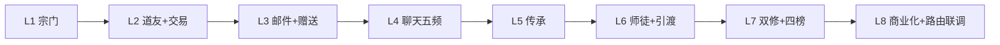
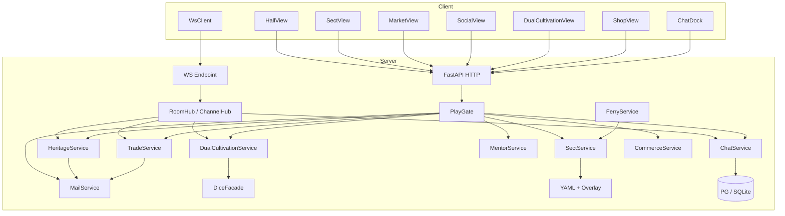

# M7 宗门、社交、经济与商业化 — 详细设计说明（骨架）

> 依据：`开发计划.md` §9 · `project修仙.md`（GDD v4.x）§13–§14 / §19–§21 · M0～M6 设计  
> 目标：落地 **散修/入宗双路线** + **弱社交闭环**（道友、邮件、赠送、多频道聊天、机缘红包、师徒、双修、交易行/面交）+ **会员/天道点沙盒壳**；复用 M6 **WS Hub** 做推送  
> 范围外：见根目录 [`后续待完成.md`](./后续待完成.md)（开实现前必读；尤其勿提前做地图/势力频、战场社交、化身双修、真支付、ATTR 满表）  
> 版本：v1.0 · 2026-08-11  
> 对应开发计划板块：**V（宗门）· W（道友/交易/引渡）· WA（邮件/赠送）· WB（聊天）· WE（传承）· WC（师徒）· WD（双修）· X（商业化）**  
> 前端落点：[`M7前端目录与路由设计.md`](./M7前端目录与路由设计.md)  
> **检定骰权威**：[`骰子系统设计.md`](./骰子系统设计.md)（双修掷骰 `purpose=dual_cultivation`；禁止业务裸 `random()`）  
> 消化延后项指针：`M5-D03`（道友/宗门真引渡）、`M4-D06`（化身宗门任务）、`CHAT-D01/D02`、`HERITAGE-D01`、`DICE-R03`（双修掷骰接入）

---

## 1. 设计目标与思路

### 1.1 一句话目标

在 M6「大道 / 道主 / WS」之上，打通 **可运营的弱社交服**：玩家可散修可入宗；可交易、邮件、赠送；可在多频道聊天并发「机缘」；可拜师出师；可双人双修与上四榜；会员挂机帽与天道点沙盒可用——**不挡挂机主线**，不依赖 AI 才能聊天。

### 1.2 设计原则

| 原则 | 落地方式 |
| --- | --- |
| **服务端权威** | 成交、领附件、抢传承、双修结算、入宗贡献、榜分只在服务端；前端只展示与发起 |
| **配置驱动** | 宗门档、手续费、频道限速、传承限额、双修功法、会员档进 YAML；须可后台域管理（§0.0） |
| **弱交互为主** | 交易/邮件/传承/双修均可异步；WS 推送为体验加分；关 WS 须可 HTTP 降级 |
| **复用 M6 WS** | 聊天/传承/邀约/面交状态走同一 Hub 与信封；**不**另起一套连接栈 |
| **频道成员抽象** | 发消息与抢传承共用「当前频道成员可见」门面（WB5）；地图/势力 type 仅预留 |
| **经济可审计** | 六币种流水；手续费入回收；邮件/赠送/传承退回可稽核 |
| **中文信条** | 玩家可见频道名/邮件/传承/双修文案一律中文（§0.0.2）；机读键英文 |
| **散修可通关** | 宗门非必要；收益差配置可见（§0.7） |
| **延后必登记** | 地图频、化身双修、真支付、战场队等写入 `后续待完成.md` |

### 1.3 成功标准（验收）

1. 散修可玩；可拜入 NPC 宗门；可自建宗门（有钱即可）；贡献轮回归零。  
2. 化身可独立接/交至少 1 条宗门任务（消化 **M4-D06**）。  
3. 宗门兑宠白名单可测；非法物种/余额拒绝。  
4. 道友双向确认；关系轮回可配保留。  
5. 交易行一口价（灵石/以物易物）+ 拍卖行（仅灵石）；绑定物不可上架；流水可审计。  
6. 面对面交易：锁定 → 双方确认 → 原子成交；取消/超时解锁。  
7. 真引渡：同图道友 / 宗门地图高修同门 / 自救成本差（消化 **M5-D03**；同图判定 M7 用占位 `same_region` 桩，真地图 → M9）。  
8. 邮件系统信/玩家信；附件领取幂等；交易失败/传承过期退回可测。  
9. 赠送：道友（或友好度达标）；日限额；绑定物规则。  
10. 五频道：`world` / `sect` / `dm` / `mentor` / `party` 鉴权正确；消息落库 + WS；聊天坞未读；关 WS 可轮询。  
11. 机缘：`random`/`fixed`；灵石或可交易非绑定非唯一道具（背包点选）；仅频道成员可领；过期退回；至少 1 条随机 + 1 条定额可测。  
12. 师徒：拜师 → 1 条任务 → 出师或解除可走通。  
13. 双修：性别必选；至少 1 条双增 + 1 条传修为；掷骰改效果/时长；男/女各有一号榜与零号榜。  
14. 六币种字段与流水；会员 12→18/24 挂机帽；天道点沙盒加点；不卖指定本命道。  
15. 路由：`/sect` `/market` `/social` `/dual-cultivation` `/shop` + 聊天坞横切可从大厅进入。  
16. README / CHANGELOG / `.env.example` 同步；ADM 域登记；无密钥硬编码。  
17. **竖切步均有验收**（§10）；不得用「能发一条世界消息」代替交易/传承/双修闭环。

### 1.4 明确不做 / 延后（指针）

完整清单与验收钩子见 [`后续待完成.md`](./后续待完成.md)。与本里程碑相关：

| ID / 主题 | 摘要 |
| --- | --- |
| **CHAT-D03** | 地图频 `region` / 势力频 `faction`（→ **M9**；本阶段仅预留 type） |
| **M7-D01** | 化身参与双修（→ M7 末可选或 M8+；本阶段仅本体） |
| **M7-D02** | 宗门大比 / 完整资源点数值成型（本阶段日结占位即可） |
| **M7-D03** | 对立盟宣战开战（→ M11；本阶段友好度归零 + 状态占位） |
| **M7-D04** | 队伍实体深化 / 战场队（本阶段最小组队会话；战场 → M11） |
| **M7-D05** | 敏感词完整运营库与人工审（本阶段占位过滤 + 禁言开关） |
| 真支付 | M7 沙盒 → **M13** |
| **ATTR-*** | schema 占位见 [`ATTR战斗属性占位设计.md`](./ATTR战斗属性占位设计.md)；满曲线填数 → M13；**不阻塞** M7 |
| 双修满数值 | → M13 |
| AI 主持聊天 | **永不依赖** |

微操战斗：**永不做**。实时战场社交：**→ M11**。

### 1.5 与 M0～M6 的关系

| 已交付 | M7 动作 |
| --- | --- |
| JWT / 创角 / `CharacterPublic` | 保留；追加性别、宗门摘要、会员档、未读邮件/聊天角标 |
| 背包 / 可交易标记（M4） | 交易行/面交/传承/赠送共用白名单与绑定规则 |
| `PlayGate` | 扩展：待引渡/渡劫/双修会话/面交会话互斥 |
| WS Hub（M6） | 扩展房间/频道订阅：`chat.*` / `heritage.*` / `trade.face` / `dual.*` |
| 引渡状态（M5） | 真道友/同门引渡接上；同图用桩 |
| 功法样本（M2） | 增「双修功法」独立表，与战斗功法解耦 |
| 化身（M4） | 独立宗门任务；**不**进双修 |
| 灵宠（N4） | 宗门兑宠 + 灵兽宗入口钩子（PET-D06 已有则对接） |
| 道主/赛会 | 不改更替规则；社交不挡道主页 |

```text
M6：开道 → 道池 → WS → 道主赛会
M7：散修/入宗 → 交易/邮件 → 聊天+传承
    → 师徒 → 双修四榜 → 会员壳
```

### 1.6 关键设计决策（实现拆分锚点）

> 锁定后 **不得在实现中偷偷改语义**；变更须改本文并记修订记录。  
> **实现顺序 = §10 竖切**，与下表对应。

| # | 决策 | 一句话 | 落入 |
| --- | --- | --- | --- |
| D1 | **散修可通关** | 宗门增益配置高于散修，但非硬门槛 | **L1** |
| D2 | **建宗有钱即可** | 无修为门槛；祖师修为锁传承/功能开关 | **L1** |
| D3 | **宗主≠祖师** | 职位字段分离；功能读祖师进度 | **L1** |
| D4 | **贡献轮回归零** | 入轮回事务清本宗/盟贡献 | **L1** |
| D5 | **道友双向** | 申请→确认；上限配置；轮回默认保留 | **L2** |
| D6 | **交易双行** | 交易行一口价（灵石/易物）；拍卖仅灵石；绑定禁上架 | **L2** |
| D7 | **面交原子** | 双人锁定→确认→成交；超时解锁；防重提 | **L2** |
| D8 | **邮件权威入包** | 领取幂等；系统退回走邮件 | **L3** |
| D9 | **赠送日限额** | 目标须道友或友好度达标；绑定规则同交易 | **L3** |
| D10 | **五频道 + 预留** | M7：world/sect/dm/mentor/party；预留 region/faction | **L4** |
| D11 | **成员可见性门面** | `ChannelMembership` 供消息与传承共用 | **L4** |
| D12 | **传承双模式** | `random` 拼手气 / `fixed` 定额；灵石+可交易道具 | **L5** |
| D13 | **传承过期退回** | 未领份退邮件/回包；流水可审计 | **L5** |
| D14 | **师徒≠双修** | 关系独立；可共享日冷却帽（可选配置） | **L6** |
| D15 | **真引渡最小社交** | 道友同图桩 + 宗门地图高修同门；成本可配 | **L6** |
| D16 | **创角必选性别** | `male`/`female`；不可随意改；无性别禁双修/上榜 | **L7** |
| D17 | **双修功法双 mode** | `mutual_gain` \| `transfer`；独立 YAML | **L7** |
| D18 | **掷骰统一门面** | `purpose=dual_cultivation`；效果档+时长查表 | **L7** |
| D19 | **四榜分性别** | 男一号/男零号/女一号/女零号；服务端写分 | **L7** |
| D20 | **同性默许** | 默认允许；功法可配 `require_opposite_gender` | **L7** |
| D21 | **化身不双修** | M7 仅本体（**M7-D01**） | **L7** |
| D22 | **天道点不直转** | 玩家间不可转天道点；打赏沙盒加点 | **L8** |
| D23 | **会员挂机帽** | 过期回落 12h；不卖指定本命道 | **L8** |
| D24 | **路由五拆 + 聊天坞** | `/sect` `/market` `/social` `/dual-cultivation` `/shop`；聊天横切 | **L8** |
| D25 | **最小队伍** | 组队/离队会话仅服务 `party` 频；无战场逻辑 | **L4** |



### 1.7 双修榜与关系定案（锁死 D-WD*）

| 代号 | 定案 |
| --- | --- |
| **D-WD1** | **一号榜** = 双修贡献分（场次加权 + 结算产出贡献）；**零号榜** = 受赠/被传修为累计分（`transfer` 受方与 `mutual` 双方均计「风姿」占位分）。字段可配置改名，语义本阶段锁此两套。 |
| **D-WD2** | 默认允许同性；功法 `require_opposite_gender: true` 时拒绝。 |
| **D-WD3** | 双修 ≠ 师徒传功；可并存；可选共享 `daily_social_cultivation_cap`。 |
| **D-WD4** | **M7 不做**化身双修；API **禁止**预留半套化身字段。 |

---

## 2. 技术框架设计

### 2.1 选型（继承 M0～M6）

| 层 | 技术 | M7 增量 |
| --- | --- | --- |
| 后端 | FastAPI + SQLAlchemy 2 async + bootstrap | sect / friend / trade / mail / chat / heritage / mentor / dual / commerce |
| 配置 | YAML + OverlayStore | `sects.yaml` / `trade.yaml` / `chat.yaml` / `chat_heritage.yaml` / `mentor.yaml` / `dual_cultivation.yaml` / `commerce.yaml` / `currencies.yaml` |
| WS | 复用 `WsHub` | 频道订阅 + 事件 type 命名空间 |
| 前端 | Vue3 + Pinia + Router | **五条玩法路由** + **ChatDock** 横切 |
| 定时 | 传承过期 / 拍卖结拍 / 面交超时：**读时惰性 + 可选定时扫** | 与挂机惰性一致，禁止全表无索引扫 |
| 骰子 | `dice_rules` 门面 | `dual_cultivation` purpose 查表 |

### 2.2 系统上下文



### 2.3 后端目录增量（相对 M6）

```text
backend/app/
├── config_data/
│   ├── sects.yaml                 # NPC 宗门、建宗费、贡献、任务样本、兑宠白名单
│   ├── trade.yaml                 # 手续费、拍卖、面交超时、可交易标记规则
│   ├── mail.yaml                  # 过期、附件上限
│   ├── chat.yaml                  # 频道、限速、禁言、敏感词占位、历史条数
│   ├── chat_heritage.yaml         # 份数、过期、白名单、日限额、random/fixed
│   ├── mentor.yaml                # 境界差、名额、任务、出师奖、冷却
│   ├── dual_cultivation.yaml      # 功法 mode、曲线、冷却、榜规则
│   ├── commerce.yaml              # 会员档、天道商店、沙盒开关
│   ├── currencies.yaml            # 六币种展示名与流水类型
│   └── （扩展 dice / idle 会员帽 / friends tradable）
├── domain/
│   ├── sect_rules.py
│   ├── trade_rules.py             # 手续费、易物合法性
│   ├── channel_membership.py      # 成员可见性纯规则
│   ├── heritage_rules.py          # 拆分 random/fixed
│   ├── mentor_rules.py
│   ├── dual_cultivation_rules.py
│   └── commerce_rules.py
├── db/models/
│   ├── sect.py / sect_member.py / sect_contribution_ledger.py
│   ├── friendship.py
│   ├── trade_listing.py / auction_lot.py / face_trade_session.py
│   ├── mail_message.py
│   ├── chat_message.py / chat_channel_ban.py / party_session.py
│   ├── heritage_packet.py / heritage_claim.py
│   ├── mentor_bond.py
│   ├── dual_session.py / dual_rank_score.py
│   ├── currency_ledger.py / membership.py
│   └── character.py               # gender、sect_id、membership_tier 摘要
├── services/
│   ├── sect_service.py
│   ├── friend_service.py
│   ├── trade_service.py
│   ├── mail_service.py
│   ├── chat_service.py
│   ├── heritage_service.py
│   ├── mentor_service.py
│   ├── dual_cultivation_service.py
│   ├── commerce_service.py
│   ├── ferry_service.py           # 扩展真引渡
│   └── ws_hub_service.py          # 扩展频道广播
├── api/
│   ├── sect.py / friends.py / trade.py / mail.py
│   ├── chat.py / heritage.py / mentor.py
│   ├── dual_cultivation.py / commerce.py
│   └── （扩展 character 创角性别 / gm / avatar quests）
├── schemas/
│   └── sect.py / trade.py / mail.py / chat.py / heritage.py
│       / mentor.py / dual_cultivation.py / commerce.py
└── tests/
    ├── test_sect_join_create.py
    ├── test_trade_listing_face.py
    ├── test_mail_gift.py
    ├── test_chat_channels_auth.py
    ├── test_heritage_random_fixed.py
    ├── test_mentor_flow.py
    ├── test_dual_cultivation_dice_ranks.py
    └── test_commerce_membership_sandbox.py
```

### 2.4 环境变量增量

| 变量 | 默认 | 说明 |
| --- | --- | --- |
| `SECT_SYSTEM_ENABLED` | `true` | 宗门总开关 |
| `TRADE_SYSTEM_ENABLED` | `true` | 交易行/拍卖/面交 |
| `CHAT_SYSTEM_ENABLED` | `true` | 聊天；`false` 时聊天 API 关闭 |
| `CHAT_WS_PUSH_ENABLED` | `true` | 关则仅 HTTP 轮询 |
| `HERITAGE_SYSTEM_ENABLED` | `true` | 传承 |
| `DUAL_CULTIVATION_ENABLED` | `true` | 双修 |
| `COMMERCE_SANDBOX_ENABLED` | `true` | 天道点沙盒加点（生产可关） |
| `MEMBERSHIP_ENABLED` | `true` | 会员档 |
| `FACE_TRADE_TIMEOUT_SEC` | `120` | 面交超时 |
| `HERITAGE_EXPIRE_SEC` | `86400` | 传承默认过期（可被 YAML 覆盖） |
| `SAME_REGION_STUB` | `true` | M7 同图判定桩（全员视为同区或配置白名单）；M9 关闭 |

---

## 3. 宗门（板块 V）

### 3.1 散修与入宗（D1）

- 角色默认 `sect_id=null`（散修）。  
- NPC 宗门表驱动：拜入条件（境界/灵石占位）、贡献商店、任务队列。  
- 入宗收益（挂机/商店折扣等）读配置乘区，**显性展示**相对散修的差。

### 3.2 自建宗门（D2 / D3）

| 字段 | 说明 |
| --- | --- |
| `founder_character_id` | 祖师（创建者） |
| `leader_character_id` | 宗主（可转让；可≠祖师） |
| `name` / `motto` | 中文校验；敏感词占位 |
| `unlocked_features[]` | 读祖师进度/境界阈值 |

建宗：扣灵石 → 写宗门行 → 创建者入成员（祖师+宗主）。  
功能未解锁时 API 返回中文原因（如「祖师未达炼虚，秘境任务未开」）。

### 3.3 化身宗门任务（M4-D06）

- 复用化身能力检定；本体无需在场。  
- 失败不牵连本体陨落；贡献入本宗账本。  
- 与化身挂机/工坊并行，受 `PlayGate` 日行动/体力约束。

### 3.4 资源点 / 盟 / 友好度 / 商铺（占位可测）

- 资源点：**日结一次**写入流水（数值占位）。  
- 盟：自愿加入；入对立盟 → 与对立成员友好度 **归零**。  
- 友好度达标 → 可买对方对外商铺。  
- 对外库类别由宗门选定；上架由宗主决定。  
- 完整大比/宣战 → **M7-D02 / M7-D03 / M11**。

### 3.5 宗门兑宠（V6）

- `sect_exchange`：贡献兑换物种白名单。  
- 依赖 N4 catalog；费用曲线 YAML；非法物种/余额 → 4xx。  
- 灵兽宗改词条类型：对接既有 PET-D06 / 设施入口。

### 3.6 魂灯（宗门地图状态）

- M7：列表展示本宗弟子 **状态摘要**（含待引渡）；位置字段占位。  
- 真地图坐标 → M9；散修无魂灯入口。

### 3.7 配置示意 `sects.yaml`

```yaml
create_cost_spirit_stones: 100000
npc_sects:
  - id: lingshou_zong
    label: 灵兽宗
    join_min_realm: jindan
features_by_founder_realm:
  huashen: [shop_basic, quests_basic]
  lianxu: [shop_basic, quests_basic, secret_realm_hook]
sect_exchange:
  enabled: true
  whitelist_species: [spirit_fox_cub]
  cost_contribution: 500
```

---

## 4. 道友、交易与引渡（板块 W）

### 4.1 道友（D5）

- 申请 → 对方确认 → `active`；拒绝/超时可配。  
- 上限 `max_friends`；轮回策略默认 **保留**（YAML）。  
- 列表含在线摘要（可选，不挡弱交互）。

### 4.2 交易行 / 拍卖行（D6）

| 行 | 计价 | 规则 |
| --- | --- | --- |
| 交易行 | 灵石一口价 **或** 以物易物 | 易物另收 **高于** 常规的固定灵石手续费（按上架者修为档） |
| 拍卖行 | **仅灵石** | 出价/结拍惰性或定时；失败退回邮件 |

- 绑定物 / 不可交易标记 → 拒绝上架。  
- 天道点 **永不**进入玩家直转或上架计价。  
- 手续费入回收池账户（系统账本）。

### 4.3 面对面交易（D7）

```text
invite → lock items both sides → confirm A/B → commit atomic
         ↘ cancel / timeout → unlock
```

- 防重复提交：`session_id` + 版本号。  
- 可选 WS：`trade.face.state`。

### 4.4 引渡（D15 / M5-D03）

| 路径 | 条件 | 成本 |
| --- | --- | --- |
| 道友救援 | 道友 + `same_region`（M7 桩） | 低于自救 |
| 同门救援 | 同宗 + 救援者修为更高 + 双方在宗门地图（占位 flag） | 可配 |
| 自救 | 已有 M5 | 较高 |

- 成功清 `awaiting_ferry`；可选 WS 推送。  
- `SAME_REGION_STUB=true` 时：配置为「全员同区」或「好友视为同区」以便联调；M9 换真 `current_region_id`。

---

## 5. 邮件与赠送（板块 WA）

### 5.1 邮件（D8）

| 类型 | 说明 |
| --- | --- |
| `system` | 活动、退回、传承过期、交易失败 |
| `player` | 玩家信（可无附件） |

- 附件：灵石 + 道具列表；**领取幂等**（`claimed_at`）。  
- 过期清理配置；未领附件过期策略：退回发件方或销毁（YAML，默认退回）。

### 5.2 赠送（D9）

- 目标：道友，或宗门友好度 ≥ 阈值。  
- 日限额（次数/总灵石估价）。  
- 绑定物拒绝；成功写双方流水 + 可选系统回执邮件。

---

## 6. 聊天室（板块 WB）

### 6.1 频道矩阵（D10）

| channel_type | 中文 | 准入 | M7 |
| --- | --- | --- | --- |
| `world` | 世界 | 全服（可分线占位） | ✅ |
| `sect` | 宗门 | 本宗成员 | ✅ |
| `dm` | 私聊 | 双方会话 | ✅ |
| `mentor` | 师承 | 当前师徒键 | ✅ |
| `party` | 队伍 | 最小队伍成员 | ✅ |
| `region` | 地图 | 同 `current_region_id` | 预留 → M9 |
| `faction` | 势力 | 势力成员 | 预留 → M9 |

### 6.2 成员可见性（D11）

```text
ChannelMembership.can_access(character, channel_ref) -> bool
ChannelMembership.list_members(channel_ref) -> ids  # 供传承广播
```

跨频道不可见：单测强制。

### 6.3 消息与推送

- 落库短历史（条数/TTL 配置；服务端可保留供审计）。  
- **会话级清空（D 追加）**：`session_ephemeral=true` 时客户端**不拉历史**；退出登录 / 关闭浏览器清空本端消息；本会话仅展示进房后新消息与本会话缓存。  
- WS：`chat.message` / `chat.unread`；HTTP `GET /chat/history` 仍可供非会话级 / 运维。  
- 鉴权、禁言、敏感词占位、速率限制。  
- 关 `CHAT_WS_PUSH_ENABLED`：非会话级时可轮询历史；会话级则断线不回填旧消息。

### 6.4 最小队伍（D25 / CHAT-D02）

- `POST /party` 组队 / 离队；仅服务 `party` 频道与传承成员集。  
- **无**副本匹配、无战场；散队清会话与未读。

### 6.5 WS type 增补（聊天）

| type | 说明 |
| --- | --- |
| `chat.message` | 新消息 |
| `chat.recall` | 撤回占位（可选） |
| `chat.unread` | 未读摘要推送 |

---

## 7. 机缘（板块 WE · 机读仍 heritage）

> 玩家文案一律称 **「机缘」**（原「传承」红包）；机读 `heritage`；ADM 域 `chat_heritage`。  
> **勿与**轮回新生「灵根/传承」混淆。

### 7.1 会话（D12）

```text
选频道 → 选内容（灵石 或 背包非绑定/非唯一/可交易物品，点选）→ 份数 n → mode=random|fixed → 广播卡片
```

- 非法道具 / 绑定物 / 唯一物拒绝；扣款/扣物权威。前端禁止手填 `item_id`。  
- `random`：份额加权随机（服务端 RNG 门面，可复现 seed 写入流水）。  
- `fixed`：总额均分（除不尽余数进末份或回收，YAML）。

### 7.2 领取（D13）

- 成员校验 → 原子扣剩余份 → 入包/加灵石。  
- 同人限领：默认 1 份/包（可配）。  
- 非成员 / 领完 / 过期 → 中文错误码。  
- **已抢完 / 已过期**：服务端 `purge_closed_packets` 可惰性删库；**客户端本会话**仍展示已抢完，默认保留 20 条（`session_finished_keep`）；退出登录 / 关闭浏览器后清空；未抢完（`open`）始终可拉回。

### 7.3 过期退回

- 惰性：下次领取或定时任务触发。  
- 未领部分退回发件人（邮件或直回包）；系统邮件文案中文。

### 7.4 验收最小集（WE4）

1. 世界频道：拼手气纯灵石。  
2. 宗门频道：定额「灵石」或「1 可交易丹」（背包点选）。

### 7.5 WS type 增补（机缘）

| type | 说明 |
| --- | --- |
| `heritage.created` | 新机缘卡片 |
| `heritage.claimed` | 领取广播（可匿名金额策略可配） |
| `heritage.expired` | 过期 |

---

## 8. 师徒（板块 WC）

### 8.1 关系（D14）

- 拜师/收徒申请；境界差与名额配置；叛师/解除冷却。  
- 轮回后关系默认 **保留**（可配清）。

### 8.2 任务与传功

- 至少 1 条师徒任务样本（计数权威）。  
- 传功：修为池小加成占位；与双修共享日帽可选。  
- 出师：结算奖励 + 解除名额占用。

### 8.3 师承频道

- 建立关系后自动可进 `mentor` 频；解除后不可发（历史只读策略可配）。

---

## 9. 双修（板块 WD）

### 9.1 性别（D16）

- 创角必选 `male` | `female`；存量角色：强制补选闸（进双修/上榜前）。  
- **不可**玩家随意改；GM 可改（审计）。

### 9.2 功法表（D17）

| 字段 | 说明 |
| --- | --- |
| `technique_id` | 机读 |
| `label` | 中文名 |
| `mode` | `mutual_gain` \| `transfer` |
| `transfer_direction` | `inviter_to_invitee` \| `invitee_to_inviter` \| `chooser`（仅 transfer） |
| `require_opposite_gender` | bool |
| `realm_min` / `cooldown_sec` | 门槛 |
| `base_yield` / curves | 占位曲线 |

与战斗功法表 **解耦**（独立 YAML）。

### 9.3 会话状态机

```text
inviting → confirmed → running → settled
                ↘ cancelled / timeout / aborted
```

互斥：渡劫、待引渡、轮回中、已在其他双修、面交锁定中 → 拒绝。  
**仅本体**（D21）。

### 9.4 掷骰（D18 / DICE-R03）

- 调用统一骰子：`purpose=dual_cultivation`。  
- 出目 → 查表得 **效果档** + **持续时长**（或本段倍率）。  
- 写入会话快照；可重掷次数配置；同 seed 单测可复现。  
- 前端只播动画与展示服务端字段。

### 9.5 结算与四榜（D19）

- `mutual_gain`：双方加修为池。  
- `transfer`：传方扣、受方加（或只加受方，传方耗灵石/体力——YAML）。  
- 写流水；更新四榜分（D-WD1）。  
- 未达上榜门槛不占榜；性别错绑拒绝。

### 9.6 WS（可选）

| type | 说明 |
| --- | --- |
| `dual.invite` | 邀约到达 |
| `dual.state` | 确认/掷骰/结束 |

关 WS → HTTP 轮询会话。

---

## 10. 货币与商业化壳（板块 X）

### 10.1 六币种（D22）

| 币种 | 机读 | 玩家间 |
| --- | --- | --- |
| 灵石 | `spirit_stone` | ✅ |
| 宗门贡献 | `sect_contrib` | ❌ 本宗 |
| 盟贡献 | `alliance_contrib` | ❌ |
| 荣誉 | `honor` | 占位 |
| 轮回点 | `reincarnation_point` | ❌ 直转 |
| 天道点 | `tiandao_point` | ❌ 直转 |

统一 `currency_ledger`；邮件/赠送/手续费/传承均打点。

### 10.2 会员（D23）

| 档 | 挂机有效时长 | 其它 |
| --- | --- | --- |
| 免费 | 12h | — |
| 会员 I | 18h | 修为/成功率占位加成 |
| 会员 II | 24h | 同上更高占位 |

过期回落 12h；开通耗天道点（沙盒可加点）。

### 10.3 天道商店与边界文案

- 沙盒：`POST /commerce/sandbox/grant-tiandao`（仅 DEV/开关）。  
- **禁止**售卖指定本命道；商店文案显性声明。  
- 真支付渠道 → M13。

### 10.4 抗通胀

- 手续费入回收；轮回清空比例读既有表；邮件/赠送计入稽核日志。

---

## 11. 与既有系统集成

| 系统 | 集成点 |
| --- | --- |
| `PlayGate` | 双修/面交/待引渡互斥；渡劫中禁交易上架可选 |
| 背包 | 锁定字段供面交/传承/上架 |
| 轮回 | 贡献归零；道友/师徒策略；会员是否跨周目（默认不保留付费档，YAML） |
| 化身 | 宗门任务；禁双修 |
| 灵宠 | 兑宠；灵兽宗设施 |
| 挂机 | 会员帽接入离线结算 |
| 骰子 | 双修 purpose |
| WS | 频道订阅与推送 |
| 引渡 UI | 灰置按钮启用真路径 |
| ADM | 域：`sects` / `trade` / `chat` / `chat_heritage` / `mentor` / `dual_cultivation` / `commerce` |

---

## 12. 错误码与角色摘要

### 12.1 错误码增量（示意段 40100+）

| 码 | 含义 |
| --- | --- |
| 40101 | 未入宗，不可用宗门功能/频 |
| 40102 | 建宗灵石不足 |
| 40103 | 祖师功能未解锁 |
| 40110 | 非道友/友好度不足 |
| 40111 | 绑定物/唯一物不可交易/赠送/入机缘 |
| 40112 | 面交状态非法 |
| 40120 | 邮件附件已领或不存在 |
| 40130 | 频道无权限 |
| 40131 | 发言限速 |
| 40132 | 禁言中 |
| 40140 | 机缘不可领（非成员/领完/过期） |
| 40150 | 师徒申请非法 |
| 40160 | 无性别 / 性别不匹配功法 |
| 40161 | 双修互斥冲突 |
| 40162 | 双修功法非法 |
| 40170 | 天道点不足 |
| 40171 | 会员功能关闭 |
| 40180 | 同图判定失败（引渡） |

### 12.2 `CharacterPublic` 扩展（示意）

```json
{
  "gender": "male",
  "sect": { "id": 1, "name": "青云", "role": "member", "contrib": 120 },
  "membership": { "tier": "none", "expires_at": null, "idle_cap_hours": 12 },
  "social_badges": { "mail_unread": 2, "chat_unread": 5, "dual_invite": 0 },
  "friend_count": 3
}
```

### 12.3 接口清单（草案）

#### 宗门

| 方法 | 路径 | 说明 |
| --- | --- | --- |
| GET | `/sect/me` | 我的宗门摘要 |
| GET | `/sect/npc` | NPC 宗门列表 |
| POST | `/sect/join` | 拜入 |
| POST | `/sect/create` | 自建 |
| GET | `/sect/quests` | 任务（含化身可接） |
| POST | `/sect/quests/{id}/accept` | 接任务 |
| POST | `/sect/exchange/pet` | 兑宠 |
| GET | `/sect/soul-lamps` | 魂灯列表 |

#### 道友 / 交易 / 引渡

| 方法 | 路径 | 说明 |
| --- | --- | --- |
| GET/POST | `/friends` | 列表（修为/在线/助战）/申请 |
| DELETE | `/friends/{id}` | 解除 |
| POST | `/friends/{id}/accept` | 确认 |
| GET/POST | `/trade/listings` | 交易行 |
| GET/POST | `/auctions` | 拍卖 |
| POST | `/trade/face` | 面交会话 |
| POST | `/ferry/rescue` | 道友/同门引渡 |

#### 邮件 / 赠送

| 方法 | 路径 | 说明 |
| --- | --- | --- |
| GET | `/mail` | 列表 |
| POST | `/mail/{id}/claim` | 领附件 |
| POST | `/gifts` | 赠送 |

#### 聊天 / 传承

| 方法 | 路径 | 说明 |
| --- | --- | --- |
| GET | `/chat/channels` | 可进频道 |
| GET | `/chat/history` | 历史 |
| POST | `/chat/send` | 发送 |
| POST | `/party` | 组队/离队 |
| POST | `/heritage` | 发传承 |
| POST | `/heritage/{id}/claim` | 领取 |

#### 师徒 / 双修 / 商业化

| 方法 | 路径 | 说明 |
| --- | --- | --- |
| POST | `/mentor/apply` | 拜师/收徒 |
| GET | `/mentor/me` | 名录与任务 |
| POST | `/dual/invite` | 邀约 |
| POST | `/dual/{id}/confirm` | 确认 |
| POST | `/dual/{id}/roll` | 掷骰 |
| POST | `/dual/{id}/settle` | 结束领取 |
| GET | `/dual/ranks` | 四榜 |
| GET | `/commerce/shop` | 天道商店 |
| POST | `/commerce/membership` | 开通/续费 |
| POST | `/commerce/sandbox/grant-tiandao` | 沙盒 |

#### WS

复用 `/api/v1/ws`；订阅 `chat:{channel}` / `heritage:{id}` / `dual:{id}` / `trade:face:{id}`。

---

## 13. 后端模块设计思路

### 13.1 分层

- API 薄路由 → Service 编排 → domain 纯规则 → ORM。  
- `ChannelMembership` 无 IO，供 Chat/Heritage 单测。  
- 经济写操作统一经 ledger helper，禁止散落改余额。

### 13.2 并发

- 传承领取、拍卖出价、面交成交：行锁或 `UPDATE … WHERE remain>0`。  
- 双修结算：会话行锁。  
- 聊天发送：限速令牌；不挡挂机 settle。

### 13.3 日志

- 关键成交/抢传承/双修结算/入宗/开通会员 → `logging` + 可选 audit 表。  
- 禁止 `print()`。

### 13.4 测试最低集

| 测试 | 断言 |
| --- | --- |
| `test_sect_join_create` | 散修拜入；有钱建宗；贡献轮回归零钩子 |
| `test_trade_listing_face` | 绑定拒绝；面交成交；超时解锁 |
| `test_mail_gift` | 领取幂等；赠送限额 |
| `test_chat_channels_auth` | 未入宗拒 sect；非师徒拒 mentor |
| `test_heritage_random_fixed` | 跨频道不可领；过期退回 |
| `test_mentor_flow` | 拜师→任务→出师 |
| `test_dual_cultivation_dice_ranks` | 双增/传修为；掷骰档；四榜 |
| `test_commerce_membership_sandbox` | 帽 18/24；过期回落；不卖本命道 |

---

## 14. 竖切实现计划（强制）

> 与 [`开发计划.md`](./开发计划.md) §9 板块对齐；**前后端交叉**，每步可玩可测。

### 14.0 总览

| 步 | 内容 | 主要板块 | 验收一句话 |
| --- | --- | --- | --- |
| **L1** | 宗门拜入/自建/贡献/化身任务/兑宠钩子 | V | 散修可入 NPC 宗；有钱可建宗 |
| **L2** | 道友 + 交易行/拍卖 + 面交 | W1～W3 | 一口价与面交可成交 |
| **L3** | 邮件 + 赠送 + 系统退回 | WA | 附件幂等；退回信可测 |
| **L4** | 五频道聊天 + 最小队伍 + 成员门面 | WB | 两账号世界/私聊互通 |
| **L5** | 传承 random/fixed + 过期退回 | WE | 世界拼手气 + 宗门定额 |
| **L6** | 师徒 + 真引渡 | WC + W4 | 拜师出师；道友引渡可测 |
| **L7** | 性别 + 双修会话/掷骰/四榜 | WD | 双增+传修为+四榜有数 |
| **L8** | 六币种/会员/沙盒 + 五路由/聊天坞联调 + smoke | X + 前端 | 出口标准全勾 |

### 14.1 与开发计划映射

| 计划步骤 | 竖切 |
| --- | --- |
| V1～V6 | L1（V5 前端可拖到 L8 壳） |
| W1～W3 | L2 |
| WA1～WA4 | L3 |
| WB1～WB5 | L4 |
| WE1～WE5 | L5 |
| WC1～WC4 / W4 | L6 |
| WD0～WD9 | L7 |
| X1～X5 / 路由总装 | L8 |
| W5～W6 / WD8 可选 WS | 随对应 L 加分，不挡出口 |

### 14.2 建议冒烟脚本

`scripts/smoke_m7.py`：两账号建友 → 交易行成交 → 世界频道互发 → 发/抢传承 → 拜师任务 → 双修双增一局 → 沙盒天道点开通会员帽。

---

## 15. M7 总验收清单

- [x] 散修/入宗双路线；自建宗；贡献轮回归零  
- [x] 化身独立宗门任务至少 1 条  
- [x] 宗门兑宠非法拒绝；白名单可兑  
- [x] 道友双向；交易行 + 拍卖 + 面交可用  
- [x] 真引渡（道友/同门）可测；自救成本差可见  
- [x] 邮件/赠送可用；退回信可测  
- [x] 世界/宗门/私聊/师承/队伍可互通；鉴权正确  
- [x] 传承至少 1 随机 + 1 定额；过期退回  
- [x] 师徒拜→任务→出师/解除  
- [x] 双修：双增 + 传修为；掷骰改效果/时长；四榜可查  
- [x] 会员挂机帽生效；天道沙盒；不卖指定本命道  
- [x] `/sect` `/market` `/social` `/dual-cultivation` `/shop` + ChatDock（五路由 + ChatDock 已落地）  
- [x] 文档与 `.env.example` 同步；ADM 域契约（sects/friends/trade/mail/chat/chat_heritage/mentor/dual_cultivation/currencies/commerce）  
- [x] `smoke_m7` 与关键单测绿灯（L1～L8：含 `test_commerce_membership_sandbox` / `smoke_m7.py`）  

**出口标准**：见 `开发计划.md` §9 末段。

---

## 16. 文档与产出物清单

| 产出 | 说明 |
| --- | --- |
| 本文 | M7 后端/领域骨架 |
| `M7前端目录与路由设计.md` | 五路由 + 聊天坞落点 |
| `后续待完成.md` | CHAT/HERITAGE → 设计中；增补 M7-D02～D05；M5-D03/M4-D06 指针 |
| README / CHANGELOG | 索引与变更 |
| 实现后 | YAML、迁移、smoke_m7、测试、README 聊天/传承协议节 |

---

## 17. 风险与对策

| 风险 | 对策 |
| --- | --- |
| 聊天做成半成品挡主线 | 聊天坞不挡挂机；竖切 L4 有双账号验收才过 |
| 传承刷物 | 白名单+锁定+日限额+审计；绑定拒绝 |
| 双修数值失衡 | 占位曲线；满平衡 → M13；榜防刷规则 |
| 同图引渡无地图 | `SAME_REGION_STUB`；真判定 M9 |
| 路由过多 | 五玩法 path + 聊天横切；不做地图频独立页 |
| 过早真支付 | 仅沙盒；M13 换渠道 |
| 化身双修半套字段 | API 禁止预留（M7-D01） |

---

## 18. 修订记录

| 日期 | 说明 |
| --- | --- |
| 2026-08-11 | **v1.0**：开篇；对齐开发计划 §9 V/W/WA/WB/WE/WC/WD/X；锁 D-WD1～4；竖切 L1～L8；CHAT/HERITAGE 细则并入本文（不另拆半成品文档） |
| 2026-08-11 | **L1 落地**：NPC 拜入/自建/贡献/化身任务/商店/魂灯/兑宠；`/sect` 前端；单测 `test_sect_join_create` |
| 2026-08-11 | **L2 落地**：道友双向；交易行一口价/易物；拍卖；面交原子成交；`/market` `/social`；单测 `test_trade_listing_face` |

---

*玩法与接口以本文为准；排期以 `开发计划.md` §9 为准；延后以 `后续待完成.md` 为准；前端以 `M7前端目录与路由设计.md` 为准。*
