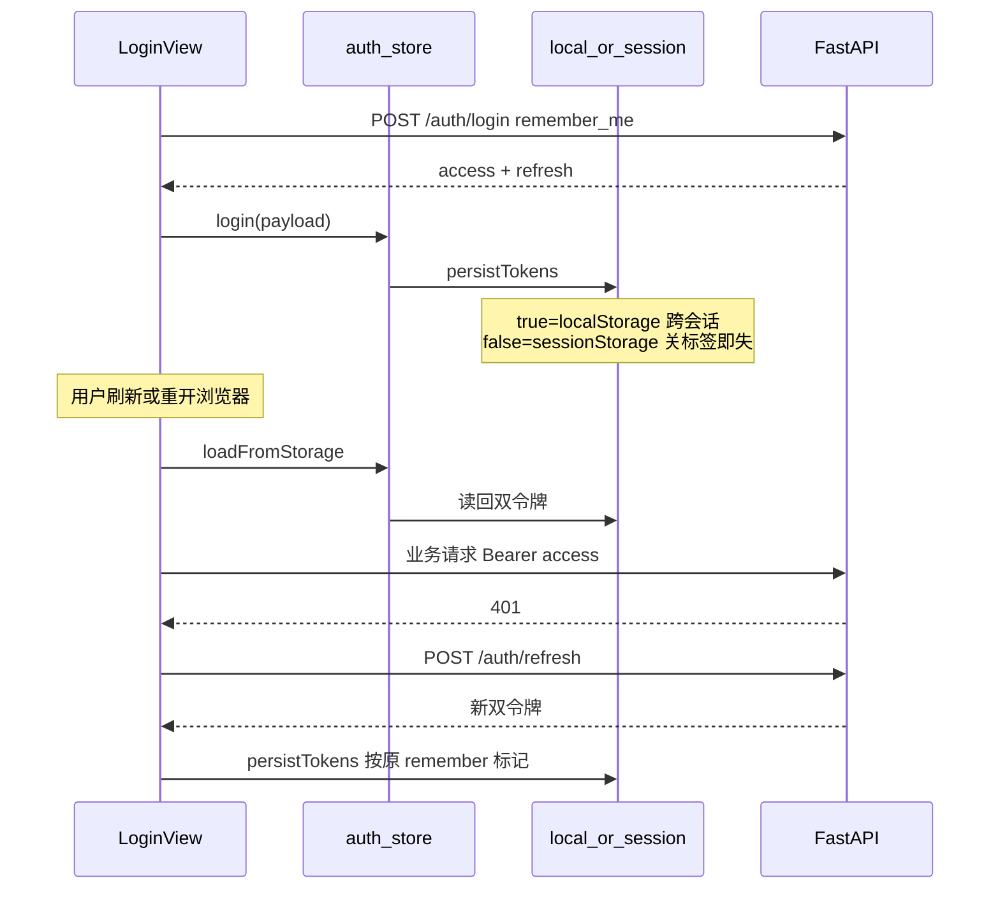

# 保留登录状态：可行方案

## 结论先说

**令牌持久化本身已经实现**，不必从零重写。真正缺的是「刷新/重开浏览器后自动识别已登录并进对的页面」。

| 已有 | 缺失（影响体感） |
| --- | --- |
| 登录勾选「记住登录」→ `remember_me` | 无路由守卫：直接访问 `/hall` 不校验登录 |
| 长/短效 refresh（默认约 14 天 / 1 天） | 启动只 `loadFromStorage()`，不主动 `/auth/me` |
| `localStorage` / `sessionStorage` 分流 | `/` 恒跳 `/login`，已登录用户仍落登录页 |
| 401 自动 refresh 一次后重试 | 无「已登录访问登录页 → 自动进大厅/创角」 |

---

## 当前机制（保留不动）

关键文件（已存在，方案内仅复用）：

- 前端存储：[frontend/src/utils/storage.ts](frontend/src/utils/storage.ts)
- 启动恢复令牌：[frontend/src/main.ts](frontend/src/main.ts)（`loadFromStorage`）
- 401 换票：[frontend/src/api/http.ts](frontend/src/api/http.ts)
- 后端签发：[backend/app/services/auth_service.py](backend/app/services/auth_store.py) 中 `_build_token_payload(remember_me=...)`；短效 1 天、长效读 `REFRESH_TOKEN_EXPIRE_DAYS`

语义约定（保持现状）：

- **勾选记住**：长效 refresh + `localStorage` → 关浏览器仍可恢复
- **不勾选**：短效 refresh（1 天）+ `sessionStorage` → 关标签/浏览器后视为未登录

---

## 推荐补齐方案（本阶段要做的）

目标：勾选「记住登录」并登录成功后，**刷新页面或关闭再打开**，应自动带着会话进入创角页或大厅，而不是再填密码。

### 1. 路由元信息 + 全局前置守卫

改 [frontend/src/router/index.ts](frontend/src/router/index.ts)：

- 公开路由：`/login`、`/register`（及可选 `/test`）
- 需登录：`/create-character`、`/hall`
- 守卫逻辑：
  1. 若目标需登录且无 token → 跳 `/login`，可带 `?redirect=`
  2. 有 token 但 `user` 为空 → 调 `authStore.fetchMe()`（内部已含 refresh 重试）
  3. `fetchMe` 失败 → `logout` 并跳登录
  4. 已登录访问 `/login` 或 `/register` → 按 `has_character` 去 `/hall` 或 `/create-character`
  5. `/`：有有效会话则同上分流；否则 `/login`

`fetchMe` / `AuthMeResult.has_character` 已在 [frontend/src/stores/auth.ts](frontend/src/stores/auth.ts) 与后端 `/auth/me` 就绪，守卫直接复用。

### 2. 启动顺序微调（可选但建议）

在 [frontend/src/main.ts](frontend/src/main.ts) 保持先 `loadFromStorage()`，再 `app.mount`；**不要**在 mount 前阻塞整页等 `/me`（避免白屏）。会话校验放在路由守卫里按需触发即可（访问受保护页或已登录撞上登录页时）。

### 3. 登录成功跳转与 redirect

[LoginView.vue](frontend/src/views/LoginView.vue) 登录成功后：

- 若 URL 有合法 `redirect` 且为目标站内路径 → 优先跳转
- 否则仍按现有 `has_character` 逻辑

### 4. 明确不做的（本阶段）

- 不做服务端 refresh 黑名单 / 旋转作废旧票（设计已注明 M0 不做）
- 不改 HttpOnly Cookie 方案（继续 JWT 存 Storage，与现栈一致）
- 不延长 access 有效期；靠 refresh + 拦截器续命

### 5. 文档与验收

- 更新 [README.md](README.md) / [CHANGELOG.md](CHANGELOG.md)：写清「记住登录」验收步骤
- 手工验收清单：
  1. 勾选记住 → 登录 → 关浏览器再开 → 应仍在大厅/创角（或自动从登录页跳入）
  2. 不勾选 → 登录 → 关标签再开 → 应回到登录页
  3. 清 Storage 或等 refresh 过期 → 访问 `/hall` → 被赶到登录页
  4. access 过期、refresh 仍有效 → 任意 API 一次 401 后自动恢复，用户无感

---

## 实现顺序

1. 给路由加 `meta.requiresAuth` / `meta.public`
2. 实现 `router.beforeEach`（调用 `fetchMe`、分流、redirect）
3. 登录成功尊重 `redirect` 查询参数
4. 文档 + 手工验收

预计改动面：主要前端 2～3 个文件（`router/index.ts`、`LoginView.vue`、文档）；后端无需改动。
