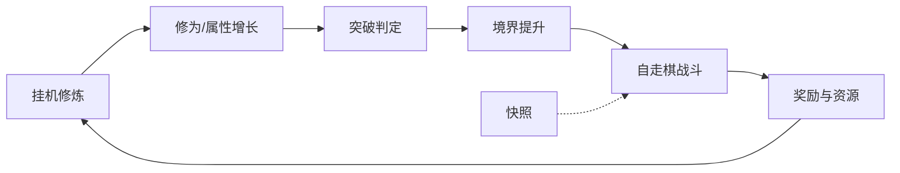

# 修仙 GDD 核心循环框架完善

## 目标与边界

- **产出**：仅完善设计文档 [`project修仙.md`](d:\ProjectXX\project修仙.md)，不写代码。
- **本批范围（对应大纲）**：
  - §1 项目概述
  - §2 境界体系（框架级总览 + 阶段划分 + 时间规划）
  - §3 突破系统（小/大境界、品阶、雷劫）
  - §9 挂机系统 + §10 化身系统（挂机修炼闭环）
  - §7 自走棋战斗 + §8 快照（战斗骨架，细则可标「待展开」）
- **不写本批**：体质/轮回细则、大道 37 条全文、生活技能、宗门社交、经济付费数值定稿等（目录保留，正文暂不填）。

## 文档结构约定

在现有目录后追加正文，按大纲编号书写；每章统一格式：

1. **设计目标**（1 段）
2. **核心规则**（条目 + 必要表格）
3. **与核心循环的关系**（输入/输出）
4. **待定项**（本批不拍板的数值用 `TBD` 标注）

版本头更新为：`v3.1 | 状态：核心循环框架已落地`。

## 核心循环（写入 §1）

设计定调（写入文档，作为后续约束）：

- 品类：偏挂机的修仙自走棋，弱社交、强个人成长。
- 日活主路径：选挂机方向 → 积修为 → 突破 → 用战力打 PVE/防守快照 → 资源回流挂机。
- 化身：金丹开启，分流生活技能挂机，不替代本体三修（修灵/炼体/修道）。

## 各章要写实的内容

### §1 项目概述
- 基本信息：暂定名「Project修仙」、端游/手游定位可写「优先服务端逻辑 + 轻客户端」、目标受众。
- 三大理念：长线境界成长、挂机为主操作、自走棋战力验证。
- 核心循环图 + 单局/单日体验切片（在线 10–30 分钟可完成什么）。

### §2 境界体系
- 总览表：下（锻体~化神）/ 中（炼虚~大乘）/ 上（真仙~大罗）/ 道主 / 轮回，每阶「小境界层数」用框架约定（如每大境界 9 层或前低后高，文档内写死一种）。
- 各阶段设计意图（节奏、内容解锁钩子：金丹→化身、化神前主线密、合体后主线疏等，与大纲 §15 对齐一句）。
- 境界时间规划：用「现实日 / 游戏年」比例占位 + 各阶段预期停留量级（框架级，非最终数值）。

### §3 突破系统
- 三类突破：小境界 / 大境界 / 大阶段，触发条件与失败代价框架。
- 品阶：劣质~天道，成功后永久加成与神通位挂钩（神通列表放附录 D，本批只定义档位与效果类型）。
- 雷劫：何种突破触发、成败与品阶关联、与战斗/挂机互斥规则。

### §9–§10 挂机与化身
- 本体挂机三选一：修灵 / 炼体 / 修道；消耗灵石；收益类型对照表。
- 离线结算规则（上限时长、效率衰减思路）。
- 化身：金丹开启、生活技能挂机、与本体修为/资源关系（不抢本体突破权）。

### §7–§8 战斗与快照骨架
- 模式：自动回合制自走棋；棋子四类（本体/灵宠/傀儡/化身）职责一句。
- 棋盘格数、布阵预设槽、战斗流程 5–7 步。
- 阵法 / 天气季节：只写「影响哪些战斗属性」，细则指向 §18。
- 快照：定义、被动/主动更新、用于 PVP 防守 / 道主挑战 / 世界事件。

## 执行方式

直接在 [`project修仙.md`](d:\ProjectXX\project修仙.md) 目录后追加上述章节正文（中文），保留原目录锚点编号；文末追加简短 `E. 版本更新记录` 条目说明 v3.0→v3.1。

## 验收标准

- 读完 §1/2/3/7/8/9/10 即可讲清「玩家每天在干什么、怎么变强、怎么验证战力」。
- 章节之间交叉引用一致（如金丹↔化身、突破↔雷劫、战斗↔快照）。
- 未覆盖章节仍仅为目录，不假装已完成。
