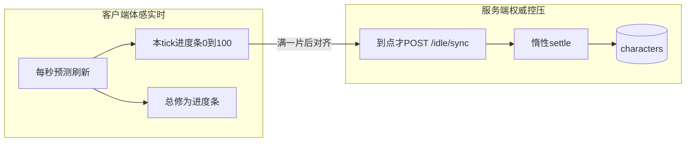

# 修炼双进度条：体感实时 + 控服压力

## 关键澄清（先对齐认知）

**惰性结算不等于「界面卡住不涨」。**  
它只规定：**数据库何时写入**——有请求才按片入账，而不是每分钟全服扫一遍写库。

当前后端已是正确的压力模型；前端也已有「整片预测 + 到点 `/idle/sync`」。缺口主要是 **UI 缺少「这一分钟从 0 长满」的动效条**，所以体感像「惰性、不实时」。

| 做法 | 体感 | 万人压力 | 结论 |
| --- | --- | --- | --- |
| 全服每分钟定时写库 | 真实时入账 | 极差 | 不做 |
| WebSocket 到点推送 | 真推送 | 连接/心跳成本高 | 仍按 [后续待完成.md](d:\ProjectXX\后续待完成.md) **M1-D33 → M6** |
| **客户端 intra-tick 条 + 惰性入账（本方案）** | 实时感强 | 仅在线可见页、每 tick 约 1 次 sync | **采用** |

## 交互目标

修灵中展示两层进度：

1. **本回合修炼（tick 条）**：当前片内从 0% → 100% 平滑增长（默认片长 60s）；满时短暂反馈（闪一下/文案「+N 修为」），然后清零重开下一片。
2. **境界总进度（总条）**：已有 [CharacterPanel.vue](d:\ProjectXX\frontend\src\components\CharacterPanel.vue) 的修为条；满片时数字与总条按预测公式跳变（`+cultivation_per_tick`），到点 `sync` 与权威对齐。

停滞 / 未修灵：tick 条停住并提示（沿用现有 `is_stalled`）。

## 实现要点

### 1. 扩展预测工具

在 [frontend/src/utils/idlePredict.ts](d:\ProjectXX\frontend\src\utils\idlePredict.ts) 的 `IdleDisplaySnapshot` 增加：

- `tick_progress_ratio: number` — 本片内进度 `0~1`，用 `(elapsed % tick_seconds) / tick_seconds`（修灵且未停滞时）
- `seconds_into_tick` / `tick_seconds` — 便于文案「还剩 Xs」

整片收益逻辑保持与后端 `settle_idle` 一致（只按完整 tick 加修为）；**片内条只驱动动画，不提前加总修为**，避免「条还没满数字已涨」。

### 2. IdlePanel 双条 UI

改 [frontend/src/components/IdlePanel.vue](d:\ProjectXX\frontend\src\components\IdlePanel.vue)：

- 修灵中显示「本回合修炼」`el-progress`（绑定 `tick_progress_ratio`，可开 `striped`/`animated`）
- 下方或旁侧显示本片预计收益文案（修为 +X / 灵石 -Y）
- 片满瞬间：用短时本地状态标「刚入账」高亮；权威仍靠 store 已有的 tick 对齐 `sync`
- 去掉或弱化「已满 N 片，待对齐入账」的生硬文案（改为进度条体感）

总修为条可继续放在 CharacterPanel；IdlePanel 只做 tick 条，职责清晰。

### 3. 刷新频率（体感 vs 压力）

- 预测时钟：现有 `VITE_IDLE_PREDICT_MS`（默认 1s）对「每分钟长满」够用；若要更丝滑，默认改为 **250ms**（仅改本地 display，**不增加 HTTP**）
- 权威对表：继续 [character.ts](d:\ProjectXX\frontend\src\stores\character.ts) 的 `next_tick_at` 对齐 + `VITE_IDLE_POLL_MS` 兜底；**禁止**改回固定 5s 全量轮询

### 4. 服务端

**不改结算权威模型**（仍惰性 + `last_settled_at`）。  
可选小改：若响应里已有 `next_tick_at`，无需新字段；文档说明「实时感由客户端片内条负责」。

### 5. 文档同步（项目强制）

- [README.md](d:\ProjectXX\README.md) / [CHANGELOG.md](d:\ProjectXX\CHANGELOG.md)：写明双进度条 + 仍惰性入账的原因  
- [M1核心循环设计.md](d:\ProjectXX\M1核心循环设计.md) §修订：补充「体感实时 ≠ 全服定时写库」  
- [后续待完成.md](d:\ProjectXX\后续待完成.md)：M1-D33 笔记补一句「片内进度条已消化体验诉求，真推送仍 M6」

## 明确不做

- 不为「更实时」上全服 APScheduler / 每分钟写所有角色  
- 本阶段不上 WebSocket/SSE  
- 不把片内小数修为写入 DB（权威仍按整片）

## 验收

- 点「开始修灵」后，tick 条约 60s 内可见增长至满，随后总修为 +配置值、tick 条归零再涨  
- 灵石不足：tick 条停、停滞提示出现  
- 离开大厅/隐藏页：不持续打 sync（沿用现有可见性逻辑）  
- 1000 在线假设：每人约 1 次/分钟 sync（可见且修灵中），而非 1 次/秒 或全服扫表
