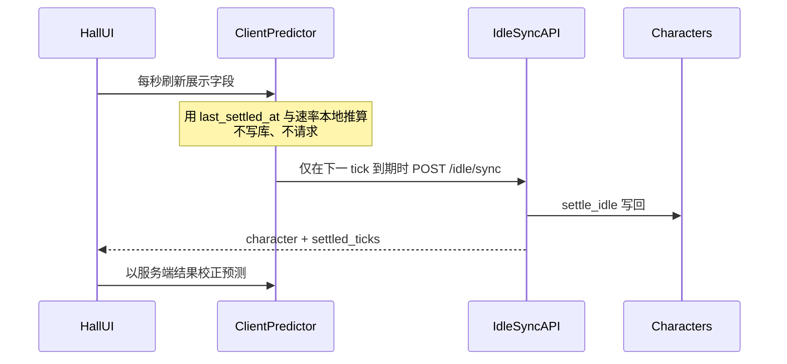

# 修炼实时机制方案（无手动同步）

## 目标

- 修炼区**去掉「同步」按钮**，玩家看到修为/灵石随时间变化，无需点按。
- **权威仍在服务端**（惰性 `settle_idle` 不变）；前端展示可预测，写库只在对齐点或关键动作发生。
- **多用户负载可控**：避免「全员每 5 秒打一次 `/idle/sync`」的打满模式。

## 选定方案：预测展示 + Tick 对齐拉取（不引入 WS/SSE）



**为何不选 WebSocket/SSE（现阶段）**

- [`后续待完成.md`](后续待完成.md) / 开发计划将推送通道放到更后（约 M6）；现网仍是惰性结算，无全局时钟任务。
- 长连接在多用户下是「连接数 × 心跳」固定开销，个人版 SQLite + 单进程 uvicorn 收益差、运维成本高。
- 本方案用现有 `/idle/sync` 即可达到「看起来实时」，改动面小、可回滚。

## 负载模型（写死约定）

| 模式 | 活跃大厅用户 N | 大约 QPS（只计 sync） |
| --- | --- | --- |
| 现状固定 5s 轮询 | N | `N / 5` |
| **Tick 对齐拉取**（默认 tick=60s） | N | `≈ N / 60` |
| 未修炼 / 停滞 / 页不可见 | — | **0**（不拉） |

再叠加：

1. **可见性门闩**：仅 `document.visibilityState === 'visible'` 且路由为 `/hall` 才调度。
2. **状态门闩**：`idle_direction === 'none'` 或 `is_stalled` 时停拉取；有石/恢复修炼后再排下一拍。
3. **单飞**：沿用 `pollingInFlight`，禁止叠请求。
4. **抖动**：对齐时刻加 `0～2s` 随机 jitter，避免整点雷群。
5. **后端轻量**（可选增强）：`POST /idle/sync` 若 `floor(elapsed/tick)==0` 早返回，少写 `updated_at`（仍保持契约字段）。

联调可将 `IDLE_TICK_SECONDS=5`，此时 QPS≈`N/5`，仍优于无脑固定高频轮询。

## 前端行为设计

### 1. 去掉手动同步

- [`IdlePanel.vue`](frontend/src/components/IdlePanel.vue)：删除「同步」按钮与 `onSync`。
- 开始/停止修炼仍调 `setDirection`（会 settle），日志只在有 `settled_ticks` 或方向变更时写入。

### 2. 客户端预测器（实时感来源）

在 [`stores/character.ts`](frontend/src/stores/character.ts)（或新建 `stores/idleRealtime.ts`）维护：

- 权威快照：服务端返回的 `character`（含 `last_settled_at`、`idle_*_per_tick`、`idle_tick_seconds`）。
- 展示字段：`displayCultivation` / `displayStones` / `displayProgress`（面板绑这个，而不是只绑权威整数）。
- 每秒 `requestAnimationFrame`/`setInterval(1000)`：
  - 若未修灵或停滞：展示 = 权威。
  - 若修灵中：按「已完整 tick 数」推算增量（与服务端同一公式：`floor(elapsed/tick)`、买不起则停滞），**只改展示，不改权威 store 里用于开战/突破的字段**——或：展示层覆盖，突破预览仍 watch 权威；对齐 sync 后权威追上。

推荐：**突破/战斗/禁战逻辑只读权威 `character`；角色面板进度条可读展示值**，避免预测值触发无意义的 `/breakthrough/preview` 风暴。突破预览改为在 **权威 sync / 方向切换 / 突破结果** 后刷新即可（轮询预测每秒变时不要打 preview）。

### 3. 调度器替换固定 `setInterval(5000)`

替换 [`startPolling`](frontend/src/stores/character.ts) 为 `startIdleRealtime`：

1. 根据 `last_settled_at + tick_seconds` 算 `nextDueAt`。
2. `setTimeout` 到点（+ jitter）→ `syncNow()` → 用响应重置定时器。
3. `visibilitychange` 回到前台：若已过期立刻 sync，否则重排 timeout。
4. 离开大厅 / logout：清 timer + 停预测时钟。

环境变量：

- 保留 `VITE_IDLE_POLL_MS` 仅作**兜底最大间隔**（例如 120s 强制对表一次，防定时器漂移），默认可改为 `120000` 或不强制。
- 新增可选 `VITE_IDLE_PREDICT_MS=1000`（预测刷新间隔）。

## 后端契约（尽量少改）

- **继续惰性结算**，不引入 APScheduler 全服扫表（那才是多用户灾难）。
- `/idle/sync`、`/idle/direction`、动作前 settle 路径不变。
- 响应可增加只读提示字段（向后兼容），便于前端排程：

```ts
// IdleSyncData 增量建议
next_tick_at: string  // ISO UTC：下一片理论到期；停滞/未修炼可为 null
```

由服务端用 `last_settled_at + tick` 计算，避免前后端各算一套时钟。

- 错误码与禁战规则不变。

## 多用户安全边界（明确不做）

| 不做 | 原因 |
| --- | --- |
| 服务端每秒全表 settle | 写放大 |
| 大厅 WebSocket 推送修为 | 排期与连接成本；记入后续待完成即可 |
| 多端同时修炼强一致实时 | 个人版串行事务足够；以最后 settle 为准 |
| 预测值直接用于突破判定 | 必须服务端权威 |

## 实现落点（确认后编码）

1. 后端：`settle_result_to_payload` / `CharacterPublic` 增加 `next_tick_at`（或仅 idle 响应带）。
2. 前端：删同步按钮；预测器 + tick 对齐调度；角色面板绑展示值；突破预览勿跟预测每秒刷。
3. 文档：`README` / `CHANGELOG` / 可选一小段写入 `M1核心循环设计.md` 修订；`后续待完成.md` 可补一条「真 WS 修炼推送 → M6」。
4. 测试：后端 `next_tick_at` 单测；前端以逻辑单测或手工验收清单（开始修炼后约 1 个 tick 内数字跳动且无手动同步）。

## 验收标准

- 修炼区无「同步」按钮，修灵中修为/灵石展示持续变化。
- 网络面板：修灵中大约每 `tick_seconds` 才有一次 `/idle/sync`（可见页）；切后台停止；停止修炼后不再拉。
- 刷新/重进大厅后数字与库一致（预测被权威校正）。
- 修炼中仍不可开战；突破仍以服务端为准。
