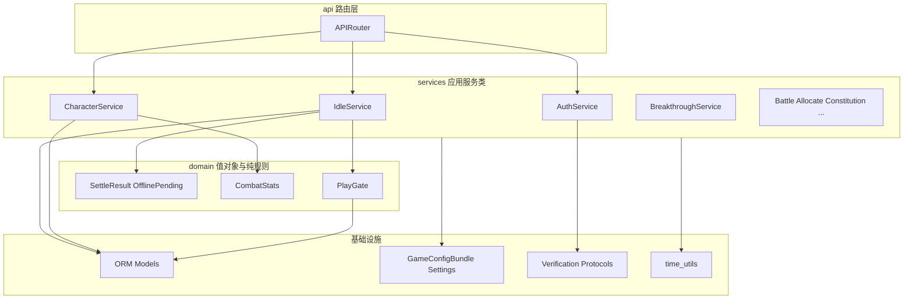

# 后端面向对象抽象方案

## 现状结论

当前后端是 **分层清晰的过程式架构**：[`api/`](backend/app/api) 薄、[`services/`](backend/app/services) 胖、[`db/models/`](backend/app/db/models) 纯数据。已有 OOP 雏形仅限于：

- ORM / Pydantic / `Settings`
- [`realm_config.py`](backend/app/services/realm_config.py) 中的 frozen dataclass 配置
- [`SettleResult`](backend/app/services/idle_service.py) 等少量值对象

业务主体是模块级函数（`settle_idle`、`register_user`、`attempt_breakthrough`…），跨文件靠 lazy import，时间/角色加载等工具多处拷贝。

**本方案定位**：应用层 OOP（Application Service + Value Object + Protocol），**不做**完整 DDD 聚合根，**暂不引入** Repository / Unit of Work（单库 SQLite + 现有测试已够用）。行为不塞进 SQLAlchemy Model，避免 ORM 与规则强耦合。

---

## 目标分层



| 层 | 职责 | 形态 |
| --- | --- | --- |
| `api/` | HTTP、依赖注入、调用服务 | 保持薄；通过 `Depends` 拿到 Service 实例 |
| `services/` | 用例编排、事务内写库、组装响应 | **类**：`__init__(self, session: AsyncSession)` |
| `domain/`（新建，轻量） | 无 IO 的纯规则与值对象 | dataclass / 纯函数模块 |
| `db/models/` | 持久化形状 | 保持数据类，不加玩法方法 |
| `core/` | 配置、安全、时间工具、deps | 公共工具上收 |

---

## 核心抽象约定

### 1. Application Service 类模板

每个业务域一个类，方法对应现有公开函数；`session` 由构造注入，便于测试与阅读依赖：

```python
class IdleService:
    """挂机权威结算与离线 pending 用例。"""

    def __init__(self, session: AsyncSession) -> None:
        self._session = session

    def settle(self, character: Character, *, now: datetime | None = None) -> SettleResult:
        ...

    async def resolve_pending_before_play(self, character: Character) -> Character:
        ...

    async def set_direction(self, user: User, direction: str) -> dict:
        ...
```

FastAPI 装配示例（[`deps.py`](backend/app/core/deps.py) 增补）：

```python
async def get_idle_service(session: AsyncSession = Depends(get_db)) -> IdleService:
    return IdleService(session)
```

路由只做：`service = Depends(get_idle_service)` → `await service.sync(...)`。

### 2. 值对象 / 纯规则进 `domain/`

从大文件中抽出「无 DB、可单测」的计算：

| 值对象 / 模块 | 来源 | 职责 |
| --- | --- | --- |
| `SettleResult` | `idle_service` | 已有，迁入 `domain/idle.py` |
| `OfflinePending` | `parse_offline_pending` / `_build_pending_payload` | 解析、校验、序列化 pending JSON |
| `IdleGainCalculator` | `_compute_settle_gains` / `_apply_gains_to_character` | 按方向与 tick 算收益 |
| `CombatStats` / `CombatCalculator` | `build_combat_stats` | 品阶×功法×体质战力公式 |
| `BreakthroughPreview` | `preview_breakthrough_for_character` | 预览结果结构 |
| `PlayGate` | `resolve_pending_before_play` + `require_character_for_user` | 跨玩法前置：有角色、清 pending |

`PlayGate` 单独成类的原因：battle / breakthrough / allocate / constitution / gm 都依赖同一前置链，目前散落在 [`idle_service`](backend/app/services/idle_service.py) 与部分路由。

### 3. Verification 真正接口化

现状是 [`verification/__init__.py`](backend/app/services/verification/__init__.py) 的 dict 工厂 + 同名函数。改为：

```python
class SmsProvider(Protocol):
    async def send_code(self, phone: str, code: str) -> None: ...

class EmailProvider(Protocol):
    async def send_code(self, email: str, code: str) -> None: ...

class IdentityProvider(Protocol):
    async def verify(self, *, real_name: str, id_card: str) -> None: ...
```

`VerificationService(session, sms: SmsProvider, email: EmailProvider, identity: IdentityProvider)` 编排发码 / 确认 / ticket；厂商实现类保留 stub，但统一签名。

### 4. 公共工具上收（消灭拷贝）

新建 [`backend/app/core/time_utils.py`](backend/app/core/time_utils.py)：

- `ensure_aware_utc` / `now_utc` / `to_utc_iso`

替换 `auth_service`、`character_service`、`idle_service`、`battle_service`、`breakthrough_service`、`verification/service` 中的重复实现。

### 5. 配置与迁移边界

- [`realm_config.py`](backend/app/services/realm_config.py)：保持「配置加载器 + frozen dataclass」，可改名为 `GameConfigLoader` 类，但 **不与玩法服务合并**。
- [`main.py`](backend/app/main.py) 中的 SQLite `ALTER` / `schema_migrations` 抽到 `app/db/bootstrap.py`（或 `migrations_runtime.py`），`main` 只负责 lifespan 调用。

### 6. 明确不做（本轮）

- 不在 `Character` ORM 上加 `settle()` / `breakthrough()` 领域方法
- 不引入 Repository 抽象层
- 不强制所有接口立刻改 `response_model`（可后续增量）
- 不改前端、不改 API 路径与业务码语义

---

## 目标目录结构（增量）

```
backend/app/
├── api/                    # 不变职责，改为 Depends(Service)
├── core/
│   ├── time_utils.py       # 新建
│   └── deps.py             # 增补 get_*_service
├── domain/                 # 新建：纯规则 + VO
│   ├── idle.py
│   ├── combat.py
│   ├── breakthrough.py
│   └── play_gate.py        # 或放 services，若需 session 则作服务类
├── services/
│   ├── idle_service.py     # IdleService 类
│   ├── character_service.py
│   ├── auth_service.py
│   ├── breakthrough_service.py
│   ├── ...
│   └── verification/
│       ├── protocols.py    # 新建 Protocol
│       ├── service.py      # VerificationService 类
│       └── providers/      # 实现 Protocol 的类
├── db/
│   ├── bootstrap.py        # 从 main 迁出
│   └── models/             # 不变
└── schemas/                # 不变（HTTP DTO）
```

兼容策略：重构初期可在模块底部保留 **薄包装函数**（调用默认 Service），让旧测试逐步迁移，避免一次改爆所有 import。

---

## 类职责清单（按域）

| 类 | 主要方法 | 从何处收拢 |
| --- | --- | --- |
| `IdleService` | `settle`, `set_direction`, `sync`, `preview_offline`, `claim_offline`, `ensure_offline_pending` | [`idle_service.py`](backend/app/services/idle_service.py) ~571 行 |
| `PlayGate` / `CharacterAccess` | `require_character`, `resolve_pending_before_play` | idle 中跨域函数 + 路由重复编排 |
| `CharacterService` | `create`, `get_mine`, `to_public`, `build_combat_stats` | [`character_service.py`](backend/app/services/character_service.py) |
| `AuthService` | `register`, `login`, `refresh`, `profile` | [`auth_service.py`](backend/app/services/auth_service.py) |
| `VerificationService` | `send_sms/email`, `confirm_*`, `submit_id`, `assert_register_tickets` | [`verification/service.py`](backend/app/services/verification/service.py) |
| `BreakthroughService` | `preview`, `attempt`, `list_grade_history` | [`breakthrough_service.py`](backend/app/services/breakthrough_service.py) |
| `GradeService` | `roll`, `write_history`, `aggregate_constitution_bonuses` | [`grade_service.py`](backend/app/services/grade_service.py) |
| `BattleService` | `start_pve` | [`battle_service.py`](backend/app/services/battle_service.py) |
| `AllocateService` | `allocate` | [`allocate_service.py`](backend/app/services/allocate_service.py) |
| `TechniqueService` | `ensure_defaults`, `list_mine`, `combat_bonuses` | [`technique_service.py`](backend/app/services/technique_service.py) |
| `ConstitutionService` | `equip/unequip/upgrade/fuse`, `get_state` | [`constitution_service.py`](backend/app/services/constitution_service.py) |
| `GmService` | `assert_allowed`, `set_character` | [`gm_service.py`](backend/app/services/gm_service.py) |
| `GameConfigLoader` | `load`, `get`, `clear_cache` | [`realm_config.py`](backend/app/services/realm_config.py)（可选改名） |

依赖方向硬约束：`api → services → domain/core/db`；`domain` **禁止** import `services` / `api`。

---

## 分阶段落地（降低风险）

### Phase 0 — 基础设施（低风险）

1. 抽出 `core/time_utils.py`，替换各处拷贝
2. 迁出 `main.py` 启动迁移到 `db/bootstrap.py`
3. 补 `deps.get_*_service` 骨架（可先只接 1～2 个服务）

### Phase 1 — Idle + PlayGate（最高收益）

1. `domain/idle.py`：`SettleResult`、`OfflinePending`、收益计算纯函数
2. `IdleService` 类化；`PlayGate` 承接 `require_character_for_user` / `resolve_pending_before_play`
3. battle / breakthrough / allocate / constitution / gm 改为依赖 `PlayGate`，去掉路由层重复编排
4. 跑通现有 `test_idle_*` / `test_offline_*`

### Phase 2 — Character + Combat

1. `domain/combat.py` 收拢战力公式
2. `CharacterService` 类化；打破与 idle/constitution 的循环 import（通过构造注入或接口回调）
3. 跑通 `test_character` / 战力相关断言

### Phase 3 — Auth + Verification

1. Provider Protocol + 实现类
2. `AuthService` / `VerificationService` 类化
3. 跑通 `test_verification_auth` / `test_id_format`

### Phase 4 — 玩法剩余域

Breakthrough / Grade / Battle / Allocate / Technique / Constitution / GM 按同一模板类化；单文件控制在约 200～300 行可读体量。

### Phase 5 — 收尾

1. 删除兼容包装函数（若测试与路由已全切）
2. 更新 [`README.md`](README.md) / [`CHANGELOG.md`](CHANGELOG.md)：新目录约定、Service 注入方式、开发者如何加新玩法服务
3. 全量 pytest

---

## 验收标准

- API 路径、请求体、业务错误码 **行为不变**（回归测试全绿）
- 每个玩法域有明确入口类；公开用例方法可从类上读出完整故事
- 无 DB 的规则可在 `domain/` 内单测
- 跨玩法前置只经 `PlayGate` 一处
- 时间工具仅一处实现
- 文档与代码同步

---

## 风险与纪律

- **行为不变优先**：先搬迁再整理命名，禁止顺手改数值/规则
- **循环依赖**：Character 面板组装依赖 idle/constitution 时，用服务协作或把纯计算下沉 `domain`，禁止模块级互相 import 公开服务函数
- **测试迁移**：优先改测试构造为 `IdleService(session)`，再删函数别名
- **单 PR/阶段可合并**：每 Phase 独立可测，避免一次「全仓改类」无法 bisect
