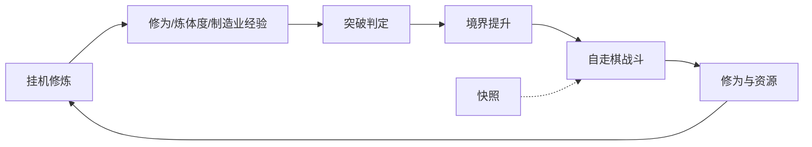
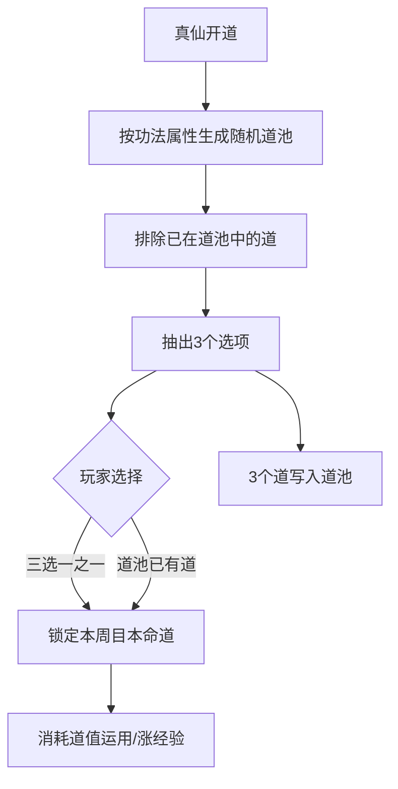

# Project修仙 — 游戏设计文档（GDD）

> 版本：v4.1
> 最后更新：2026-08-06
> 状态：**玩法框架定稿**（剧情细案与数值公式明确不设计；§3.3 雷劫范围 2026-08-06 修订为仅跨境）

---

## 目录

> 下列目录为当前已确认的设计大纲。正文按此结构展开。  
> **本文档不设计**：剧情章回/对白、世界观编年与地图细表、具体数值公式与概率表。

### 第一部分 · 项目总览

1. 项目概述
   1. 基本信息
   2. 核心设计理念
   3. 核心循环

### 第二部分 · 角色成长

2. 境界体系
   1. 境界总览（锻体/炼气：1–9 层+大圆满；其余：初/中/后/大圆满）
   2. 下境界（锻体 ~ 化神）
   3. 中境界（炼虚 ~ 大乘）
   4. 上境界（真仙 ~ 大罗）
   5. 道主境（身份）
   6. 轮回境（外环状态）
   7. 境界时间规划（对齐六时历法）

3. 突破系统
   1. 突破分类（层/期进阶、跨大境界；无大阶段特殊机制）
   2. 突破品阶（劣质 ~ 天道；仅跨境结算）
   3. 雷劫（自元婴→化神起，此后每次**跨大境界**必经；小境界进阶无雷劫）

4. 体质系统
   1. 主词条 / 副词条与品质、品级升品
   2. 体质格子
   3. 融合
   4. 格子扩充
   5. 轮回境（体质视角）

5. 轮回系统
   1. 触发（主动 / 待引渡自选 / 强制）
   2. 陨落、引渡与自选轮回
   3. 保留规则
   4. 核心收益（成长属性 / 传承道具 / 轮回点）
   5. 轮回后状态（剧情从 0、已历可跳、贡献归零等流程规则）

### 第三部分 · 大道与道主

6. 大道系统
   1. 开启条件（真仙境）
   2. 开道与道池（随机池 → 三选一 → 道池跨轮回累积）
   3. 道值、道经验与运用（战斗 / 制造业）
   4. 分类总览（37 条道 · 名录不在本文展开）
   5. 稀有度与功法权重（全体真仙可进池）
   6. 各类道定位摘要（基础/特殊/无本源/武技/奇技/法则/炼体）
   7. 上位道克制
   8. 道主（首位 / 挑战制；挑战者实时淘汰制，道主快照；离线不空悬）
   9. 道主特权（天道技能 / 定时秘境）
   10. 道主与轮回

### 第四部分 · 战斗与快照

7. 自走棋战斗
   1. 模式概述
   2. 棋子（本体 / 灵宠 / 傀儡 / 化身）
   3. 棋盘（共用 7×7；初始己方中央 3×3）
   4. 布阵与策略预设
   5. 战斗流程
   6. 阵法（属性 / 非常规占位 / 强制移位）
   7. 天气与时辰锁定
   8. 结果与奖励（PVE 修为；陨落→引渡/轮回）

8. 快照系统
   1. 定义
   2. 更新（手动 1 小时冷却；每日定点 3–4 次）
   3. 用途（PVP 防守 / 道主应战 / 世界事件）

### 第五部分 · 挂机、化身与生产

9. 挂机系统
   1. 本体三选一（修灵 / 炼体 / 制造业）
   2. 化身并行挂机
   3. 灵石消耗
   4. 离线规则（免费 12h；会员可至 18h / 24h）

10. 化身系统
    1. 金丹凝练
    2. 功能（修炼 / 上阵 / 独立宗门任务）
    3. 初始（50% 属性 + 同修为；材料功法修正）
    4. 与本体关系（修为可互传；炼体度与制造业经验不可传）
    5. 神识约束与反噬

11. 灵宠与御兽
    1. 持有与上阵
    2. 神识衰减
    3. 用途（战斗 / 生活 / 修炼）
    4. 获取
    5. 培养与进化

12. 生活技能（制造业）
    1. 手动启动 → 挂机执行
    2. 炼丹 / 炼器 / 制符 / 阵法 / 傀儡
    3. 与大道道值运用联动

### 第六部分 · 宗门与社交

13. 宗门系统
    1. 散修可选；入宗收益显著更高
    2. NPC 宗门（全程可留，休闲归宿）
    3. 自建宗门（有钱即可；祖师修为锁传承与功能；宗主可≠祖师）
    4. 化身独立做宗门任务
    5. 资源日结、盟、友好度、对外商铺
    6. 功能摘要

14. 社交系统
    1. 道友
    2. 交易行与拍卖行（含以物易物手续费）
    3. 搭救（同图道友；宗门地图魂灯与高修同门）
    4. 弱交互主流程 + 可选强交互（道主挑战 / 秘境 / 世界 Boss）

### 第七部分 · 环境

17. 历法（游戏时间）
    1. 一日六时：清晨 / 正午 / 晌午 / 傍晚 / 半夜 / 深夜（每时现实 1 分钟）
    2. 影响：功法修炼、灵兽怪物出没、突破概率

18. 天气
    1. 类型：晴 / 阴 / 雨 / 飓风 / 暴雨 / 雷暴
    2. 影响：渡劫、出没、修为、突破、炼丹炼器傀儡制符、功法强度、灵根、阵法

### 第八部分 · 经济与商业化

19. 货币（灵石 / 宗门贡献 / 盟贡献 / 荣誉 / 轮回点 / 天道点）

20. 经济平衡（产出消耗、抗通胀、会员边界）

21. 商业化
    1. 打赏 → 天道点
    2. 会员（修为与基础成功率）
    3. 特殊道具 / 丹药 / 功能解锁（含挂机时长 12h → 18h / 24h）
    4. 免费与付费边界

### 第九部分 · 技术提纲（非数值）

22. 技术架构提纲（服务端权威、快照、离线切片结算等）

### 明确不设计（本文档范围外）

| 编号占位 | 类别 | 说明 |
| --- | --- | --- |
| （原15–16） | 剧情 / 世界观细案 | 章回对白、地图势力编年等不写；仅正文保留已锁定的流程句 |
| （原23） | 数值公式 | 曲线、概率、系数矩阵不定参 |
| 附录 A–D | 名录长表 | 术语全表、37 道细表、体质词条全表、神通全表另档或不写 |

### 附录

- 附录 E · 版本更新记录

---

# 正文

> **定稿范围（v4.0）**：目录第一部分～第九部分（§1–§14、§17–§22）。  
> **不设计**：剧情/世界观细案、数值公式、附录名录长表。

---

## 1. 项目概述

### 1.1 基本信息

| 项 | 说明 |
| --- | --- |
| 项目暂定名 | Project修仙 |
| 品类 | 偏挂机的修仙题材自走棋（主流程弱社交；可选强交互活动加速资源） |
| 技术形态 | 优先服务端权威逻辑 + 轻客户端；战斗/挂机/突破均以服务端结算为准 |
| 目标受众 | 喜欢长线养成、可离线收益、短时在线决策的修仙/放置玩家 |
| 会话节奏 | 单次在线 10–30 分钟可完成「换挂机方向 / 突破尝试 / 打一场验证战 / 调阵」 |

### 1.2 核心设计理念

1. **长线境界成长**：玩家身份与内容解锁以境界为轴；中后期通过大道、道主、轮回拉长寿命，而非常规等级膨胀。
2. **挂机为主操作**：日常主操作是选择挂机方向并保证灵石供给；精细玩法（布阵、突破时机、制造业配方）集中在短时在线窗口。
3. **自走棋战力验证**：养成结果必须通过自动战斗验证；日常 PVP 防守靠快照；道主挑战等为可选实时强交互（§14.4）。

### 1.3 核心循环

**日活主路径**

1. 选择本体挂机方向（修灵 / 炼体 / 制造业 三选一），金丹后可并行安排化身独立修炼。
2. 将修为/炼体度投入境界或功法升级（玩家自选）；条件满足时发起突破（见 §3）。
3. 用当前阵容打 PVE / 防守相关挑战；常规 PVE 奖励含修为（见 §7.8）。
4. 资源回流挂机；按冷却或每日定点更新防守快照（见 §8）。

**单日体验切片（目标）**

| 在线时长 | 可完成事项 |
| --- | --- |
| ~10 分钟 | 领取离线收益、切换挂机、分配修为/功法、打 1 场日常战 |
| ~20 分钟 | 上述 + 调整 7×7 布阵、尝试进阶/雷劫准备 |
| ~30 分钟 | 上述 + 化身修炼安排、手动更新快照、短支线/宗门简任 |

**与核心循环的关系**：§1 定义全局闭环；后续各章只解释环上某一节点的规则，不得另起平行主循环。

**待定项**：客户端平台优先级（移动端优先 vs 双端同步）、具体美术风格档位 — `TBD`。

---

## 2. 境界体系

### 2.0 设计目标

用清晰的大境界阶梯驱动内容解锁与节奏，使「挂机 → 突破 → 战力提升」始终有下一座山峰；前期用细分层教学，筑基起改用「四期」结构加快可读性。

### 2.1 境界总览

**层/期划分约定（写死）**

| 大境界 | 内部划分 |
| --- | --- |
| **锻体、炼气** | **一至九层**，之后为 **大圆满**（共 10 档） |
| **筑基及之后所有大境界**（含金丹、元婴、化神、炼虚…大罗等） | **初期 → 中期 → 后期 → 大圆满**（共 4 档） |

- **层/期内晋升**：如锻体三层→四层，或金丹初期→中期，统称「层/期进阶」。
- **跨大境界进阶**：如炼气大圆满→筑基初期，或化神大圆满→炼虚初期；**无额外特殊机制**，规则与普通进阶同一套流程，仅消耗/难度与是否雷劫按 §3 区分。

| 阶段 | 大境界序列 | 设计意图（摘要） |
| --- | --- | --- |
| 下境界 | 锻体 → 炼气 → 筑基 → 金丹 → 元婴 → 化神 | 教学与主线密集；金丹解锁化身；化神收束前期叙事 |
| 中境界 | 炼虚 → 合体 → 大乘 | 宗门/秘境、战力分化加大 |
| 上境界 | 真仙 → 金仙 → 太乙 → 大罗 | **真仙开道**；法则与道主争夺 |
| 道主境 | 道主（与「某条大道之主」绑定） | 服内战力与特权顶点之一；可被挑战更替 |
| 轮回境 | 轮回（特殊阶段，非单纯战力台阶） | 长线重置与永久成长；亦承接战斗陨落后的强制去向（§5 / §7.8） |

**内容解锁钩子（与大纲对齐）**

| 节点 | 解锁/变化 |
| --- | --- |
| 金丹 | 化身凝练（§10） |
| 化神前（锻体~化神） | 主线剧情密（对应 §15.2） |
| 元婴→化神 | **雷劫开启点**（此后每次**跨大境界**均有雷劫；小境界进阶无雷劫，见 §3.3） |
| 炼虚起 | 中境界内容与宗门/秘境加深 |
| **真仙** | **大道系统开启**（§6）；开道三选一与道池 |
| 合体~大罗 | 主线变短、侧重世界事件与道主（对应 §15.3） |

### 2.2 下境界（锻体 ~ 化神）

| 大境界 | 内部档位 | 定位 | 典型解锁（框架） |
| --- | --- | --- | --- |
| 锻体 | 1–9 层 + 大圆满 | 入门，理解挂机与属性 | 基础挂机、教学战斗 |
| 炼气 | 1–9 层 + 大圆满 | 建立「修灵」主收益感 | 灵石日常、简易灵宠位 |
| 筑基 | 初/中/后/大圆满 | 第一次真正的「卡住感」 | 品阶初体验；四期结构适应 |
| 金丹 | 初/中/后/大圆满 | 双线程开始 | **化身凝练** |
| 元婴 | 初/中/后/大圆满 | 阵容与神识压力上升 | 傀儡/更多灵宠位（§11 `TBD`） |
| 化神 | 初/中/后/大圆满 | 下境界毕业；雷劫常态化后的首个大境界 | 主线阶段性收束 |

### 2.3 中境界（炼虚 ~ 大乘）

| 大境界 | 内部档位 | 定位 | 典型解锁（框架） |
| --- | --- | --- | --- |
| 炼虚 | 初/中/后/大圆满 | 虚空/法则入门 | 秘境与宗门深度 |
| 合体 | 初/中/后/大圆满 | 战力与身份社会化 | 宗门深度、弱交互（§13–14） |
| 大乘 | 初/中/后/大圆满 | 中境界顶点 | 为入仙做资源与品阶准备 |

### 2.4 上境界（真仙 ~ 大罗）

| 大境界 | 内部档位 | 定位 | 典型解锁（框架） |
| --- | --- | --- | --- |
| 真仙 | 初/中/后/大圆满 | 仙道门槛；**开道** | 大道三选一（§6） |
| 金仙 | 初/中/后/大圆满 | 长线战力平台 | 道主挑战资格门槛 `TBD` |
| 太乙 | 初/中/后/大圆满 | 服内顶尖梯队 | 世界事件快照权重提高 |
| 大罗 | 初/中/后/大圆满 | 上境界顶点 | 通向道主/轮回的分叉 |

### 2.5 道主境

- **定义**：玩家成为某条「大道」的现任道主后进入的身份境界（可与修为境界并行展示）。
- **产生**：首位达成 / 快照挑战更替；长期离线不空悬（§6.14–6.16）。
- **与战斗**：道主挑战使用防守快照（§8）。
- **特权**：天道技能、域外秘境（§6.15）。

### 2.6 轮回境

- **定义**：主动或强制进入的长线重置 **外环状态**（非靠修为修上去的常规大境界）；细则见 **§4.5（体质视角）** 与 **§5（流程与保留）**。
- **与核心循环**：日常仍回到挂机→突破→战斗；轮回结算永久成长与扩格。
- **强制入口**：PVE 陨落进入待引渡；超时未引渡或自选轮回（§5 / §7.8）。

### 2.7 境界时间规划

**游戏时间（与 §17 对齐）**

- 历法核心为 **一日六时**，每时辰现实 **1 分钟**，完整游戏日 = **6 现实分钟**。
- 境界停留仍以「现实日/周」体验量级规划（下表）；活动排期同时标现实钟点与当前时辰。

**各阶段预期停留量级（框架，非最终数值）**

| 阶段 | 预期现实停留 | 设计说明 |
| --- | --- | --- |
| 锻体~炼气 | 数日级 | 九层结构完成教学 |
| 筑基~金丹 | 约 1–2 周级 | 适应四期；金丹开化身 |
| 元婴~化神 | 1–3 周级 | 雷劫开始，节奏变慎 |
| 炼虚~大乘 | 数周~月级 | 宗门与社交弱交互展开 |
| 真仙~大罗 | 月级+ | 开道、道池累积与道主争夺 |
| 道主/轮回 | 赛季或长线周期 | 与版本运营节奏绑定 `TBD` |

### 与核心循环的关系

- **输入**：挂机产出的修为/炼体度、突破材料与灵石。
- **输出**：新系统解锁、战斗属性上限、剧情与地图权限。

### 待定项

- 各大境界基础属性成长曲线 — 见 §23.2，`TBD`
- 道主是否占用「大境界」槽位还是纯身份标签 — 倾向「身份并行」，最终 `TBD`

---

## 3. 突破系统

### 3.0 设计目标

把「变强」收束为可预期的节点决策：何时进阶、资源如何保底、雷劫从何处开始常态化；品阶制造同境界永久差异。跨下/中/上阶段（如化神→炼虚）**不设特殊机制**。

**检定骰**：突破成功判定走修为区间骰（境界查表上下限 × 功法/体修/气运等修正），见 [`骰子系统设计.md`](./骰子系统设计.md)。

### 3.1 突破分类（层/期进阶 / 跨大境界进阶）

| 类型 | 触发条件（框架） | 成功效果 | 失败代价（框架） |
| --- | --- | --- | --- |
| 层进阶（仅锻体/炼气） | 当前层修为达标 + 基础资源 | 层数 +1；九层后再进为大圆满 | 修为回退一部分 |
| 期进阶（筑基及以后） | 当前期修为达标 + 资源 | 初期→中期→后期→大圆满 | 修为/材料损失；可能轻伤 |
| 跨大境界进阶 | 当前大境界大圆满 + 突破材料 | 进入下一境对应起点（锻体/炼气为「一层」，其余为「初期」）；可结算品阶 | 同失败框架；**无额外特殊惩罚表** |

说明：化神大圆满→炼虚初期与金丹大圆满→元婴初期等，走同一套跨大境界流程，仅数值与是否已进入雷劫段不同。

**互斥规则**

- 进阶读条/渡劫期间：**不可**进入战斗；本体挂机 **暂停**。
- 化身可继续修炼，但本体渡劫时化身不可上阵（见 §7）。

### 3.2 突破品阶系统（劣质 ~ 天道）

仅 **跨大境界进阶** 结算品阶；层/期内晋升不结算品阶。

| 品阶（低→高） | 效果类型（框架） | 神通位 |
| --- | --- | --- |
| 劣质 | 属性惩罚或无加成 | 无 |
| 凡品 | 基础属性小幅加成 | 无 |
| 良品 | 基础属性加成 | 可解锁低阶神通槽 `TBD` |
| 上品 | 较高属性加成 | 常规神通 |
| 极品 | 高属性 + 特殊词条倾向 | 较强神通 |
| 仙品 | 显著加成 | 高阶神通 |
| 天道 | 顶格加成 + 稀有表现 | 天道级神通（附录 D 待写） |

**规则要点**

- 品阶在跨境成功瞬间判定；受材料、体质、天气/时辰、付费道具等影响（§23.3 `TBD`）。
- 品阶为**永久记录**（轮回继承与转化见 §5.3）。
- 神通列表 → 附录 D。

### 3.3 雷劫系统

| 项 | 规则（框架） |
| --- | --- |
| 开启点 | **元婴 → 化神**（元婴大圆满跨入化神初期）为第一次雷劫 |
| 此后规则 | **每一次跨大境界进阶**均触发雷劫（如化神大圆满→炼虚初期及之后各境跨境） |
| 小境界 | 同大境内的层/期进阶（如化神初→中→后→大圆满）**无雷劫**，走普通突破流程 |
| 开启前 | 锻体、炼气、筑基、金丹、元婴（含其内部进阶与跨入元婴）**无雷劫** |
| 形式 | 独立渡劫流程（多波自动战或阶段性检定）；不占用常规 PVP |
| 与品阶 | 若本次进阶结算品阶，渡劫表现可影响品阶权重（公式 `TBD`） |
| 失败 | 进阶失败并惩罚；极端失败可对接陨落/轮回（§5 / §7.8） |
| 互斥 | 渡劫中不可战斗、不可改本体挂机方向、不可手动更新快照 |

### 与核心循环的关系

- **输入**：挂机堆满的修为、材料、阵容强度（影响渡劫）。
- **输出**：新境界档位、品阶（跨境时）、神通；失败则短时减速循环。

### 待定项

- 品阶概率表、雷劫波次数值、护劫道具 — `TBD`（§23.3）

---

## 4. 体质系统

### 4.0 设计目标

用「体质本体 + 主/副词条」承载长线身体资质与战斗倾向；**品质只影响基础属性**，词条提供属性加成或特殊效果并可升品；通过融合与轮回扩格沉淀多周目差异，并与炼体挂机、突破品阶联动。

### 4.1 体质结构（主词条 / 副词条与品质）

每位角色可装备/激活有限个体质；每条体质由 **基础属性（受品质约束）** + **词条（主词条 / 副词条）** 构成。完整词条与体质名录见附录 C。

#### 4.1.1 主词条与副词条

| 类别 | 作用 | 内容形态 |
| --- | --- | --- |
| **主词条** | 体质的核心倾向；同体同时激活数量少、权重大 | 可以是 **属性加成**，也可以是 **特殊效果**（如渡劫抗性、某系伤害转化、挂机修正等） |
| **副词条** | 细调与补强；数量更多，受格子上限约束 | 同上，可为属性加成或特殊效果 |

词条 ≠ 「属性」本身：属性加成只是词条的一种效果类型。

#### 4.1.2 品质与品级（体质与词条共用规则）

| 对象 | 规则 |
| --- | --- |
| **体质品质** | 同种体质可有不同品质；**品质只影响该体质的基础属性**（如体魄、防御基底等），不直接改写词条内容 |
| **词条品级** | 主词条、副词条均有品级；品级影响该词条数值强度或特殊效果幅度 |
| **升品** | 低品级词条可消耗指定材料 **升品**；体质本体亦可按同规则升品（升的是品质 → 只抬基础属性） |
| **材料** | 升品材料分体质升品与词条升品两类（可部分通用，`TBD`） |

**规则要点**

- 炼体挂机的 **炼体度** 用于强化炼体功法及体质相关成长效率（§9），不直接随机刷出新主词条。
- 突破品阶判定可读取体质基础属性与主词条匹配度（§3.2）。

### 4.2 体质格子系统

| 项 | 框架约定 |
| --- | --- |
| 格子类型 | **主词条格**（少而贵）与 **副词条格**（较多） |
| 初始数量 | 开局：主词条格 **1**、副词条格 **2** |
| 镶嵌物 | 体质词条载体（命名 `TBD`）；主/副格不可混装 |
| 卸下 | 允许，有冷却或损耗（`TBD`） |
| 冲突 | 同名副词条不可重复；互斥标签不可同亮（附录 C） |

无空格则无法再镶嵌，只能融合压缩、卸下或扩格。

### 4.3 融合机制

| 规则 | 说明 |
| --- | --- |
| 材料 | 2–3 枚词条/体质素材 + 融合媒介 |
| 结果 | 生成更高品级词条、新特殊效果词条，或用于体质品质相关的素材压缩；失败风险 `TBD` |
| 与格子 | 多合一可释放格子 |
| 锁定 | 可消耗资源锁定目标词条方向（付费点见 §21） |
| 与升品 | 融合偏「横变/出新」；升品偏「纵升同条」——两条线并存 |

### 4.4 格子扩充规则

| 扩格来源 | 说明 |
| --- | --- |
| 境界节点 | 部分大圆满/跨境赠送副词条格（表 `TBD`） |
| 炼体成就 | 炼体功法达标解锁主/副格 |
| **轮回奖励** | 永久 + 主或副词条格（§5.4） |
| 特殊事件 | 世界事件 / 道主特权偶发扩格 |

主词条格增速必须显著慢于副词条格。

### 4.5 轮回境定义（体质视角）

- **轮回境** = 进入轮回流程后的外环状态：大境界进度结算/重置，但 **已镶嵌体质与词条、轮回成长属性** 作为「真灵记忆」保留。
- 轮回落地前不可进行常规冲榜型跨境玩法（§5.5）。
- 与道主：入轮回则卸下道主身份（§6.14）。

### 与核心循环的关系

- **输入**：炼体度、升品/融合材料、轮回扩格。
- **输出**：基础属性（品质）、词条效果、突破权重、化身凝练修正。

### 待定项

- 体质与词条完整列表、互斥表 — 附录 C
- 品质/品级阶梯与升品消耗 — §23
- 各境界赠格表 — `TBD`

---

## 5. 轮回系统

### 5.0 设计目标

把「陨落风险」与「长线重置」收束为可理解的外环：主动轮回用于规划性多周目；待引渡期可自选提前入轮回；超时未引渡则强制轮回；保留规则保证越轮回越强并打掉通胀战力。

### 5.1 触发方式（主动 / 强制 / 待引渡自选）

| 类型 | 触发条件 | 说明 |
| --- | --- | --- |
| **主动轮回** | 安全区轮回祭坛确认并支付代价 | 可预览保留清单与收益 |
| **待引渡自选轮回** | 处于 **待引渡** 状态时，玩家可 **直接选择进入轮回** | 不等待倒计时结束；结算倾向接近强制表或折中表（`TBD`，本批：按强制轮回结算） |
| **强制轮回** | 引渡倒计时结束仍未获引渡 | 不可取消 |

雷劫惨败若判定陨落，进入待引渡，之后三条路径：引渡复活 / 自选轮回 / 超时强制轮回。

### 5.2 死亡与复活机制

| 状态 | 规则 |
| --- | --- |
| **战败** | 未陨落：仅失败结算，角色存活 |
| **陨落** | 进入 **待引渡** |
| **待引渡期间** | ① 等待道友/宗门/道具 **引渡**；② **主动选择进入轮回**；③ 超时未引渡 → 强制轮回 |
| **引渡成功** | 复活并保留当前周目（短惩罚 `TBD`） |
| **化身** | 化身战败 ≠ 角色陨落（§10.4） |

引渡时限与次数细则见 **§14.3**；窗口内可自选轮回。

### 5.3 轮回保留规则

| 类别 | 主动轮回 | 强制 / 待引渡自选 |
| --- | --- | --- |
| 体质与已镶嵌词条 | **保留**（含品质与品级） | **保留** |
| 轮回成长属性 / 轮回点 | 保留并结算本周目收益 | 保留；收益可能乘惩罚系数 |
| 传承道具 | 按携带上限保留 | 上限可能更严 |
| 境界与修为 | **重置**（§5.5） | 同左 |
| 功法等级 | 部分保留或转「残忆」`TBD` | 惩罚更重 `TBD` |
| 制造业经验 / 炼体度 | 不直接保留；可兑换轮回点/材料 `TBD` | 同左 |
| 化身 | 解散或沉睡；部分转传承 `TBD` | 同左 |
| 道主身份 | 卸下（§6.14） | 卸下 |
| 宗门贡献 / 盟贡献 | **归零** | **归零** |
| 背包灵石与普通材料 | 大部清空或兑轮回点 | 清空比例更高 |

### 5.4 轮回核心收益

| 收益 | 说明 |
| --- | --- |
| **成长属性** | 永久小幅加成；随本周目最高境界/品阶/道主履历提高 |
| **传承道具** | 带入下周目；有携带栏上限 |
| **轮回点** | 用于扩格、升品锁定、新生增益等（§19） |

与体质联动：结算/商店可购 **永久 +1 副词条格**（稀有：主词条格）。

### 5.5 轮回后状态

| 项 | 框架约定 |
| --- | --- |
| 新生境界 | 自 **锻体一层** 重新开始 |
| 已保留内容 | 体质与词条、成长属性、传承道具、轮回点立即生效 |
| **剧情** | **从 0 开始**走主线；**前世已经历过的剧情节点可跳过**；未经历的照常游玩（§15.5） |
| **任务奖励** | **非唯一** 物品类任务奖励可再次获取；唯一奖励/称号等不可重复占坑（判定标签 `TBD`） |
| **宗门贡献 / 盟贡献** | **归零**；需重新累计（道友关系可保留，§14） |
| 快照 | 旧快照作废，需重布阵后更新（§8） |
| 保护期 | 短时 PVP 免战 / 陨落概率降低（`TBD`） |

### 与核心循环的关系

- 日常环：挂机→突破→战斗；轮回为外环。
- **输入**：本周目成就；**输出**：永久成长、轮回点、扩格、传承 → 加速下周目。

### 待定项

- 引渡时限、自选轮回与强制结算是否完全同一套系数 — `TBD`
- 功法残忆、化身解散细则 — `TBD`
- 成长属性曲线 — §23.4

---

## 6. 大道系统

### 6.0 设计目标

在 **真仙** 起提供「道」向专精与服内竞争锚点：开道靠功法/属性权重进随机池再三选一；道池跨轮回累积；战斗与制造业中消耗 **道值** 运用道并涨经验；道主靠首位与快照挑战更替，**长期离线不空悬**。

### 6.1 开启条件（真仙境）

| 条件 | 说明 |
| --- | --- |
| 境界门槛 | 进入 **真仙境**（真仙初期起）后方可执行开道流程 |
| 次数 | 每个轮回周目，在首次达到真仙时进行 **一次** 开道选定 |
| 本周目锁定 | 选定本命道后，**本轮回不可更改** |

### 6.2 开道与道池规则（随机池 / 三选一 / 轮回累积）

#### 6.2.1 单次开道流程

1. 根据本周目 **修炼功法、属性、体质词条等** 加权，生成一份 **随机道池**（候选集合）。
2. 从该随机道池中再随机抽出 **3 个选项**，供玩家 **三选一** 定为本周目本命道。
3. 选定后本周目锁定；**本次抽出的 3 个道全部写入玩家「道池」**（永久收藏，跨轮回保留）。

#### 6.2.2 再次轮回后的开道

1. 再次达到真仙可开道时，按 **本次轮回** 的功法、属性等重新生成随机道池。
2. **玩家道池中已有的道不进入本次随机道池**（避免重复抽取已收藏道）。
3. 再次抽出 3 个选项做三选一；玩家也可改为 **选择道池中已收藏的任意一道** 作为本周目本命道。
4. 本次选项相关道仍全部保持进道池（新抽到的 3 个入库；若选道池旧道，规则同上：新抽 3 个仍入库）。

#### 6.2.3 道池终局

- 经过 **N 次** 有效开道/轮回累积后，道池足够大，玩家可在开道时 **直接从自己道池中选择任意已收藏道**（不再依赖「池外三选一」限制，或三选一与道池自选并存，`TBD` 交互）。
- N 的数值与「道池是否可集齐全部 37 道」— `TBD`（§23）。

### 6.3 道值、道经验与运用

获得本命道后，角色多出 **道值** 资源与该道的 **道经验 / 道等级**。

| 项 | 规则 |
| --- | --- |
| **道值** | 运用道时消耗；可通过 **升级/强化功法、技法** 等途径获得 |
| **运用道** | 在 **战斗**、**炼丹 / 炼器 / 制符 / 阵法** 等生活技能过程中主动或被动触发，产生 **特殊效果** |
| **道经验** | **每次成功运用道** 增加该道经验 |
| **道等级** | 经验满则升级；升级给予 **额外属性** 与 **特殊效果**（或强化既有效果） |
| **与挂机** | 不占用修灵/炼体/制造业三选一槽；道值与运用在战斗与制造业操作中发生 |

### 6.4 大道分类总览（37 条道）

分类结构保留，细则名录见附录 B：

| 大类 | 说明 |
| --- | --- |
| 基础属性道与上位道 | 基底战斗/修炼倾向及其上位聚合 |
| 特殊属性道与上位道 | 非常规亲和及其上位 |
| 无本源属性道 | 非五行本源路线 |
| 武技道 | 自走棋技法向 |
| 奇技道 | 制造业/阵法/符傀等 |
| 法则道 | 规则级效果（仍在真仙起即可进池，稀有度体现在抽取权重） |
| 特殊道（炼体） | 与炼体、体质联动 |

合计目标 **37 条**。

### 6.5 稀有度与功法关联（全体真仙开放）

| 规则 | 说明 |
| --- | --- |
| 开放时机 | **所有道** 均在真仙境开道体系中开放，**不按境界分段锁道** |
| 稀有度含义 | **只影响进入随机道池 / 被抽进三选一的概率**，不表示「更晚才能修」 |
| 概率来源 | 与玩家持有的 **功法** 强相关：相关功法越稀有、越难获取、升级消耗越大 → 对应道进入池/被抽中的权重越高（或专属权重表 `TBD`） |
| 属性加权 | 属性、体质词条等作为次级权重修正 |

### 6.6–6.12 各类道定位（摘要）

| 小节 | 定位摘要 |
| --- | --- |
| **6.6 基础属性道与上位道** | 常见基底；上位克制与强度更高 |
| **6.7 特殊属性道与上位道** | 非常规亲和；与天气、六时联动更强（§17–§18） |
| **6.8 无本源属性道** | 概念/因果等；独立克制表 |
| **6.9 武技道** | 强化出手循环、连击、反击等 |
| **6.10 奇技道** | 强化制造业与阵法占位/移位等 |
| **6.11 法则道** | 规则级效果；靠稀有权重控制获取，不靠境界锁 |
| **6.12 特殊道（炼体）** | 炼体挂机、体质升品/词条、渡劫抗性；运用时可消耗道值强化炼体相关行为 |

### 6.13 上位道克制规则

- 上位道克制对应基础道；上位之间另有矩阵（附录 B）。
- 战斗中影响伤害、减伤、控制抗性等；道主战完整生效。

### 6.14 道主产生机制（首位 / 挑战制 / 离线不空悬）

| 机制 | 说明 |
| --- | --- |
| **首位** | 某道首次有玩家道等级/考核达标 → 初代道主 |
| **挑战制** | 达标者可发起挑战；**挑战者必须在规定时段以本体实时参与淘汰制挑战**；**道主可用快照应战**；挑战成功即换人（详见 §14.4） |
| 冷却 | 挑战成功/失败均有冷却 |
| **长期离线** | **不空悬、系统不收回**；他人仍可在开放挑战时段打其快照，打赢即更替 |
| **轮回** | 道主若轮回则卸下身份，该道暂时空位（§6.16） |

### 6.15 道主特权（天道技能 / 域外秘境）

| 特权 | 说明 |
| --- | --- |
| **天道技能** | 道主专属或强化版道技 |
| **域外秘境** | 道主/道祖可在 **固定开放时段** 开启；参与者需 **实时在场**（§14.4）；产出道系材料与荣誉 |
| 其他 | 标识、排行、事件加权等 |

### 6.16 道主与轮回处理

| 情况 | 处理 |
| --- | --- |
| 离线（含长期） | **保留道主位**；防守完全依赖快照；被挑战成功则换人 |
| 主动/强制/待引渡自选轮回 | **立即卸下道主**；特权清空；该道空位待补 |
| 道池 | **跨轮回保留**；本命道选定记录按周目重置，需真仙后重新开道 |
| 道等级 / 道经验 | 跨轮回保留或按规则部分保留 `TBD`（倾向：道池收藏保留，本周目道等级部分保留） |
| 再夺 | 新生达真仙并开道、达标后可再挑战 |

### 与核心循环的关系

- **输入**：功法与属性决定开道权重；强化功法技法产道值；战斗/制造业运用道。
- **输出**：道等级属性与特效、道主竞争与秘境资源。

### 待定项

- 37 道名单、克制矩阵、功法→权重表 — 附录 B / §23
- 道池终局次数 N、道经验曲线、道值获取公式 — `TBD`
- 道等级跨轮回保留比例 — `TBD`

---

## 7. 自走棋战斗系统

### 7.0 设计目标

用自动回合制自走棋验证养成结果：玩家的核心决策在战前（布阵、阵法、棋子编成），战后回收修为与资源；战斗过程可跳过观战。

**骰子**：先攻 / 伤害 / 阵法对抗使用修为区间骰（境界表 + 功法修正），见 [`骰子系统设计.md`](./骰子系统设计.md)；不再假定全体固定 d20。

### 7.1 战斗模式概述

- **模式**：自动回合制自走棋（服务端演算，客户端表现）。
- **对抗**：PVE 关卡、PVP 攻打他人防守快照、道主挑战、世界事件战。
- **操作原则**：战中无微操；可事前配置 AI 策略预设（深度 `TBD`）。

### 7.2 棋子种类（本体 / 灵宠 / 傀儡 / 化身）

| 棋子 | 职责（一句） | 备注 |
| --- | --- | --- |
| 本体 | 阵容核心与技能轴 | 唯一；渡劫中不可出战 |
| 灵宠 | 补充输出/控制/辅助 | 受神识与上阵衰减约束（§11） |
| 傀儡 | 可消耗的肉盾/功能单位 | 依赖制造业「傀儡」（§12） |
| 化身 | 可独立战力的第二单位 | 强度不直接绑本体，受 **神识** 约束（§10）；本体渡劫时不可上阵 |

### 7.3 棋盘设计

| 项 | 框架约定 |
| --- | --- |
| 棋盘 | 双方 **共用一张 7×7** 棋盘（共 49 格） |
| 初始可部署区 | 仅能把棋子部署在 **己方半场中央 3×3** 区域 |
| 非常规占位 | 默认不可；需通过 **阵法** 等效果解锁在非常规格放置（见 §7.6） |
| 可上阵数 | 随境界/神识解锁，初始较少，上限 `TBD` |
| 朝向 | 双方相对；己方 3×3 位于靠近本方底边的中央（具体坐标表 `TBD`） |

### 7.4 布阵与策略预设

- 玩家可保存 **不少于 3 套** 布阵预设（进攻 / 防守 / 渡劫或活动）。
- 防守阵容写入快照（§8）；进攻可临时改阵，不自动覆盖防守快照。
- 策略预设：集火规则、是否保本体等 — `TBD`。

### 7.5 战斗流程

1. 加载双方阵容与属性（进攻方实时或快照；防守方一般为快照）。
2. 套用天气/时辰修正（§7.7 / §17–§18）。
3. 套用阵法修正（含占位与移位效果，§7.6）。
4. 回合循环：出手顺序 → 技能/普攻 → 召唤与死亡结算，直至一方全灭或回合上限。
5. 回合上限结束：按剩余战力/血量评分判定胜负（规则 `TBD`）。
6. 结算奖励与战报（含修为、陨落判定等）。

### 7.6 阵法在战斗中的作用

阵法由制造业「钻研阵法」等养成（§9 / §12）；出战前选定，战中不可更换。

**效果类别**

1. **属性修正**：全局或区域的伤害、减伤、速度、五行亲和等。
2. **非常规占位**：允许将己方棋子部署到初始 3×3 以外的格子（具体解锁范围由阵法等级/类型决定，`TBD`）。
3. **强制移位**：指定「对方某一格上的棋子」移到「另一目标格」；若 **指定源位置没有对方棋子，则该效果无效**。目标格占用、碰撞与挤退规则 `TBD`。

### 7.7 天气与时辰对战斗的影响

- 天气/六时修正 **渡劫、伤害、恢复、功法强度** 等（详见 §17–§18）。
- 战斗开始时锁定当前天气与时辰，战中不切换。

### 7.8 战斗结果与奖励

| 结果 | 典型奖励 / 后果（框架） |
| --- | --- |
| **常规 PVE 胜** | **必给修为**；另可含灵石、突破材料、概率装备/符箓 |
| **常规 PVE 败** | 仍可能有少量安慰收益 `TBD`；**有概率判定陨落** |
| **陨落** | 进入待引渡：可被 **引渡** 复活，或 **自选进入轮回**，或超时 **强制轮回**（§5.1–5.2） |
| PVP 攻打快照胜 | 荣誉、少量灵石/修为 `TBD` |
| 道主挑战 | 道主身份更替 / 冷却（§6.14–6.16） |

### 与核心循环的关系

- **输入**：境界属性、棋子养成、布阵、阵法、环境修正。
- **输出**：修为与材料 → 回流 §9；陨落风险 → 对接轮回外环。

### 待定项

- 7×7 坐标与双方 3×3 精确格位图 — `TBD`
- 出手速度公式、强制移位冲突规则 — `TBD`
- 陨落基础概率与境界修正 — `TBD`
- 每日战斗次数 / 体力 — `TBD`（§20）

---

## 8. 快照系统

### 8.0 设计目标

在弱实时前提下提供可挑战的「静态对手」，支撑 PVP 防守、道主战与世界事件，同时控制服务器演算成本。

### 8.1 快照定义

快照 = 某一时刻玩家 **可出战状态的冻结副本**，至少包含：

- 境界与核心属性、品阶加成
- 上阵棋子（本体/灵宠/傀儡/化身）及技能/功法等级
- 布阵与防守策略预设、阵法配置
- 生成时的版本号 / 校验哈希（技术见 §22.3 待写）

快照**不包含**：进行中的挂机进度条瞬时值、背包可变消耗品库存（挑战消耗走进攻方）。

### 8.2 更新机制

| 类型 | 触发 | 规则 |
| --- | --- | --- |
| **主动更新** | 玩家手动点击「更新防守快照」 | **现实 1 小时冷却**；渡劫中禁止 |
| **每日定点更新** | 服务器每日固定若干时刻自动用当前防守预设刷新 | **每天 3–4 次**（具体钟点表 `TBD`，写死进运营配置） |

进攻用阵容默认用实时数据；若活动要求「公平镜像」，可强制双方快照对快照。

### 8.3 快照用途

| 用途 | 说明 |
| --- | --- |
| PVP 防守 | 他人攻打时加载你的防守快照 |
| 道主挑战 | 挑战者实时淘汰制；道主快照应战（§6.14 / §14.4） |
| 世界事件 | NPC/首领或玩家镜像波次使用快照或快照模板 |

### 与核心循环的关系

- 快照是战斗环的「稳定对手接口」；养成通过主动/每日定点更新传导到 PVP 环境。

### 待定项

- 每日 3 次还是 4 次及具体 UTC/区服时刻 — `TBD`
- 快照存储容量、跨服是否共享 — `TBD`（§22）
- 被连续攻破后的保护期 — `TBD`

---

## 9. 挂机系统

### 9.0 设计目标

让「选择修炼方向 + 维持灵石 + 分配成长资源」成为每日主操作；修为/炼体度既可推境界，也可升功法，由玩家选择。

**挂机速率**：每 tick 产出 = **大境界基础速率** × **内部加成**（灵根 / 功法 / 体质 / 装备等）× **外部加成**（时辰天气 / 丹药 / 符箓 / 灵眼 / 洞府等）。细则与配置见 [`挂机速率与加成设计.md`](./挂机速率与加成设计.md)。

### 9.1 本体挂机（修灵 / 炼体 / 制造业 三选一）

同一时间本体 **只能** 选择一种挂机方向：

| 方向 | 主要收益 | 用途（玩家自选分配） | 备注 |
| --- | --- | --- | --- |
| **修灵** | **修为** | ① 提升境界进度；② 提升对应 **功法** 等级 | 默认主线方向 |
| **炼体** | **炼体度** | 提升 **炼体功法** 等级（及体修相关成长） | 与特殊道「炼体」联动（§6.12） |
| **制造业** | **制造业经验** | 投入炼丹 / 炼器 / 制符 / 钻研阵法等分支熟练与等级 | 本体亦可从事生产，不独属于化身 |

切换方向：立即生效；已累计未结算收益先结算再切换。

**分配原则**：挂机只产出资源池（修为 / 炼体度 / 制造业经验）；**升级哪一门功法、是否先堆境界，由玩家手动选择**，系统不自动代选。

### 9.2 化身挂机（独立修炼与制造业）

- 金丹凝练化身后，化身拥有 **独立挂机线程**，可修炼修为、功法，以及炼丹/炼器/阵法/制符等（详见 §10）。
- 与本体挂机 **并行**，互不抢占本体「三选一」槽位。
- 化身修炼速度受 **神识** 影响（神识不足则变慢，并可能反噬，见 §10.4）。

### 9.3 挂机消耗（灵石）

- 本体与化身挂机均按时间消耗 **灵石**；灵石不足时进入「停滞」：保留进度但不增长。
- 消耗速率随境界上升（曲线 §23 / §20 `TBD`）。
- 战斗与任务产出的灵石是主补给。

### 9.4 离线挂机规则

| 规则 | 框架约定 |
| --- | --- |
| 离线仍结算 | 是，服务端按时间片结算（§22） |
| **免费有效时长** | 现实 **12 小时** 内正常累计收益；**超过 12 小时不再增加收益** |
| **会员延长** | 消耗天道点开通/续费会员后，可将有效挂机延长至 **18 小时**、**24 小时** 等档位（§21） |
| 上线 | 一次性领取；领取前可预览明细 |
| 时辰/天气 | 离线时段仍按服务端六时与天气切片结算修正（§17–§18） |

### 与核心循环的关系

- **输入**：灵石、方向选择、**境界基础速率**、六时与天气修正（§17–§18）、灵根/功法/体质等加成、会员时长。
- **输出**：修为 / 炼体度 / 制造业经验 → 境界或功法；制造业成品 → 战斗与突破。

### 待定项

- 完整数值曲线、装备/洞府/灵眼养成表 — 见 `挂机速率与加成设计.md` 与 `后续待完成.md` IDLE-R\*；细则 `TBD`（§23.3）

- 每分钟基础产出公式、灵石/小时 — `TBD`
- 会员各档精确小时与售价 — `TBD`

---

## 10. 化身系统

> **细则真相源**：[`化身系统设计.md`](./化身系统设计.md)（**v1.0** · **单化身** · 境界解锁功能 · 体力/互传折扣 · 独战）  
> 本节只保留框架；数量、功能闸、体力、互传折扣以该文档为准。**加解锁档 / 改折扣只改数据。**

### 10.0 设计目标

在金丹节点引入可独立成长的第二修士：战力 **不必弱于本体**，上限与安全由 **神识** 约束；与本体分工并行，而非简单的属性打折影子。

### 10.1 开启条件（金丹）

- 成功进入 **金丹** 后可进行化身 **凝练**。
- 凝练消耗材料；结果受材料与本体功法加成/减成影响。

### 10.2 化身功能

1. **独立修炼**：单独积累修为、升级功法；可从事炼丹、炼器、阵法、制符等。
2. **战斗上阵**：作为棋子参战（§7.2）；强度不与本体境界直接挂钩，受神识约束。
3. **宗门事务**：只要化身能力达标，可 **完全独立** 接取与完成宗门任务（§13.4），无需本体亲临。

### 10.3 凝练初始与成长

| 项 | 规则（框架） |
| --- | --- |
| 初始属性 | 凝练完成时为本体属性的 **50%** 为基线 |
| 初始修为 | 与本体 **相同修为**（同境界进度池对齐到凝练时刻） |
| 材料与功法修正 | 根据凝练材料与本体功法，对初始属性做 **加成或扣除** |
| 之后成长 | 化身独立挂机/修炼；可超过凝练时的 50% 基线，甚至整体强于本体（仍受神识约束） |
| 境界突破权 | 角色「正身」突破仍以本体为准；化身是否独立跨境 `TBD`（本批默认：化身可涨修为与功法，跨大境界突破权在本体） |

### 10.4 化身与本体的关系

| 关系 | 规则 |
| --- | --- |
| **资源互传** | 背包物品、成品等可共享或转移 |
| **不可互传** | **炼体度、制造业经验**不可在本体与化身间直接传递 |
| **修为互传** | **修为可以**在本体与化身之间互相传递 |
| 灵石 | 共享消耗池；双方挂机均耗灵石 |
| 死亡 | 化身战败仅退出战斗；不单独触发角色陨落（陨落以出战本体/角色规则为准，§7.8） |
| 渡劫 | 本体渡劫时化身不可上阵，可继续挂机 |
| 快照 | 防守快照可包含化身编成 |

> 说明：若与「三项经验均不可传」的旧口述冲突，以本文为准——**修为可传；炼体度与制造业经验不可传**。

### 10.5 神识与化身强度

| 规则 | 说明 |
| --- | --- |
| 强度锚点 | 化身强度 **不与本体境界直接挂钩**，主要受 **神识** 支撑 |
| 神识不足 | 化身实战强度被压制（衰减比例 `TBD`） |
| 神识过低 | **反噬本体**（属性/状态惩罚 `TBD`）；同时 **降低化身修炼速度** |
| 神识充足 | 化身可按自身养成完整发挥 |

神识来源与成长曲线见属性体系 §23.1；与灵宠共用神识池见 §11.2。

### 与核心循环的关系

- 化身提供第二条修炼与制造业线程；通过修为传递可支援本体突破，但炼体/制造业进度各自独立。

### 待定项

- ~~化身数量是否随境界增加~~ — **已定案：否；永久 1 个**（见 [`化身系统设计.md`](./化身系统设计.md)）
- 神识阈值表、反噬具体效果 — 玩法公式见 M4-D03 / `divine_sense.yaml`；数值仍可调
- 凝练材料品类与加减成上下限 — `TBD`
- 化身功能随境界解锁细表 — **真相源** [`化身系统设计.md`](./化身系统设计.md)

---

## 11. 灵宠与御兽系统

> **细则真相源**：[`灵宠系统设计.md`](./灵宠系统设计.md)（**v1.2** · 热插拔 / 回合制对战 / 灵兽宗接口先行）  
> 宝可梦式图鉴/遭遇、个体品阶、暗黑式词条、四技能、捕获骰、灵兽宗改类型等均以该文档为准；本节只保留框架与神识锚点。**加种族/物种/技能只改数据，图鉴自动同步。**

### 11.0 设计目标

用灵宠扩展自走棋阵容与挂机辅助，同时用 **神识** 约束多宠强度，避免无脑堆宠碾压；与化身神识规则共用同一属性锚点。养成侧采用 **物种图鉴 + 个体品阶词条 + 技能装备**（见灵宠系统设计）。

### 11.1 持有与上阵规则

| 规则 | 框架约定 |
| --- | --- |
| 持有 | 图鉴可收集多种；背包/灵兽园有持有上限（随境界升；细则见灵宠系统设计） |
| 上阵 | 战斗中可上阵数量随境界/神识解锁；占 §7 棋子位 |
| 与本体 | 灵宠不可替代本体；渡劫中灵宠是否可出战 `TBD`（倾向：可，但强度受神识） |

### 11.2 神识与上阵强度衰减机制

| 规则 | 说明 |
| --- | --- |
| 神识池 | 上阵灵宠（及化身，§10.5）共同消耗神识容量 |
| 衰减 | 超出舒适阈值后，超出部分灵宠战力按曲线衰减（公式 §23.5；完整式 → M4-D03） |
| 过载 | 严重超载可导致操控失败、技能空放或反噬（轻于化身反噬，`TBD`） |

### 11.3 灵宠用途（战斗 / 生活 / 修炼）

| 用途 | 说明 |
| --- | --- |
| 战斗 | 自走棋面板；另有灵宠 **回合制对战**（神奇宝贝式选招，非棋盘；读四技能）；词条/被动可含战斗效果 |
| 生活 | 部分被动/种族天赋加成炼丹/采药/寻矿等（与 §12 联动） |
| 修炼 | 少量加成挂机效率或特定功法经验（需平衡，避免必带） |

### 11.4 灵宠获取

- 捕获（野外时辰×天气×地图遭遇后掷骰）、蛋孵、宗门兑换、活动、轮回传承概率带出等。
- 稀有灵宠与稀有功法类似：获取难、养成贵。
- **稀有度**属物种表；**品阶**属个体（同物种可不同品阶）。详见灵宠系统设计 §2～§3、§9。

### 11.5 灵宠培养与进化

- 升级、**品阶升阶**（加词条槽并随机追加词条类型）、技能书学招（装备最多 4）、丹药喂养（有上限）、词条数值洗炼；材料来自战斗与制造业。
- 改词条**类型**仅灵兽宗（M7）；进化改定位 / 升星链见灵宠系统设计（深挖不阻塞 N4/N5）。

### 与核心循环的关系

- **输入**：神识、养成材料、诱灵草/灵兽袋（野外）；**输出**：阵容强度、回合制对战、部分挂机/制造业加成。

### 待定项

- 神识衰减公式 — §23.5 / M4-D03
- 上阵软上限 — `TBD`
- 子系统分期实现 — `后续待完成.md` **M4-D04a～c / PET-D01～D06**

---

## 12. 生活技能系统（制造业细项）

### 12.0 设计目标

落实本体/化身「制造业」挂机：手动选定配方后挂机执行；产出喂养突破、战斗与阵法；真仙后可与 **道运用** 联动产生特殊效果（§6.3）。

### 12.1 操作方式（手动启动 → 挂机执行）

1. 玩家选择技能分支与配方/图纸。
2. 支付材料与灵石，开始挂机队列。
3. 本体处于「制造业」方向时效率最高；化身可并行制造业线程（§9–§10）。
4. 完成后领取成品；失败/暴击规则 `TBD`。

### 12.2 炼丹

- 产出突破丹、恢复丹、升品辅助丹等。
- 可消耗道值运用相关道，提高品质或附加词条（真仙后）。

### 12.3 炼器

- 产出法器、棋子装备、傀儡零件。
- 影响自走棋面板与耐久。

### 12.4 制符

- 产出战斗符、阵眼符、一次性强效道具。
- 出战可预载有限符位（`TBD`）。

### 12.5 阵法

- 钻研阵法等级 → 解锁 §7.6 属性修正、非常规占位范围、强制移位强度。
- 阵盘为出战预设的一部分，写入快照。

### 12.6 傀儡

- 制造可上阵傀儡棋子；消耗材料与维护灵石。
- 战损可能损坏，需修理。

### 12.7 生活技能与大道的联动

| 联动 | 说明 |
| --- | --- |
| 道值运用 | 炼丹/炼器/制符/阵法过程中可 **使用道**，消耗道值、增加道经验，触发特殊效果 |
| 奇技道 | 对本节各分支加成更直接 |
| 功法 | 制造业相关功法影响效率，并反向影响开道随机权重（§6.5） |
| 经验池 | 制造业经验不可与化身互传（§10.4） |

### 与核心循环的关系

- **输入**：材料、灵石、制造业经验、道值；**输出**：丹器符阵傀 + 道经验。

### 待定项

- 各分支配方表、失败率、道值单次消耗 — `TBD`

---

## 13. 宗门系统

### 13.0 设计目标

宗门为 **非必要玩法**：可全程当 **散修** 跑通核心循环。但宗门在功法、资源、商铺、魂灯救援、盟贸易等方面提供 **显著高于散修** 的收益与便利，形成「可散修、值得入宗」的吸引力差。轮回后宗门贡献归零（§5.5）。

### 13.1 散修与宗门定位

| 路线 | 说明 |
| --- | --- |
| **散修** | 不入任何宗门；主线、挂机、突破、开道、道主挑战均可独立完成；资源获取更慢、缺魂灯与宗门传承加成 |
| **入宗** | 优势远大于散修：传承功法/丹器符水平、资源点分红、对外贸易、同门救援、任务贡献等 |

### 13.2 NPC 宗门（全程可留）

| 项 | 框架约定 |
| --- | --- |
| 时段 | **前期可拜入，后期也可一直留**；是休闲玩家的 **最佳归宿** |
| 定位 | 稳定传承、低管理负担、任务与商店齐全 |
| 叛出/转入 | 允许；有冷却与贡献损失 |
| 与玩家宗门 | 可并存；资源争夺规则见 §13.5 |

### 13.3 玩家自建宗门（有钱即可 / 祖师修为锁功能）

| 项 | 框架约定 |
| --- | --- |
| **建宗门槛** | **无修为要求，有钱（灵石等）即可** 创建 |
| **创派祖师** | 创建者；其修为与完成度决定宗门「天花板」 |
| **传承水平** | 祖师修为不足时，宗内 **传承功法、秘籍、丹道、炼器、制符** 等水平全面偏低 |
| **功能解锁** | 宗门任务、额外功能与加成与 **祖师修为及进度** 绑定：祖师未完成指定任务 / 秘境 / Boss，则对应功能与加成 **无法开启** |
| **宗主** | **不一定是创派祖师**；可由任命产生，负责日常上架与部分管理 |
| 规模 | 人数上限与职位（宗主/长老/内外门等）`TBD` |

### 13.4 化身独立宗门任务

- 金丹凝练化身后，只要 **化身能力足够**，可 **完全独立** 接取、执行、交付宗门任务。
- 不要求本体在线或处于宗门地图（魂灯/救援等另见 §14.3）。
- 能力不足时任务失败或不可接，不牵连本体陨落。

### 13.5 资源争夺、盟与友好度、对外商铺

#### 资源争夺

- 宗门资源点争夺 **每日结算一次**。
- 已加入同一 **盟** 的宗门 **不可互相争夺**。
- 可不加入任何盟，独立争夺。

#### 盟

| 项 | 说明 |
| --- | --- |
| 加入 | 自愿；对立盟之间的成员宗门若原有友好度，**入对立盟后友好度直接归零** |
| 不入盟 | 合法；仅用宗门自身友好度开展外交 |

#### 友好度

- 每个宗门维护 **独立友好度**（对其他宗门）。
- 友好度高到阈值后，可与对方开展 **交易**（购买对方对外商铺商品，付灵石）。
- 盟层级同样有对外贸易能力（见下）。

#### 对外商铺

| 层级 | 商品库 | 实际上架 |
| --- | --- | --- |
| **宗门** | 由宗门选定 **一个对外商品库（类别范围）** | 由 **宗主** 决定库中上架哪几件；宗主≠必须祖师 |
| **盟** | 由盟选定 **一个对外商品库** | 由 **盟主** 决定实际上架哪些具体物品 |

### 13.6 宗门功能摘要

功法传承、资源点、任务、大比、贡献商店、对外商铺、魂灯（宗门地图，§14.3）、入盟外交等。贡献货币仅本宗有效，轮回归零。

### 与核心循环的关系

- 非门禁；加速功法与材料，改善开道权重与生存（救援）。

### 待定项

- 建宗灵石价格、祖师解锁任务清单、友好度阈值 — `TBD`

---

## 14. 社交系统

### 14.0 设计目标

主流程以弱交互为主；引渡与交易可异步；另设 **少量可选强交互活动**（道主挑战、道祖/道主秘境、世界 Boss），不参加只变慢资源，不卡主线。

### 14.1 道友系统

| 规则 | 说明 |
| --- | --- |
| 关系 | 双向确认；有上限；轮回后关系保留 |
| 功能 | 私聊/邮件、同图救援入口等 |

### 14.2 交易系统（交易行 / 拍卖行）

| 渠道 | 规则 |
| --- | --- |
| **交易行** | **一口价** 上架；可用 **灵石** 购买，或 **以物易物**（上架时选「异物」，指定想要的物品与数量） |
| **拍卖行** | **仅灵石**；在上架时限内 **价高者得** |
| **手续费** | 两行均收；以物易物额外按上架者 **修为** 收取 **固定灵石手续费**，且 **高于** 常规灵石交易手续费 |
| 限制 | 绑定物不可上架；天道点不直接进玩家间交易（§21） |
| 税收 | 手续费回收进抗通胀（§20） |

另：友好度达标后的 **宗门/盟对外商铺** 为定向购买渠道（§13.5），与交易行并行。

### 14.3 道友与同门搭救（引渡）

| 路径 | 条件 | 消耗 |
| --- | --- | --- |
| **道友搭救** | 救援者与目标在 **同一地图**；目标待引渡 | 复活道具 **或** 灵石等货币；**货币消耗高于自救** |
| **同门搭救** | 救援者为同宗且 **修为高于** 目标；双方须在 **宗门地图** | 道具或货币（系数 `TBD`） |
| **自救** | 目标自用道具/货币 | 货币成本 **低于** 被他人用货币救援 |

**魂灯（宗门地图）**

- 在宗门地图可查看 **魂灯**：显示本宗弟子的 **位置与状态**（含是否待引渡等）。
- 便于同门组织救援；散修无此功能。

窗口内仍可：**被救 / 自选轮回 / 超时强制轮回**（§5）。

### 14.4 弱交互原则 + 可选强交互活动

**弱交互原则**

- 主线、挂机、突破、开道、日常宗门任务（化身可做）不强制组队开黑。
- 资源争夺日结、交易行/拍卖行为异步。

**可选强交互（不参与不挡主流程，仅资源更慢）**

| 活动 | 规则 |
| --- | --- |
| **道主挑战** | **固定/规定时段**；挑战者必须 **本体实时** 参与 **淘汰制**；**道主可用快照** 应战；胜则更替道主 |
| **道祖/道主秘境** | 由道主（或道祖称谓持有者）在 **固定可开启时间** 开启；参与者须 **实时在场** |
| **世界 Boss** | **固定时间刷新、固定时间消失**；窗口内 **实时挑战**；错过则等下次 |

### 与核心循环的关系

- 强交互是资源加速器与竞技舞台，不是门禁。

### 待定项

- 道主挑战赛程、Boss 刷新表、救援货币倍率 — `TBD`

---

## 15. 剧情系统 — 不设计

本文档 **不设计** 剧情章回、对白与任务脚本。

已锁定、不可推翻的流程规则见 §5.5（轮回后从 0、已历可跳、非唯一奖励可再拿等）。

---

## 16. 世界观 — 不设计

本文档 **不设计** 地图细表、势力编年与历史长文。

玩法挂点（宗门地图/魂灯、资源点日结、开道与秘境等）见 §13–§14、§6、§17–§18。

---

## 17. 历法系统

### 17.0 设计目标

历法即 **游戏内昼夜时辰循环**，用于驱动功法效率、灵兽/怪物出没与特定突破概率；活动排期同时标注现实钟点与当前时辰。

### 17.1 一日六时

完整 **游戏日** 分为六个阶段，**每个阶段持续现实 1 分钟**（全日 = 6 现实分钟，循环往复）：

| 顺序 | 时辰 |
| --- | --- |
| 1 | 清晨 |
| 2 | 正午 |
| 3 | 晌午 |
| 4 | 傍晚 |
| 5 | 半夜 |
| 6 | 深夜 |

服务端以权威时钟推进；客户端显示当前时辰。战斗开始时 **锁定** 当时辰（与天气一并锁定，§7.7）。

### 17.2 时辰影响

| 影响对象 | 说明 |
| --- | --- |
| **功法修炼** | 不同功法在特定时辰有效率加成/惩罚（表 TBD） |
| **灵兽 / 怪物出没** | 刷新池、精英率、可遇种类随时辰变化 |
| **功法突破 / 境界突破概率** | 部分功法或进阶在指定时辰提升或降低成功率 |

与天气（§18）可叠加，最终修正有上下限防止极端。

### 待定项

- 各时辰 × 功法标签修正表 — §23

---

## 18. 天气系统

### 18.0 设计目标

用六种天气给渡劫、刷怪、修为、突破、制造业与阵法/灵根提供环境差，鼓励择时行动。

### 18.1 天气类型

| 天气 |
| --- |
| 晴 |
| 阴 |
| 雨 |
| 飓风 |
| 暴雨 |
| 雷暴 |

按区域天气池随机切换；可与时辰独立滚动。战斗/渡劫/开工制造业时锁定当前天气。

### 18.2 天气影响范围

| 系统 | 影响 |
| --- | --- |
| **渡劫难度** | 如雷暴抬高雷劫压力，晴天相对缓和等（系数 TBD） |
| **灵兽 / 怪物出没** | 刷新种类与密度变化 |
| **修为获取** | 挂机/战斗修为效率修正 |
| **突破概率** | 进阶成功率修正 |
| **制造业** | **炼丹、炼器、傀儡、制符** 分别有天气加成/减成 |
| **功法强度** | 战斗中对应功法伤害或效果幅度修正 |
| **灵根加成** | 灵根相关收益/抗性修正 |
| **阵法加成** | 阵法属性、非常规占位/移位相关效果修正（§7.6） |

### 待定项

- 天气 × 系统完整系数矩阵 — §23

---

## 19. 货币体系

| 货币 | 获取（框架） | 用途 |
| --- | --- |
| **灵石** | 战斗、任务、资源点、交易 | 挂机、交易行/拍卖、建宗、救援、商铺等基础消耗 |
| **宗门贡献** | 宗门任务与活动 | 本宗传承/物资；**轮回归零** |
| **盟贡献** | 盟相关任务与活动 | 盟商店/权限；**轮回归零** |
| **荣誉** | PVP、道主挑战、强交互活动等 | 荣誉兑换 |
| **轮回点** | 轮回结算等 | 轮回商店：扩格、锁定、新生增益（§5.4） |
| **天道点** | **打赏** 获取（§21） | 会员、特殊道具/丹药、功能解锁（如挂机时长） |

玩家间交易以灵石（及以物易物）为主；天道点不进入玩家直转账。

---

## 20. 经济平衡设计

### 20.1 灵石产出与消耗循环

- 产：战斗、任务、资源日结、交易。
- 耗：挂机、手续费、建宗、救援、突破配套。

### 20.2 通胀控制机制

- 交易/拍卖手续费、以物易物高额固定费、绑定物、轮回清空部分物资。

### 20.3 天道点与会员限制

- 天道点来自打赏；会员与限购道具设档位与（如需要）日/周限购，避免无限叠加突破软顶（§21）。

---

## 21. 商业化模型

### 21.1 打赏获取天道点

- 玩家通过 **打赏** 获得 **天道点**（具体渠道与汇率 TBD）。
- 天道点为付费点券，不直接等于战力数值。

### 21.2 会员与基础成功率

会员（天道点购买/续费）提供例如：

- **修为获取** 提高；
- **多方面基础成功率** 提高（突破、炼丹、炼器、制符、傀儡等，分项列表 TBD）。

### 21.3 特殊道具、丹药与功能解锁

天道点还可用于：

- 购买 **特殊道具、丹药**；
- **解锁特定功能**，其中明确包括 **挂机有效时长**：

| 档位 | 挂机有效时长（现实） |
| --- | --- |
| 免费默认 | **12 小时**，超时 **不再增加收益** |
| 会员/充值解锁 | 可提升至 **18 小时**、**24 小时** 等 |

- **不出售** 本命道指定结果（开道仍走随机池，§6.2）。

### 21.4 免费与付费平衡

- 免费可完整体验核心循环与开道、道主挑战；付费提升效率、成功率与挂机时长。
- 强交互活动不付费可打，付费最多提供便利道具。

---

## 22. 技术架构（提纲）

| 项 | 方向 |
| --- | --- |
| 服务器 | 分区服；权威演算战斗、挂机、六时与天气 |
| 存储 | 角色、道池、快照、宗门/盟友好度与贡献 |
| 快照 | 防守与道主应战；挑战者实时另通道 |
| 离线挂机 | 按六时/天气切片结算；免费 12h 帽，会员延长 |

---

## 23. 数值框架 — 不设计

本文档 **不设计** 数值公式、概率表与系数矩阵。玩法规则中的 `TBD` 仅表示「数值另案」，不在本 GDD 展开。

---

## 附录 E. 版本更新记录

| 版本 | 日期 | 说明 |
| --- | --- | --- |
| v3.0–v3.8 | 2026-07 | 玩法框架迭代至历法六时、天气、货币与打赏会员 |
| v4.0 | 2026-07-23 | **目录按定稿大纲重写**；明确剧情/世界观细案与数值公式为不设计；附录仅保留 E |
| v4.1 | 2026-08-06 | **§3.3 雷劫**：此后规则改为仅跨大境界必经；同境内小境界（层/期）进阶无雷劫（对齐实现） |

---
