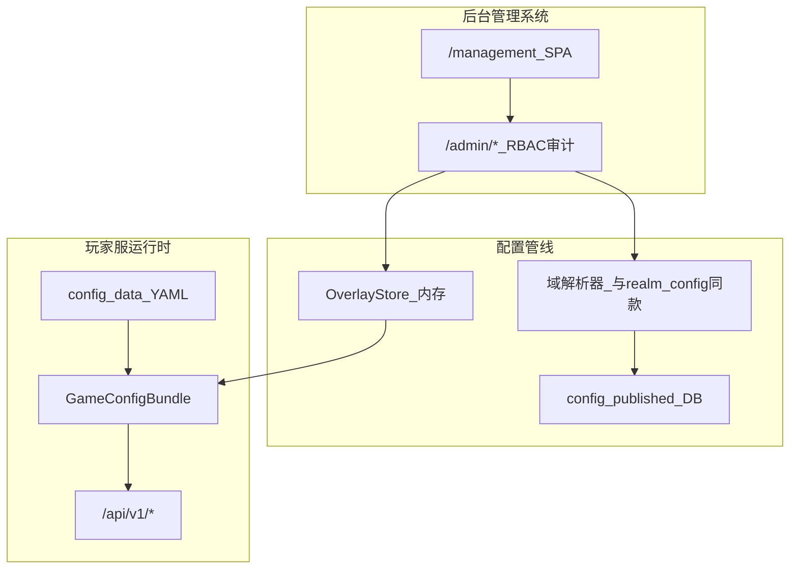

# 后台管理系统 — 独立开发计划

> **文档性质**：运营/内容 **管理后台** 的专项细则（**已并入** [`开发计划.md`](./开发计划.md) **§0.0 / §1.1**，优先级 **P0 最高**）  
> **版本**：v1.3.3 · 2026-08-07  
> **状态**：**ADM-0～11 主路径已落地**（双写表格+JSON、字段中文说明、sects/map/activity）；多环境通道仍可加深  
> **关联**：玩家服排期 [`开发计划.md`](./开发计划.md) · **§0.0.1 双写强制** · 配置源 **M2-D01 已消化** · 灵宠热插拔 [`灵宠系统设计.md`](./灵宠系统设计.md) §1.4 · 现行 DEV GM（**不是**本系统）

---

## 0. 与主开发计划的关系

| 项 | 说明 |
| --- | --- |
| **优先级** | **最高（P0）** — 见主计划 §20 第 1 条 |
| **强制提示** | 主计划 **§0.0 / §0.0.1**：凡可配置必须适配本系统；**表格+JSON 双写**；**字段中文说明** |
| **竖切表** | 主计划 **§1.1** 与本文 §7 同步；改一处须改另一处 |
| **实现** | 可与 N4/M6 等玩法并行；但玩法配置表不得违反 §0.0 |

---

## 1. 一句话目标

做一个 **独立部署** 的后台管理系统：凡玩法需要「配表 / 扩内容 / 调平衡 / 开关设施」的对象——**灵兽、功法、宗门、地图、怪物、道具、天气、历法、阵法、体质词条、活动…**——均可在后台完成 CRUD、校验、发布与审计，**无需改玩家端业务代码**。

---

## 2. 边界（写死）

| 是 | 不是 |
| --- | --- |
| 独立应用（独立前端 + 管理 API + 独立鉴权） | 玩家 Vue 里塞一个「GM 面板」冒充后台 |
| 覆盖 **全站可配置内容**，灵兽只是其中一域 | 仅灵宠 CMS |
| 写配置覆盖层 / 内容库 → 经校验器 → 发布到运行时注册表 | 直接改生产代码发版加内容 |
| 与 **M2-D01** `ConfigSource`（YAML 底表 + DB/覆盖层）对接 | 绕过配置源手写 SQL 当唯一入口 |
| 操作审计、角色权限、分环境发布 | 与玩家 JWT 共用、无审计的「万能 GM」 |

**与现行 DEV GM 的关系**：`/gm` 等接口仅服务本地联调（抬境界、发测试宠）。后台管理系统上线后，联调 GM **保留**但 **不得** 作为运营正式入口；正式改数走本系统。

---

## 3. 部署定案（ADM-0 · 已定）

| 项 | 选择 |
| --- | --- |
| **形态** | **A（monorepo）**：`admin/`（Vue）+ `backend/app/admin_api/` 前缀 **`/admin/*`** |
| **鉴权** | 独立表 `admin_users` + 独立 JWT（`aud=admin`，密钥 `ADMIN_JWT_SECRET_KEY` / 派生） |
| **配置契约** | YAML 底表 ∪ DB `config_published` 覆盖 → `OverlayStore` → `GameConfigBundle` |
| **不选 B** | 个人期不拆独立 repo；日后可把 `admin/` 单独部署仍打同一 `/admin` API |

---

## 4. 架构要点（已实现）



| 层 | 路径 / 职责 |
| --- | --- |
| Admin UI | `admin/`：登录、域列表、JSON 草稿编辑、发布/回滚、审计、**道主运营（剔除）** |
| Admin API | `app/admin_api/`：`/admin/auth` · `/admin/config/*` · `/admin/audit/logs` |
| ConfigSource | `app/config_source/`：`YamlConfigSource` + `OverlayStore` + `deep_merge` + 域注册表 |
| 玩家服 | 只读 Bundle；`realm_config._load_yaml` 自动合并已发布覆盖 |

**热插拔验收**：后台新增物种并发布 → `GET /admin/config/bundle/summary` 与玩家 `pets` catalog 路径读到新值 → **零** 玩家端发版。冒烟：`backend/scripts/smoke_adm.py`。

---

## 5. 内容域清单（现行）

| 域 ID | 内容 | YAML | 状态 |
| --- | --- | --- | --- |
| `pets` | 物种、持有上限 | `pets.yaml` | **可发布** |
| `items` | 道具目录 | `inventory.yaml` | **可发布** |
| `techniques` | 功法 | `techniques.yaml` | **可发布** |
| `weather` | 天气 | `weather.yaml` | **可发布** |
| `calendar` | 六时 | `calendar.yaml` | **可发布** |
| `monsters` | PVE 怪 | `pve_monsters.yaml` | **可发布** |
| `formations` | 阵法 | `formations.yaml` | **可发布** |
| `realms` / `idle` / `dice` | 高危数值 | 对应 YAML | **可发布**（须 `confirm_high_risk`） |
| `sects` | 设施开关 + 宗门模板 | `sects.yaml` | **可发布** |
| `map` | 区域占位 | `map.yaml` | **可发布** |
| `activity` | 活动开关 | `activity.yaml` | **可发布** |
| `avatar` | 化身解锁/互传折扣/体力 | `avatar.yaml` | **可发布**（表格+JSON；高危 balance） |
| `dao` / `dao_restraint` / `dao_lord` | 大道目录、克制、道主门槛 | 对应 YAML | **可发布**（M6 已登记） |
| `dao_lord`（赛会字段预告） | **`contest.*`**：报名窗、开打时刻、直播轮次、日志保留；运营 **立刻开赛** 走 GM/管理动作（审计） | `dao_lord.yaml` | **预告**（实现挂 M6-D06 P1；勿前端写死时刻） |

**运行时运营（非配置域）**

| 能力 | API | 权限 | 状态 |
| --- | --- | --- | --- |
| 道主榜只读 | `GET /admin/ops/dao-lords` | viewer+ | **已落地** |
| **剔除道主**（席位空缺） | `POST /admin/ops/dao-lords/{dao_id}/remove` | publisher/admin；审计 `ops.dao_lord.remove` | **已落地** |

登记权威：`app/config_source/registry.py`。新域先登记再玩法。

---

## 6. 权限与安全（已落地）

| 角色 | 能力 |
| --- | --- |
| `viewer` | 只读 |
| `editor_content` | 改内容域草稿 |
| `editor_balance` | 改高危域草稿 |
| `publisher` | 发布 / 回滚 |
| `admin` | 超权 |

- Bootstrap：`ADMIN_BOOTSTRAP_*`（默认 `admin` / `admin123`，仅开发）  
- 审计表：`admin_audit_logs`  
- 玩家 JWT 与后台 JWT **互斥校验**（单测覆盖）

---

## 7. 竖切进度（ADM）

| 步 | 内容 | 状态 |
| --- | --- | --- |
| **ADM-0** | 定案形态 A | **已定**（本文 §3） |
| **ADM-1** | Admin UI + `/admin/auth` + RBAC + audit | **已落地** |
| **ADM-2** | M2-D01：草稿覆盖 + 发布清 Bundle 缓存 | **已落地** |
| **ADM-3** | 域 `pets` | **已落地** |
| **ADM-4** | `items` + `techniques` | **已落地** |
| **ADM-5** | `weather` + `calendar` | **已落地** |
| **ADM-6** | `monsters` + `map` 占位区 | **已落地** |
| **ADM-7** | `sects` + 设施开关（含灵兽宗） | **已落地**（玩家 `/facilities` + `/pets/sect/*` 桩） |
| **ADM-8** | 回滚 / diff / 审计 + **条目表 + JSON/YAML/CSV 导入导出** | **已落地** |
| **ADM-9** | 高危域 `confirm_high_risk` | **已落地** |
| **ADM-10** | `activity` 活动开关占位 | **最小落地**（完整多环境后置） |
| **ADM-11** | 双写+中文字段：`realms`/`idle`/`dice` 表格↔JSON | **已落地**（对齐主计划 §0.0.1） |

**出口标准**：≥3 内容域可发布、审计可查、RBAC 区分编辑/发布、与 DEV GM 分离 — **已满足**（pets/items/techniques/weather/calendar）。

---

## 8. 本地启动

```powershell
# 1）构建后台前端（产出 admin/dist）
cd admin
npm install
npm run build

# 2）后端（同进程：玩家 API + /admin API + /management 页面）
cd ..\backend
.\.venv\Scripts\Activate.ps1
uvicorn app.main:app --reload --host 127.0.0.1 --port 8000
```

- **入口**：浏览器打开 **http://127.0.0.1:8000/management/**
- 登录：默认 `admin` / `admin123`（见 `.env`）  
- API：仍为 `/admin/*`（与页面同源，无需单独端口）  
- 可选热更新：`cd admin && npm run dev` → `http://127.0.0.1:5174/management/`  
- 冒烟：`python scripts/smoke_adm.py`

### 8.1 运行时结构与开销（v1.3.2）

| 组件 | 职责 |
| --- | --- |
| `AdminSpaHost` | `/management` SPA 托管；hashed assets `Cache-Control: immutable` |
| `YamlConfigSource` + `get_shared_yaml_source()` | YAML **mtime 内存缓存**；玩家服与后台共用 |
| `OverlayStore.has` / `get_ref` / `versions_map` | 热路径少 `deepcopy` |
| `RuntimeConfigReloader` | 发布/回滚/启动统一清 Bundle 缓存并重载 |
| `AdminEntryEditor` | 条目表 CRUD/CSV 从 `AdminConfigService` 拆出（组合） |
| `admin_field_schema` | 域编辑契约：`label_zh`/`help_zh` + `edit_modes` |
| `admin_sheet_codec` | `realms`/`idle`/`dice` 表格 ↔ 域 JSON（后端 format） |

### 8.2 双写与中文字段（强制 · 对齐主计划 §0.0.1）

运营可能多人、水平不一：

1. **不会 coding**：用「表格编辑」改行；列头悬停可见中文说明；保存时后端 `sheets_to_payload` format 成 JSON 进草稿。  
2. **会 coding**：用「JSON 覆盖」直接写 partial/整段；JSON 页附「字段中文说明」对照表。  
3. **后续新域**：登记 `DomainEditSchema`（字段中文 + `edit_modes` 含 table/entries 与 json）；嵌套矩阵必须提供 sheet codec，禁止只丢 textarea。

API：`GET /admin/config/{domain}/schema` · `GET|PUT /admin/config/{domain}/sheets`

---

## 9. 与现有文档的指针

| 文档 | 关系 |
| --- | --- |
| [`开发计划.md`](./开发计划.md) | §0.0 / §1.1；冲突时以 §0.0 为准 |
| [`后续待完成.md`](./后续待完成.md) | **M2-D01 / ADM 已消化**（深化项另登） |
| [`灵宠系统设计.md`](./灵宠系统设计.md) | 热插拔消费者；写入端为本系统 `pets` 域 |
| [`化身系统设计.md`](./化身系统设计.md) | 化身功能解锁 / 互传折扣 / 体力表；写入端域 **`avatar`**（须双写+中文 schema） |
| 各 `M*` 设计 | 配置表须可被本系统域管理；禁止前端写死内容枚举 |

---

## 10. 修订记录

| 日期 | 说明 |
| --- | --- |
| 2026-08-07 | **v1.0** 立项 |
| 2026-08-07 | **v1.1** 并入主计划 P0 |
| 2026-08-07 | **v1.3.1** 后台前端改由后端同端口托管：`/management`；API 仍 `/admin` |
| 2026-08-07 | **v1.3.2** OOP 封装 + 减负：YAML mtime 缓存、OverlayStore 轻量 API、SPA 宿主类、条目编辑器拆分、RuntimeConfigReloader |
| 2026-08-07 | **v1.3.3** 双写+中文字段：`realms`/`idle`/`dice` 表格↔JSON；schema API；主计划 §0.0.1 / ADM-11 |
| 2026-08-07 | 登记化身深化域 `avatar`（待加深）；指针 [`化身系统设计.md`](./化身系统设计.md) |
| 2026-08-07 | 域 `avatar` **可发布**：功能矩阵/互传折扣/体力表双写+中文 schema（AVATAR-D* 落地） |
| 2026-08-10 | **预告**：域 `dao_lord` 增赛会 `contest.*` 与立刻开赛（M6-D06；设计见大道 §5） |
| 2026-08-10 | **运行时运营**：道主榜 + **剔除道主**（`/ops/dao-lords`，席位变虚位，审计） |

---

*玩法冲突时以 `project修仙.md` 为准。*
