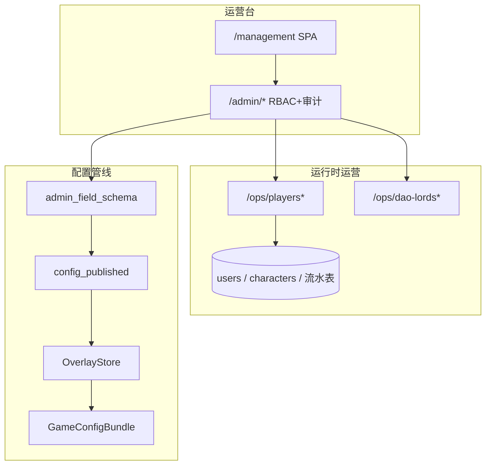

# 后台管理系统 — 开发计划（v2.0）

> **文档性质**：运营后台专项细则；与 [`开发计划.md`](./开发计划.md) **§0.0 / §0.0.1 / §0.0.2 / §0.6.3 / §1.1** 同步  
> **版本**：v2.0.2 · 2026-08-14  
> **状态**：**整改进行中** — 配置域旧 SPA 入口已下线；**玩家管理 · 账号管理 / 角色管理** 已按主计划规范落地（含 user_id 规则 / 勾选批量 / 软删）  
> **前版**：原 v1.x「配置草稿/发布/回滚 YAML」运营文案导向文档已废止；本文为重建稿

---

## 0. 与主计划的关系

| 项 | 说明 |
| --- | --- |
| **优先级** | **P0 最高**（主计划 §20） |
| **强制** | §0.0 凡可配置须适配后台；§0.0.1 双写+字段中文；§0.0.2 人读中文；§0.6.3 协议常量入 `app.constants` |
| **竖切表** | 主计划 **§1.1** 与本文 **§7** 同步；改一处须改另一处 |
| **边界** | 配置 Overlay 与运行时运营（账号/打赏等）分流；DEV `/gm` 仅联调 |

---

## 1. 一句话目标

独立运营台（`/management` + `/admin/*`）：

1. **运行时运营**：玩家账号、打赏流水、仙缘派发、广告观看等 **DB 事实**；  
2. **配置运营**：灵兽/功法/境界等 **YAML 底表 ∪ DB 发布层**（契约保留；UI 按 Navicat 网格重建中，**禁止**再对运营暴露「保存 JSON 草稿 / 发布 / 回滚 YAML」等旧文案）。

---

## 2. 边界（写死）

| 是 | 不是 |
| --- | --- |
| `admin/` SPA + `admin_api` + 独立 JWT（`aud=admin`） | 玩家端塞 GM 面板冒充后台 |
| 账号封禁 / 重置密码 / 派发仙缘 / 打赏录入（审计） | 与玩家 JWT 共用 |
| 配置域经 OverlayStore → Bundle；表格+JSON 双写契约 | 只丢 textarea 无中文说明 |
| 字段一律 `label_zh` / `help_zh`（§0.0.1） | 英文键直接甩给非编码运维 |

---

## 3. 部署（ADM-0 · 已定）

| 项 | 选择 |
| --- | --- |
| 形态 | monorepo：`admin/` + `/admin/*`；同端口 `/management` |
| 鉴权 | `admin_users` + `ADMIN_JWT_SECRET_KEY` |
| 配置契约 | YAML ∪ `config_published` → `OverlayStore` → `GameConfigBundle` |
| ContentStore | `CONTENT_STORE_MODE`：`yaml_authority` / `yaml_base_db_overlay` / `db_authority` |

### 3.1 运行时库 vs 设定存储（无痛切换）

| 环境 | 账号/角色/流水（运行时实体） | 玩法设定（境界/功法/…） |
| --- | --- | --- |
| **测试** | SQLite `backend/xiuxian.db`（`DATABASE_URL`） | YAML `config_data/*.yaml`（可 + DB overlay） |
| **正式** | PostgreSQL（同一 ORM；改 `DATABASE_URL`） | DB 发布层权威（`CONTENT_STORE_MODE=db_authority`） |

- 业务代码只依赖 SQLAlchemy 会话 + `ContentStore.load(domain)`，**不**写死 SQLite / PostgreSQL 专有语法。  
- 相对路径 SQLite 锚定 `backend/`；若仓库根另有旧 `xiuxian.db` 且配置库 `users=0`，启动自动选用账号更多的文件（避免后台「看不到测试账号」）。  
- 健康检查 `GET /api/v1/server/health` 返回 `database_dialect` / `database_target` / `content_store_mode` 便于核对。  
- 正式 PG：**缺列用 Alembic**；本地 SQLite 仍可用启动补丁。

---

## 4. 架构



| 层 | 路径 |
| --- | --- |
| UI | `admin/src`：登录、玩家管理；旧配置域菜单暂隐藏 |
| API | `admin_api/`：`auth` · `config_routes` · `ops_routes` · `player_routes` |
| 常量 | `constants/admin_player.py` · `constants/admin_character.py` · `constants/character.py`（状态/货币/schema） |
| 配置 | `config_source/` + `admin_field_schema` + `admin_sheet_codec` |

---

## 5. 功能清单

### 5.1 玩家管理（运行时 · 已落地）

| 模块 | 说明 | 状态 |
| --- | --- | --- |
| **账号管理** | 网格：数据库ID / user_id(`M/P/T/G`+7位) / 邮箱 / 手机 / 仙缘 / 总打赏 / GM；勾选+顶栏批量；行内流水；道号可跳转角色管理 | **已落地** |
| **角色管理** | 网格+抽屉：属性/状态/背包/功法/境界/制造业/货币/体质；通用删除(软删)/死亡(待引渡)/轮回/修为·炼体突破/邮件给予 | **已落地** |
| 封号 / 解封 | `users.is_active`；登录提示「无效用户名」 | **已落地** |
| 删除账号 | 软删 `is_active=false`（非物理删除） | **已落地** |
| 设为 GM | `is_gm` + user_id 前缀 `G`；功能暂未开放 | **已落地** |
| 重置密码 | 固定明文见常量 `DEFAULT_RESET_PASSWORD` | **已落地** |
| 改联系方式 | 邮箱 / 手机；唯一性校验；可批量 | **已落地** |
| 派发仙缘 | `characters.fate_luck` + 流水表；可批量 | **已落地** |
| 记录 / 查看打赏 | `player_tip_records`；累加 `total_recharge_amount` | **已落地** |
| 仙缘派发记录 | `fate_luck_grant_records` | **已落地** |
| 广告观看记录 | `player_ad_watch_records`；**仅查看**，写入待广告接入 | **表+查看已落地** |

**API**

| Method | Path | 权限 |
| --- | --- | --- |
| GET | `/admin/ops/players/schema` | viewer+（中文字段契约） |
| GET | `/admin/ops/players` | viewer+ |
| POST | `/admin/ops/players/{id}/ban` | publisher/admin |
| POST | `/admin/ops/players/{id}/soft-delete` | publisher/admin |
| POST | `/admin/ops/players/{id}/set-gm` | publisher/admin |
| POST | `/admin/ops/players/{id}/reset-password` | publisher/admin |
| POST | `/admin/ops/players/{id}/contacts` | publisher/admin |
| POST | `/admin/ops/players/{id}/grant-fate-luck` | publisher/admin |
| POST | `/admin/ops/players/{id}/tips` | publisher/admin |
| GET | `/admin/ops/players/{id}/tips` | viewer+ |
| GET | `/admin/ops/players/{id}/fate-luck-grants` | viewer+ |
| GET | `/admin/ops/players/{id}/ad-watches` | viewer+ |

**角色管理 API**

| Method | Path | 权限 |
| --- | --- | --- |
| GET | `/admin/ops/characters/schema` | viewer+ |
| GET | `/admin/ops/characters` | viewer+ |
| GET | `/admin/ops/characters/{id}` | viewer+ |
| POST | `/admin/ops/characters/{id}/soft-delete` | publisher/admin |
| POST | `/admin/ops/characters/{id}/kill` | publisher/admin |
| POST | `/admin/ops/characters/{id}/reincarnate` | publisher/admin |
| POST | `/admin/ops/characters/{id}/breakthrough/cultivation` | publisher/admin |
| POST | `/admin/ops/characters/{id}/breakthrough/body` | publisher/admin |
| POST | `/admin/ops/characters/{id}/grant-item` | publisher/admin |
| POST | `/admin/ops/characters/{id}/base-attrs` | publisher/admin |
| POST | `/admin/ops/characters/{id}/status` | publisher/admin |
| POST | `/admin/ops/characters/{id}/inventory/{item_row_id}` | publisher/admin |
| POST | `/admin/ops/characters/{id}/techniques/*` | publisher/admin |
| POST | `/admin/ops/characters/{id}/realm` | publisher/admin |
| POST | `/admin/ops/characters/{id}/craft-levels` | publisher/admin |
| POST | `/admin/ops/characters/{id}/recipes/*` | publisher/admin |
| POST | `/admin/ops/characters/{id}/currencies` | publisher/admin |

**玩家端只读（ADM-P6，玩家 JWT）**

| Method | Path | 说明 |
| --- | --- | --- |
| GET | `/api/v1/account/summary` | 仙缘余额 / 累计打赏 / 累计观看广告次数 |
| GET | `/api/v1/account/tips` | 打赏账单：时间 / 金额 / 单号 / 途径（原文，含运营自填） |
| POST | `/api/v1/auth/change-password` | 原密码+新密码；`REGISTER_REQUIRE_EMAIL_CODE` 开则须 `email_ticket`（与注册同一套 `verification/email`） |

**表**

| 表名 | 中文 |
| --- | --- |
| `player_tip_records` | 打赏流水 |
| `fate_luck_grant_records` | 仙缘派发流水 |
| `player_ad_watch_records` | 广告观看流水 |

### 5.2 配置内容域（契约保留 · UI 重建中）

登记权威：`config_source/registry.py`。域含 `pets` / `items` / `techniques` / `weather` / `calendar` / `monsters` / `map` / `sects` / `activity` / `avatar` / `dao*` / `realms` / `idle` / `dice` 等。

| 纪律 | 说明 |
| --- | --- |
| 双写 | 表格 + JSON；表格由后端 format（§0.0.1） |
| 中文 | 每字段 `label_zh` / `help_zh` |
| UI | 重建时用 Navicat 网格；**不得**再写「校验 / 保存 JSON 草稿 / 发布 / 回滚到 YAML」运营文案 |
| API | `/admin/config/*` 仍可用；侧栏入口暂下线 |

### 5.3 其它运行时运营

| 能力 | API | 状态 |
| --- | --- | --- |
| 道主榜 / 剔除 / 赛会干预 | `/admin/ops/dao-lords*` · `dao-contests*` | API **已落地**；SPA 入口待归入新类目 |

---

## 6. 权限与安全

| 角色 | 能力 |
| --- | --- |
| `viewer` | 只读（含账号列表与流水） |
| `editor_content` / `editor_balance` | 配置草稿（按域风险） |
| `publisher` | 配置发布/回滚；**账号写操作** |
| `admin` | 超权 |

- Bootstrap：`ADMIN_BOOTSTRAP_*`（默认 `admin` / `admin123`）  
- 审计：`admin_audit_logs`（账号 `ops.player.*` / 角色 `ops.character.*`）  
- 玩家 JWT 与后台 JWT 互斥

---

## 7. 竖切进度（与主计划 §1.1 同步）

### 7.1 配置轨（ADM-0～11 · 已出口）

| 步 | 内容 | 状态 |
| --- | --- | --- |
| ADM-0～11 | 脚手架、Overlay、多域、双写+中文字段 | **已落地**（UI 侧整改中） |

### 7.2 玩家运营轨（整改）

| 步 | 内容 | 状态 |
| --- | --- | --- |
| **ADM-P0** | 侧栏重做：玩家管理类目；废止旧配置菜单入口 | **已落地** |
| **ADM-P1** | 账号管理网格 + 顶栏批量封号/重置密码/改联系方式/派发仙缘/软删/设GM；行内流水 | **已落地** |
| **ADM-P2** | 打赏流水表 + 录入/查看；累加总打赏 | **已落地** |
| **ADM-P3** | 仙缘派发流水；广告观看表（只读） | **已落地** |
| **ADM-P4** | §0.0.1 schema API + §0.6.3 常量抽取；前端按 schema 渲染 | **已落地** |
| **ADM-P5** | 广告回调写入观看流水 | **待做**（广告系统） |
| **ADM-P6** | 玩家端账号页只读账单 + 改密核验与注册同开关 | **已落地** |
| **ADM-P7** | 角色管理（软删/死亡/轮回/突破/给予 + 属性·状态·背包·功法·境界·制造业·货币） | **已落地** |
| **ADM-C1** | 配置域 Navicat UI 重建（无旧发布文案） | **待做** |
| **ADM-C2** | 道主控制台 / 审计归入新类目 | **待做** |

---

## 8. 本地启动

```powershell
cd admin
npm install
npm run build

cd ..\backend
.\.venv\Scripts\Activate.ps1
uvicorn app.main:app --reload --host 127.0.0.1 --port 8000
```

- 入口：http://127.0.0.1:8000/management/  
- 默认账号：`admin` / `admin123`  
- 热更新：`cd admin && npm run dev` → http://127.0.0.1:5174/management/  
- 单测：`pytest tests/test_admin_player_accounts.py tests/test_admin_character_ops.py`

---

## 9. 规范自检（每个后台竖切结束前）

1. **§0.0.1**：可编辑字段是否都有 `label_zh` / `help_zh`？（玩家运营见 `GET …/players/schema`）  
2. **§0.6.3**：协议魔数是否进 `app.constants`？  
3. **§0.0.2**：运营可见文案是否中文？文档英文键是否双语备注？  
4. **审计**：写操作是否落 `admin_audit_logs`？  
5. **RBAC**：写操作是否限制 publisher/admin？

---

## 10. 指针

| 文档 | 关系 |
| --- | --- |
| [`开发计划.md`](./开发计划.md) | §0.0 / §1.1；冲突以主计划为准 |
| [`后续待完成.md`](./后续待完成.md) | M2-D01 / ADM 深化项 |
| [`双轨整改与配置兼容方案.md`](./双轨整改与配置兼容方案.md) | ContentStore 模式 |
| 各 `M*` / 专题设计 | 配置域须可后台管理 |

---

## 11. 修订记录

| 日期 | 说明 |
| --- | --- |
| 2026-08-14 | **v2.0.2** **ADM-P7 角色管理**：`/ops/characters*`；状态常量入 `constants/character`；软删 `characters.is_active`；账号道号跳转角色页 |
| 2026-08-14 | **v2.0.1** 运行时库兼容：SQLite 多文件自动选用 + PG 透传；健康检查可核对 `database_target` |
| 2026-08-14 | **v2.0** 废止 v1.x 旧稿；以玩家管理为整改首轨重建全文；登记 ADM-P0～P4 / ADM-C* |
| 2026-08-14 | **ADM-P6**：玩家账号页摘要与打赏账单；改密邮箱核验与 `REGISTER_REQUIRE_EMAIL_CODE` 同源 |
| 2026-08-07～10 | v1.0～v1.3.x（配置轨落地；详见 git 历史） |
