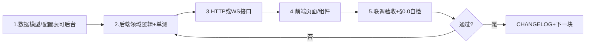

# Project修仙 — 个人开发计划

> 依据：`project修仙.md`（GDD v4.0）  
> 技术栈：前端 Vue 3 · 后端 Python 3.11 · 强交互 WebSocket · 服务端权威  
> 原则：**按板块竖切、前后端交叉、每块可测可玩、数值后期填坑**；**设定与数值对玩家显性可见（§0.7）**；**凡可配置必须适配后台（§0.0）**；**玩家可见文案一律中文（§0.0.2）**  
> 版本：v3.1 · 2026-08-12（**M7 收口** · 延后项已镜像入 **§1.2 + 各 M 待做队列** · 细则仍以 [`后续待完成.md`](./后续待完成.md) 为准 · 下一主线见 §20）

---

## ⚠️ 0.0 强制提示词 · 后台管理系统适配（每次读本文必读）

> **【AGENT / 开发者特殊提示 · 最高优先级】**  
> 每当打开或依据本文进行设计、实现、评审时，必须默认遵守：  
> **一切需要配置、配表、扩内容、调平衡、开关设施的需求，都必须适配「后台管理系统」。**  
> 禁止只做「改 YAML + 改玩家代码」的一次性方案；禁止前端/后端写死物种、功法、怪物、道具、天气、地图节点等本应进注册表的枚举。  
> 细则与竖切见本文 **§1.1 ADM** 与 [`后台管理系统开发计划.md`](./后台管理系统开发计划.md)。配置源抽象见 `后续待完成.md` **M2-D01**。

### 0.0.1 运营双写与中文字段（强制 · 2026-08-07）

> 运营可能 **多人协作**，其中有人 **不会写代码**、有人 **会写 JSON**。后续凡新增/加深后台域，**必须**同时满足：

| 必须 | 说明 |
| --- | --- |
| **双写准备** | 同一内容域同时提供 **表格编辑** 与 **JSON 覆盖** 两种写入入口；禁止只给其中一种 |
| **表格→JSON** | 表格提交后由 **后端 format** 成该域约定 JSON（再进草稿→校验→发布）；禁止只在前端拼装后当黑盒 |
| **字段中文说明** | **每一个**可编辑字段须有 `label_zh`（中文名）与 `help_zh`（用途/取值约定），方便非编码运维；schema 见 `admin_field_schema` |
| **高危嵌套域** | 境界 `realms`、挂机速率 `idle`、修为骰 `dice` 等矩阵/列表须拆成运营表格（非仅 raw JSON） |

| 必须 | 禁止 |
| --- | --- |
| 新配置进 **可后台 CRUD 的注册表/覆盖层**（现阶段 YAML 也须 schema+校验器，契约与后台一致） | `if species_id == "xxx"` / 前端写死下拉枚举当内容源 |
| 玩家服只读 `GameConfigBundle`（或等价）；图鉴/列表/遭遇 **派生注册表** | 发版改代码才能加一条灵兽/功法/怪物 |
| 新域先在后台计划 **内容域清单** 登记，再实现玩法 | 玩法做完才发现无法运营录入 |
| DEV `/gm` 仅联调；正式改数走后台 | 把 GM 面板当运营后台 |
| 新后台域登记 **字段中文 schema** + **双写模式**（§0.0.1） | 只丢一个 JSON 文本框给运营、无中文注释 |

**自检（每个玩法竖切结束前）**：若运营要加一条同类内容，能否 **只改数据（未来后台一点发布）** 且玩家端无发版生效？非编码同事能否靠 **表格+中文列头** 完成修改、会 coding 的同事能否走 **JSON**？不能则本竖切未完成。

### 0.0.2 玩家可见文案 · 中文信条（法律级 · 2026-08-10）

> **【AGENT / 开发者特殊提示 · 与 §0.0 同级强制】**  
> 代码变量、配置键、事件字段、内部枚举 **允许且鼓励使用英文**（如 `seal`、`mist`、`thunderstorm`、`force_apply`）。  
> 但凡面向 **说明文档、开发计划、设计文档、运营字段说明、玩家 UI、战报播报/播放器日志** 的文案，**必须使用对应中文**；禁止把英文 id / 变量名直接甩给玩家或写进「给人读」的段落却不加中文备注。

#### 信条（写死）

| # | 条文 | 说明 |
| --- | --- | --- |
| 1 | **机读英文，人读中文** | `id` / `type` / `subtype` / `attack_kind` 等存英文；展示层只出中文名 |
| 2 | **文档必双语备注** | 计划/设计/登记册首次出现英文键时，须写 `英文（中文）`，例：`seal`（禁制）、`weather`（天气）、`force_apply`（强制生效） |
| 3 | **战报只播中文** | `battle_text`、战报播放器、简易/详细日志：**禁止**出现裸英文 id（如 `mist`、`thunderstorm`、`seal`）；须经 `label_zh` / 映射表译出 |
| 4 | **配置自带中文名** | 凡会进入战报或 UI 的内容 id，YAML/后台必须有 `label_zh`（及必要时 `summary`）；缺中文名视为该竖切未完成 |
| 5 | **事件可留英文键** | `events[]` 内机器字段可仍为英文（便于单测/复现）；**渲染出口**负责中文化，前端不得把 raw id 当正文展示 |

#### 禁止 vs 必须

| 禁止 | 必须 |
| --- | --- |
| 详细战报打印 `【四象】天气：thunderstorm 覆盖全场` | `【四象】天气：雷暴 覆盖全场`（id 仅留在 events / debug） |
| 设计文档通篇只写 `seal subtype` 无中文 | 写 `seal`（禁制）子类：`ranged_physical`（禁远程物理）… |
| 前端播放器用 `ev.resolved_full` 直接上屏 | 用服务端已译字段或本地映射表（优先服务端 `*_label_zh`） |
| 棋盘图例只写英文 `seal` | 图例用中文：如「禁=禁制」 |

#### 自检（每个玩法竖切 / 战报相关改动结束前）

1. 关掉英文注释，只看玩家能看到的字符串——是否仍有裸英文 id？  
2. 新内容 id 是否同时具备 **配置 `label_zh`** 与 **战报映射**？  
3. 设计/计划文档里的英文键是否都有中文备注？  

**违反本条 = 该功能未完成**，与 §0.0 后台适配、§0.7 显性设计同等对待。

---

## 0. 总原则

### 0.1 边做边测（个人开发节奏）

| 规则 | 说明 |
| --- | --- |
| **竖切交付** | 每个板块做完必须形成「后端可结算 + 前端可操作 + 联调通过」的最小闭环，再进入下一块 |
| **前后端交叉** | 同一板块内按「表结构 → API/WS → 前端页 → 联调」交替推进，禁止整端堆完再对接 |
| **数值占位** | 公式/概率一律配置表或常量占位，不阻塞玩法联通；与 GDD「§23 不设计」对齐；**表结构须可被后台管理（§0.0）** |
| **显性设计** | **凡影响玩法的设定与数值必须对玩家可见**（见 **§0.7**）；「研究游戏设计」本身是本游戏主要玩法之一，禁止隐性黑盒 |
| **后台适配** | **凡可配置必须适配后台管理系统**（见 **§0.0** / **§1.1**）；优先级高于「先打通再补录入」的侥幸 |
| **中文信条** | **玩家可见文案一律中文**（见 **§0.0.2**）；代码可用英文键，文档须双语备注，战报禁止裸英文 id |
| **剧情与细案后置** | GDD **不写**章回正文/地图编年（§15–§16）；**工程上** M5 只留解锁 flag，**M10** 再做脚本管线与可跳过播放器；正文另档创作 |
| **强交互后置** | 日常挂机/突破/PVE 走 HTTP；道主挑战、秘境、世界 Boss / 势力战等再上 WebSocket（M6 骨架 → **M11** 成型） |
| **AI 后置** | AI 天道化身 / AI NPC **仅**经第三方 API 决策；权威结算仍在本服；排在世界空间与事件之后（**M12**），避免无世界可驱动 |

### 0.2 推荐技术选型（可微调，定后写死）

| 层 | 建议 |
| --- | --- |
| 前端 | Vue 3 + Vite + TypeScript + Pinia + Vue Router |
| 后端 | FastAPI（HTTP）+ 同进程/旁路 WebSocket 通道 |
| 数据 | PostgreSQL（角色/宗门）+ Redis（会话、冷却、在线状态、六时天气缓存） |
| 任务 | APScheduler / 异步定时：离线切片、每日定点快照、资源日结 |
| 鉴权 | JWT + refresh；敏感操作用服务端校验 |
| 日志 | Python `logging` → 文件 + 控制台 |

### 0.3 通信分工

```
HTTP（REST）          WebSocket（强交互 / 推送）
─────────────────     ─────────────────────────
登录注册、角色面板     道主挑战实时淘汰制
挂机切换 / 领取        道主秘境、世界 Boss 房间
突破发起 / 结果        战斗观战推送（可选）
布阵保存、快照更新     全局六时/天气变更广播
交易行、面交、邮件     聊天室推送、拍卖/面交状态（M7）
宗门异步、赠送、师徒   引渡状态变更推送（可选）
双修邀约/掷骰（M7）   双修会话状态推送（可选）
PVE 开战（服务端演算） 在线心跳 / 强制踢下线
```

### 0.4 仓库与文档约定

```
ProjectXX/
├── project修仙.md                 # GDD（玩法真理）
├── 开发计划.md                    # 本文（含 §0.0 / §1.1 ADM）
├── 后台管理系统开发计划.md         # ADM 细则（与本文 §1.1 同步）
├── README.md / CHANGELOG.md
├── backend/                       # Python（玩家 API + admin_api `/admin/*`）
├── frontend/                      # 玩家 Vue（5173）
└── admin/                         # 后台前端（5174；ADM 已落地）
```

每完成一个**里程碑验收**，同步更新 `CHANGELOG.md` 与 `README.md`（如何启动、新增环境变量）。

### 0.5 单板块标准作业流（SOP）

每个板块重复同一套交叉节奏（约 4～8 个工作日量级，视复杂度）：



**每日建议**：上午后端 + 接口自测；下午前端对接同一接口；晚上用验收清单回归。  
**配置自检**：本板块新增的 YAML/表，是否已按 §0.0 可被后台域管理（或已登记待 ADM 域）？

### 0.6 后端代码分层（现行约定，2026-08-04）

玩法数值与业务编排分离；**HTTP 契约不变**，内部为 Application Service OOP：

```
api/（薄路由，Depends 注入）
  → services/（XxxService(session) 用例类；可保留兼容函数包装）
  → domain/（无 IO 值对象与纯计算）
  → db/models + config_data/*.yaml（经 realm_config → GameConfigBundle）
```

| 约定 | 说明 |
| --- | --- |
| 新增玩法 | 新 `XxxService` → `deps.get_xxx_service` → 路由 `Depends`；无 DB 规则进 `domain/` |
| 跨玩法前置 | 统一 `PlayGate`（有角色 + 自动 claim 离线 pending） |
| 配置 | YAML 底表 + **M2-D01** 覆盖层（`OverlayStore`）+ 校验器；**须适配后台**（§0.0）；后台竖切 **§1.1 ADM** |
| 详情 | README「后端架构」；M0/M1/M2 设计 §分层 已同步；后台细则见 [`后台管理系统开发计划.md`](./后台管理系统开发计划.md) |

### 0.6.1 展示中文化 · 解耦 · 算力与索引（工程约定 · 2026-08-10）

> 与 **§0.0.2** 配套；M5 收口后的横切打磨，后续里程碑默认遵守。

| 约定 | 说明 |
| --- | --- |
| **机读 / 人读出口** | 事件与 DB 存英文 id；玩家 API/UI 出口经 `domain/display_labels.py` 或配置 `label_zh` / `labels`；缺译用 `未知(id)`，禁止裸 id 当正文 |
| **战报** | `battle_text` 摘要击杀用单位中文名；未知枚举回落「未知」；前端播放器不把 `seed=` 等调试串当简易档主文案 |
| **服务解耦** | 跨服务 settle 等用 **lazy import**（例：突破 → 挂机），避免模块顶层环；纯规则进 `domain/` |
| **切段算力** | 挂机 settle 用 `_make_segment_env_resolver`：天气冻结一次 + 时辰公式按槽缓存（`memoize_env_resolve`），禁止每 tick 新建 Calendar/Weather 快照 |
| **查表索引** | 高频 `WHERE character_id AND status/phase` 须复合索引；启动 `bootstrap._ensure_performance_indexes` 补齐已有 SQLite 库 |

### 0.6.2 战斗属性与棋子养成（路线图 · 2026-08-12 修订）

> **现状**：统一 schema 已落地（`combat_attrs.yaml` + `CharacterPublic.combat`/`life`）；战力仍为境界 `base_*` 占位曲线。见 [`ATTR战斗属性占位设计.md`](./ATTR战斗属性占位设计.md) **v1.2**（**ATTR-D01 已消化**）。  
> **纪律**：**不单开「属性里程碑」**；按竖切喂进战斗与工坊。  
> **M13 边界**：**只填正式曲线与全量表**，**不再重设计字段/叠层**；schema 占位必须先于填数。  
> **v1.2 要点**：`build_combat_attrs` 权威；物法拆分+七维抗性+生活键；装备/傀儡通道默认关。

| 阶段 | 做什么 | 不做 |
| --- | --- | --- |
| **ATTR-D01** | **已落地**：CombatAttrBlock + LifeAttrBlock、实体适用面、叠层、面板 `breakdown`、ADM 注册表 | 追求平衡的正式曲线 |
| **M3 末 / M3-D03** | 功法主动/被动链读写扩展键；与 schema 对齐 | 全装备养成、全怪物数值 |
| **M8** | 装备/丹药/符箓/自研 → `build_combat_attrs`；傀儡加深；打通 **IDLE-R01 / DICE-R01** | 正式曲线（→ M13） |
| **M9** | 野怪/NPC/Boss 战斗模板挂同一 schema（ADM `monsters`） | AI 行为（→ M12） |
| **M13** | GDD §23 指向的 **正式属性曲线与全量词条表**（改 YAML 数字） | 另起第二套属性名 |

### 0.7 显性设计原则（新会话必读 · 2026-08-06）

> **一句话**：本游戏把「研究与理解游戏设计」当作主要玩法之一；凡影响收益、风险、偏好、成功率的设定与数值，**必须对玩家显性展示**，禁止「后台悄悄改、界面只报结果」的隐性设计。

#### 0.7.1 为什么必须显性

| 动机 | 说明 |
| --- | --- |
| **玩法本体** | 玩家应能像研究修仙体系一样，研究时辰/天气/灵根/功法/乘区如何叠加，并据此择时、择术、择路 |
| **可验证** | 配置改了，玩家立刻在界面看到「基础→有效」「×1.xx」「来自哪一项」；联调与验收也靠同一套可见字段 |
| **可录入** | 后期填表（天气、妖兽、炼器炼丹等）时，说明字段与数值字段一起进 YAML；UI 只读配置，不写死文案 |

#### 0.7.2 禁止 vs 必须

| 禁止（隐性） | 必须（显性） |
| --- | --- |
| 结算吃了环境乘区，界面仍只显示裸基础速率 | 展示 **基础值、有效值、总乘区**；有拆解则列出来源（时辰/天气/灵根·功法标签等） |
| 天气变了只 toast「天气转晴」，不说对修炼/刷怪/工坊有何影响 | 同步 **说明文案**（修炼速度、妖兽出没喜好、炼丹炼器等分支） |
| 「感觉变强了」但无数字、无标签、无来源 | 能回答：**改了什么、改成多少、因为什么** |
| 前后端各算一套展示公式，或前端本地发明乘区 | **服务端权威**：预览字段与 settle 同一套公式；前端只渲染 |
| 配置只有 `modifiers` 数字、无玩家可读说明 | 配置同时提供 **catalog / note 类字段**（见下），录入新内容时一并维护 |

#### 0.7.3 配置侧约定（录入即可见）

新增或扩展会「吃环境/吃标签/吃公式」的内容时，YAML（或等价配置）至少考虑：

| 字段族 | 用途 | 示例落点 |
| --- | --- | --- |
| **数值乘区** | 结算用系数 | `modifiers` / `tag_modifiers` |
| **idle_note** | 基础修炼速度说明 | `calendar.yaml` / `weather.yaml` → `catalog.<id>` |
| **spawn_bias_note** | 妖兽出没喜好说明 | 同上 |
| **craft_notes.\*** | 炼丹 / 炼器 / 制符 / 傀儡 / 阵法等分支说明 | 同上 |
| **summary / 专题 note** | 总述、突破、渡劫等 | `breakthrough_note` / `tribulation_note` 等 |
| **标签** | 角色灵根、功法 `env_tags` 等参与乘区的身份 | 角色字段 + `techniques.yaml` |

> 数值可以后期调；**说明字段不能空着就上线玩法**——至少占位一句真话（「略升 / 标准 / 占位」亦可），避免界面无字可显。

#### 0.7.4 工程验收清单（每块功能自检）

新会话实现任何「修正 / 加成 / 偏好 / 概率」时，交付前自问：

1. **玩家能否在相关面板看到当前有效数值？**（不只最终结果，最好含基础与修正）
2. **玩家能否知道加成/减益来自哪里？**（拆解或等价说明）
3. **配置是否有对应的玩家可见说明字段？** 后期录入新数据时 UI 是否自动带出？
4. **预览 API / `CharacterPublic` 嵌入字段是否与真实结算一致？**
5. **环境或标签变化后，界面是否会刷新？**（轮询/推送后重拉角色或 env，禁止陈旧展示）

**反例（已纠正方向）**：挂机曾只在后台乘环境系数、修炼区仍显示裸 `per_tick` → 应改为 `idle_env` 式预览（有效速率 + breakdown + catalog），修炼区直接渲染。

#### 0.7.5 与「数值占位」的关系

- **§0.1 数值占位**：允许公式粗糙、系数 `1.0`、文案写「占位」——**不阻塞竖切**。
- **§0.7 显性设计**：占位也必须 **露出来**；不能因为「以后再调」就藏进黑盒。  
  → 先显性占位，再在 M13 / 填表阶段改准数字与文案。

#### 0.7.6 AI / 协作者执行约定

阅读本文开始新会话或新板块时：

- 默认按 **显性设计** 出方案与 UI，不要先做「只有结算、没有展示」的半截功能。
- 若暂时做不到完整拆解，至少：**有效值 + 一句说明 + 配置 catalog 钩子**；并在 `后续待完成.md` 标明「拆解 UI 延后」，而不是永久隐性。
- 文档（README / CHANGELOG / 里程碑设计）同步写清：**玩家在哪看到什么字段**。

### 0.8 活动互斥状态机（2026-08-06）

> **一句话**：同一时刻本体只占用一种「积极活动」——修炼中须先停止才能开战/炼丹炼器/突破/渡劫；再进入修炼前须无工坊进行中、非渡劫/引渡；战斗为同步 HTTP（无持久 in_battle）；秘境落地后挂同一套钩子。

#### 两轴（不要合成一个大 status）

| 轴 | 字段 | 取值 |
| --- | --- | --- |
| 生命周期 | `Character.status` | `normal` / `breaking_through` / `tribulation` / `awaiting_ferry` / `reincarnating` |
| 挂机意图 | `idle_direction` | `none` / `spirit` / `body` / `crafting` |
| 派生 busy | 工坊 `CraftJob.running` 等 | 计数；未来 `in_secret_realm` |

#### 互斥表（权威在 `domain/activity_mutex.py` + `PlayGate.assert_activity`）

| 当前占用 | 禁止 | 允许 |
| --- | --- | --- |
| 修炼中（direction≠none） | 开战、工坊开工、突破、开渡劫、进秘境（预留） | 停止修炼、领取、只读面板 |
| 工坊 RUNNING | 进入修炼 | 等待完成/领取；停修炼已是 none 时可开战等 |
| 渡劫 / 待引渡 / 轮回 | 积极玩法 + 改挂机 | 渡劫/引渡流程自身 API |
| 空闲（normal + none + 无 running） | — | 进入修炼或其它积极玩法 |

**显性**：`CharacterPublic.activity` 暴露 `mode` / `mode_label` / `can_*` / `blockers`；大厅 `ActivityStatusBanner` + 各面板禁用按钮。

**错误码**：`40074` 请先停止修炼；`40075` 请先完成工坊；`40076` 生命周期占用；`40077` 秘境（预留）。

### 0.9 修为骰子系统（跨里程碑强制，2026-08-06）

> **一句话**：凡「掷出整数上下限」「成功率检定」「权重抽签」——**一律**复用 [`骰子系统设计.md`](./骰子系统设计.md) + `dice.yaml` / `DiceService`；禁止业务内再发明 `randint(1,20)` 或裸 `random()<rate`。

| 类型 | 机制 | 用途示例 |
| --- | --- | --- |
| **区间骰** | YAML 查 `(major,stage)` 得 base min/max → 叠功法/体修/气运等 → `uniform_int(lo,hi)` | 突破成败、战斗先攻/伤害、阵法对抗、双修 WD3（占位） |
| **概率门面** | `dice_rules.chance` | 遮天、护主、制造失败 |
| **权重门面** | `dice_rules.weighted_pick` | 突破品阶、预估品阶 |

**配置**：`backend/app/config_data/dice.yaml`（境界表）+ 功法 `dice_mods`；调数值只改表。  
**延后**：装备/道具时效/双修会话 → `后续待完成` **DICE-R01～R03**。  
**文档**：M2/M3/M5 设计与前端目录已对齐；新功能先查本文再 coding。

---

## 1. 里程碑总览

| 优先级 | 阶段 | 名称 | 目标一句话 | 可玩/可用结果 |
| --- | --- | --- | --- | --- |
| **P0 最高** | **ADM** | **后台管理系统** | 全站可配置内容可后台 CRUD/发布 | 加内容不改玩家代码；见 §1.1 |
| — | **M0** | 工程骨架 | 能跑通登录与空角色 | 注册登录、空大厅 |
| — | **M1** | 核心循环 MVP | 挂机→修为→突破→简单战 | 锻体教学闭环 |
| — | **M2** | 成长深度 | 体质 + 挂机三向 + 离线 | 可离线过夜 |
| — | **M3** | 战斗成型 | 7×7 自走棋 + 快照 | 日常 PVE/防守 |
| — | **M4** | 双线程 | 化身 + 制造业 + 灵宠雏形 | 金丹后双挂机 |
| — | **M5** | 环境与外环 | 六时天气 + 轮回雏形 | 择时与多周目 |
| — | **M6** | 大道与道主 | 开道道池 + 强交互 WS | 真仙竞争锚点 |
| — | **M7** | 宗门社交经济 | 宗门 + 交易/邮件/赠送/**多频道聊天**/**传承红包**/师徒/**双修** + 商业化壳 | 弱社交服可运营 |
| — | **M8** | 自研与内容管线 | 自研功法/阵法/符箓 + 样本扩表 | 玩家可产出可入库配方 |
| — | **M9** | 世界空间 | 地图 + 势力范围 + NPC 骨架 | 可走图、占点、对话 |
| — | **M10** | 叙事与任务 | 奇遇 / 任务 / 剧情脚本管线 | 可接任务、触发奇遇、播可跳过剧情 |
| — | **M11** | 世界事件 | 宗门战 / 势力战 / 抢地盘 / 世界 Boss | 定时活动可参与可结算 |
| — | **M12** | AI 代理 | AI 天道化身 + AI NPC（第三方 API） | NPC/天道可异步决策，服内权威落子 |
| — | **M13** | 内容与数值案 | 全量表 + 正式曲线 + 支付上线 | 可运营填充 |

> **ADM 纪律**：后台为 **最高优先级轨道**，可与玩法里程碑 **并行**；但任意玩法新增「需要配置的东西」时，**必须先满足 §0.0**（注册表 + 可后台），不得等 M13 再补。  
> 个人开发建议：玩法仍按 M0→M7 打通核心服；**同时**推进 ADM-0 起脚手架与 M2-D01。扩展层 M8→M13 同前。  
> GDD 仍不写剧情/地图细案正文；本表排的是**系统工程步骤**，创作内容进独立文档/配置/**后台**。

---

## 1.1 ADM — 后台管理系统（最高优先级）

> **详细设计/域清单/安全**：[`后台管理系统开发计划.md`](./后台管理系统开发计划.md)  
> **配置源**：`后续待完成.md` **M2-D01**  
> **提示词**：§0.0（每次读本文生效）

### 目标

独立部署的运营后台：灵兽、功法、宗门、地图、怪物、道具、天气、历法、阵法、体质词条、活动等 **全站可配置域** 均可 CRUD、校验、发布、审计；玩家服无发版加内容。

### 板块 ADM · 竖切

| 步骤 | 端 | 任务 | 验收 / 状态 |
| --- | --- | --- | --- |
| ADM-0 | 文档 | 定部署形态 **A**：`admin/` + `/admin/*` | **已定** |
| ADM-1 | 双端 | Admin 脚手架：登录、RBAC、audit 表 | **已落地** |
| ADM-2 | 后端 | **M2-D01**：草稿覆盖 + 发布使 Bundle 失效 | **已落地** |
| ADM-3 | 双端 | 域 `pets` | **已落地** |
| ADM-4 | 双端 | 域 `items` + `techniques` | **已落地** |
| ADM-5 | 双端 | 域 `weather` + `calendar` | **已落地** |
| ADM-6 | 双端 | 域 `monsters` + `map` | **已落地** |
| ADM-7 | 双端 | 域 `sects` + 设施开关 | **已落地** |
| ADM-8 | 双端 | 回滚 / 条目表 / JSON·YAML·CSV | **已落地** |
| ADM-9 | 双端 | 高危域 `confirm_high_risk` | **已落地** |
| ADM-10 | 双端 | `activity` 活动开关占位 | **最小落地** |
| ADM-11 | 双端 | **双写+中文字段**：`realms`/`idle`/`dice` 表格↔JSON；§0.0.1 | **已落地** |

**ADM 出口标准**：≥3 内容域可发布且玩家服无发版生效；审计可查；RBAC 区分编辑/发布；与 DEV `/gm` 职责分离 — **已满足**（详见后台计划）。

**与玩法并行规则**：玩法竖切（如 N4）交付时，配置必须已是注册表+校验器；ADM 域 UI 可稍后几步补上，但 **契约不得与后台计划冲突**，且须遵守 **§0.0.1 双写与中文字段**。

### ADM 深化队列（出口后 · 可并行）

| ID / 主题 | 状态 | 内容 | 备注 |
| --- | --- | --- | --- |
| **ADM-10+** | 待做 | 多环境通道、更富结构化表单、CSV/批量深化 | 与 M8+ 玩法并行；不阻塞开 M8 |
| **M7-D05** | 待做 | 敏感词完整运营库 + 人工审台 | 可挂 ADM `chat` 域；M7 占位过滤已够出口 |

---

## 1.2 延后项计划队列（与 `后续待完成.md` 对齐 · 2026-08-12）

> **用途**：总览「还没做、挂在哪一程」。**验收钩子 / 依赖 / 笔记以 [`后续待完成.md`](./后续待完成.md) 正文为准**；此处只定 **目标里程碑与优先级**。  
> **纪律**：实现消化后 → 登记册标「已消化」+ 本表删行或改「已消化」；禁止在错误阶段抢跑「仍勿提前」项。

### ★ 当前开工优先级（摘自登记册 §0.1）

| 优先级 | 挂载 | ID / 主题 | 说明 |
| --- | --- | --- | --- |
| **P0** | M7 出口 | `smoke_m7` + 设计 §15 勾选 | L1～L8 已落地；打磨通过即可开 M8 / 并行 |
| **P1 并行** | ADM | **ADM-10+** | 多环境 / 富表单 |
| **P2 下一主线** | **M8** | **ATTR-D02** + Y/Z/AA | 装备/傀儡喂战斗属性；自研功法/阵法/符 |
| **P2 登记** | M9 / M7 末 | **CHAT-D03** / **M7-D*** | 地图频与宗门深化延后，勿抢跑 |

### 按目标里程碑归队（仅「待做」）

| 目标阶段 | 待做 ID | 一句话 |
| --- | --- | --- |
| **M3 末打磨**（不阻塞主线） | **M3-D01** | 快照每日定点 APScheduler（多进程/整点必刷时） |
| | **M3-D02** | 任意角 LOS / 飞跃完整寻路 |
| | **M3-D03** + **M3-D06b** | 功法主动/被动/道具陷阱链；嘲讽 Phase B（技能施加/时长/驱散） |
| | **M3-D04** | PVP 守方战报可见（可选；确定性重演） |
| | **M3-D05** | 体力恢复道具 + 制作扣体力接入 |
| | **M3-D10** | 引擎 Tier A/C、基准、修正栈打磨 |
| **M4 延后** | **M4-D02** | 化身独立跨大境界突破权（易拖垮；单独评审） |
| **M5+ / 专项** | **M5-D06** | 轮回带宠完整概率与数值 |
| | **M5-D07**（接 M4-D02） | 化身独立渡劫 / 跨境 |
| | **M5-D09** | 气运 / 魔性完整养成与来源 |
| **M6 可选** | **M6-D02** | 道池终局次数 N + 自选交互 |
| | **M6-D07**（=M1-D33） | 修炼结算 WS/SSE 真推送（不进出口） |
| **M7 末打磨** | **M7-D01** | 化身参与双修（本体双修已落地后再定） |
| | **M7-D02** | 宗门大比 / 资源点完整数值（或邻近 M11） |
| | **M7-D05** | 敏感词运营库（或 ADM） |
| **M8** | **ATTR-D02**、**IDLE-R01**、**DICE-R01** | 装备/傀儡喂属性；挂机/骰子装备通道 |
| | **M7-D06** | 宗门工坊真材料与图纸 `item_type` |
| | **M3-D08 Phase B** | 自研阵法设计器 / brush（板块 Z） |
| | **DICE-R02** / **IDLE-R02** | 道具时效骰 / 丹药符箓挂机 buff（有道具管线后） |
| **M9** | **CHAT-D03**、**ATTR-D03** | 地图频/势力频；野怪 NPC Boss 属性模板 |
| | **M5-D02**、**M5-D08** | 多区天气绑定；劫云真实邻区覆盖 |
| | **IDLE-R04**（邻近） | 洞府道具驻地挂机加成 |
| **洞府/驻地专项** | **IDLE-R03** | 灵眼驻地挂机加成 |
| **多 worker 工程** | **PRESENCE-R01** | Redis Presence（跨进程在线一致） |
| **M11** | **M6-D04**、**M6-D05** | 天道技能完整；世界 Boss / 秘境成型 |
| | **M7-D03**、**M7-D04** | 对立盟宣战开战；队伍实体深化 / 战场队 |
| | **M7-D02**（可选） | 大比完整赛季若未在 M7 末做完 |
| **M13 / 数值专项** | **M5-D01**、**M6-D01**、**M6-D03** | 六时×功法全矩阵；37 道满表；道等级跨轮回保留比例 |
| | **AO\*** / ATTR 填数 | 正式曲线、真支付、运维；**不重开字段** |

### 仍勿提前（依赖未开）

| 勿抢跑 | 须等到 |
| --- | --- |
| 完整 37 道（M6-D01） | M13 / 内容专项 |
| Boss 成型（M6-D05） | M11 |
| 地图/势力频（CHAT-D03） | M9 |
| 化身双修（M7-D01） | 本体双修稳定后再评审 |
| 真支付 | M13 |
| IDLE-R01 / DICE-R01 | ATTR-D02（M8）同批开通道 |

---

## 2. M0 — 工程骨架（约 3～5 天）

### 板块 A · 工程与鉴权

| 步骤 | 端 | 任务 | 验收 |
| --- | --- | --- | --- |
| A1 | 双端 | 初始化 `backend/`（FastAPI）、`frontend/`（Vue3+Vite） | `uvicorn` / `npm run dev` 可起 |
| A2 | 后端 | `.env` 加载 DB/Redis/JWT；健康检查 `/health` | 无密钥硬编码 |
| A3 | 后端 | 用户表、注册/登录、JWT | Postman/脚本通过 |
| A4 | 前端 | 登录注册页、Token 持久化、Axios 拦截器 | 登录后进大厅 |
| A5 | 后端 | 角色创建（姓名、初始锻体一层占位） | 一账号一角色（可先限制） |
| A6 | 前端 | 角色面板壳（境界、灵石、空白挂机区） | 读到服务端真实数据 |
| A7 | 双端 | CORS、基础错误码约定、日志落盘 | README 写清启动步骤 |

**本阶段不做**：战斗、挂机结算、WebSocket。

---

## 3. M1 — 核心循环 MVP（约 1.5～2.5 周）

> 对齐 GDD §1 核心循环：挂机 → 修为 → 突破 → 战斗 → 资源回流。  
> 只打通 **锻体～炼气** 教学段；九层结构可配置，数值占位。  
> **详细设计**：[`M1核心循环设计.md`](./M1核心循环设计.md) · [`M1前端目录与路由设计.md`](./M1前端目录与路由设计.md) · 延后项 [`后续待完成.md`](./后续待完成.md)
### 板块 B · 境界与属性骨架（§2）

| 步骤 | 端 | 任务 | 验收 |
| --- | --- | --- | --- |
| B1 | 后端 | 境界枚举配置（锻体/炼气 1–9+圆满；后续大境界四期表） | 配置驱动，非写死 if 链 |
| B2 | 后端 | 角色字段：大境界、层/期、修为池、基础属性占位 | 创建角色默认锻体一层 |
| B3 | 前端 | 境界进度条、层/期展示 | 与后端一致 |
| B4 | 双端 | 联调：改库/GM 接口临时抬境界，前端刷新正确 | GM 仅开发环境 |

### 板块 C · 挂机最小集（§9.1 / §9.3 简化）

| 步骤 | 端 | 任务 | 验收 |
| --- | --- | --- | --- |
| C1 | 后端 | 本体挂机方向仅先做 **修灵**；按时间片累加修为；耗灵石 | 单测：时间前进 → 修为增加 |
| C2 | 后端 | 切换方向接口（先预留三选一枚举，炼体/制造业返回暂未开放） | 切换先结算再换 |
| C3 | 前端 | 挂机面板：当前方向、预估速度、灵石余额 | 可切换修灵 |
| C4 | 前端 | 「领取/同步」或自动轮询拉取最新修为 | 在线可见增长 |
| C5 | 双端 | 灵石不足进入停滞 | UI 明确提示停滞 |

### 板块 D · 突破最小集（§3.1，无雷劫）

| 步骤 | 端 | 任务 | 验收 |
| --- | --- | --- | --- |
| D1 | 后端 | 层进阶：修为达标 + 消耗 → **修为区间骰**判定成败（§0.9 / [`骰子系统设计.md`](./骰子系统设计.md)；`success_rate` 映射阈值） | 锻体层数 +1；响应含 `dice` |
| D2 | 后端 | 进阶中互斥：暂停挂机、禁止开战 | 状态机字段清晰 |
| D3 | 前端 | 突破按钮、读条/结果弹窗；展示出目与阈值（显性 §0.7） | 失败有修为回退反馈 |
| D4 | 双端 | 炼气大圆满 → 筑基初期（跨境流程骨架，品阶先固定凡品） | 跨境成功进筑基 |

### 板块 E · 战斗最小集（§7 极简）

| 步骤 | 端 | 任务 | 验收 |
| --- | --- | --- | --- |
| E1 | 后端 | 服务端演算：1v1 或本体单棋 vs 固定怪；回合上限；胜负；骰子走单位修为区间（§0.9） | 不依赖前端算伤害 |
| E2 | 后端 | PVE 胜利给修为 + 少量灵石 | 回流挂机闭环 |
| E3 | 前端 | 开战按钮、简易战报列表（可跳过动画） | 能连打验证养成 |
| E4 | 双端 | **M1 验收清单**：注册→挂机→突破一层→打赢一场→修为/灵石变化正确 | 录像或 checklist 打勾 |

**M1 出口标准**：陌生人按 README 能在本地跑通「挂机变强再打架」闭环。

> **状态（2026-08-04）**：**已验收收口**。实现与清单见 `M1核心循环设计.md` §11、`M1前端目录与路由设计.md` §9；延后能力见 `后续待完成.md`，勿在收口后继续往 M1 加玩法。

---

## 4. M2 — 成长深度（约 2～3 周）

### 板块 F · 挂机三向 + 离线切片（§9 全）

| 步骤 | 端 | 任务 | 验收 |
| --- | --- | --- | --- |
| F1 | 后端 | 炼体方向 → 炼体度；制造业方向 → 制造业经验池 | 三选一互斥 |
| F2 | 后端 | 修为/炼体度/制造业经验 **手动分配** 到境界或功法（功法表最小 2～3 本） | 系统不代选 |
| F3 | 前端 | 资源分配页（滑条/按钮） | 分配后属性/等级变 |
| F4 | 后端 | 离线：上线按时间片结算；**免费 12h 帽**；会员字段预留 18/24 | 改系统时间或 mock 测帽 |
| F5 | 前端 | 离线收益预览弹窗 → 一键领取 | 明细可读 |
| F6 | 双端 | 挂机消耗随境界配置表 | 高境界灵石耗更快（占位曲线） |

### 板块 G · 体质系统骨架（§4）

| 步骤 | 端 | 任务 | 验收 |
| --- | --- | --- | --- |
| G1 | 后端 | 体质品质、主/副词条格（初始 1+2）、镶嵌/卸下 | 格满不可再嵌 |
| G2 | 后端 | 升品、融合接口骨架（结果占位随机） | 日志记录材料消耗 |
| G3 | 前端 | 体质背包 + 格子 UI | 拖拽或点击镶嵌 |
| G4 | 双端 | 突破读取体质基础属性权重（系数占位） | 有/无体质差异可测 |

### 板块 H · 突破品阶（§3.2，仍无雷劫）

| 步骤 | 端 | 任务 | 验收 |
| --- | --- | --- | --- |
| H1 | 后端 | 仅跨境结算品阶枚举（劣质～天道），写永久记录；权重抽走 §0.9 `weighted_pick` | 层内进阶不出品阶 |
| H2 | 前端 | 品阶展示与历史 | 面板可见 |
| H3 | 双端 | 神通槽位按品阶解锁占位 | 无神通内容也可空槽 |

**M2 出口标准**：可离线 12h 内收益正确；体质可镶嵌；跨境有品阶。

---

## 5. M3 — 战斗成型（约 2.5～3.5 周）

> 对齐 GDD §7 / §8：7×7 自走棋、阵法雏形、防守快照。**战报零保留**（v1.4.4：响应即战报，浏览器会话自存；服务器只落体力/奖励结算）。  
> **详细设计**：[`M3战斗成型设计.md`](./M3战斗成型设计.md) · [`M3自动移动攻击算法设计.md`](./M3自动移动攻击算法设计.md) · [`M3前端目录与路由设计.md`](./M3前端目录与路由设计.md) · [`阵法部署与自研设计.md`](./阵法部署与自研设计.md) · [`嘲讽光环设计.md`](./嘲讽光环设计.md) · 延后项 [`后续待完成.md`](./后续待完成.md)  
> **实现拆分（强制）**：成型设计 **§11 六步 S1～S6**；**S3 战斗全流程** 为独立重点板块（**§12**）。  
> **战斗模式（v1.4.4 + 骰子系统）**：自走棋；棋盘 §3；四象/探路 §5；演算 §7；**每回合 2 AP**；先攻/伤害/阵法对抗用 **修为区间骰**（§0.9 / [`骰子系统设计.md`](./骰子系统设计.md)；单位 `dice_lo`/`dice_hi`；`board.dice_sides` 仅回落）；默认 AI 见算法专文；**体力门禁 D10**。

### 板块 I · 7×7 自走棋核心（§7.2–§7.5）

> 落地映射：I1→**S1**；I3→**S2/S5**；I2+PVE 演进→**S3/§12（重点）**；I4→**S4**；I5→**S5**。

| 步骤 | 端 | 任务 | 验收 |
| --- | --- | --- | --- |
| I1 | 后端 | 棋盘模型：7×7；x 三区；默认落子 `(0,2)–(1,4)`；棋子 kind 枚举 | 非法占位拒绝 |
| I2 | 后端 | 先攻 + **每回合 2AP** 移动/攻击、命中/伤害、主技能；空盘 AI；骰用修为区间 | 对齐 §7、算法专文与 §0.9 |
| I3 | 前端 | 布阵编辑器（默认 6 格可点）；≥3 套预设存档 | 进攻/防守/临时 |
| I4 | 双端 | 战报播放器（数据源=开战响应，`sessionStorage` 会话内保存）+ 开局棋盘字符画 + 双档日志；**体力系统**（恢复/扣减/体力条） | 服务器零战报行；体力不足 `40049`；可跳过回放 |
| I5 | 双端 | 上阵数量随境界配置（默认上限 6）；本体唯一 | 渡劫状态禁本体（先预留状态） |

### 板块 J · 阵法雏形（§7.6 / §12.5 挂钩）

> 落地映射：整块 J → **S6**（须在 S3 战斗全流程验收后）。

| 步骤 | 端 | 任务 | 验收 |
| --- | --- | --- | --- |
| J1 | 后端 | 阵法四象：地形（障碍/沟壑/禁制）+ 环境/天气/效果 DND 对抗 | 单测对抗与最小 LOS |
| J2 | 前端 | 出战前选阵法；己方半区地形/合法格高亮 | UI 与规则一致 |
| J3 | 双端 | 阵法写入防守预设；开战带四象结算 | 战报记录骰点与 resolved |

### 板块 K · 快照系统（§8）

> 落地映射：整块 K → **S6**（与阵法同步收尾；惰性定点见成型设计，APScheduler 见 **M3-D01**）。

| 步骤 | 端 | 任务 | 验收 |
| --- | --- | --- | --- |
| K1 | 后端 | 快照序列化（属性、棋子、布阵、阵法、版本哈希） | 不含挂机瞬时进度 |
| K2 | 后端 | 手动更新：1 小时冷却；每日定点 3～4 次任务 | 渡劫中禁止更新 |
| K3 | 前端 | 「更新防守快照」+ 冷却倒计时 | 攻打他人加载对方快照 |
| K4 | 双端 | PVP：攻打快照 → 荣誉/灵石占位奖励 | 不改对方实时养成 |

**M3 出口标准**：能布阵打 PVE（**须先通过成型设计 §12.7 战斗全流程验收**）；能更新快照并被他人攻打。

> **状态（2026-08-05）**：**主路径已实现收口**。S1～S6 六步竖切全部落地：I（棋盘/引擎/2AP/体力/播放器）、J（阵法四象）、K（快照/PVP）均完成。  
> **收口后打磨（2026-08-10）**：

| ID | 状态 | 落入 |
| --- | --- | --- |
| **M3-D06** Phase A | **已消化** | [`嘲讽光环设计.md`](./嘲讽光环设计.md) v1.1.1；`taunt_aura` / 选怪 `taunt_auras` |
| **M3-D08** Phase A | **已消化** | [`阵法部署与自研设计.md`](./阵法部署与自研设计.md) v1.1；`deploy` / `force_shifts` |
| **M3-D06b** Phase B | **挂账 → 与 M3-D03 同迭代** | 技能施加光环 / `duration_rounds` / 驱散 |
| **M3-D08** Phase B | **挂账 → M8 板块 Z** | 自研阵法设计器 / brush |
| **M3-D07** | **已消化（Phase A）** | 四象 `seal`（禁制）/ 环境·天气载荷 → [`四象禁制与环境天气载荷设计.md`](./四象禁制与环境天气载荷设计.md) v1.1 |

#### M3 待做打磨队列（不阻塞 M8+ 主线 · 按需穿插）

| ID | 状态 | 目标 | 摘要 |
| --- | --- | --- | --- |
| **M3-D01** | 待做 | 多进程/整点必刷时 | 快照每日定点 APScheduler（现行惰性补刷够用） |
| **M3-D02** | 待做 | M3 末 / M4 | 任意角 LOS、飞跃寻路、毁障后 LOS 更新 |
| **M3-D03** | 待做 | M3 末 / M4 | 功法主动/被动完整链 + 战斗道具/陷阱库存 |
| **M3-D06b** | 待做 | **同 M3-D03** | 嘲讽光环 Phase B（技能施加/时长/驱散） |
| **M3-D04** | 待做（可选） | 按反馈 | 守方确定性重演战报（仍零落库） |
| **M3-D05** | 待做 | 道具/制作可用后 | 体力恢复道具 + `spend(kind=craft)` |
| **M3-D10** | 待做 | 性能回退时 | Tier A 短路、Tier C 基线、修正栈脏标记 |

勿把 Phase B / 完整技能树提前塞进「嘲讽已完成」叙事；细则见 [`后续待完成.md`](./后续待完成.md) §1.5。

---

## 6. M4 — 双线程成长（约 2～3 周）

> 对齐 GDD §9.2 / §10 / §11 / §12：化身双挂机、制造业配方、灵宠雏形、神识约束。  
> **详细设计**：[`M4双线程成长设计.md`](./M4双线程成长设计.md) · [`M4前端目录与路由设计.md`](./M4前端目录与路由设计.md) · **灵宠细则** [`灵宠系统设计.md`](./灵宠系统设计.md) · **化身细则** [`化身系统设计.md`](./化身系统设计.md) · 延后项 [`后续待完成.md`](./后续待完成.md)（**AVATAR-D***；M4-D02/D05～D06；**M4-D01 多化身已取消**；PET 已消化；M3 打磨不阻塞出口）  
> **实现拆分（强制）**：成长设计 **§11 竖切 T1～T6**（L/M/N 映射见该节）；物种/途径深化见 **§7.4～7.5 / N4～N5**（N4 已收窄）。  
> **路由**：新增 `/avatar` `/workshop` `/pets`；`/hall` 枢纽扩展；`/formation` Bench 接真棋子。

### 板块 L · 化身（§10）

| 步骤 | 端 | 任务 | 验收 |
| --- | --- | --- | --- |
| L1 | 后端 | 金丹解锁凝练；初始 50% 属性 + 同修为；材料修正占位 | 非金丹不可凝练 |
| L2 | 后端 | 化身独立挂机线程；与本体并行耗灵石 | 两线程互不抢三选一 |
| L3 | 后端 | 修为可互传；炼体度/制造业经验不可传 | 接口拒绝非法转移 |
| L4 | 后端 | 神识容量与衰减/反噬占位 | 超载可见惩罚日志 |
| L5 | 前端 | 化身管理页：凝练、挂机、传修为、上阵勾选 | 渡劫时禁化身上阵 |
| L6 | 双端 | 化身可进快照编成 | 防守快照含化身 |

### 板块 M · 制造业细项（§12）

| 步骤 | 端 | 任务 | 验收 |
| --- | --- | --- | --- |
| M1 | 后端 | 配方表：炼丹/炼器/制符/阵法/傀儡各至少 1 配方 | 手动启动→挂机队列 |
| M2 | 后端 | 完成结算成品入背包；失败率占位 | 本体制造业方向效率高 |
| M3 | 前端 | 工坊 UI：选配方、进度、领取 | 化身可并行工坊 |
| M4 | 双端 | 傀儡可上阵；阵法等级挂钩 §7.6 | 产出能进战斗 |

### 板块 N · 灵宠雏形（§11）

| 步骤 | 端 | 任务 | 验收 |
| --- | --- | --- | --- |
| N1 | 后端 | 持有/上阵；与化身共用神识池衰减 | 超载衰减可测 |
| N2 | 前端 | 灵兽园 + 上阵勾选 | 不可替代本体 |
| N3 | 双端 | 捕获/发放测试宠；培养升级占位 | 战力进战报 |

### 板块 N 深化 · 物种与正式获取

> **玩法细则**：[`灵宠系统设计.md`](./灵宠系统设计.md)（品阶/词条/技能/捕获/1v1/灵兽宗）。  
> N4 收窄出口：[`M4双线程成长设计.md`](./M4双线程成长设计.md) **§7.4 / §7.5**。  
> **不重开** M4 T1～T6 出口。  
> 延后拆分：[`后续待完成.md`](./后续待完成.md) **M4-D04b / D04c** + **PET-D01～D06**（**M4-D04a / N4 已消化**）。

| 步骤 | 端 | 任务 | 验收 |
| --- | --- | --- | --- |
| N4 | 双端 | 热插拔 `races`/`species`/`grades`；catalog **派生注册表**；品阶字段；`capture_test`；**预留** `/pets/sect/affix/*` 桩 | ✅ 加 YAML 物种 → 图鉴同步；reroll-type 未开放不改库 |
| N5 | 双端 | 蛋物品 + 孵化会话（耗时/材料）；成品入灵兽园 | ✅ 蛋→开工→领取入园 |

**M4 出口标准**：金丹后双挂机；能炼丹/上傀儡；神识约束生效。

> **状态（2026-08-07）**：T1～T6 / N1～N5 / **PET-D01～D06** / **M4-D04c** **已收口**。灵宠 P0 竖切完成；真地图 → M9。下一主线见 §1.2 / §20。

#### M4 待做队列

| ID | 状态 | 目标阶段 | 摘要 |
| --- | --- | --- | --- |
| **M4-D02** | 待做 | M5+ 单独评审 | 化身独立跨大境界突破权（双突破状态机；M4 不做） |
| **M4-D01** | **取消** | — | 多化身 → 单化身功能矩阵（AVATAR-D* 已消化） |
| **M4-D03 / D04\* / D05 / D06** | **已消化** | — | 神识表 / 宠生态竖切 / 道值炼丹(M6) / 化身宗门任务(M7) |

---

## 7. M5 — 环境与轮回外环（约 2～3 周）

> 对齐 GDD §3.3 / §5 / §17 / §18：六时天气、雷劫渡劫、待引渡与轮回新生。  
> **详细设计**：[`M5环境与轮回外环设计.md`](./M5环境与轮回外环设计.md)（**v1.1** 渡劫双维/准备格/劫云）· [`M5前端目录与路由设计.md`](./M5前端目录与路由设计.md) · 延后项 [`后续待完成.md`](./后续待完成.md)（**M5-D01～D10**；并消化指针 **M1-D21**）  
> **实现拆分（强制）**：外环设计 **§11 竖切 E1～E6**（O/P/Q/R 映射见该节）。  
> **路由**：新增 `/tribulation` `/reincarnation`；全局 `WorldClockBar`（非独立 path）；`/hall` 枢纽扩展。

### 板块 O · 历法六时（§17）

| 步骤 | 端 | 任务 | 验收 |
| --- | --- | --- | --- |
| O1 | 后端 | 权威时钟：每现实 1 分钟推进一时；循环六时 | Redis/内存当前时辰 |
| O2 | 后端 | 挂机/突破/出没修正读时辰表（系数占位） | 切片结算带时辰 |
| O3 | 前端 | 顶栏当前时辰；可选简易倒计时到下一时 | 与服务器一致 |
| O4 | 可选 WS | 广播时辰切换（减少轮询） | 多开客户端同步 |

### 板块 P · 天气（§18）

| 步骤 | 端 | 任务 | 验收 |
| --- | --- | --- | --- |
| P1 | 后端 | 区域天气池滚动；开战/渡劫/开工锁定天气 | 战中不切换 |
| P2 | 前端 | 天气图标 + 对当前行为的提示文案 | 制造业/突破提示 |
| P3 | 双端 | 雷暴等对渡劫难度占位修正 | 配置可改 |

### 板块 Q · 雷劫（§3.3）

| 步骤 | 端 | 任务 | 验收 |
| --- | --- | --- | --- |
| Q1 | 后端 | 元婴→化神起：**仅跨大境界**进渡劫；小境界（层/期）无雷劫 | 锻体～元婴无雷劫；首劫后层进阶走普通突破 |
| Q2 | 后端 | 渡劫互斥：禁战斗、禁改挂机、禁更快照 | 状态机完整 |
| Q3 | 前端 | 渡劫专属 UI / 战报；遮天/护主结果只展示服务端（§0.9 门面） | 失败惩罚可见 |
| Q4 | 双端 | 极端失败 → 待引渡状态入口（对接板块 R） | 状态流转正确 |

### 板块 R · 轮回与引渡骨架（§5 / §14.3 最小）

| 步骤 | 端 | 任务 | 验收 |
| --- | --- | --- | --- |
| R1 | 后端 | 战败 vs 陨落；待引渡倒计时；自选轮回 / 强制轮回 | 三条路径可测 |
| R2 | 后端 | 保留表：体质保留、境界重置锻体一层、贡献归零、**阵法预设 reset**；普通袋清空 / 轮回袋可带；可轮回功法；**灵宠栏位占位**（`reincarnation_carry`） | 按 `reincarnation.yaml` carry 实现 |
| R3 | 后端 | 轮回点（境界×路径倍率）；**永久加成表** `character_reincarnation_bonuses`；槽位/袋容量可配 | 结算日志完整；战力/突破读永久加成 |
| R4 | 前端 | 待引渡界面：自救 / 等救 / 入轮回；轮回预览清单 | 主动轮回祭坛 |
| R5 | 双端 | 轮回后快照作废；剧情钩子「已历可跳」仅存 flag | 不写剧情正文 |
| R6 | 双端 | **可选钩子**：轮回传承概率带出灵宠（依赖 N4 物种表；完整数值后置） | 配置可关；流水可查 |

**M5 出口标准**：六时天气影响结算；有雷劫；能走完一次轮回新生。

> **状态（2026-08-07）**：**已实现收口**（E1～E6）+ **收口后强化**。  
> **主路径（2026-08-06）**：六时/天气/环境修正、渡劫双维+准备格+批次结算、待引渡/轮回、前端 `/tribulation` `/reincarnation` + `WorldClockBar`；冒烟 `scripts/smoke_m5.py`。设计见外环 **v1.4** · 前端目录 **v1.3**（指针 [`骰子系统设计.md`](./骰子系统设计.md) · [`挂机速率与加成设计.md`](./挂机速率与加成设计.md)）。  
> **收口后续（2026-08-06～07）**：  
> - 粘性 `reincarnating` → 新生选角（灵根/传承/体质倾向）+ 轮回商店（固定+随机货架、`shop/refresh` 耗点/仙缘）→ `complete-newborn`  
> - 永久加成表（初始/小·大突破成长/突破率）；轮回点路径倍率；轮回袋；功法 `reincarnatable`；体质/灵根槽公式  
> - 轮回后阵法预设 reset；打开布阵时清洗失效棋子（无化身幽灵占格）  
> - 筑基前（锻体/炼气）挂机灵石消耗 `0`（`idle.yaml`）  
> **优先打磨（已消化）**：M5-D10～D12 · M1-D30 · M5-D03（真引渡→M7）· M5-D04（WS 广播→M6）· M5-D05/M1-D20（异步读条，默认关）。

#### M5 待做队列

| ID | 状态 | 目标阶段 | 摘要 |
| --- | --- | --- | --- |
| **M5-D01** | 待做 | **M13** / 数值专项 | 六时×功法 / 天气×全系统完整系数矩阵 |
| **M5-D02** | 待做 | **M9** | 多区域天气与地图 `region_id` 绑定 |
| **M5-D06** | 待做 | N4 后 + 数值专项 | 轮回带宠完整概率与流水 |
| **M5-D07** | 待做 | M5+ 评审（接 M4-D02） | 化身独立渡劫 / 跨境 |
| **M5-D08** | 待做 | **M9** | 劫云半径真实覆盖邻区并对他角色生效 |
| **M5-D09** | 待做 | M7+ / 养成专项 | 气运 / 魔性完整获取与衰减 |

---

## 8. M6 — 大道、道主与 WebSocket 强交互（约 3～4 周）

### 板块 S · 大道与道池（§6.1–§6.5）

| 步骤 | 端 | 任务 | 验收 |
| --- | --- | --- | --- |
| S1 | 后端 | 真仙开道：加权随机池 → 抽 3 → 三选一；3 道入道池 | 本周目锁定 |
| S2 | 后端 | 再轮回开道：排除已收藏；可选道池旧道 | 道池跨轮回保留 |
| S3 | 后端 | 道值、道经验、道等级；战斗/制造业运用占位 | 消耗与涨经验 |
| S4 | 前端 | 开道 UI、道池图鉴、运用道开关 | 不可指定买本命道 |
| S5 | 双端 | 上位克制读表（先做少量道，不必凑齐 37） | 战报有克制标记 |

### 板块 T · WebSocket 基础设施

| 步骤 | 端 | 任务 | 验收 |
| --- | --- | --- | --- |
| T1 | 后端 | WS 鉴权（JWT）、心跳、房间模型、断线重连策略 | 压测小房间稳定 |
| T2 | 前端 | WS 客户端封装、重连、与 Pinia 状态同步 | 掉线提示 |
| T3 | 双端 | 约定消息协议（type / payload / seq） | 文档化到 README |

### 板块 U · 道主挑战（§6.14 / §14.4）

| 步骤 | 端 | 任务 | 验收 |
| --- | --- | --- | --- |
| U1 | 后端 | 首位达标成为道主；挑战时段配置；冷却 | 离线不收回道主 |
| U2 | 后端 | **挑战者实时**（WS 房间淘汰制）+ **道主快照应战** | 打赢更替 |
| U3 | 前端 | 挑战大厅、倒计时、实时战况 | 非时段不可进 |
| U4 | 后端 | 轮回卸下道主；特权字段（天道技能/秘境开关）占位 | 身份与特权清空 |
| U5 | 双端 | 秘境/世界 Boss 房间骨架（定时开、须在场） | 不参加不挡主线 |

**M6 出口标准**：真仙可开道；能用 WS 打一场道主挑战；道主离线可被快照挑战更替。

### 板块 U6 · M6 打磨包 — 道主之争赛会收口（**已收口 · 2026-08-10**）

> **前置**：W1～W6 + **M6-D06 P1**（报名/日程/立刻开赛）已落地。  
> **目标**：有主更替走完整赛会（淘汰 → 决战道主 → 半决/决赛可直播），再开 M7。  
> **细则**：[`M6大道与道主设计.md`](./M6大道与道主设计.md) §5.3～§5.9；登记 [`后续待完成.md`](./后续待完成.md) **M6-D06**。

| 步骤 | 端 | 任务 | 验收 |
| --- | --- | --- | --- |
| U6-P2 | 双端 | 同道随机配对、奇数轮空、对手离线判负；对阵树；EarlyRounds 权威结算 + 战报回放（可跳过） | **已通过** |
| U6-P3 | 双端 | 1 人直战道主；冠军 vs 道主：在线双方实时 / 离线打防守快照；胜则更替 | **已通过** |
| U6-P4 | 双端 | 半决/决赛/道主战直播（不可跳过）；单直播槽；下赛开赛清回溯 | **已通过** |

**打磨包出口**：报名 → 开赛 → 淘汰出冠军 → 决战道主（双模）→ 半决/决赛可直播观战；日志保留至下场开赛。  
**其后**：M7 已收口；下一主线 **M8**（§10）+ §1.2 并行项。

#### M6 待做队列

| ID | 状态 | 目标阶段 | 摘要 |
| --- | --- | --- | --- |
| **M6-D01** | 待做 | **M13** | 完整 37 道 + 满克制矩阵 + 功法权重全表 |
| **M6-D02** | 待做 | M6 末可选 / M13 | 道池终局次数 N + 自选本命道交互 |
| **M6-D03** | 待做 | **M13** / 数值 | 道等级/道经验跨轮回保留比例 |
| **M6-D04** | 待做 | **M11** | 天道技能完整效果 + 道主秘境成型 |
| **M6-D05** | 待做 | **M11** | 世界 Boss / 秘境成型数值与多波次 |
| **M6-D06** | **已消化** | — | 道主之争赛会 P1～P4 |
| **M6-D07** | 待做 | M6 可选（不进出口） | 修炼结算 WS/SSE 真推送（=M1-D33） |

---

## 9. M7 — 宗门、社交、经济与商业化（约 5～6 周）

> **前置**：M4 背包/道具最小集（可交易标记）；M6 WS 基础设施（聊天/双修/传承推送复用）；M5 引渡状态可对接；M2 功法样本可扩展「双修功法」表。  
> **目标**：散修/入宗双路线 + **弱社交闭环**（道友、邮件、赠送、**多频道聊天**、**传承红包**、师徒、**双修**、交易行/面交）+ 会员壳。  
> **不做**：实时战场社交（→ M11）；AI 主持聊天（永不依赖 AI 才能聊天）；双修数值完整平衡（→ M13 填坑）；**地图频 / 势力频**（→ **M9** 挂同一聊天协议）。  
> **设计（2026-08-11）**：[`M7宗门社交与经济设计.md`](./M7宗门社交与经济设计.md) · [`M7前端目录与路由设计.md`](./M7前端目录与路由设计.md)（竖切 **L1～L8**）。

### 板块 V · 宗门（§13）

| 步骤 | 端 | 任务 | 验收 |
| --- | --- | --- | --- |
| V1 | 后端 | 散修可玩；NPC 宗门拜入；贡献货币；轮回归零 | 入宗收益配置高于散修 |
| V2 | 后端 | 自建宗门：有钱即可；祖师修为锁传承/功能；宗主可≠祖师 | 功能开关按祖师进度 |
| V3 | 后端 | 化身独立宗门任务 | 本体无需在场 |
| V4 | 后端 | 资源点日结、盟、友好度、对外商铺上架 | 对立盟友好度归零 |
| V5 | 前端 | 宗门大厅、任务、商店、魂灯列表（宗门地图状态） | 散修无魂灯 |
| V6 | 双端 | **宗门兑宠**（`sect_exchange`）：贡献兑换物种白名单宠；依赖 N4；**灵兽宗改词条类型**见 PET-D06 / 灵宠系统设计 §5 | 非法物种/余额拒绝；改类型费用曲线可测 |
| V7 | 双端 | **宗门等级**（草庐→道庭）+ 设施等级门槛升等 + 宗门 buff | 配置驱动；NPC 不可升等 |
| V8 | 双端 | **十二档弟子职位** + 贡献自申次日过 + 任命权/唯一/当日锁 | 议事厅可测 |
| V9 | 双端 | **十设施**可玩骨架（藏宝阁/藏经阁/三工坊/大阵/矿脉/灵药园） | 贡献闭环；战入口占位→M11 |

### 板块 W · 道友、交易行与引渡（§14.1–§14.3）

| 步骤 | 端 | 任务 | 验收 |
| --- | --- | --- | --- |
| W1 | 后端 | 道友双向确认；关系轮回保留；上限配置 | 可查列表 |
| W2 | 后端 | **交易行**一口价（灵石/以物易物+高额手续费）、**拍卖行**（仅灵石） | 绑定物不可上架；流水可审计 |
| W3 | 后端 | **面对面交易**（双人确认会话：锁定道具→双方确认→原子成交） | 取消/超时解锁；防重复提交 |
| W4 | 后端 | 引渡：同图道友 / 宗门地图高修同门 / 自救成本差 | 对接待引渡 |
| W5 | 前端 | 道友、交易行/拍卖、面交、救援入口 | 弱交互异步完成 |
| W6 | 可选 WS | 引渡成功推送、拍卖出价推送、面交状态推送 | 体验加分非阻塞 |

### 板块 WA · 邮件与赠送

| 步骤 | 端 | 任务 | 验收 |
| --- | --- | --- | --- |
| WA1 | 后端 | 邮件箱：系统信 / 玩家信；附件道具与灵石；领取幂等；过期清理配置 | 附件入包权威 |
| WA2 | 后端 | **赠送**：道友（或友好度达标）定向送礼；日限额；绑定物规则 | 拒绝非法目标/超额 |
| WA3 | 前端 | 邮件列表、读信、一键领附件；赠送面板（从背包选） | 未领红点 |
| WA4 | 双端 | 系统邮件（活动/交易失败退回）可触发 | 退回信可测 |

### 板块 WB · 聊天室

> **频道矩阵**：M7 落地 **世界 / 私聊 / 宗门 / 师承 / 队伍（最小）**；**地图 / 势力** 频道协议预留，实体挂 **M9**（见 AC6 / AD5）。  
> 延后登记：`后续待完成.md` **CHAT-D01～D03**。

| 步骤 | 端 | 任务 | 验收 |
| --- | --- | --- | --- |
| WB1 | 后端 | 频道：`world`（世界）/ `sect`（宗门）/ `dm`（私聊）/ `mentor`（师承）/ `party`（队伍）；鉴权、禁言、敏感词占位、速率限制 | 未入宗不可进宗门频；非师徒不可进师承频 |
| WB2 | 后端 | 消息落库（短历史）+ **WS 推送**（复用 M6）；HTTP 补拉历史 | 掉线重连可补洞 |
| WB3 | 前端 | 聊天坞：切频道、私聊会话、未读数 | 不挡挂机主界面 |
| WB4 | 双端 | 两账号互发私聊与世界频道可见 | 关 WS 时降级为轮询仍可用（可选） |
| WB5 | 后端 | 频道成员可见性抽象（供 **传承** 复用）：仅当前频道成员可收/抢 | 单测：跨频道不可见 |

### 板块 WE · 传承（聊天室内红包）

> **定案（2026-08-10）**：聊天室内发「传承」（红包）；**仅该聊天室成员**可见可领；可装 **灵石** 与 **可交易道具**（装备/丹药/符箓等，白名单接交易行规则）；模式 **`random`（拼手气）** / **`fixed`（定额均分）**。  
> **依赖**：WB 频道成员；W2 可交易标记；背包锁定/防刷。细则见 [`M7宗门社交与经济设计.md`](./M7宗门社交与经济设计.md) §6～§7（不再另拆半成品文档）。延后登记：**HERITAGE-D01**。

| 步骤 | 端 | 任务 | 验收 |
| --- | --- | --- | --- |
| WE1 | 后端 | 传承会话：选频道 → 锁定灵石/道具 → 份数 → `random`/`fixed` → 过期退回 | 非法道具/绑定物拒绝；扣款权威 |
| WE2 | 后端 | 领取：成员校验、份数原子扣减、入包/加灵石；流水可审计 | 非成员 4xx；超领拒绝；同人限领规则可配 |
| WE3 | 前端 | 聊天坞内发传承 / 抢传承 / 结果摘要（中文；§0.0.2） | 不挡挂机；过期提示 |
| WE4 | 双端 | 至少走通：世界频道拼手气灵石；宗门频道定额「灵石+1 可交易丹」 | 退回信/系统邮件可测（接 WA） |
| WE5 | 配置/ADM | 域 `chat_heritage`（或并入 chat）：份数上下限、过期秒、道具白名单、日限额 | §0.0 / §0.0.1 |

### 板块 WC · 师徒

| 步骤 | 端 | 任务 | 验收 |
| --- | --- | --- | --- |
| WC1 | 后端 | 拜师/收徒申请；境界差与名额配置；解除与叛师冷却 | 非法申请拒绝 |
| WC2 | 后端 | 师徒任务/传功占位（经验或修为池小加成）；出师结算奖励 | 轮回后关系策略可配（默认保留或清） |
| WC3 | 前端 | 师徒页：申请、名录、任务进度、传功按钮 | 文案边界清晰 |
| WC4 | 双端 | 完整走通：拜师 → 做 1 条师徒任务 → 出师或解除 | 流水/日志可查 |

### 板块 WD · 双修（道侣双人修炼）

> **定位**：双人弱交互养成；**非战斗微操**。权威结算全在服务端；前端只展示邀请/会话/掷骰结果与榜单。  
> **功法决定流向**：不同双修功法配置为「双人同增」或「单向传修为」（A→B 或 B→A）；与战斗功法表解耦（独立 YAML/表）。  
> **掷骰**：会话内可掷骰决定**效果档**与**持续时长**（或本段结算倍率）；**必须**复用修为骰子系统（[`骰子系统设计.md`](./骰子系统设计.md) `purpose=dual_cultivation`），禁止另起一套随机。  
> **排行榜**：男修 / 女修 **各自**维护 **一号榜** 与 **零号榜**（两套榜；统计维度开设计时定——占位如双修贡献分 / 风姿分等）；禁止客户端直写榜。

| 步骤 | 端 | 任务 | 验收 |
| --- | --- | --- | --- |
| WD0 | 后端 | 角色 **性别** 字段（创角必选 male/female；不可随意改）；迁移 + 校验 | 无性别不可进双修/上榜 |
| WD1 | 后端 | 双修功法配置表：`mode=mutual_gain \| transfer`、基础产出/传量曲线、冷却、境界门槛 | 非法功法/未装备拒绝 |
| WD2 | 后端 | 双修会话：邀请 → 双方确认 → `running`；互斥（渡劫/待引渡/已在他会话不可开） | 超时取消；防重复开 |
| WD3 | 后端 | **掷骰**：复用 [`骰子系统设计.md`](./骰子系统设计.md)（`purpose=dual_cultivation`）；效果档 + 时长查表；写入会话快照；可重掷次数配置 | 同 seed 可复现 |
| WD4 | 后端 | 结算：按功法 `mode` 给双方加修为池，或从传方扣、受方加；流水可审计 | 灵石/体力等消耗占位可配 |
| WD5 | 后端 | **排行榜**：男修一号榜 / 男修零号榜 / 女修一号榜 / 女修零号榜；日/周刷新策略占位；防刷分规则 | 四榜独立查询；性别错绑拒绝 |
| WD6 | 前端 | 双修页：选功法、邀约道友、会话状态、掷骰动画/结果、结束领取摘要 | 不挡挂机主界面 |
| WD7 | 前端 | 四榜 UI（男/女 × 一号/零号）；本人名次与上榜条件文案 | 未达门槛不占榜 |
| WD8 | 可选 WS | 邀约到达、对方确认、掷骰结果、会话结束推送 | 关 WS 时 HTTP 轮询仍可用 |
| WD9 | 双端 | 联调：双增功法一次；传修为功法一次；掷骰改时长可见；四榜至少各有测试数据 | 日志/错误码清晰 |

**设计决策（已在 [`M7宗门社交与经济设计.md`](./M7宗门社交与经济设计.md) §1.7 锁死）**：

| 代号 | 议题 | 定案 |
| --- | --- | --- |
| D-WD1 | 一号榜 / 零号榜统计字段 | 一号=双修贡献分；零号=受赠/被传修为「风姿」分 |
| D-WD2 | 是否允许同性双修 | 默认允许，功法可配 `require_opposite_gender` |
| D-WD3 | 与师徒传功关系 | 双修 ≠ 师徒传功；可并存但共享日冷却帽（可选） |
| D-WD4 | 化身是否可参与 | **M7 不做**；仅本体（化身双修 → **M7-D01**） |

### 板块 X · 货币与商业化壳（§19–§21）

| 步骤 | 端 | 任务 | 验收 |
| --- | --- | --- | --- |
| X1 | 后端 | 六币种字段与流水表；天道点不进玩家直转 | 流水可审计 |
| X2 | 后端 | 会员档：挂机 12→18/24；修为/成功率加成占位 | 过期回落 12h |
| X3 | 后端 | 打赏→天道点 **沙盒接口**（真实支付后接） | 开发环境可加点 |
| X4 | 前端 | 会员与天道商店页；免费/付费边界文案 | 不卖指定本命道 |
| X5 | 双端 | 抗通胀：手续费入回收；轮回清空比例；邮件/赠送计入稽核 | 经济日志可查 |

**M7 出口标准**：散修/入宗双路线；交易行 + 面交可用；邮件/赠送可用；**世界/宗门/私聊/师承（+队伍最小）可互通**；**传承**至少 1 条随机 + 1 条定额可测；师徒可拜可出师；**双修**：至少 1 条双增功法 + 1 条传修为功法可走通，掷骰影响效果/时长可测，男/女各有一号榜与零号榜可查；救援与会员挂机帽生效。

> **状态（2026-08-12）**：**主路径 L1～L8 已落地**（含 V+ 宗门深化骨架：等级/职位/十设施）。设计见 [`M7宗门社交与经济设计.md`](./M7宗门社交与经济设计.md) · [`M7前端目录与路由设计.md`](./M7前端目录与路由设计.md)。  
> **出口打磨**：`smoke_m7` + 设计 §15 勾选（P0）。  
> **已一并消化**：M4-D06 · M5-D03 · CHAT-D01/D02 · HERITAGE-D01 · DICE-R03 · M7-X 会员/天道沙盒。

#### M7 待做队列（出口后 · 勿抢跑主线）

| ID | 状态 | 目标阶段 | 摘要 |
| --- | --- | --- | --- |
| **M7-D01** | 待做 | M7 末可选 / M8+ | 化身参与双修（本体双修已落地后再定） |
| **M7-D02** | 待做 | M7 末 / **M11** 邻近 | 宗门大比 / 资源点完整数值（勿半套大比 UI） |
| **M7-D03** | 待做 | **M11** | 对立盟宣战开战（M7 仅友好度/占位；议事厅 war API 占位） |
| **M7-D04** | 待做 | **M11** | 队伍实体深化 / 战场队（M7 仅最小 party） |
| **M7-D05** | 待做 | ADM / M7 末 | 敏感词完整运营库 + 人工审 |
| **M7-D06** | 待做 | **M8** | 宗门工坊真材料与图纸 `item_type` |
| **PRESENCE-R01** | 待做 | 多 worker 时 | Redis Presence 跨进程在线 |
| **CHAT-D03** | 待做 | **M9** | 地图频 / 势力频（协议已预留） |

---

## 10. M8 — 自研与内容管线（约 2～3 周）

> **前置**：M2 功法样本、M3 阵法样本、M4 工坊配方/制符骨架已落地；**ATTR-D01** schema 已落地。  
> **目标**：玩家可「自研」产出可入库的功法残篇 / 阵盘草案 / 符箓图纸；运营可扩 YAML/DB 样本表；**装备/傀儡属性喂入统一战斗面板**（接 §0.6.2 / **ATTR-D02**）。  
> **不做**：完整平衡数值、全服神通名录（→ M13）。  
> **本里程碑须消化（登记册）**：**ATTR-D02** · **IDLE-R01** · **DICE-R01** · **M7-D06** · **M3-D08 Phase B**（板块 Z）；有道具管线后可并 **IDLE-R02 / DICE-R02**。

### 板块 Y · 自研功法

| 步骤 | 端 | 任务 | 验收 |
| --- | --- | --- | --- |
| Y1 | 后端 | 自研会话：材料+修为/炼体投入 → 草稿功法（schema 版本化） | 非法材料拒绝 |
| Y2 | 后端 | 定稿入库：写入角色私有功法表；可升级；可选提交审核池（占位） | 与 M2 分配体系兼容 |
| Y3 | 前端 | 自研台：选材料、预览词条槽、定稿命名 | 失败/暴击占位可见 |
| Y4 | 双端 | 自研功法可装备并进 `build_combat_stats` / 开战面板 | 战报能区分样本功 vs 自研 |
| Y5 | 双端 | **属性深化（ATTR）**：装备词条 / 傀儡属性样本进统一 schema；打通 IDLE-R01·DICE-R01 通道开关 | 面板显性展示来源；通道可关 |

### 板块 Z · 自研阵法

> **契约真相源**：[`阵法部署与自研设计.md`](./阵法部署与自研设计.md)（部署四模式 / 地形 brush 定稿 / 与官方同 schema；Phase A=M3-D08，Phase B=本板块）。

| 步骤 | 端 | 任务 | 验收 |
| --- | --- | --- | --- |
| Z1 | 后端 | 阵盘草案：地形笔刷 + 四象参数草稿；校验部署合法性（`validate_blueprint`） | 越界/互斥拒绝 |
| Z2 | 后端 | 定稿 → 私有 `formation_id`；挂钩 `array_craft_level` 门槛；定稿后蓝图不可变 | 未达标不可用 |
| Z3 | 前端 | 阵法工坊（可复用 `/formation` 编辑器扩展为设计器：mask/free_own + brush） | 保存草案 / 定稿 |
| Z4 | 双端 | 自研阵法可选出战并写入快照（内联或版本冻结） | PVP 加载对方自研阵盘 |

### 板块 AA · 自研符箓

| 步骤 | 端 | 任务 | 验收 |
| --- | --- | --- | --- |
| AA1 | 后端 | 符箓图纸：材料+制符熟练 → 符模板（效果 ID 白名单） | 非白名单效果拒绝（防外挂造效果） |
| AA2 | 后端 | 批量画符入背包；出战预载符位占位（接 M3-D03 道具链） | 库存跨场扣减权威 |
| AA3 | 前端 | 符箓工坊 + 预载栏 | 与工坊 `/workshop` 分支打通 |
| AA4 | 双端 | 至少 1 个自研符在战报有 `item_trigger` / 等效事件 | 可关开关回退 |

### 板块 AB · 样本扩表管线（非自研）

| 步骤 | 端 | 任务 | 验收 |
| --- | --- | --- | --- |
| AB1 | 后端 | 功法/阵法/符/体质词条 **导入校验器**（CI 可跑） | 坏表拒绝启动或告警 |
| AB2 | 双端 | 文档：如何新增一条 YAML 样本而不改代码 | README 一节可复现 |

**M8 出口标准**：能自研并装备至少 1 功法、1 阵法、1 符箓；样本扩表有校验管线；**ATTR-D02** 装备/傀儡可喂入 `build_combat_attrs` 且 IDLE/DICE 装备通道可开。

#### M8 待做队列（开里程碑时拆竖切）

| ID | 板块挂钩 | 摘要 |
| --- | --- | --- |
| **ATTR-D02** | Y5 | 装备 / 傀儡养成喂入战斗属性；面板显性来源 |
| **IDLE-R01** | Y5 / 挂机 | 装备挂机词条 → `idle_mult`；开 `equipment_idle` 通道 |
| **DICE-R01** | Y5 / 骰子 | 装备改骰子 min/max；开 `equipment` 通道 |
| **M7-D06** | 背包/工坊 | 宗门工坊真材料与图纸 `item_type`；藏宝阁类型一致 |
| **M3-D08 Phase B** | Z | 自研阵法设计器 / brush |
| **IDLE-R02** / **DICE-R02** | 道具管线后 | 丹药符箓时效 buff；道具时效骰 |

---

## 11. M9 — 世界空间：地图 · 势力 · NPC（约 3～4 周）

> **前置**：M7 宗门/资源点日结概念；M5 六时天气可挂区域修正；**M7 聊天协议**（地图/势力频挂载）；**ATTR-D01**。  
> **目标**：抽象地图图（非 3D 大世界）：区域节点、势力控制、静态 NPC；**补齐地图频 / 势力频**；**怪/NPC/Boss 属性模板**。  
> **AI NPC → M12**；本阶段 NPC 为脚本/表驱动。  
> **本里程碑须消化**：**CHAT-D03** · **ATTR-D03** · **M5-D02** · **M5-D08**；邻近可开 **IDLE-R04**（洞府）。

### 板块 AC · 地图

| 步骤 | 端 | 任务 | 验收 |
| --- | --- | --- | --- |
| AC1 | 后端 | 地图图：区域 / 边 / 移动耗时或门票；角色 `current_region_id` | 非法跨区拒绝 |
| AC2 | 后端 | 区域权限：境界门槛、宗门地图、秘境入口钩子 | 未解锁可见不可进 |
| AC3 | 前端 | 地图页：节点图 + 当前位置 + 移动 | 与服务器位置一致 |
| AC4 | 双端 | 同图判定（救援/奇遇前置）：`same_region` API | 道友救援能读同图 |
| AC5 | 双端 | **野外捕获**（`wild_capture`）：区域×时辰×天气遭遇 → 捕获骰入园；依赖 N4；见 M4-D04c / 灵宠系统设计 §9 | 非测试捕获；诱灵草/灵兽袋/自动捕可配 |
| AC6 | 双端 | **地图聊天频** `region`：同 `current_region_id` 可收发；复用 M7 WB/WE（含传承） | 换区后不可见旧区消息/未领传承策略可配 |

### 板块 AD · 势力范围

| 步骤 | 端 | 任务 | 验收 |
| --- | --- | --- | --- |
| AD1 | 后端 | 势力实体（宗门/散修联盟/系统势力）；区域控制权字段 | 一区一主控（可配置多股） |
| AD2 | 后端 | 控制权产出修正（挂机/资源点）；日结写入流水 | 与 M7 资源点衔接 |
| AD3 | 前端 | 地图着色：势力色 + 控制者摘要 | 点击区看归属 |
| AD4 | 双端 | 宣战/和平状态机占位（开战逻辑 → M11） | 状态可查不可胡进战 |
| AD5 | 双端 | **势力聊天频** `faction`：势力成员可收发；复用 WB/WE | 非成员不可进；传承仅势力内 |

### 板块 AE · NPC（非 AI）

| 步骤 | 端 | 任务 | 验收 |
| --- | --- | --- | --- |
| AE1 | 后端 | NPC 表：驻地、对话树 ID、商店/任务入口、快照战可选；**战斗属性模板**挂 ATTR schema | 配置驱动 |
| AE2 | 后端 | 对话/选项结果：发奖、改 flag、开门 | 幂等 |
| AE3 | 前端 | NPC 面板：对话、商店、挑战 | 无第三方 AI |
| AE4 | 双端 | 至少 1 个教学 NPC + 1 个商店 NPC 可联调 | README 可复现 |

**M9 出口标准**：可在地图移动；区域有势力色；能与静态 NPC 对话/购物；**地图频/势力频可聊并可发传承（复用 M7）**；区域天气与劫云邻区可测。

#### M9 待做队列（开里程碑时拆竖切）

| ID | 板块挂钩 | 摘要 |
| --- | --- | --- |
| **CHAT-D03** | AC6 / AD5 | 地图频 `region` / 势力频 `faction` + 传承复用 |
| **ATTR-D03** | AE | 野怪 / NPC / Boss 完整战斗属性模板（ADM `monsters`） |
| **M5-D02** | AC + P | 多区域天气池与 `current_region_id` 绑定 |
| **M5-D08** | AC + Q | 劫云半径覆盖邻区并对他角色/NPC 生效 |
| **IDLE-R04** | 洞府邻近 | 洞府摆放物挂机加成（可与地图同迭代或驻地专项） |

---

## 12. M10 — 叙事与任务：奇遇 · 任务 · 剧情管线（约 3～4 周）

> **前置**：M9 地图/NPC；M5 轮回「已历可跳」flag。  
> **目标**：任务与奇遇引擎 + 剧情脚本**播放器**（JSON/YAML 脚本）；**不在 GDD 写正文**，正文另档。  
> 对齐 GDD：轮回后主线从 0，已历节点可跳（§5 / §15.5 流程句）。

### 板块 AF · 任务系统

| 步骤 | 端 | 任务 | 验收 |
| --- | --- | --- | --- |
| AF1 | 后端 | 任务定义：接取条件、目标计数、交付、奖励标签（唯一/可重复） | 轮回按标签清算 |
| AF2 | 后端 | 日常/主线/宗门任务队列；化身可接宗门任务（接 M7-V3） | 状态机清晰 |
| AF3 | 前端 | 任务日志、追踪、交付 | 目标进度服务端权威 |
| AF4 | 双端 | 战斗/到达区域/交物品三类目标至少各 1 条样本 | 可测 |

### 板块 AG · 奇遇

| 步骤 | 端 | 任务 | 验收 |
| --- | --- | --- | --- |
| AG1 | 后端 | 奇遇池：按区域/六时/天气/境界加权抽检（惰性或移动时） | 冷却与日上限 |
| AG2 | 后端 | 奇遇实例：选项 → 战斗/奖励/陷阱/任务 | 结果可复现（seed） |
| AG3 | 前端 | 奇遇弹窗/页；选项确认 | 超时服务器结算默认项（可配置） |
| AG4 | 双端 | 至少 3 条样本奇遇跨区域可触发 | 日志可查 |
| AG5 | 双端 | **可选**：活动发宠挂点（`activity_grant`，经邮件附件；依赖 N4） | 与 WA 系统信衔接 |

### 板块 AH · 剧情脚本管线

| 步骤 | 端 | 任务 | 验收 |
| --- | --- | --- | --- |
| AH1 | 后端 | 剧情节点图：`node_id`、解锁条件、`skip_if_experienced` | 轮回已历可跳 |
| AH2 | 后端 | 脚本资源：对白/立绘/简单演出指令（无章回长文进 GDD） | 加载失败降级 |
| AH3 | 前端 | 剧情播放器：打字/立绘/选项；**跳过**与「已历跳过」 | 不挡挂机主循环 |
| AH4 | 双端 | 教学段 2～3 节点样本；未经历不可跳 | flag 与奖励一致 |

**M10 出口标准**：能接交任务；移动可触发奇遇；剧情节点可播可跳，轮回已历生效。

---

## 13. M11 — 世界事件（约 3～4 周）

> **前置**：M6 WS + 世界 Boss 骨架（U5）；M7 宗门/盟；M9 地图与势力状态机。  
> **目标**：定时/宣战驱动的大型活动；不参加只少资源，不卡主线（对齐 GDD §14.4）。  
> **本里程碑须消化**：**M6-D04** · **M6-D05** · **M7-D03** · **M7-D04**；可选收口 **M7-D02** 大比完整赛季。

### 板块 AI · 世界 Boss（成型）

| 步骤 | 端 | 任务 | 验收 |
| --- | --- | --- | --- |
| AI1 | 后端 | 刷新窗、血条房间、多玩家贡献记账；消失结算 | 错过等下次 |
| AI2 | 前端 | Boss 大厅、倒计时、贡献榜 | WS 房间稳定 |
| AI3 | 双端 | 奖励按贡献档；与荣誉币衔接 | 可审计 |

### 板块 AJ · 宗门战 / 势力战

| 步骤 | 端 | 任务 | 验收 |
| --- | --- | --- | --- |
| AJ1 | 后端 | 宣战 → 匹配窗口 → 据点战或快照轮战规则（先选一种） | 对立盟不可互宣（接 M7） |
| AJ2 | 后端 | 胜负改友好度/贡献/临时 Buff | 流水完整 |
| AJ3 | 前端 | 宣战 UI、战况、结果 | 非参战可见公告 |
| AJ4 | 双端 | 至少 1 场脚本化「系统势力 vs 玩家宗门」可测 | GM 可开赛 |

### 板块 AK · 抢地盘

| 步骤 | 端 | 任务 | 验收 |
| --- | --- | --- | --- |
| AK1 | 后端 | 争夺时段：对区域控制权发起占领进度（驻守/战斗点数） | 与 AD 控制权写入同一权威 |
| AK2 | 后端 | 保护期、连续破防规则占位 | 防刷 |
| AK3 | 前端 | 地图上争夺进度条与参战入口 | 与 M9 地图同页或子页 |
| AK4 | 双端 | 占领成功 → 势力色变更 + 产出修正次日生效 | 可回归 |

**M11 出口标准**：世界 Boss 可打可奖；至少一种大规模战（宗门或势力）可结算；抢地盘改控制权。

#### M11 待做队列（开里程碑时拆竖切）

| ID | 板块挂钩 | 摘要 |
| --- | --- | --- |
| **M6-D04** | AI / U4 | 天道技能进战斗可测；道主秘境波次与产出完整 |
| **M6-D05** | AI / U5 | 世界 Boss / 秘境成型刷新表、伤害与掉落 |
| **M7-D03** | AJ | 对立盟宣战 → 匹配 → 据点/轮战 |
| **M7-D04** | AJ / 活动 | 战场队 / 活动匹配组队（与 party 聊天策略清晰） |
| **M7-D02** | 可选 | 若 M7 末未做：宗门大比完整数值 |

---

## 14. M12 — AI 代理层（约 2～3 周）

> **前置**：M9 NPC、M10 任务/奇遇、M11 事件；密钥与配额治理就绪。  
> **原则**：**决策建议**来自第三方 AI API；**合法性、扣费、战果、落库**只信本服。  
> **环境变量**：`AI_PROVIDER_*` / `AI_ENABLED`；默认关闭，development 可开。

### 板块 AL · AI 基础设施

| 步骤 | 端 | 任务 | 验收 |
| --- | --- | --- | --- |
| AL1 | 后端 | Provider 抽象（OpenAI 兼容等）；超时、重试、熔断、日配额 | 失败回落脚本 NPC |
| AL2 | 后端 | 决策请求审计表（prompt 摘要、响应、adopted/rejected） | 可追责 |
| AL3 | 后端 | 动作白名单：移动 / 对话选项 / 宣战建议 / 报价等；非法动作丢弃 | 无法直接改境界/灵石 |
| AL4 | 文档 | README：费用、限流、关闭开关、隐私（不上传密钥外数据策略） | 无密钥进仓 |

### 板块 AM · AI NPC

| 步骤 | 端 | 任务 | 验收 |
| --- | --- | --- | --- |
| AM1 | 后端 | NPC `brain=script|ai`；ai 时周期性或交互时拉取决策 | script 路径永不依赖 AI |
| AM2 | 后端 | 上下文裁剪：区域、势力、任务状态、最近事件（有上限） | token 预算可配 |
| AM3 | 前端 | NPC 对话显示「智者」标记；延迟与失败提示 | 失败自动改脚本句 |
| AM4 | 双端 | 1 个 AI 商店/任务 NPC 可本地联调（mock provider 可测） | 单测不打真实外网 |

### 板块 AN · AI 天道化身

| 步骤 | 端 | 任务 | 验收 |
| --- | --- | --- | --- |
| AN1 | 后端 | 系统角色「天道化身」：可对世界事件/奇遇池/势力平衡发**建议** | 建议入队，GM/规则引擎批准后执行 |
| AN2 | 后端 | 自动批准策略（低风险）vs 人工/规则闸（高风险：开宗门战、改控制权） | 高风险默认不自动 |
| AN3 | 前端 | 天道公告（可选）：展示已采纳事件文案 | 不暴露原始 prompt |
| AN4 | 双端 | 关闭 `AI_ENABLED` 时全服行为与 M11 一致 | 回归通过 |

**M12 出口标准**：AI NPC 可对话决策且失败可回落；天道化身能提建议并经闸门落地；关 AI 不影响核心循环。

---

## 15. M13 — 内容填充、数值案与上线准备（持续）

> 与 GDD §23 / 附录长表对齐：**正式曲线与全量表**放此处，不阻塞 M0～M12 规则。  
> **本阶段须消化**：**M5-D01** · **M6-D01** · **M6-D02**（若未在 M6 末做）· **M6-D03** · ATTR **填数不改键** · 真支付。

| 步骤 | 端 | 任务 | 验收 |
| --- | --- | --- | --- |
| AO1 | 双端 | 37 道 / 体质词条 / 神通 / 功法阵法符全量或版本切片导入；**ATTR 正式曲线**（**M6-D01** / ATTR 填数） | 校验器全绿 |
| AO2 | 数值 | 另开《数值案》文档：境界曲线、奇遇权重、事件奖励；含 **M5-D01** 全矩阵 | 改 YAML 不改代码 |
| AO3 | 后端 | 真实支付渠道替换 M7 沙盒 | 沙盒仍可切回 |
| AO4 | 运维 | 部署、备份、监控、GM 后台最小集；**PRESENCE-R01** 若已多实例 | 演练恢复 |
| AO5 | 双端 | 内容季排期：新奇遇/新地图节点/新事件模板；**M6-D03** 道等级跨轮回保留若定案 | 不破旧存档 |

**M13 出口标准**：有可运营的内容管线 + 数值文档 +（可选）真支付。

#### M13 / 专项待做队列

| ID | 摘要 |
| --- | --- |
| **M5-D01** | 六时×功法 / 天气×全系统完整系数矩阵 |
| **M6-D01** | 37 道满表 + 克制 + 功法权重 |
| **M6-D02** | 道池终局自选（若未提前） |
| **M6-D03** | 道等级/经验跨轮回保留比例 |
| **ATTR 填数** | 正式战斗/生活曲线；**禁止重开字段名** |
| **真支付** | 替换 M7 天道点沙盒 |

---

## 16. 跨切面工作（贯穿全程）

下列不单独成「玩法板块」，但每个里程碑都要带一点：

| 主题 | 做法 |
| --- | --- |
| **服务端权威** | 战斗、挂机、突破、开道、地图移动、事件结算只信服务端；客户端只表现 |
| **配置驱动** | 境界、天气、时辰、配方、道权重、地图、任务、奇遇、事件进 JSON/YAML/DB 配置 |
| **状态机** | **两轴**：① `status` 生命周期（normal / breaking_through / tribulation / awaiting_ferry / reincarnating）；② `idle_direction` 挂机意图（none / spirit / body / crafting）。**活动互斥**见 **§0.8**（修炼↔战/工坊/突破/渡劫；工坊进行中不可再修炼；秘境预留）。勿把「挂机」升成第五种 status |
| **幂等与冷却** | 快照更新、突破、领取离线、交易下单、奇遇选项、宣战防重复提交 |
| **可观测** | 关键订单、挂机结算、战斗 seed、AI 决策审计打日志，便于个人排错 |
| **安全** | 密钥仅 `.env`；GM 隔离；WS 鉴权；AI 动作白名单；速率限制（429 重试） |
| **文档** | 每里程碑更新 README/CHANGELOG；环境变量表同步；延后项进 `后续待完成.md` |

---

## 17. 建议开发日历（个人，弹性）

| 周次（约） | 焦点 |
| --- | --- |
| 第 1 周 | M0 + M1 启动（鉴权、修灵挂机、一层突破） |
| 第 2～3 周 | 完成 M1（极简战斗闭环） |
| 第 4～6 周 | M2（三向挂机、离线、体质） |
| 第 7～10 周 | M3（7×7、阵法、快照） |
| 第 11～13 周 | M4（化身、制造业、灵宠） |
| 第 14～16 周 | M5（六时天气、雷劫、轮回） |
| 第 17～20 周 | M6（大道、WS、道主） |
| 第 21～26 周 | M7（宗门 + 交易/邮件/赠送/**聊天+传承**/师徒/**双修** + 商业化） |
| 第 27～29 周 | **M8**（自研功法/阵法/符箓 + 扩表管线） |
| 第 30～33 周 | **M9**（地图、势力、静态 NPC） |
| 第 34～37 周 | **M10**（任务、奇遇、剧情管线） |
| 第 38～41 周 | **M11**（世界 Boss、宗门/势力战、抢地盘） |
| 第 42～44 周 | **M12**（AI NPC、AI 天道化身） |
| 之后持续 | **M13**（内容填充、数值案、真支付、部署运维） |

> 以上为单人全职粗估；兼职按里程碑考核。**宁可 M1～M7 扎实，勿早开 AI 与大规模战争。**  
> M8～M12 可在 M7 后视精力裁剪并行（例如先 M9+M10 再 M11），但依赖关系勿反：无地图不做抢地盘；无事件闸门不接天道 AI 自动开打。

---

## 18. 每板块联调检查清单（模板）

复制到每个板块结束时打勾：

- [ ] 后端单测 / 脚本覆盖主成功路径与 1～2 条失败路径  
- [ ] HTTP/WS 契约与前端类型一致（字段名、错误码）  
- [ ] 前端主路径无死按钮；加载/失败有反馈  
- [ ] **显性设计（§0.7）**：影响收益/风险/偏好的数值与说明已对玩家可见（基础→有效、来源拆解或 catalog）；预览与结算一致；配置有可录入说明字段  
- [ ] 刷新页面后状态与服务器一致（权威）  
- [ ] 互斥状态抽测（渡劫、待引渡、灵石停滞、宣战窗等）  
- [ ] AI 相关：关开关回归；动作白名单；无真实密钥进测试默认路径  
- [ ] `CHANGELOG.md` 已记；`README.md` 启动方式仍有效  
- [ ] 无新增硬编码密钥  

---

## 19. 明确边界（与 GDD / 扩展层对齐）

| 项 | 处理 |
| --- | --- |
| 剧情章回、世界观长文（GDD §15–§16） | **GDD 仍不写细案**；工程上 **M10** 做脚本管线与样本节点；正文另档 |
| 地图势力编年 | GDD 不写；**M9** 做图与控制权系统，编年文案另档 |
| 数值公式与概率表（§23） | 配置占位；**M13** 另开数值文档再填 |
| 37 道 / 体质词条 / 神通全表 | M2/M6/M8 样本 → **M13** 扩表 |
| 自研功法/阵法/符箓 | **M8**（本计划已排期） |
| 聊天室 / 邮件 / 赠送 / 师徒 / 面交 | **M7**（板块 WB/WA/WC/W3）；交易行/拍卖见 W2 |
| **传承红包**（拼手气/定额；灵石+可交易道具） | **M7**（板块 **WE**）；地图/势力频道挂载 → **M9** |
| **双修**（功法双人结算、掷骰、男女一号/零号榜） | **M7**（板块 **WD**）；化身双修延后 |
| **战斗属性 / 装备 / 傀儡养成深化** | **§0.6.2** + [`ATTR战斗属性占位设计.md`](./ATTR战斗属性占位设计.md) **v1.2**：schema **ATTR-D01 已落地** → **M8 ATTR-D02** 喂属性 → **M13 填数**；总表见 **§1.2** |
| **延后项总表** | [`后续待完成.md`](./后续待完成.md)（钩子）+ 本文 **§1.2**（阶段归属） |
| 地图 / 势力 / NPC | **M9**（含地图频/势力频） |
| 奇遇 / 任务 / 剧情播放 | **M10** |
| 世界 Boss / 宗门战 / 势力战 / 抢地盘 | **M11**（Boss 骨架在 M6-U5） |
| AI 天道化身 / AI NPC | **M12**；仅第三方 API 决策 + 本服权威闸门 |
| 真实支付渠道 | M7 沙盒 → **M13** 真渠道 |
| 微操战斗 | **永不做**；仅战前决策 |

---

## 20. 近期立即开工顺序（本周可执行）

1. **★【P0】M7 出口验收**：`smoke_m7` + [`M7宗门社交与经济设计.md`](./M7宗门社交与经济设计.md) §15 勾选；通过后开 M8。  
2. **★【下一主线】M8**：按 §10 板块 Y/Z/AA + **ATTR-D02**（装备/傀儡喂属性）+ **IDLE-R01 / DICE-R01** 通道；并消化 **M7-D06** / **M3-D08 Phase B**（见 §1.2）。  
3. **ADM-10+**（可并行）：多环境通道 / 富表单；日常改数走后台。  
4. **按需穿插（不阻塞 M8）**：M3 打磨队列（D01～D05 / D06b / D10）；M5 待做（D01/D02/D06～D09）仅在依赖满足时做。  
5. **勿抢跑**：CHAT-D03 / 真地图 → M9；Boss 成型 / 宣战开战 → M11；37 道满表 / 真支付 → M13；化身双修（M7-D01）待评审。  
6. 每完成一竖切步：更新设计进度表 + CHANGELOG + README；勾选 §0.0 配置自检；消化项同步 [`后续待完成.md`](./后续待完成.md)。

---

## 附录 · 板块与 GDD / 扩展对照

| 开发板块 | GDD / 说明 |
| --- | --- |
| **ADM** | 后台管理系统：全站配置 CRUD/发布；§0.0 / §1.1；[`后台管理系统开发计划.md`](./后台管理系统开发计划.md) |
| B 境界 | §2 |
| C/F 挂机 | §9 |
| D/H/Q 突破与雷劫 | §3 |
| G 体质 | §4 |
| E/I/J 战斗与阵法 | §7 |
| K 快照 | §8 |
| L 化身 | §10；细则 [`化身系统设计.md`](./化身系统设计.md) |
| M 制造业 | §12 |
| N 灵宠 | §11；细则 [`灵宠系统设计.md`](./灵宠系统设计.md)；N4/N5 见 M4 §7.4～7.5；PET-D* 见后续待完成 |
| O/P 历法天气 | §17–§18 |
| R 轮回引渡 | §5、§14.3 |
| S/U 大道道主 | §6、§14.4 |
| T WebSocket | §14.4、§22 |
| V 宗门 | §13 |
| W 道友/交易行/面交/引渡 | §14.1–§14.3 |
| **WA** 邮件与赠送 | §14.1（私聊/邮件挂点）；赠送为扩展 |
| **WB** 聊天室 | 扩展（世界/私聊/宗门/师承/队伍；WS 复用 M6；地图/势力 → M9） |
| **WE** 传承红包 | 扩展（频道内拼手气/定额；灵石+可交易道具；成员可见） |
| **WC** 师徒 | 扩展（拜师传功出师；师承频道） |
| **WD** 双修 | 扩展（双修功法双增/传修为；掷骰效果与时长；男/女 × 一号榜/零号榜） |
| X 货币会员 | §19–§21 |
| **Y/Z/AA** 自研功法阵法符 | 扩展（制造业/战斗内容生产）；**Y5 属性深化**；GDD 无专章 |
| **AB** 扩表管线 | 附录长表工程化；内容 → M13 |
| **AC/AD/AE** 地图势力 NPC | 玩法挂点见 §13–§14；**AC6/AD5 聊天频**；细案 GDD 不写 |
| **AF/AG/AH** 任务奇遇剧情 | 流程句见 §5/§14；正文 GDD §15 不写 |
| **AI/AJ/AK** 世界事件 | §8.3、§14.4；Boss 骨架 M6-U5 |
| **AL/AM/AN** AI 代理 | 扩展；第三方 API + 本服权威 |
| **AO** 内容数值上线 | §23 数值另案；支付运营 |
| 架构贯穿 | §22 |

---

*本文随开发进度修订；玩法冲突时以 `project修仙.md` 为准；后端分层以 README「后端架构」与各 `M*` 设计 §分层 为准；**延后项阶段归属以 §1.2 为准**，验收钩子以 `后续待完成.md` 为准。*  
***新会话必读 §0.0 后台适配（最高优先级）· §0.0.2 玩家可见文案中文信条 · §1.2 延后项计划队列 · §0.6.1 性能/索引 · §0.6.2 属性路线 · §0.7 显性设计 · §0.8 活动互斥 · §0.9 修为骰子 · §20 近期开工**：凡可配置必须适配后台管理系统；**文档备注中文、战报/UI 只播中文**；设定与数值须对玩家可见；修炼/工坊/渡劫等互斥经 PlayGate；检定/掷骰一律 `骰子系统设计.md`。*
