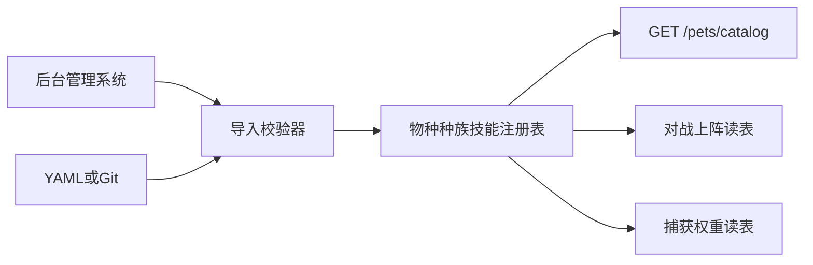
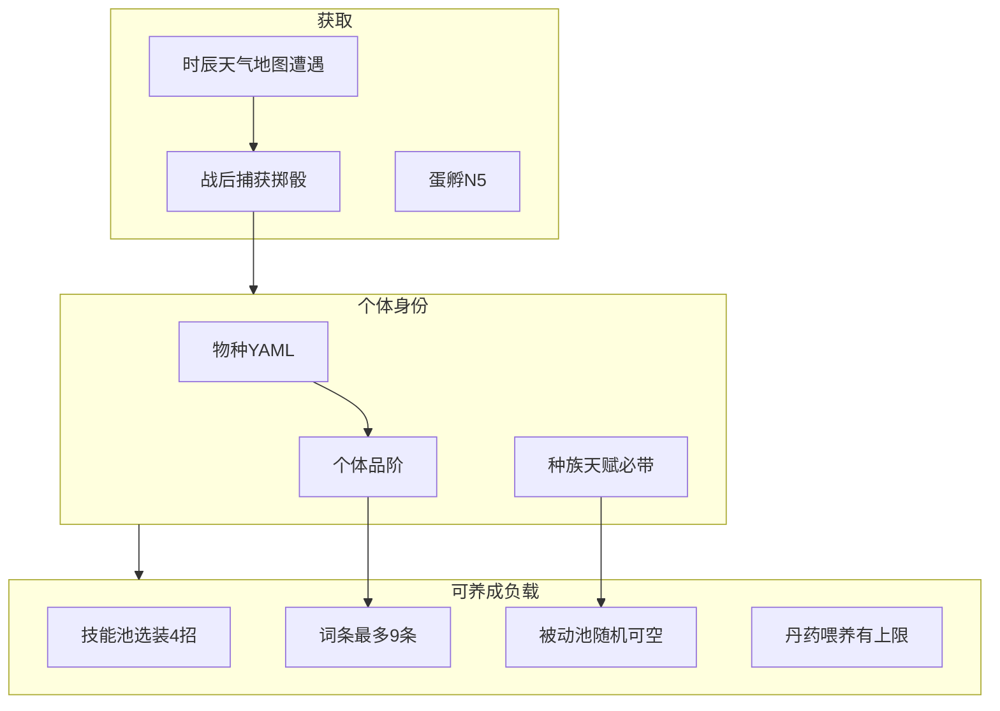

# 灵宠系统设计（宝可梦式遭遇 · 暗黑词条 · 技能装备）

> **文档性质**：GDD §11 的玩法扩展真相源（细则以本文为准；框架仍见 `project修仙.md` §11）  
> **版本**：v2.1 · 2026-08-07  
> **范围**：物种/种族/品阶、词条与洗炼、技能与技能书、被动与种族天赋、喂养、遭遇捕获、**宝可梦式回合制对战**、图鉴、灵兽宗改类型、蛋孵  
> **实现状态**：**N4/N5 + PET-D01～D06 + M4-D04c 已落地**；真地图 region 接驳见 M9  
> **关联**：[`M4双线程成长设计.md`](./M4双线程成长设计.md) §7 · [`开发计划.md`](./开发计划.md) 板块 N · [`后续待完成.md`](./后续待完成.md)  
> **原则（v1.2+）**：灵宠子系统 **相对独立**，不因 M7/M9「未开」而整块延期；内容 **热插拔**；灵兽宗改类型 **接口先行预留**。

---

## 1. 设计目标与边界

### 1.1 目标

用接近 **宝可梦** 的物种图鉴与遭遇节奏，叠加接近 **暗黑破坏神** 的词条养成，再加 **四技能装备** 与御兽捕获骰，扩展灵宠从「棋子面板占位」到可独立养成、可 **回合制对战**、可野外捕获的完整子系统；同时继续用 **神识** 约束自走棋上阵强度。

### 1.2 边界（写死）

| 做 | 不做 / 说明 |
| --- | --- |
| 种族 / 物种（品类）/ 技能 / 词条 / 被动 **全配置热插拔** | 加内容 **不改代码**；见 §1.4 |
| 词条最多 9；升阶加槽；日常只洗数值 | 改词条**类型**走灵兽宗（§5 / **PET-D06 已落地**） |
| 物种技能池 + 通用/种族技能书；装备 4 招 | **4 技能服务回合制对战**；自走棋仍读面板数值 |
| 时辰×天气×地图遭遇；战后捕获；自动捕 | 遭遇表用 `region_id` 热插；地图未成型时用占位区亦可验收 |
| 图鉴由物种表 **自动派生** | 运营加物种 → catalog / 图鉴同步出现，无需改前端枚举 |
| 与体质词条 **规则可类比** | 表与服务 **分离**（`pet_affixes` ≠ 体质词条） |

> **排期纪律（v1.2）**：PET-D* / 野外 / 灵兽宗 **不是**「等 M7/M9 才能开工」的冻结项。灵宠与宗门大厅、世界地图 **相对独立**——可并行竖切；仅当某功能物理依赖真坐标时用占位 `region_id`，地图接真即可。

### 1.3 与自走棋 / 神识

- **自走棋（M3）**：上阵灵宠继续贡献 `atk/hp/speed`（及未来光环类被动的数值投影）；**不要求**本期把 4 装备技能打进棋盘引擎。棋盘读技能另开条目（见 §13 `PET-D07`）。
- **灵宠对战**：独立简易回合制（§10）；**禁止**复用棋盘引擎。
- **神识**：上阵化身+灵宠仍占神识池；品阶高 ≠ 无视神识。完整公式见 M4-D03，不在本文展开。

### 1.4 热插拔与内容管线（强制）

新增 **种族、物种（品类）、技能、技能书、词条类型、被动、遭遇权重、品阶表行** 时：

1. **只写数据**（YAML 底表；运营经 [`后台管理系统开发计划.md`](./后台管理系统开发计划.md) **v1.3** `pets` 域条目表/发布 Overlay，契约不变）。  
2. **禁止**为新宠/新招改 Python/TS 分支、`if species_id == ...`、前端写死物种/技能枚举。  
3. **校验器**：启动或导入时校验外键（`race` 存在、`skill_pool` 内 id 合法、`racial_talent_id` 可解析）；坏数据拒绝加载并打日志。  
4. **图鉴同步**：`GET /pets/catalog`（及前端图鉴）= **物种注册表投影 + 玩家 seen/caught**；后台发布新物种后下次拉 catalog 即出现。  
5. **管理后台**：全站独立系统；灵兽宗设施闸 `sects.facilities.spirit_beast_sect`；预留桩 `/pets/sect/affix/*` 已挂。



与全站配置热更（**M2-D01 已落地**）及后台 `pets` 域同向：灵宠表优先「可整表替换/增量覆盖」的注册表。

---

## 2. 概念模型



### 2.1 术语对照（强制）

| 术语 | 含义 | 非含义 |
| --- | --- | --- |
| **种族 race** | 配置枚举（灵兽/灵禽/灵虫/精怪…）；绑定**种族天赋**与技能书限定 | 不等于个体品阶 |
| **物种 species** | YAML 主键；固定成长曲线、技能池、基础面板底 | 不等于稀有战利品 roll |
| **稀有度 rarity** | **物种表**字段（common/rare/epic/legendary） | 不是个体品阶 |
| **品阶 grade** | **个体**捕获/养成维度；同物种可高低品阶 | 不是物种 rarity |
| **词条 affix** | 槽内一条：固定**类型** + 可洗**数值**；有词条品级 | 不是技能栏 |
| **特殊词条** | 词条品级 ≥ 配置阈值（默认 `rare`）的条；影响捕获率 | 不是「任意词条」 |
| **被动 passive** | 独立于词条槽的随机被动（可空）；战斗/生活/修炼 | 种族天赋是必带、不算被动 roll |
| **技能 skill** | 主动技；物种池 + 书学；装备恰好最多 4 | 不等于被动 |

---

## 3. 物种 / 种族 / 品阶

### 3.1 种族（race）

| race_id | 名称 | 定位倾向（占位） |
| --- | --- | --- |
| `beast` | 灵兽 | 近战 / 坦 |
| `avian` | 灵禽 | 敏捷 / 远程 |
| `insect` | 灵虫 | 控制 / 毒 |
| `spirit` | 精怪 | 辅助 / 光环 |

每族必配 `racial_talent_id`（指向被动/天赋表；**必带，不可卸、不可洗类型**）。

### 3.2 物种字段（YAML）

| 字段 | 说明 |
| --- | --- |
| `species_id` / `name` | 主键与展示名 |
| `race` | 所属种族 |
| `rarity` | 物种稀有度 |
| `roles` | `dps` / `tank` / `control` / `support` |
| `base_atk` / `base_hp` / `base_speed` | **1 品阶**时的基础面板底 |
| `growth` | 升级成长系数（**同物种固定**；品阶不改成长） |
| `acquire_tags` | 途径白名单（`capture_test` / `egg_hatch` / `wild_capture` / …） |
| `skill_pool_id` | 物种可学主动技能池 |
| `passive_pool_id` | 可选；被动随机池（可与种族池合并加权） |
| `divine_sense_cost` | 可选；覆盖默认宠神识占用 |
| `evolve_to` | 可选；进化目标（深挖，不进 N4/N5 出口） |
| `base_capture_rate` | 可选；覆盖种族默认捕获底（野外用） |

### 3.3 个体品阶（grade）

- 捕获时按权重 roll 品阶（配置表）；升阶消耗材料/时间（PET-D01 定细则）。
- **效果**：
  1. 抬 **基础属性**（乘区或加值，YAML `grade_base_mult`）；
  2. 抬 **词条槽上限**（见下表，最高 **9**）；
  3. **不改变** `growth` 曲线。
- **升阶**：槽位 +1，并 **随机追加 1 条词条类型**（玩家不可选类型与品级权重按表）；旧词条类型与已洗数值保留。

#### 品阶 → 词条槽（占位表，可调）

| grade | 名称占位 | 词条槽上限 | 灵兽宗可改类型槽数 |
| --- | --- | --- | --- |
| 1 | 凡品 | 3 | 1 |
| 2 | 灵品 | 4 | 1 |
| 3 | 玄品 | 5 | 2 |
| 4 | 地品 | 6 | 2 |
| 5 | 天品 | 7 | 3 |
| 6 | 仙品 | 8 | 3 |
| 7 | 神品 | 9 | 4 |

可改类型槽数 ∈ **[1, 4]**，由品阶表给出，禁止散落 if。

---

## 4. 词条系统

### 4.1 结构

每条词条实例：

| 字段 | 说明 |
| --- | --- |
| `slot_index` | 0..cap-1 |
| `affix_type_id` | 类型（如 `flat_atk` / `pct_atk` / `passive_ref`…） |
| `affix_tier` | 词条品级：`common` / `rare` / `epic` / `legendary` |
| `rolled_value` | 当前数值（在类型允许的区间内） |
| `locked` | 可选；付费锁（后置） |

- 类型库与体质词条 **分表**：`config_data/pet_affixes.yaml`。
- 效果可以是 **属性强化** 或 **引用某被动**（仍占词条槽，与独立被动 roll 分流清晰：词条被动来自词条库，独立被动来自 passive 池）。

### 4.2 词条品级与数值区间（示例）

| 词条品级 | 典型形态 | 示例（攻击） |
| --- | --- | --- |
| common / rare | 平铺加值 | 攻击 +10～15 |
| epic | 较高平铺或小百分比 | 攻击 +20～30 或 +3%～5% |
| legendary | 百分比或强特效 | 攻击 +10%～15% |

具体区间全部进 YAML；禁止代码写死。

### 4.3 日常洗炼（数值-only）

- **只能**在同一 `affix_type_id` + 同一 `affix_tier` 的合法数值区间内重 roll。
- **不能**把「攻击 +10」洗成「防御 +10」。
- 费用：独立计数 `value_reroll_count[slot]`；曲线便宜于改类型（例：`cost = v_base * (1+v_grow)^(k-1)`）。

### 4.4 捕获时初始词条

- 槽位数 = 当前品阶上限。
- 每槽独立 roll 类型 + 品级 + 数值（权重表）；服务端权威。

### 4.5 升阶追加

- 新槽 **仅追加**；不重 roll 旧槽类型。
- 玩家无法控制新词条类型。

---

## 5. 灵兽宗：改词条类型（PET-D06 · **已落地**）

「改类别」玩法挂在 **灵兽宗**（或等价设施/NPC）；**不阻塞**于完整宗门系统——设施可用占位入口。

### 5.1 玩法规则

1. 可选中已解锁的改类型槽（数量 = 品阶表 `type_reroll_slots`，最少 1、最多 4）。
2. 选定后 **只改该槽的 `affix_type_id`（及随之重 roll 的 tier/value 规则按表）**；其它槽仍只能数值洗。
3. 费用（灵石，占位公式）：

设「第 i 个可改类型槽」的基础价（i 从 1 起）：

\[
base_i = base_1 \times i
\]

例：`base_1 = 100` → 100 / 200 / 300 / 400。

同槽第 k 次改类型（k 从 1 起，**各槽独立计数**）：

\[
cost_{i,k} = base_i \times (1 + grow)^{k-1}
\]

例：`grow = 0.1` → 槽1：100, 110, 121…；槽2：200, 220, 242…  
改完槽2再回来改槽1，用槽1 自己的 k，**不重置**其它槽计数。

> 用户口述「第二次 110、槽二初始 200、再回槽一 120」与指数增长同族；实现采用上式，数值可在 YAML 微调以贴合手感。

### 5.2 接口（N4 预留 → PET-D06 已填实）

| 方法 | 路径 | 行为 |
| --- | --- | --- |
| GET | `/pets/sect/affix/type-reroll/preview` | 费用公式；可选 `pet_id`+`slot_index` 报价 |
| POST | `/pets/sect/affix/reroll-type` | `pet_id` + `slot_index`；设施未开 **50110**；扣灵石改类型 |
| GET | `/pets/sect/affix/type-reroll/status` | 各槽 `type_reroll_count` 与下次费用 |

路径挂在 `/pets/sect/...`（灵宠域），避免死等 `/sect/*` 宗门路由；日后宗门大厅只做入口跳转。费用参数进 `pet_sect_reroll.yaml`（热插拔）。

---

## 6. 技能与技能书

### 6.1 规则

- 每只个体装备栏固定 **最多 4** 个主动技能。
- 可学来源：
  1. **物种技能池**（升级/领悟解锁，占位）；
  2. **技能书**：
     - `scope: universal` — 所有灵宠可学；
     - `scope: race` + `race_id` — 仅该种族；
     - （可选后置）`scope: species`。
- 重复技能、互斥标签由 YAML 约束。

### 6.2 战斗消费

- **灵宠对战（PET-D05）**：传统回合制；每回合从已装备的最多 **4** 招中选 1 招出手（详见 §10）。
- **自走棋**：本期不读技能栏；仅面板（+ 词条/被动的数值投影，在 PET-D01/D03 落地后）。

---

## 7. 被动与种族天赋（PET-D03 · **已落地**）

| 种类 | 必带？ | 来源 | 可否为空 |
| --- | --- | --- | --- |
| 种族天赋 | 是 | `race.racial_talent_id` | 否 |
| 独立被动 | 否 | `passive_pool` 按种族/类型加权 | **可以不 roll 到** |
| 词条内被动 | 随词条 | 词条类型引用 | 随槽 |

被动 `effect_domain`：`combat` / `life` / `cultivation`（对齐 GDD §11.3）。  
`combat` 效果叠入战斗面板；`life`/`cultivation` 本期仅展示。

---

## 8. 丹药喂养（PET-D04）

- 消耗指定丹药，永久（或本世）提高个体基础属性。
- **数量/总量上限**按物种或品阶配置（防无脑堆药）：物种覆盖 > 品阶覆盖 > `total_feed_cap`；另有单药 `per_item_cap`。
- 效果键与战斗 flat/pct 对齐；次数存 `feed_counts_json`，按 YAML 重算叠面板。
- 与工坊炼丹样本联动；无丹药配方时可用 GM/占位道具验收（DEV 发材料含 `pet_pill_*`）。
- **已落地**：`pet_feed.yaml` · `POST /pets/{id}/feed` · 超限 `40066` · 缺药 `40055` · 详情喂养 UI。

---

## 9. 遭遇、捕获与批量自动捕（M4-D04c · 可独立开工）

> 不绑死 M9：遭遇键用字符串 `region_id`；地图未开时用 `default` / `region_placeholder_*` 即可联调。M9 只是把占位区换成真区域。

### 9.1 遭遇

- 权重表键：`region_id × shichen × weather ×（可选）活动`。
- 遇敌类型：`cultivator` / `monster` / `spirit_beast` / …（可扩）。
- 仅 `spirit_beast`（及配置允许的类型）在战斗结束后进入捕获流程。
- **已落地**：`pet_encounter.yaml`；`POST /pets/explore/encounter`；`skip_battle=true` 时占位区可直接捕。

### 9.2 捕获检定（掷骰）

成功率（0～1，再映射到骰子系统阈值）：

\[
\begin{aligned}
p &= clamp\big(\\
&\quad p_{race} \\
&+ p_{taming\_tech} \\
&+ p_{realm\_diff} \\
&+ p_{root\_affinity} \\
&- n_{special\_affix} \times pen_{affix} \\
&- pen_{grade}(grade),\\
&0,\ 1\big)
\end{aligned}
\]

| 因子 | 说明 |
| --- | --- |
| \(p_{race}\) | 种族（或物种覆盖）基础成功率 |
| \(p_{taming\_tech}\) | 御兽类功法加成 |
| \(p_{realm\_diff}\) | 玩家修为相对灵兽越高越高；反之降低 |
| \(p_{root\_affinity}\) | 灵根与种族亲和表 |
| \(n_{special\_affix}\) | 词条品级 ≥ `capture.special_affix_min_tier`（默认 `rare`）的条数 |
| \(pen_{grade}\) | 品阶惩罚（同物种高品阶更难捕） |

每次尝试消耗 **诱灵草 ×1**；失败可再试（受日上限/袋空间约束）。  
**已落地**：`pet_capture.yaml`；`POST /pets/explore/capture`；回包含 `p` / `factors` / `roll` / `seed`；成功 `acquire_tag=wild_capture`。

### 9.3 批量探索自动捕

玩家可设置：遇到可捕灵兽且装备 **灵兽袋** 且袋内有空位且诱灵草足够 → 自动发起捕获尝试。  
无袋/满袋/无草 → 跳过或仅战斗（配置）。  
**已落地**：`POST /pets/explore/auto`（`auto_capture.enabled`）。

### 9.4 测试捕获

`capture_test` **不得**冒充 `wild_capture`；N4 仅用其走物种表 + 品阶占位 roll。

---

## 10. 灵宠对战（PET-D05）· 宝可梦式简易回合制

> **定位写死**：参照任天堂《神奇宝贝》**传统对战**——双方各出一只（或短序列换宠占位），按回合选招；**不是**自走棋，**不复用** M3 7×7 / AP / 移动 / 阵法引擎。

### 10.1 模式与边界

| 项 | 约定 |
| --- | --- |
| 对手 | 玩家 vs 玩家；个别 NPC 可配置 |
| 场面 | 双方当前出战灵宠各 **1**（首版可只做单宠打完；多宠队伍换宠 → 后置） |
| 引擎 | **独立** `pet_duel` 规则与战报 schema；禁止依赖 `autochess` / board |
| 面板来源 | 基础 × 品阶 × 词条 × 成长 + 种族天赋 + 被动 + **已装备 ≤4 技能** |
| 自走棋 | 继续只吃数值投影；对战技能栏互不串 |

### 10.2 回合流程（传统对战最小集）

1. **选招**：玩家从己方出战宠已装备的 4 个技能槽中选 1；也可选「防御/挣扎」类占位指令（YAML）。  
2. **先手**：比较双方 **速度**（面板 speed；同速再比配置 tie-break 或掷骰）。  
3. **结算**：先手技能结算 → 后手（若目标仍可战）→ 状态/持续效果 tick（毒/灼等占位）。  
4. **胜负**：一方 HP≤0 判负；首版不强制多宠续战。  
5. **服务端权威**：选招提交后服务端结算整回合；客户端只播报事件列表。

**明确不做（首版 / 防膨胀）**

- 棋盘移动、占位、阵法四象、AP、嘲讽光环探路  
- 即时策略、微操、多单位同屏混战  
- 完整属性相克大表可后置；首版可用简化 `element` 乘区或先做无克制纯数值

### 10.3 技能在对战中的形态（占位）

| 字段方向 | 说明 |
| --- | --- |
| `power` / `accuracy` | 威力与命中（命中可走骰子系统） |
| `pp` 或 冷却 | 任选一种限次模型；YAML 定一种，代码勿双轨 |
| `category` | `physical` / `special` / `status`（状态技改 buff/debuff） |
| `priority` | 可选；先制档（宝可梦式） |

### 10.4 验收钩子（PET-D05）

- 玩家间（及 1 个 NPC）可完成一场「选招→先手→伤害/状态→胜负」闭环；  
- 战报可复现（seed）；  
- **零** 依赖 formation/board API；  
- 未装备技能时有默认普攻占位，不崩溃。

---

## 11. 图鉴（与注册表同步）

对齐宝可梦式收集；**数据源 = 物种注册表**（§1.4），禁止前端/服务另维护一份「图鉴物种列表」。

| 状态 | 含义 |
| --- | --- |
| `unknown` | 未见（可灰影展示名或隐藏，由配置） |
| `seen` | 遭遇或观战见过 |
| `caught` | 曾捕获（持有过） |

`GET /pets/catalog`：

- **静态段**：当前注册表全部（或 `catalog_visible`）物种的 race/rarity/roles/简介字段；  
- **玩家段**：`seen` / `caught`；  
- **热插拔验收**：仅追加 YAML/后台一条新物种并重载配置 → catalog 多一条，**零**发版改代码。

---

## 12. 配置 Schema 草案

### 12.1 `pets.yaml`（扩展）

```yaml
hold_cap: 5
level_stat_bonus: 0.05

races:
  beast:
    name: 灵兽
    racial_talent_id: talent_beast_hide
    base_capture_rate: 0.35
  avian:
    name: 灵禽
    racial_talent_id: talent_avian_wind
    base_capture_rate: 0.32

grades:
  1: { name: 凡品, affix_slots: 3, type_reroll_slots: 1, base_mult: 1.0 }
  2: { name: 灵品, affix_slots: 4, type_reroll_slots: 1, base_mult: 1.08 }
  # …至 7 → slots 9 / type_reroll 4

capture_test_weights:
  common: 70
  rare: 25
  epic: 5
  legendary: 0

species:
  test_pet_fox:
    name: 试炼灵狐
    race: beast
    rarity: common
    roles: [dps]
    acquire_tags: [capture_test, gm_grant]
    skill_pool_id: pool_fox
    base_atk: 8
    base_hp: 40
    base_speed: 12
    growth: { atk: 1.0, hp: 1.0, speed: 1.0 }
    upgrade_cost: { spirit_stones: 100, materials: [{ item_id: pet_food_basic, quantity: 1 }] }
```

### 12.2 其它注册表（均为热插拔；随竖切建文件）

| 文件 | 用途 | 竖切 |
| --- | --- | --- |
| `pet_affixes.yaml` | 词条类型、品级区间、权重 | PET-D01 |
| `pet_skills.yaml` | 主动技能定义 | PET-D02 |
| `pet_skill_books.yaml` | 技能书与 scope | PET-D02 |
| `pet_passives.yaml` | 被动与种族天赋 | **PET-D03 已落地** |
| `pet_encounter.yaml` | 区域×时辰×天气遭遇 | M4-D04c |
| `pet_capture.yaml` | 捕获因子、诱灵草、日上限 | M4-D04c |
| `pet_sect_reroll.yaml` | 灵兽宗 `base_1` / `grow` / `enabled` | **PET-D06 已落地** |
| `pet_eggs.yaml` | 蛋→物种/耗时/费用 | **N5 已落地** |
| `pet_duel.yaml` | 回合制对战规则/NPC | **PET-D05 已落地** |

**加种族 / 加物种 / 加技能 = 只改上表**；校验器通过即对战、捕获、图鉴可读。

### 12.3 个体持久化（方向）

| 列/结构 | N4 | 其后 |
| --- | --- | --- |
| `species_id` | 已有 |  |
| `level` / `nickname` / `is_deploy_preferred` | 已有 |  |
| `grade` | **预留并写入占位** | 升阶逻辑 PET-D01 |
| `affix_slot_cap` | 可由 grade 推导；可冗余存储 |  |
| `affixes_json` | 可空 | PET-D01 填充 |
| `skills_equipped`（4 ids） | 可空 | PET-D02 |
| `passive_ids` | 可空 | PET-D03 |
| `feed_counts` | 可空 | PET-D04 |
| `type_reroll_counts` / `value_reroll_counts` | 可空列预留 | D01/D06 |

---

## 13. 竖切映射（并行友好 · 非冻结延期）

> 下表是 **推荐实现顺序**，不是「未到目标阶段禁止动手」。灵宠域可与 M6/M7/M9 **并行**。

| 步 / ID | 内容 | 建议时机 | 验收摘要 |
| --- | --- | --- | --- |
| **N4 / M4-D04a** | 种族+多物种+图鉴；`grade`；catalog **派生注册表**；热插拔校验；灵兽宗 **接口桩** | **已落地** | ≥2 种族 ≥3 物种；加 YAML 物种 → catalog 同步；reroll-type 返回未开放 |
| **N5 / M4-D04b** | 蛋孵 | **已落地** | 蛋→入园闭环 |
| **PET-D01** | 词条库；捕获/升阶 roll；数值-only 洗炼 | **已落地** | 升阶+槽+随机类型；洗炼不改类型 |
| **PET-D02** | 技能池+4 栏+技能书（数据热插） | **已落地** | 可装备 4；书 scope 校验；加技能只改 YAML |
| **PET-D03** | 被动池+种族天赋绑定 | **已落地** | 天赋必带；被动可空 |
| **PET-D04** | 丹药喂养上限 | **已落地** | 涨属性；超上限拒绝 |
| **PET-D05** | 灵宠对战（宝可梦式回合制） | **已落地** | 选招→先手→结算；seed 可复现；零 board |
| **PET-D06** | 灵兽宗改类型 **填逻辑**（接口已在 N4） | **已落地** | 1～4 槽；分槽递增费用 |
| **M4-D04c** | 遭遇+捕获全因子+自动捕 | **已落地**（占位 region） | 非 capture_test；骰可审计 |
| （笔记）**PET-D07** | 自走棋读灵宠技能栏 | 可选更后 | 不阻塞对战 |

**N4 最小必做**：**已完成**（注册表热插拔 + catalog + `grade` + 灵兽宗 API 预留）。  
词条/技能/对战/野外/喂养可在 N4 后 **任意并行**，不要求等 M7/M9 里程碑开关。

---

## 14. API 方向

| 方法 | 路径 | 说明 |
| --- | --- | --- |
| GET | `/pets` | 已有；扩 race/rarity/grade |
| GET | `/pets/catalog` | N4；**注册表投影** + seen/caught |
| POST | `/pets/capture_test` | 已有；N4 改抽表+grade |
| POST | `/pets/{id}/upgrade` | 已有等级占位 |
| POST | `/pets/{id}/grade-up` | PET-D01 |
| POST | `/pets/{id}/affix/reroll-value` | PET-D01 |
| GET | `/pets/sect/affix/type-reroll/preview` | **PET-D06**（可选 pet_id/slot 报价） |
| GET | `/pets/sect/affix/type-reroll/status` | **PET-D06** |
| POST | `/pets/sect/affix/reroll-type` | **PET-D06** |
| GET | `/pets/hatch` | **N5** 蛋目录+会话 |
| POST | `/pets/hatch/start` | **N5** 消耗蛋开工 |
| POST | `/pets/hatch/{id}/claim` | **N5** 领取入园 |
| POST | `/pets/{id}/skills/equip` | PET-D02 |
| POST | `/pets/{id}/feed` | PET-D04 |
| POST | `/pets/duel/*` | PET-D05 |
| GET | `/pets/explore/preview` | **M4-D04c** |
| POST | `/pets/explore/encounter` | **M4-D04c** |
| POST | `/pets/explore/capture` | **M4-D04c**（审计回包） |
| POST | `/pets/explore/auto` | **M4-D04c** 自动捕 |

错误码段与现有 `40057` 灵宠非法对齐扩展；设施未开用独立业务码（实现时定）。

---

## 15. 显性设计（对齐开发计划 §0.7）

- 词条类型、品级区间、捕获因子、品阶槽表、灵兽宗费用参数 **全部进注册表 catalog**。
- 联调验收清单须能指出：当前宠的品阶、每条词条类型与数值区间、捕获骰分项、改类型费用预览。
- **禁止**隐性：客户端私改词条类型、私改捕获成功、跳过诱灵草消耗。
- **禁止**为加宠改代码；全站内容写入走独立后台（见后台开发计划），现阶段 YAML + Git。

---

## 16. 修订记录

| 日期 | 说明 |
| --- | --- |
| 2026-08-07 | **v1.0** 初稿：宝可梦遭遇 + 暗黑词条 + 四技能 + 灵兽宗改类型 + 捕获骰；N4 收窄；PET-D01～D06 / D04c 映射 |
| 2026-08-07 | **v1.1** §10 定案：灵宠对战 = 神奇宝贝式**简易回合制**（非自走棋） |
| 2026-08-07 | **v1.2** 热插拔强制；子系统相对独立不绑 M7/M9；灵兽宗 **接口先行**；catalog 派生注册表；§13 改为并行竖切 |
| 2026-08-07 | **v1.2.1** §1.4：管理写入端改为全站独立系统指针 [`后台管理系统开发计划.md`](./后台管理系统开发计划.md) |
| 2026-08-07 | **v1.3** **N4 落地**：实现状态与 §13 N4 行改为已完成；下一竖切 PET-D01 / N5 |
| 2026-08-07 | **v1.4** **PET-D01 落地**：词条库 / grade-up / reroll-value；§13 PET-D01 行勾选 |
| 2026-08-07 | **v1.5** **PET-D02 落地**：技能池 / 四装备栏 / 技能书 scope；§13 PET-D02 行勾选 |
| 2026-08-07 | **v1.6** **PET-D05 落地**：vs NPC 回合制；`/pets/duel/*`；seed 复现；§13 PET-D05 行勾选 |
| 2026-08-07 | **v1.7** **PET-D06 落地**：灵兽宗改类型；`type_reroll_counts`；分槽费用；设施闸 + `pet_sect_reroll` |
| 2026-08-07 | **v1.8** **N5 落地**：`pet_eggs`；孵化会话；领取入园；灵兽园孵化 Tab |
| 2026-08-07 | **v1.9** **PET-D03 落地**：`pet_passives`；种族天赋必带；独立被动可空；combat 面板 |
| 2026-08-07 | **v2.0** **PET-D04 落地**：`pet_feed`；单药/总量上限；喂养叠面板；详情 UI |
| 2026-08-07 | **v2.1** **M4-D04c 落地**：遭遇表；全因子捕获骰可审计；诱灵草/袋；自动捕；`wild_capture` |

---

*冲突时：框架以 `project修仙.md` §11 为准；本子系统细则以本文为准；排期以 `开发计划.md` 与 `后续待完成.md` 为准；M4 雏形实现以 `M4双线程成长设计.md` 已落地部分为准。*
