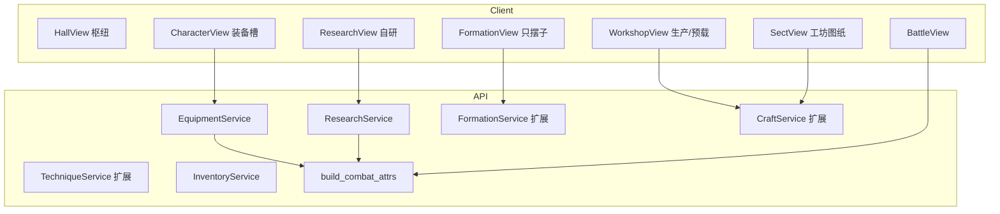

# M8 自研与内容管线 — 详细设计说明（骨架）

> 依据：`开发计划.md` §10 · `project修仙.md`（GDD）制造业/战斗内容生产扩展 · M0～M7 设计  
> 目标：玩家可 **自研** 产出可入库的功法残篇 / 阵盘草案 / 符箓图纸；运营可扩 YAML 样本表；**装备 / 傀儡喂入统一战斗面板**（接 §0.6.2 / **ATTR-D02**）  
> 范围外：见 [`后续待完成.md`](./后续待完成.md)（开实现前必读；尤其勿提前做满曲线、完整技能树、地图、真支付、化身双修）  
> 版本：v1.1.18 · 2026-08-20  
> 对应开发计划板块：**Y（自研功法）· Z（自研阵法）· AA（自研符箓）· AB（样本扩表）**；须同批消化 **ATTR-D02 · IDLE-R01 · DICE-R01 · M7-D06 · M3-D08 Phase B**；**道具法则**见 [`道具与装备实体设计.md`](./道具与装备实体设计.md) **R0（已落地）**  
> 前端落点：[`M8前端目录与路由设计.md`](./M8前端目录与路由设计.md)（**v1.1** 含视觉与布局：1100px 玩法壳、mode-nav、虚线槽、BoardGrid 设计器）  
> 阵法契约真相源：[`阵法部署与自研设计.md`](./阵法部署与自研设计.md)（部署四模式 / brush / 与官方同 schema；Phase B = 本里程碑 Z）  
> 属性契约真相源：[`ATTR战斗属性占位设计.md`](./ATTR战斗属性占位设计.md) **v1.3**（`AdditiveSource`；喂装备打开通道，**不重开字段**）  
> 装备门面：[`统一实体类层次与重构方案.md`](./统一实体类层次与重构方案.md) **R3**（`EquipmentItem` + Ability `stat_mod` + 傀儡双切面）  
> **道具 ABC 真理源**：[`道具与装备实体设计.md`](./道具与装备实体设计.md) **v0.8**（四页 / 占位不迁格 / **17 区** / 丹药方案 A·多轨时效 / 福宝不可逆耐久）  
> **检定骰权威**：[`骰子系统设计.md`](./骰子系统设计.md)（自研成败/暴击 `purpose=research_*`；装备改区间走 **DICE-R01**）  
> **挂机通道**：[`挂机速率与加成设计.md`](./挂机速率与加成设计.md)（装备 `idle_mult` 走 **IDLE-R01**）  
> 消化延后项指针：`ATTR-D02`、`IDLE-R01`、`DICE-R01`、`M7-D06`、`M3-D08 Phase B`

---

## ARCH 对齐（2026-08-17）

> 工程重构指针：[`统一实体类层次与重构方案.md`](./统一实体类层次与重构方案.md) · [`双轨整改与配置兼容方案.md`](./双轨整改与配置兼容方案.md)  
> **ARCH S1 已收口**。本里程碑打开 **R3 装备通道**：`EquipmentItem` + `EquipmentLoadout` + `channels.equipment` / `channels.puppet`；玩法数值曲线仍占位，**HTTP 既有路径默认不变**。

| 项 | 对齐 |
| --- | --- |
| 领域对象 | `EquipmentItem` / `TalismanItem` / `BlueprintItem`；`PlayerCharacter.iter_grant_sources()` 纳入已穿装备；`PuppetCharacter` 养成行喂 `AdditiveSource(puppet)` |
| 配置 | 经 ContentStore（`items` / `equipment` / `techniques` / `formations` / `talisman_effects` / `combat_attrs` / `idle` / `dice`）；测试可 `CONTENT_STORE_MODE=yaml_authority` |
| 战斗 | 开战仍 `on_battle_enter` → `BattleUnitSeed`；引擎纯度不变；装备/自研功法以 grants + ATTR 叠层进入 seed |
| 增量 | 新特效走 Ability grants / 效果白名单；禁止按装备 id / 自研 id 写死 `if` 分支 |
| 常量 | 槽位、会话相位、错误码、item_type 一律 `app.constants`（§0.6.3）；禁止业务文件新增魔数 |

---

## 1. 设计目标与思路

### 1.1 一句话目标

在 M7「弱社交服可运营」之上，打通 **玩家可产出、可入库、可进战** 的内容管线：自研至少 1 功法、1 阵法、1 符箓；装备与傀儡养成写入同一套 `build_combat_attrs`；挂机/骰子装备通道可开——**禁止**「先做自研、后做属性」各写一套攻击字段。

### 1.2 设计原则

| 原则 | 落地方式 |
| --- | --- |
| **ATTR 同批** | **R1 必须先于或并行咬合 Y**；自研功法词条、装备 `stats`、傀儡养成 **只写** `CombatAttrBlock` / `AdditiveSource` 已登记键 |
| **服务端权威** | 自研会话、定稿、穿戴、画符库存、快照内联只在服务端；前端只展示与发起 |
| **配置驱动** | 材料表、词条池、效果白名单、槽位、通道开关进 YAML；须可后台域管理（§0.0 / §0.0.1 双写+中文字段） |
| **官方与自研同 schema** | 功法残篇 / 阵法蓝图 / 符模板与官方表同构；私有多 `owner_character_id` + `source=custom` |
| **定稿不可变** | 定稿后禁止改蓝图/残篇/图纸；再改只能另存新版新 id（对齐阵法专文 §10.3） |
| **效果白名单** | 自研不可发明未登记的战斗效果 id（防外挂造载荷）；官方表可任意（仍经校验器） |
| **机读英文、人读中文** | id / slot / phase 英文；UI / 战报 / 设计正文用中文（§0.0.2） |
| **显性设计** | 面板必须能回答：装备改了哪一键、来自哪一槽、挂机/骰子通道是否开启（§0.7） |
| **玩法页皮肤继承** | 布局/样式以 [`M8前端目录与路由设计.md`](./M8前端目录与路由设计.md) **§4 / §6.5** 为准：1100px 文档流 + Element Plus；大厅入口进 `hall-nav`；装备抄体质虚线槽；阵法设计器复用 `BoardGrid`。禁止把登录页 `.game-card` 金色印章壳搬进自研 |
| **骰子统一门面** | 自研成败/暴击走 `DiceService`；禁止业务 `randint` |
| **延后必登记** | 审核真池、套装满表、完整技能树、符箓完整道具链、IDLE-R02/DICE-R02 完式写入 `后续待完成.md` |

### 1.3 成功标准（验收）

1. **ATTR-D02**：角色可穿戴配置样本装备；`build_combat_attrs` 的 `breakdown` 出现 `source=equipment`（中文「装备」）；通道可关则数值回落。  
2. 傀儡养成行（已有 `PuppetActor`）写入 `channels.puppet`；面板可见来源；可关。  
3. **IDLE-R01**：装备词条可改 `idle_mult`；`idle_env.breakdown` 出现 `equipment`；与体质内部乘区叠乘。  
4. **DICE-R01**：装备可改骰子 min/max；`DiceBounds.breakdown` 出现 `equipment`。  
5. **Y**：材料+修为/炼体投入 → 草稿功法（schema 版本化）→ 定稿入角色私有功法表 → 可装备 → 开战面板/战报能区分样本功 vs 自研（`source_label_zh`）。  
6. **Z**：阵盘草案（部署模式 + mask/free_own + brush）经 `validate_blueprint` → 定稿私有 `formation_id` → 挂钩 `array_craft_level` → 可出战并写入快照（内联或版本冻结）。  
7. **AA**：符箓图纸仅白名单效果 → 批量画符入背包 → 出战预载栏占位 → 至少 1 个自研符在战报有 `item_trigger`（或等效中文事件）；可关开关回退。  
8. **M7-D06**：宗门工坊代工真扣材料；捐赠图纸 `item_type` 入工坊目录；藏宝阁拒收类型与背包枚举一致。  
9. **AB**：功法/阵法/符/体质词条/装备 **导入校验器** CI 可跑；坏表拒绝启动或告警；README 有「如何新增一条 YAML 样本而不改代码」。  
10. 路由：`/research` 三分支 + `/character` 装备槽 + `/workshop` 生产/预载 + `/formation` 仍只摆棋子，可从大厅进入。  
11. README / CHANGELOG / `.env.example` 同步；ADM 域登记；无密钥硬编码；新协议值进 `app.constants`。  
12. **竖切步均有验收**（§14）；不得用「能开空页」代替装备喂属性与自研定稿闭环。

### 1.4 明确不做 / 延后（指针）

完整清单与验收钩子见 [`后续待完成.md`](./后续待完成.md)。与本里程碑相关：

| ID / 主题 | 摘要 |
| --- | --- |
| **M8-D01** | 自研提交全服审核池 **真审核**（本期仅占位开关/队列字段） |
| **M8-D02** | 装备套装 2/4 件完整数值与套装特效矩阵（本期槽位 + `stats` + 最小 `grants`） |
| **M8-D03** | 自研功法完整主动/被动技能树（接 **M3-D03**；本期残篇可装备进 ATTR，不必完整施放链） |
| **M8-D04** | 符箓出战预载完整道具/陷阱库存链（接 **M3-D03**；本期 1 个 `item_trigger` 占位） |
| **M8-D05** | **IDLE-R02 / DICE-R02** 丹药·符箓时效 buff 完式（本期通道可预留；**不进出口**） |
| **M7-D01** | 化身参与双修（仍仅本体；**禁止**半套化身双修字段） |
| **ATTR-D03** | 野怪/NPC/Boss 满模板 → **M9** |
| ATTR 填数 / 37 道满表 | → **M13**；禁止重开字段名 |
| 完整神通名录 | → M13 |
| 出战中临时改阵法地形 | **永不做**（与快照一致性冲突） |
| 微操战斗 | **永不做** |

### 1.5 与 M0～M7 的关系

| 已交付 | M8 动作 |
| --- | --- |
| JWT / 创角 / `CharacterPublic` | 保留；追加 `equipment` 摘要、`research` 进行中、combat `breakdown` 装备/傀儡行 |
| ATTR-D01 `build_combat_attrs` / `AdditiveSource` | **打开** `channels.equipment` / `channels.puppet`；禁止另起 atk |
| ARCH S1 `Item` ABC / `PuppetActor` / GrantSource | 落地 `EquipmentItem`；傀儡养成喂 puppet 通道 |
| 功法分配（M2） | 自研定稿写入同一套「已学功法」装配；分配经验兼容 |
| 阵法 Phase A（M3-D08） | Phase B 设计器 + 私有定稿；出战页仍只摆棋子 |
| 工坊/背包（M4） | 画符/炼器产出装备与符；`item_type` 扩 `equipment` 与图纸类 |
| 挂机三层模型 / `idle.yaml` | 开 `bonus_channels.equipment_idle` |
| 骰子 `bonus_channels.equipment` | 开通道；读装备 `dice_mods` |
| 宗门工坊骨架（M7-V+） | 真材料与图纸类型（**M7-D06**） |
| `PlayGate` | 定稿/开工画符/穿脱装备写路径均经 Gate；修炼中须先停（§0.8） |
| `/workshop` `/formation` `/character` | 扩展，不推翻；**新增** `/research` |

```text
M4：配方队列 → 成品入包（丹/符/傀/阵法等级）
M7：交易/宗门工坊贡献闭环（图纸类型占位）
M8：装备喂 ATTR + 自研定稿入库 + 扩表校验
    → 自研功/阵/符可出战；快照含私有阵盘
```

### 1.6 关键设计决策（实现拆分锚点）

> 锁定后 **不得在实现中偷偷改语义**；变更须改本文并记修订记录。  
> **实现顺序 = §14 竖切**，与下表对应。

| # | 决策 | 一句话 | 落入 |
| --- | --- | --- | --- |
| D1 | **ATTR 同批、禁止第二套 atk** | 装备/自研/傀儡只写已登记战斗键 | **R1** |
| D2 | **穿戴栏** | **17 区权威**（15 装备 + `pet` + 傀儡编成板）；五槽已废 | **R0** |
| D3 | **stats + grants** | 装备基础属性走快捷 `stats`；特效走 Ability `grants` | **R1** |
| D4 | **三通道同开** | combat `equipment`/`puppet` + idle `equipment_idle` + dice `equipment` | **R1** |
| D5 | **化身不吃本体装备** | 除非配置显式 `avatar_inherits_equipment`（默认 false） | **R1** |
| D6 | **洞府下研究室** | `/cave` 一级；`/cave/lab?mode=technique\|formation\|talisman` | **已改** 2026-08-20 |
| D7 | **布阵≠设计** | `/formation` 只改棋子落点；蓝图只在 `/cave/lab?mode=formation` | **R3** |
| D8 | **同 schema** | 官方 YAML ∪ 私有定稿共用校验器 | **R2～R4** |
| D9 | **定稿冻结** | 再改必须新 id；快照不追踪作者事后改草案 | **R3** |
| D10 | **效果白名单** | 自研阵载荷 / 符效果 / 功法词条 id ∈ 注册表 | **R2～R4** |
| D11 | **私有 id 前缀** | `custom:{kind}:{character_id}:{slug}` | **R2～R4** |
| D12 | **自研阵进快照** | 内联蓝图或不可变 `revision`；官方阵仍 id+配置哈希 | **R3** |
| D13 | **审核池占位** | Y2 `submit_review` 返回「尚未开放」；不做真审台 | **R2** |
| D14 | **扩表校验** | 启动 + CI 跑同一套 validator；坏表拒绝 | **R6 已落地** |
| D15 | **图纸真类型** | `item_type=manual` + `manual_kind`∈{forge/talisman/alchemy/puppet/formation\_blueprint}；禁止第三套大类 | **R5 已落地** |
| D16 | **自研掷骰** | `purpose=research_technique\|research_formation\|research_talisman` | **R2～R4** |
| D17 | **常量包** | `app.constants.equipment` / `research`；错误码 40200+ | **横切** |
| D18 | **ADM 双写** | 域 `equipment` + 白名单域；字段 `label_zh`/`help_zh` | **R1 / R6** |
| D19 | **显性来源** | 面板 breakdown 中文；通道关闭时展示「未启用」而非静默 | **R1** |
| D20 | **战报区分来源** | 功法/符事件带 `source_label_zh`（样本 / 自研） | **R2 / R4** |
| D21 | **符最小触发** | 1 个白名单 `item_trigger`；完整链 → M8-D04 / M3-D03 | **R4** |
| D22 | **时效 buff 不进出口** | IDLE-R02 / DICE-R02 → **M8-D05** | **R4 禁偷开** |
| D23 | **化身不双修** | 维持 M7-D01；本里程碑 API 不预留 | — |
| D24 | **定稿经 PlayGate** | 修炼中 / 渡劫 / 待引渡 / 工坊 RUNNING 按互斥表拒绝 | **R2～R4** |
| D25 | **傀儡双切面** | 背包 `PuppetItem`；上阵 `PuppetCharacter`；养成数字只经 puppet 通道 | **R1** |
| D26 | **Item ABC 先于 R3** | 自研图纸/丹方/装备必须挂同一 `Item` 树；见道具专文 | **R0** |
| D27 | **四法则** | `bound` / `unique` / `tradable` / `max_stack`+`quantity` 语义写死 | **R0** |
| D28 | **装备浅继承** | 细类用 `equip_kind`，不新开 `item_type`、不新开第六槽 | **R0** |
| D29 | **秘籍≠配方定义** | 包内 `ManualItem`；配方/功法正文归 Content | **R0 / R5** |
| D30 | **禁止 Item+Character 双继承** | 傀儡/宠/蛋用互指双切面 | **R0** |
| D31 | **占位不迁格** | 穿戴/上阵不腾背包格；标已装备/已上阵；占用中禁交易 | **R0** |
| D32 | **背包四页** | `gear`装备 / `elixir`丹药 / `material`材料 / `manual`秘籍 | **R0** |
| D33 | **装备深度 A + 扩展点** | 只落地 kind+槽表；养成进 `extras`；禁止改占用/大类 | **R0** |
| D34 | **17 区穿戴栏** | 15 装备格 + `pet` 硬顶 1 + **傀儡编成板（列表，无件数硬顶）**；双手占两格；布阵只摆坐标 | **R0** |
| D35 | **福宝消耗** | `item_type=equipment`；`durability_mode=irreversible`；到 0 破碎 | **R0 法则 / 结算可后开** |
| D36 | **傀儡编成 ≠ 单槽** | 编成板最多 3 只；神识占用并入共享池（M4 §6.4）；灵宠硬顶 1 | **R0 法则** |
| D37 | **丹药方案 A** | `use_effect` 白名单；时效多轨 `wall`/`battle`/`round`；禁止裸 duration；结算 M8-D05 | **R0 契约 / M8-D05 结算** |


---

## 2. 技术框架设计

### 2.1 选型（继承 M0～M7）

| 层 | 技术 | M8 增量 |
| --- | --- | --- |
| 后端 | FastAPI + SQLAlchemy 2 async + bootstrap | equipment loadout / research sessions / private techniques·formations·talisman templates / blueprint item_types |
| 配置 | YAML + OverlayStore + ContentStore | `equipment.yaml` / `research.yaml` / `talisman_effects.yaml`；扩展 `inventory.yaml` / `combat_attrs.yaml` / `idle.yaml` / `dice.yaml` / `formations.yaml` / `techniques.yaml` / `sects.yaml` |
| 领域 | `app/game/item` + `domain/` 纯校验 | `EquipmentItem`；`validate_blueprint` 已有则复用；自研 schema codec |
| 前端 | Vue3 + Pinia + Router | **一条新路由** `/research` + 角色页装备槽 + 工坊预载 + 阵法设计器复用 BoardGrid |
| 定时 | **无全表扫** | 自研会话过期：读时惰性作废（同挂机） |
| 骰子 | `dice_rules` 门面 | `research_*` purpose + 装备通道 |
| WS | 复用 Hub | **不**为自研新开房间；可选 `game.log` 推送定稿摘要（加分非阻塞） |

### 2.2 系统上下文



### 2.3 分层

```
api/research.py · api/equipment.py  （薄路由）
  → services/equipment_service.py · research_service.py
  → game/item/equipment.py（EquipmentItem）
  → domain/equipment_rules.py · research_schema.py · formation_blueprint.py
  → db/models + config_data/*.yaml（ContentStore）
```

跨玩法前置统一 `PlayGate`。无 IO 规则进 `domain/`。协议枚举进 `app.constants.equipment` / `app.constants.research`。

---

## 3. ATTR-D02 · 装备 / 傀儡喂入（板块挂钩 Y5）

### 3.1 装备槽（`EquipmentLoadout`）

| 槽 `slot` | 中文 | 一期规则 |
| --- | --- | --- |
| `weapon` | 武器 | 每角色 1；类型须 `equip_slot=weapon` |
| `armor` | 防具 | 每角色 1 |
| `accessory_1` | 项链 | 与 `accessory_2` 同类；不可同一 `unique` 实例双戴 |
| `accessory_2` | 饰品 | 同上 |
| `fabao` | 法宝 | 每角色 1；可空 |

穿戴：从背包把 `item_type=equipment` 实例装入槽；卸下回包。绑定规则同交易（绑定可自用不可上架）。

### 3.2 `EquipmentItem` 契约

```yaml
# equipment.yaml 条目示意（官方样本）
iron_sword_t1:
  label_zh: 玄铁剑（占位）
  help_zh: 教学武器；打开装备通道后喂物理攻击
  slot: weapon
  item_type: equipment
  stats:                    # 快捷加算，键必须 ∈ CombatAttrBlock
    phys_atk: 3
  dice_mods:                # DICE-R01；缺省不加
    min_bonus: 0
    max_bonus: 1
  idle_mods:                # IDLE-R01
    idle_mult: 1.02
  grants: []                # Ability id 列表；套装完式 → M8-D02
  required_major_realm: body_tempering
```

- `stats` 经 `AdditiveSource(source="equipment", label_zh="装备")` 叠入。  
- 非法键（未登记 ATTR）→ **校验失败**，禁止静默丢弃。  
- `grants` 走既有 Ability 展开；无对应 Ability 的 id → 拒绝发布/拒绝穿戴。

### 3.3 傀儡通道

- 已落地：`PuppetActor` + 开战 `PuppetCharacter`。  
- M8：傀儡养成字段（精度/等级占位）映射到 `AdditiveSource(source="puppet", label_zh="傀儡养成")`，写入该棋子的 `build_combat_attrs`，**不是**改本体面板。  
- `combat_attrs.yaml` `channels.puppet.enabled: true`（可关）。

### 3.4 通道开关（必须可关）

| 通道 | 配置 | 关闭行为 |
| --- | --- | --- |
| 战斗装备 | `combat_attrs.channels.equipment.enabled` | 穿戴仍允许，**不**叠战斗键；面板注明「装备属性通道未启用」 |
| 傀儡 | `channels.puppet.enabled` | 傀儡按模板地板，不叠养成 |
| 挂机 | `idle.yaml` `bonus_channels.equipment_idle.enabled` | `idle_mult` 视为 1.0 |
| 骰子 | `dice.yaml` `bonus_channels.equipment.enabled` | 不加 min/max |

验收：**同一套装备**，关通道后面板/settle/骰区间与未穿戴一致（允许仍显示槽位外观）。

### 3.5 显性出口

`CharacterPublic.combat.breakdown` 增行：

| `source` | `label_zh` |
| --- | --- |
| `equipment` | 装备 |
| `puppet` | 傀儡养成 |

`idle_env.breakdown` 增 `equipment`（中文「装备」）。骰子响应 `dice.breakdown` 增 `equipment`。禁止把 `weapon` 等槽 id 裸给玩家。

---

## 4. 板块 Y · 自研功法

> **2026-08-28 · P1 已实现**：功法自研已替换为卡片草稿流程，见 [`docs/superpowers/specs/2026-08-27-technique-research-design.md`](../docs/superpowers/specs/2026-08-27-technique-research-design.md)。下列 R2「材料会话 + 一次词条预览」为**已下线旧流程**，勿再加旧会话字段。秘籍/藏经阁/师徒为 P2–P4。

### 4.1 流程

```text
选材料 + 投入修为/炼体（配置表）
  → POST 创建会话（drafting）
  → 预览词条槽（服务端 roll + 白名单池；返回 dice）
  → 可重投次数配置（耗额外材料）
  → 定稿命名（中文名校验）→ 写入角色私有功法
  → 可选 submit_review（占位 → 40210）
  → 装备进 TechniqueBag → grants / ATTR
```

### 4.2 草稿 schema（版本化）

私有功法与 `techniques.yaml` 条目同构，额外字段：

| 键 | 含义 |
| --- | --- |
| `source` | `custom` |
| `schema_version` | 整数；与官方 codec 对齐 |
| `owner_character_id` | 所属角色 |
| `revision` | 定稿版本；冻结后只读 |
| `affix_ids` | 词条 id 列表 ⊆ 白名单 |
| `label_zh` | 玩家命名（审核占位仍须中文可见） |

非法材料、词条越池、schema 不匹配 → `40200` / `40208`。

### 4.3 与 M2 分配兼容

定稿后出现在「已学功法」列表，可投入制造业/修为分配（若该残篇允许升级）。升级 **不** 改已冻结词条集合，只改等级系数（占位）。完整技能施放链 → **M8-D03**。

### 4.4 战报

事件可留 `technique_id`；渲染出口必须有 `technique_label_zh` + `source_label_zh`（「官方样本」/「自研」）。禁止战报打出 `custom:…` 裸 id。

---

## 5. 板块 Z · 自研阵法（M3-D08 Phase B）

> 部署模式、brush、移位、快照冻结以 [`阵法部署与自研设计.md`](./阵法部署与自研设计.md) **§3～§10** 为准；本文只定 **会话与权限**。

### 5.1 流程

```text
材料 / array_craft_level 门槛
  → 创建草案（默认 deploy.mode=default）
  → 设计器：选模式 → 画 mask / 设 free_own 上限
        brush 地形（预算内）
        四象白名单载荷
        可选 force_shifts（条数帽）
  → 多次保存草案
  → 定稿 validate_blueprint + 扣材料
  → 私有 formation_id 可出战 / 进快照
```

### 5.2 与出战页边界（写死）

| 界面 | 改什么 |
| --- | --- |
| `/research?mode=formation` | 蓝图（模式、区、地形、移位、四象） |
| `/formation` | **只**棋子落点；下拉可选已定稿自研阵 |

禁止在出战页改 `deploy.mode` 或现场刷障碍。

### 5.3 快照

- 官方阵：`formation_id` + 配置版本哈希。  
- 自研阵：**内联蓝图** 或 `formation_id` + 不可变 `revision`。攻打时加载快照内副本，**不**读作者当前草案。

---

## 6. 板块 AA · 自研符箓

### 6.1 图纸 vs 生产

| 阶段 | 路由 | 产物 |
| --- | --- | --- |
| 设计图纸 | `/research?mode=talisman` | 私有符模板（效果 id 白名单） |
| 批量画符 | `/workshop?branch=talisman` | 背包 `item_type=talisman` 实例 |
| 出战预载 | 工坊预载栏 或 开战前栏 | 本场可触发的符位；跨场扣减权威在服务端 |

### 6.2 白名单

`talisman_effects.yaml`（ADM 域）：每条 `id` + `label_zh` + 效果参数占位。自研只许引用已发布 id。非白名单 → `40204`。

### 6.3 战报最小集

至少 1 个样本自研符：开战预载 → 触发条件占位（如首次受击）→ `item_trigger` 事件，中文「符箓：××」。完整 CD/库存陷阱链 → **M8-D04**。开关 `research.talisman_battle.enabled` 可关回退。

---

## 7. 板块挂钩 · M7-D06 宗门工坊真材料与图纸

### 7.1 类型权威（已锁 · R5）

**背包大类**只用 `item_type=manual`（秘籍页）。图纸细类走 **`manual_kind`**，**不是**第三套 `item_type`。

| `manual_kind` | 中文 | 工坊分支 |
| --- | --- | --- |
| `forge_blueprint` | 锻造图纸 | smithing |
| `alchemy_formula` | 丹方 | alchemy |
| `talisman_blueprint` | 符箓图纸 | talisman |
| `puppet_blueprint` | 傀儡图纸 | talisman（服务工坊） |
| `formation_blueprint` | 阵盘图纸 | array（本期工坊页未开） |

`sects.yaml` `treasury.forbidden_deposit_types` 登记的是上述 **manual_kind 别名**（兼容客户端误传同名假 `item_type`）；真入库按目录解析 `item_type`+`manual_kind` 再拒。

样本：`inventory.yaml` `bp_ore_plate_t1` / `bp_pill_stamina_minor` / `bp_talisman_atk_t1`。

**本期不做**：图纸品阶、学习门槛、消耗后解锁配方完式、战斗属性——登记延后，禁止在 R5 顺手发明。

### 7.2 工坊行为（已落地）

- 代工：按配方 **真扣** 材料（不足 `40055`）；领取 **成品入包**（精品产量×2 占位）。  
- 兑换：扣贡献 → 背包发 `manual`（`bp_{recipe_id}`）。  
- 捐赠：非自研须耗背包 `manual` 行；`manual_kind` 与分支不匹配 → **`40209`**；已收录拒绝。  
- 藏宝阁：图纸类拒收（遗留假类型 + `manual`+kind）。

---

## 8. 板块 AB · 样本扩表管线

### 8.1 校验器

启动加载与 CI 共用 `config_source` / ContentStore 校验：

- 功法 / 阵法蓝图 / 符效果 / 体质词条 / 装备 `stats` 键 ∈ ATTR 注册表  
- 阵法 `validate_blueprint`（已有则调用）  
- 坏表：**拒绝启动**（development 可告警+退出码非 0）；发布路径拒绝发布

### 8.2 文档

README 增加一节：**新增一条官方样本功法/装备/符效果，只改 YAML（或后台表格），不改玩家代码**。给出最小 diff 示例与后台域名。

---

## 9. 配置与后台（§0.0）

| 域 `domain_id` | 用途 | 双写 |
| --- | --- | --- |
| `equipment` | 官方装备目录 | 表格 + JSON |
| `research` | 自研材料、词条池、重投次数、通道 | 表格 + JSON |
| `talisman_effects` | 符效果白名单 | 表格 + JSON |
| `techniques` / `formations` / `items` / `combat_attrs` / `idle` / `dice` / `inventory` | 既有域扩展字段 | 沿用 §0.0.1 |

每个新字段必须有 `label_zh` / `help_zh`。高危：`channels.*.enabled`、效果白名单增删。DEV `/gm` 仅发测试装备/材料，正式改数走后台。

---

## 10. 数据模型（示意）

| 表 / 存储 | 职责 |
| --- | --- |
| `character_equipment` | 角色 id + slot + inventory_item_id；唯一 (character_id, slot) |
| `research_sessions` | 会话：kind、phase、投入快照、seed、过期时刻 |
| `private_techniques` | 定稿功法残篇 JSON + revision + label_zh |
| `private_formations` | 定稿蓝图 JSON + revision（草案可另表 `formation_drafts`） |
| `private_talisman_templates` | 定稿符模板 + 效果 id |
| `inventory_items` | 扩类型；装备实例绑定 def_id |
| 既有 `puppets` / `PuppetActor` | 养成列映射 puppet 通道 |

轮回：装备默认进普通袋规则走 `inventory.yaml`；自研私有内容 **默认不带出**（可配 `research.reincarnation_carry`，本期 `false`）。贡献/图纸不进本里程碑轮回深化。

---

## 11. 错误码（玩家 API）

> 实现时写入 `app.constants.research`；文案中文。

| 码 | 场景 |
| --- | --- |
| `40200` | 非法材料或投入不足 |
| `40201` | 自研会话不存在或已过期 |
| `40202` | 草案/残篇校验失败（细节在 message） |
| `40203` | 定稿门槛未达标（阵法等级 / 制符熟练 / 境界） |
| `40204` | 非白名单效果或词条 |
| `40205` | 装备槽冲突 / 槽位与物品不匹配 / 境界不足 |
| `40206` | 已定稿不可改（须另存） |
| `40207` | 私有内容不属于当前角色 |
| `40208` | 词条槽数量/重复非法 |
| `40209` | 图纸 `item_type` 与工坊分支不匹配 |
| `40210` | 审核池尚未开放（占位） |
| `40211` | 当前活动互斥，不可定稿/画符 |
| `40212` | 请求要求「强制吃装备数值」但通道关闭（可选；默默按关通道结算即可不抛） |
| `40213` | 符位预载非法（非持有 / 非本模板） |
| `40055` | 材料数量不足（沿用） |
| `40074`～`40077` | 活动互斥（沿用 PlayGate） |
| `40041` / `40044` / `40054` / `40055` | 阵法占位/不存在/等级（沿用） |

---

## 12. HTTP 契约（示意）

前缀 `/api/v1`。均需登录+角色；写操作经 PlayGate。

### 12.1 装备

| 方法 | 路径 | 说明 |
| --- | --- | --- |
| GET | `/equipment/slots` | 17 区指针槽 + 每槽摘要 + `puppet_loadout`/`bag_puppets` + 通道 |
| POST | `/equipment/puppet-loadout/add` | 傀儡加入编成（`occupancy=deployed`） |
| POST | `/equipment/puppet-loadout/remove` | 傀儡移出编成 |
| POST | `/equipment/equip` | `{ slot, item_uid }` |
| POST | `/equipment/unequip` | `{ slot }` |
| GET | `/equipment/catalog` | 官方样本图鉴（只读；含 label_zh） |

穿脱成功后返回最新 `CharacterPublic.combat`（含 breakdown），避免前后端各算。

### 12.2 洞府 / 研究室

权威前缀 `/cave/lab`；旧 `/research/*` 为兼容别名。来源标签仍为「自研」。

| 方法 | 路径 | 说明 |
| --- | --- | --- |
| GET | `/cave` | 洞府房间列表 |
| GET | `/cave/lab/catalog` | 材料、词条池、门槛、通道说明（中文） |
| POST | `/cave/lab/sessions` | `{ kind: technique\|formation\|talisman, materials, spends }` |
| GET | `/cave/lab/sessions/{id}` | 会话状态 + 预览 |
| POST | `/cave/lab/sessions/{id}/reroll` | 重投词条（耗材料） |
| POST | `/cave/lab/sessions/{id}/draft` | 阵法蓝图或符箓效果存盘 |
| POST | `/cave/lab/sessions/{id}/finalize` | `{ label_zh }` 定稿 |
| POST | `/cave/lab/sessions/{id}/submit-review` | 占位 → 40210 |
| GET | `/cave/lab/mine` | 我的已定稿功/阵/符列表 |

### 12.3 阵法 / 工坊扩展

| 方法 | 路径 | 说明 |
| --- | --- | --- |
| GET | `/formation/presets` | 增量：自研阵出现在下拉；`effective_deploy_cells` 仍服务端算 |
| POST | `/craft/talisman/scribe` | 按模板批量画符 |
| PUT | `/craft/talisman/preload` | 出战预载栏 |
| POST | `/sect/workshop/donate-blueprint` | 捐赠图纸（类型校验） |

幂等：定稿 / 画符 / 穿戴写路径支持 `Idempotency-Key`（沿用 M1-D30 中间件）。

---

## 13. 后端模块设计思路

### 13.1 并发

- 穿戴：行锁库存行 + 槽位唯一约束。  
- 定稿：会话行 `phase` 条件更新，防双花材料。  
- 画符：扣材料与入包同一事务。

### 13.2 日志

关键穿戴、定稿、画符、通道开关变更 → `logging`（禁止 `print`）。自研 seed 写入会话便于复现。

### 13.3 测试最低集

| 测试 | 断言 |
| --- | --- |
| `test_equipment_attr_feed` | 穿武器 → phys_atk breakdown 有装备；关通道回落 |
| `test_equipment_idle_dice_channels` | idle_mult 与 dice min/max 出现 equipment |
| `test_puppet_channel` | 傀儡养成改棋子面板；关通道回落 |
| `test_research_technique_finalize` | 非法材料拒绝；定稿可装备；战报来源中文 |
| `test_research_formation_blueprint` | 越区 brush 拒绝；定稿可出战；快照内联不随后改 |
| `test_research_talisman_whitelist` | 非白名单拒绝；画符入包；item_trigger 可关 |
| `test_sect_blueprint_item_type` | 真扣材料；错误图纸类型 40209 |
| `test_content_validators_m8` | 坏装备键 / 坏蓝图拒绝加载 |

---

## 14. 竖切实现计划（强制）

> 与 [`开发计划.md`](./开发计划.md) §10 板块对齐；**前后端交叉**，每步可玩可测。  
> **纪律**：不得先做 Y/Z/AA 再补 ATTR——否则会各写一套攻击。

### 14.0 总览

| 步 | 内容 | 主要板块 | 验收一句话 |
| --- | --- | --- | --- |
| **R1** | 装备喂 ATTR + 傀儡通道 + 打开 IDLE/DICE 装备通道（历史竖切；槽位已由 R0 扩为 17 区） | ATTR-D02 / Y5 | **已落地** 2026-08-17；**槽表以 R0 为准** |
| **R2** | 自研功法会话 / 定稿 / 装备 / 战报来源 | Y | **已落地** 2026-08-17 |
| **R0** | 道具 ABC + 四法则 + 工厂 + **17 区穿戴栏** + **傀儡编成板** + 双手双指针；细类字段后补 | 道具专文 | 背包行可分派到子类；绑定/唯一/出售/堆叠可读；穿戴栏非五槽；编成/双手 **已落地** 2026-08-17 |
| **R3** | 阵法设计器 / brush / 定稿 / 快照 | Z · M3-D08 B | **已落地** 2026-08-17：至少 1 盘自研阵可出战；快照内联蓝图 |
| **R4** | 符图纸白名单 / 画符 / 预载 / 最小 item_trigger | AA | **已落地** 2026-08-17：至少 1 符战报可见；时效 buff **不做** |
| **R5** | 宗门工坊真材料与图纸类型 | M7-D06 | **已落地** 2026-08-17：真扣材料；兑换入包；捐赠 40209；藏宝阁拒图纸 |
| **R6** | 导入校验器 + `/research` 总装 + smoke_m8 + README 扩表 | AB + 前端 | **已落地** 2026-08-17 |

### 14.1 与开发计划映射

| 计划步骤 | 竖切 |
| --- | --- |
| Y5 / ATTR-D02 / IDLE-R01 / DICE-R01 | **R1**（必须最先） |
| Y1～Y4 | **R2** |
| 道具 ABC / 四法则 | **R0**（最高优先，先于 R3） |
| Z1～Z4 / M3-D08 Phase B | **R3**（**已落地** 2026-08-17） |
| AA1～AA4 | **R4**（**已落地** 2026-08-17） |
| M7-D06 | **R5**（**已落地** 2026-08-17） |
| AB1～AB2 / 路由联调 | **R6（已落地）** |
| IDLE-R02 / DICE-R02 | **不进** R4～R6 出口（**M8-D05**） |

### 14.2 建议冒烟脚本

`scripts/smoke_m8.py`：发测试装备并穿戴 → 面板 breakdown 含装备 → 自研功法定稿并装备 → 自研阵定稿并写入防守快照 → 画 1 张白名单符并开战见到中文触发 → 宗门工坊扣真材料。

---

## 15. M8 总验收清单

- [x] 装备穿戴栏可穿脱；`build_combat_attrs` 含装备来源；通道可关（槽表 = 17 区）
- [x] 傀儡编成板可勾进/移出；布阵 Bench 仅编成傀儡；双手 `weapon_2h` 双指针不双计  
- [x] 傀儡养成喂 puppet 通道；通道可关  
- [x] IDLE-R01 / DICE-R01 装备通道打开且显性  
- [x] 能自研并装备至少 1 功法；列表/面板区分样本/自研（`source_label_zh`）  
- [x] 能自研并出战至少 1 阵法；快照加载对方自研阵盘  
- [x] 能自研并使用至少 1 符箓；战报 `item_trigger` 中文  
- [x] 样本扩表校验器 CI/启动可跑；README 可复现加一条 YAML  
- [x] 宗门工坊真材料/图纸 `item_type` 与藏宝阁一致  
- [x] `/research` + 角色装备槽 + 工坊预载可从大厅进入  
- [x] 文档与 `.env.example` 同步；ADM 域契约；常量无新增魔数  
- [x] `smoke_m8` 与关键单测绿灯  

**出口标准**：见 `开发计划.md` §10 末段。

---

## 16. 文档与产出物清单

| 产出 | 说明 |
| --- | --- |
| 本文 | M8 后端/领域骨架 |
| `M8前端目录与路由设计.md` | `/research` + 装备槽落点 |
| `后续待完成.md` | ATTR-D02 等 → 设计中；增补 M8-D01～D05 |
| README / CHANGELOG | 索引与变更 |
| 实现后 | YAML、迁移、smoke_m8、测试、README 扩表一节 |

---

## 17. 风险与对策

| 风险 | 对策 |
| --- | --- |
| 自研与装备各写一套 atk | R1 先行；Code Review 搜业务文件是否新增战斗键 |
| 自研发明未登记效果 | 白名单 + 校验器；非白名单 40204 |
| 作者改草案影响已开打快照 | 定稿冻结；快照内联/revision |
| 设计器拖垮布阵页 | 蓝图 UI 只放 `/research`；`/formation` 复用高亮不复用 brush |
| 审核做成半套运营台 | submit_review 直接 40210；真审 → M8-D01 |
| 时效 buff 偷开 | R4 禁止写 buff 持久化；登记 M8-D05 |
| 图纸类型与藏宝阁分叉 | R5 与 inventory 枚举同一常量 |
| 路由爆炸 | 只增 `/research`；生产仍 `/workshop` |

---

## 18. 修订记录

| 2026-08-20 | **v1.1.18**：研究室迁入洞府；API 权威 `/cave` + `/cave/lab/*`；页名「研究室」；来源标签仍「自研」 |
| 2026-08-17 | **v1.1.14**：**R6 已落地**（`validate_content`；大厅 nav 工坊/自研/继续草案；`smoke_m8`；`test_content_validator`）；M8 出口标准全勾；延后仍 **M8-D01～D06** |
| 2026-08-17 | **v1.1.13**：**R5 已落地**（`manual`+`manual_kind`；代工真扣；兑换入包；捐赠 40209；藏宝阁拒图纸；`test_sect_blueprint_item_type`）；图纸玩法属性延后；下一 **R6** |
| 2026-08-17 | **v1.1.12**：**R4 已落地**（符箓白名单/画符/预载/`item_trigger`；`/research?mode=talisman`；工坊全宽画符带；`test_research_talisman_whitelist`）；下一 **R5** |
| 2026-08-17 | **v1.1.11**：**R3 已落地**（自研阵会话/草案/定稿；`/research?mode=formation`；picker 自研分组；快照内联蓝图；`test_research_formation_blueprint`）；下一 **R4** |
| 2026-08-17 | **v1.1.9**：废除五槽过渡；穿戴栏 API/UI 以 17 区为准；D2 修订 |
| 2026-08-17 | **v1.1.8**：ITEM-0 升为竖切 **R0**（最高优先）；工厂/四法则开始落地 |
| 2026-08-17 | **v1.1.7**：道具专文 v0.8——丹药方案 A + 多轨时效契约；锁 D37 |
| 2026-08-17 | **v1.1.6**：废止单指针傀儡槽；D34 改为 17 区；锁 D36（傀儡神识乘区 / 灵宠硬顶 1） |
| 2026-08-17 | **v1.1.5**：道具专文 v0.6——17 槽（含灵宠/傀儡格，已被 v1.1.6 作废单槽傀儡）；福宝不可逆耐久；锁 D35 |
| 2026-08-17 | **v1.1.4**：道具专文 v0.5——15 槽穿戴栏；D2 修订、锁 D34 |
| 2026-08-17 | **v1.1.3**：道具专文 v0.4——装备深度 A + extras 扩展点；锁 D33 |
| 2026-08-17 | **v1.1.2**：道具专文 v0.3——背包四页；锁 D32 |
| 2026-08-17 | **v1.1.1**：道具专文 v0.2——占位不迁格（冒险岛宠物模型）；锁 D31 |
| 2026-08-17 | **v1.1.0**：补道具法则指针 [`道具与装备实体设计.md`](./道具与装备实体设计.md)；竖切插入 **ITEM-0**（优先于 R3）；锁 D26～D30 |
| 2026-08-17 | **v1.0.3**：**R2 已落地**（自研功法会话/定稿/私有 id；`/research?mode=technique`；审核池占位 40210）；下一 **R3** |
| 2026-08-17 | **v1.0.2**：**R1 已落地**（装备穿戴 / ATTR-D02 / IDLE-R01 / DICE-R01 装备通道；槽表后扩 17 区）；下一 **R2** |
| 2026-08-17 | **v1.0**：开篇；对齐开发计划 §10 Y/Z/AA/AB；锁 D1～D25；竖切 R1～R6；ATTR-D02 与自研同批；阵法 Phase B 指针专文 |

---

*玩法与接口以本文为准；**道具 ABC / 四法则 / 双切面**以 `道具与装备实体设计.md` 为准；排期以 `开发计划.md` §10 为准；延后以 `后续待完成.md` 为准；前端以 `M8前端目录与路由设计.md` 为准；阵法字段以 `阵法部署与自研设计.md` 为准；属性键以 `ATTR战斗属性占位设计.md` 为准。*
